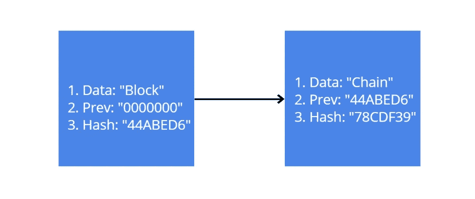
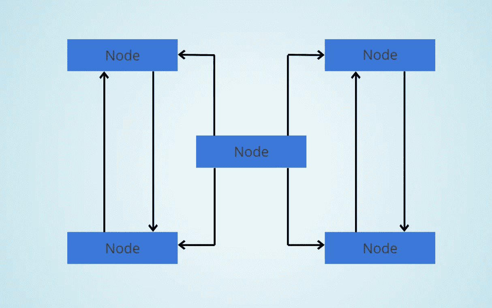

# 理解难以捉摸的区块链技术—第 1 部分

> 原文：<https://medium.com/hackernoon/understanding-the-elusive-blockchain-technology-part-1-1172fd8d02c2>


[@clintadair](https://unsplash.com/@clintadair)

尽管人们普遍认为，区块链并没有那么复杂，一旦你了解了它们背后的一般概念。

有趣的是，区块链很难实现，因为它由许多不同的复杂组件组成，一个优秀的区块链开发者需要知道如何以正确的顺序连接这些组件，以构建良好的区块链。

在这篇文章中，我将解释区块链实际上是什么，然后开始谈论区块链的各种功能，如哈希、不变性和分布式 P2P 网络。

> 这是我的区块链系列的第 1 部分。第二部分很快就要出来了！

# 定义区块链

区块链技术的发明通常归功于一个名叫中本聪的匿名实体(可能是一个人或一个团体，没人知道)，他的学术论文题为**“比特币:点对点电子现金系统”**发表于 2008 年。

但是在 Satoshi 之前还有另外两个人讲过和区块链非常类似的东西。这些人是 Stuart Haber 和 Scott Stornetta，他们发布了一篇题为“**如何给数字文档**加时间戳”的论文。

虽然本文没有公开讨论与区块链相关的任何内容，但本文介绍了区块链的几个概念、功能和概念……区块链。

> 但是什么是区块链呢？

如果你去维基百科——定义的通用集合，你会看到它被定义为“**一个不断增长的记录列表，称为块，使用密码术链接起来**”。

简单地说，它是一个块列表，其中的块以链的形式相互链接。

你心中的下一个问题应该是:

> 什么是街区？

区块链中的一个区块被定义为一个记录，它由一些数据、一个名为 **previous hash** 的指针(用于寻址它之前的区块)和另一个名为 **hash** 的指针(用于寻址区块本身)组成。

这是一个由两块积木组成的简单区块链的例子:



第一块被称为**创世纪块。一旦这个方块被创造出来，它将永远保持不变。没有办法，任何其他块都可以代替。像任何其他块一样，它将有一些数据存储在其中。但是因为它是链中的第一个块，并且在它之前显然没有块，所以它之前的散列值将是一串零。该块还有一个哈希值，它是一个十六进制字符串。**

第二个块中也会存储一些数据。并且它的前一个散列值将与前一个块的散列值相同。除此之外，它还将有一个哈希值，该哈希值将是链中下一个块的前一个哈希值，依此类推。

哈希是块之间的链接。每个块知道它自己的身份和它前面的块的身份。这种链接方法还可以保护区块链免受块数据的任何更改。

块的散列是通过获取存储在其中的数据和先前的散列来创建的。因此，如果我以某种方式改变了一个块的数据，那么这个块的散列也会改变。但是现在下一个块的先前散列值将不会与被改变的块的新散列值相匹配。然后区块链将知道该块已被破坏，区块链将变成**无效**。

# 散列法

前面几段描述了哈希如何将块相互连接，以及如何使用哈希来保护块。

> 但是哈希到底是什么？

就人类而言，有几样东西可以用来区分和识别他们:

*   脱氧核糖核酸
*   指纹

虽然同卵双胞胎拥有相同的 DNA，但他们却没有相同的指纹。因此，指纹可以被认为是任何个人的最终唯一标识符。

哈希是区块链版的指纹！

有不同的算法可用于散列，最流行的是 SHA 256，它是大多数区块链和加密货币中使用的算法。

SHA 代表安全散列算法，它有许多不同的版本。SHA-2 是由美国国家安全局(NSA)设计的一组加密哈希函数，包含六个哈希函数。

使用 SHA-256 的“256”部分是因为这是它在内存中占用的位数。该算法创建的哈希长度为 64 个字符，采用十六进制格式。十六进制代表 16，因此哈希的每个字符占用 4 位(4 = 16，16*4 = 64)。

哈希可以用于任何类型的数据，无论是金钱、文档、程序还是视频。

[](https://www.xorbin.com/tools/sha256-hash-calculator) [## SHA-256 哈希计算器。在线 SHA-256 哈希生成器。挖掘比特币

### SHA-256 产生一个 256 位(32 字节)的哈希值。SHA(安全散列算法)是众多加密算法中的一种

www.xorbin.com](https://www.xorbin.com/tools/sha256-hash-calculator) 

上面的链接带你到一个在线哈希生成网站。尝试在输入区输入不同的单词，看看你会得到什么样的 SHA-256 散列。这是我得到一些照片:

```
Rajat -> 126e11da02566f50f0f9449586cd9069ba908ce82ebfd69d6c3b9f48f56853a5rajat -> a2acfac793fcfd3ced6506d76fabfcaea56fcb07d59a173663f003b85465a18fBlock ->
211d0bb8cf4f5b5202c2a9b7996e483898644aa24714b1e10edd80a54ba4b560
```

你会注意到“rajat”和“Rajat”虽然是同一个单词，但由于其中一个大写，它们的哈希值完全不同。这种由于数据的微小变化而导致的散列的完全改变被称为雪崩效应。

不管你是对一个字母、一个单词还是整本哈利波特使用 hash，hash 的长度总是 64 个字符。

使用哈希函数时，需要记住几件事:

1.  哈希函数只有一种工作方式。您将无法使用散列来找出原始数据是什么。
2.  无论何时，散列函数都应该给出相同的输出。因此，如果我在“Rajat”上使用哈希函数并得到一些哈希，然后几天后我再次做同样的事情，我应该得到相同的哈希。
3.  散列函数应该快速给出散列。
4.  即使数据中最小的变化也会完全改变散列。
5.  因为哈希值总是 64 位长，我们可以使用的潜在哈希值数量有限。所以很有可能迟早会得到两个散列值相同的块。但是这种冲突很少发生，万一发生了也有办法解决。但是黑客也可以制造碰撞事件，这在区块链会导致进一步的问题。

你可以在这里阅读更多关于安全散列算法的信息。

# 不变

不变性是区块链最受欢迎的特性之一。不变意味着保持不变。所以就区块链而言，一旦你创建了一个区块，没有人会对它做任何改变。不，即使是创造它的人。

这是保持对区块链信任的一个很好的方式。

在现实世界中，当你买了一个大东西，比如一栋房子，你实际上是用一笔固定金额的钱来换取一张房契，上面写着这栋房子是你的。

但是任何人都可以写一份契约说你刚买的房子实际上是他们的！

为了防止这种做法，你去一个中央机关，如市议会，并登记你的所有权。现在你合法拥有那栋房子！

同样，在区块链，需要有一些方法来防止任何人未经授权就拥有一个街区或整个连锁店。

但是区块链没有任何中心机构，用户可以在那里注册他们的区块！

虽然你可能认为这是区块链的一个缺点，但它实际上是一个优点！

如果区块链有一个中央机构来记录关于这些区块的任何数据，那么黑客只需要侵入它，然后就可以进行任何未经授权的更改。相反，区块链是分散的。

这种系统的去中心化是中本聪和维塔利克·布特林(以太坊背后的人)谈论的主要内容之一。

之前，我谈到了改变一个块上的数据将如何改变它的哈希值。如果有人设法做到这一点，他们将不得不改变下一个块的前一个哈希值，这将改变该块的哈希值。黑客将不得不改变下一个哈希值的前一个哈希值，等等。

因此，为了更改一个数据块的数据，黑客也必须更改其余的数据块！这需要很强的计算能力，因此对于普通黑客来说，这是不可能完成的任务。

这就是如何在区块链中使用哈希来实现不变性！

# 分布式 P2P 网络

区块链网络被称为**分布式对等网络**将有多台计算机(又名节点)相互连接，没有中央权威。这里有一个例子:



每个节点都会有一个区块链的副本。这里您可以看到一个由 5 台计算机组成的小型网络。但在现实中，区块链网络可以有数百到数千台计算机相互连接。而且这些电脑不一定要高端。任何普通的笔记本电脑或台式机都可以成为区块链网络中的一个节点。

虽然每个节点都有一份区块链的拷贝，但如果没有适当的授权，它们实际上不能窃取别人的数据。

当一个节点将一个块添加到区块链的末尾时，网络会通知其他节点，并且相应地更新区块链的所有副本。

我们需要担心的不仅仅是黑客。有时，会出现一些小故障，导致其中一个区块链副本出现不同种类的错误。

由于区块链的不变性，一旦将区块添加到区块链，用户就不能对其进行更改。如果它的一个副本显示的数据不同于其他副本，我们如何纠正这个链，而不存在任何恶意的背后力量呢？

区块链网络不断地将所有节点相互同步。因此，当一个节点的区块链副本被破坏时，网络会意识到这个副本有问题，网络会用其他副本中未被破坏的区块替换该链中被破坏的区块。

欺骗区块链网络的唯一方法是改变网络的大多数节点。所以如果一个网络有 100 个节点，黑客就要换 50 多个节点，这仍然是一个巨大的数字。

因此，区块链网络的安全性随着用户数量的增加而增加。

# 未完待续…

这似乎是一个暂停的好地方。

请继续关注更多关于区块链的帖子。在下一篇文章中，我将解释:

*   采矿
*   共识

感谢阅读这篇长文！我希望这篇文章能帮助你更好地了解区块链。如果你喜欢这篇文章，请给我一些👏请在下面随意评论。干杯！

> 我的区块链系列文章的第 1 部分到此结束。第二部分很快就要出来了！