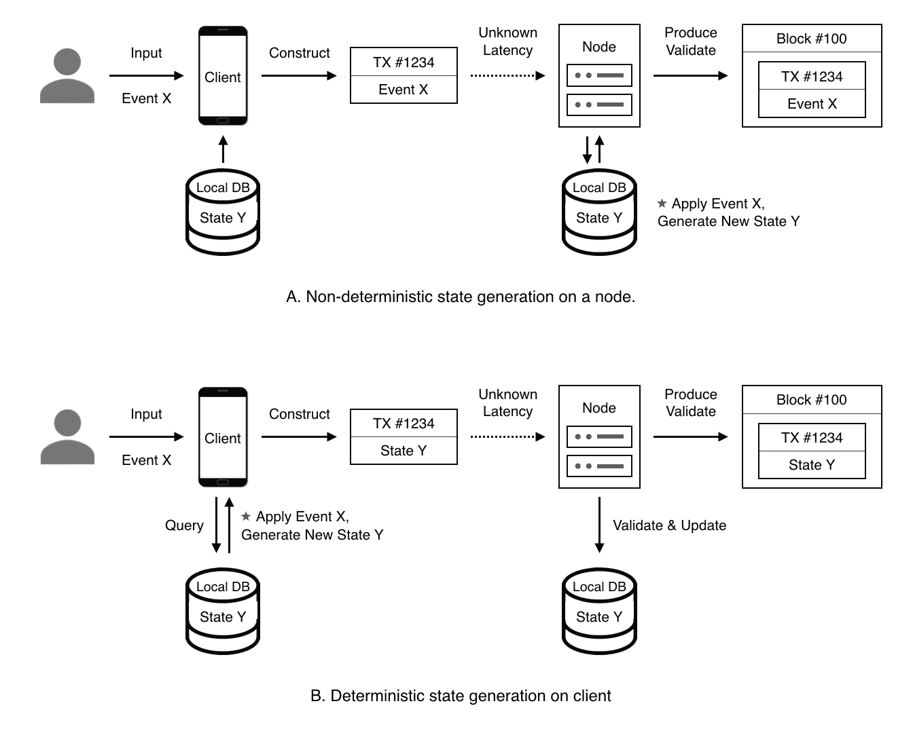
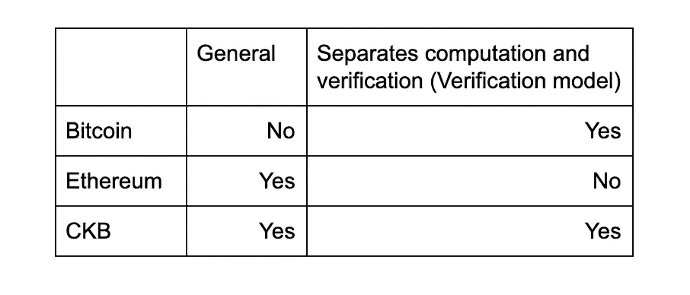

# 理解为区块链设计编程模型的权衡

> 原文：<https://medium.com/hackernoon/understanding-the-tradeoffs-of-designing-programming-models-for-blockchains-a055de1b2d1e>

One Summer Day in My Apartment Building

**如果您想更仔细地了解单元模型本身，有一个两部分的系列，介绍了单元模型******和** [**与 UTXOs**](/nervosnetwork/verification-computation-and-the-internet-of-value-92080251f8d8?source=friends_link&sk=4e19a42e6ae30218fa9159546ddb5427) **的比较。****

**作者 [Jan Xie](https://medium.com/u/ad74c0ef8418?source=post_page-----a055de1b2d1e--------------------------------) 翻译 [Harika Kalidhindi](https://medium.com/u/d64ccafb94ca?source=post_page-----a055de1b2d1e--------------------------------)**

**今天流行的区块链或多或少地面临着阻碍可伸缩性的这三个问题中的至少一个:**

1.  **[国家爆炸](https://talk.nervos.org/t/blockchain-and-state-explosion/1566)(以及由此导致的去中心化损失)导致的(存储)公地悲剧；**
2.  **计算和验证耦合导致的灵活性和可伸缩性的损失；**
3.  **交易吞吐量和价值存储需求之间存在的矛盾。第 2 层和跨链实现会加剧这些矛盾，从而对第 1 层产生负面的经济影响。**

****这些问题根源于底层的区块链架构和协议，使得它们很难用补丁来解决。**要真正解决问题的根源，底层数据结构本身必须更加合适。本文详细介绍了 CKB 通过使用 cell 模型获得的好处，cell 模型是 UTXO 模型的推广。**

**如果你不熟悉 CKB 的细胞模型或比特币的 UTXO 模型，有一个由两部分组成的系列，介绍细胞模型及其与 UTXOs 的比较。**

**以下是细胞模型的快速回顾:**

**在 CKB 的细胞模型中，有细胞而不是 UTXOs。虽然 UTXOs 只能保存代表硬币数量的数字，但单元格可以保存任何类型的数据。一个单元的价值取决于它可以用来存储数据的位数。这样的存储容量给你提供了 CKB 网络中蜂窝的价值，因为 CKB 的第一等公民是存储空间(以及保存每个人都已达成共识的信息的能力)。**

**用户为他们的单元格分配一个类型。当用户定义一个类型时，他们也定义了一个类型脚本，其中包含管理该类型单元格的规则。类型脚本确保试图更改单元格中数据的事务仍然会产生给定类型的有效数据。规则可以定义任何类型的模型；例如，UTXO 模型可以使用单元来实现。**

**与比特币不同，CKB 允许你定义自己的交易规则(通过编写类型脚本来决定交易是否有效)。与以太坊不同，用户可以占用的存储空间是有上限的，因为如果您已经拥有一个超过 16 字节存储空间的单元，您只能创建两个占用 8 字节数据的单元。**

**让我们回顾一下以太坊和比特币的交易流程，然后将它们与 CKB 的交易流程进行比较。**

## **通用验证网络**

**比特币是一个验证网络。**

**当进行交易时，用户需要向钱包或本地客户端输入要转移的硬币数量和接收者。收到这些信息后，钱包将计算并搜索发送者(本地)拥有的硬币数量(UTXOs ),并创建新的硬币，其中一部分将转移到接收者，一部分将作为零钱返回给发送者。然后，钱包将把用过的和新的 UTXOs 打包成一个事务，并将其广播到网络。一旦交易被网络验证，它将被打包成一个块并完成。**

**在这个过程中，网络的节点不关心先前的状态(被销毁的硬币)是如何被发现的，也不关心新的状态(新的硬币)是如何产生的。这些节点只关心交易完成后这些硬币总价值的任何变化。当用户进行转账时，计算在他们的(客户端)端完成。因此，用户在发送事务时可以确定结果(新状态)。**

**然而，现在比特币网络已经建立，很难改变这种状态的检查方式。**

**以太坊是一个通用的计算网络。**

**当使用 DApp 时，用户需要告诉钱包或本地客户端他想做什么。钱包会将用户的请求打包成一个交易，并广播到网络。当事务被网络节点接受时，将根据当前状态和事务中包含的请求来计算新状态。在此过程中，计算由节点完成。结果(新状态)只能在事务被添加到程序块后才能确认。与比特币平台不同，用户在发送交易时不确定结果。**

****

**顶部显示以太坊上的交易流程，交易是一个请求或事件；以下是比特币/CKB 上的交易流程，交易的新状态是离线生成的。**

**CKB 是一个**通用验证**网络。**

**当使用 DApp 时，用户需要告诉钱包或本地客户端他想做什么。钱包将根据当前状态和用户请求计算新状态。在这个过程中，计算是在用户端完成的，并且在发送事务之前确认其结果(新状态)。**

**像在以太坊模型中一样，用户可以定义自己的逻辑来使用他们在 CKB 上定义的资产。这意味着它们都拥有**的共性**，这造就了一个强大的开发平台。**

**与以太坊(和比特币一样)不同，CKB 仍然是一个**验证**(非计算)模型:在交易完成和广播之前，计算仍然在本地完成。换句话说，交易是在比特币或 CKB 模型中完成计算之后，但在以太坊模型中完成计算之前创建的。**

**计算和验证的分离也分离了层 1 和层 2。第 1 层关注的是新状态，而不是产生新状态的步骤。本质上，所有第 2 层解决方案(包括状态通道和等离子体)都是在链外进行计算，并在特定时间将最终状态提交给第 1 层进行验证。**

****

**Difference in Blockchain Programming Models at a Glance**

## **为什么 CKB 更好？**

**我们现在有了一个与众不同的基本数据结构，并在此基础上设计了一个独特的经济模型。这样真的更好吗？也许我们可以从本文开头提出的三个问题中获得一些启发。**

**[**状态爆炸**](https://talk.nervos.org/t/topic/1515) **带来了(存储)公地的悲剧和以太坊(以太坊这样的网络中去中心化**的丧失(这种情况足够普遍，以至于开发人员想要分配新数据来适应他们的用例)。**

**产能是 CKB 固有的有限资产，其供应受到预定义规则的限制。它也是状态的度量单位。容量大小决定了 CKB 上可以存储多少数据，即 CKB 的最大状态空间。这意味着存储在 CKB 上的状态受到总容量的限制。因此，CKB 不能遭受国家爆炸。只要适当地分配容量，网络就能无限期地保持其分散特性。每个细胞都是独立的，都有特定的主人。[这将作为一种公共资源的国家空间私有化](https://en.wikipedia.org/wiki/Tragedy_of_the_commons%23Privatization)，确保宝贵的共识空间能够得到更有效的利用。**

****[**耦合的计算和验证**](https://talk.nervos.org/t/layer-1/1486) **限制了灵活性和可扩展性，就像以太网上一样。******

****作为一个通用的验证网络，CKB 将计算和验证分离，使两者更加灵活和可扩展。[更多的计算在用户端执行](https://en.wikipedia.org/wiki/Edge_computing)，更接近他们的数据以及应用程序的使用。可以用更多样的工具更灵活地处理数据。有了 CKB 的架构，钱包可以有更多的权力和能力。在验证阶段，考虑到计算结果已经确定，分析事务的依赖性并并行执行事务会更容易。****

****虽然比特币不存在这些问题，但比特币平台是专门的，永远不能用来运行比特币交易以外的任何东西。****

******交易吞吐量需求与价值存储需求之间存在的矛盾。******

****第 2 层和跨链实现会加剧这些矛盾，从而对第 1 层产生负面的经济影响。****

****在基于细胞的经济模型中，存储成本与共识空间的大小和所需的时间长度成正比。采矿者可以通过提供共识空间来赚取收入，而 CKB 的效用来自于其对安全共识空间的权利。CKB 的价值在于它的安全性和可达性，而不是 TPS。像 CKB 这样的纯状态第一层自然补充了面向交易的第二层，使 CKB 在分层网络和链间网络中更善于获取价值。****

******CKB 继承了比特币架构的思想，通过推广 UTXO 模型创建了细胞模型，保留了比特币的一致性和简单性。在 CKB 模型中，所有状态都存储在单元中，所有计算都在链外完成，所有验证工作都由节点处理。******

## ****CKB 不是…****

## ******IPFS******

****将 CKB 定义为存储可能会引起混淆。你可能会问，“这与 IPFS、Filecoin 或任何其他分布式存储模型不一样吗？”****

****CKB 与分布式存储的不同之处在于，后者只存储未经验证的数据，因此无法就存储在其中的数据达成共识。分布式存储的容量可以与存储技术的发展成比例地增长。然而，CKB 的能力受到达成全球共识的效率的限制。****

****没有必要担心 CKB 的容量。随着第 2 层和其他分层技术的成熟，在最极端的第 1 层效率需求的情况下，单个 merkle 根可能就是第 1 层上所需的全部。第 1 层验证所需的状态也可以通过事务提交，要求节点检查 merkle 证明，以确保状态和状态转移的有效性。对此已有一些研究。****

****参考:****

**** [## 理解 CKB 的 Cell 模型

### 在设计 CKB 的时候，我们想要解决三个方面的问题： 状态爆炸 引起的公地悲剧及去中心化的丧失； 计算和验证耦合在了一起 使得无论是计算还是验证都失去了灵活性，难以扩展； 交易与价值存储这两个目标的内在矛盾，Layer…

talk.nervos.org](https://talk.nervos.org/t/ckb-cell/1562)****