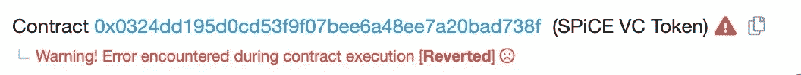
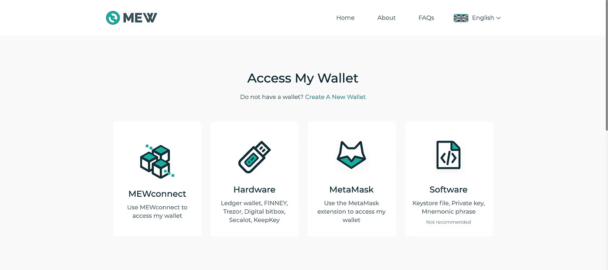
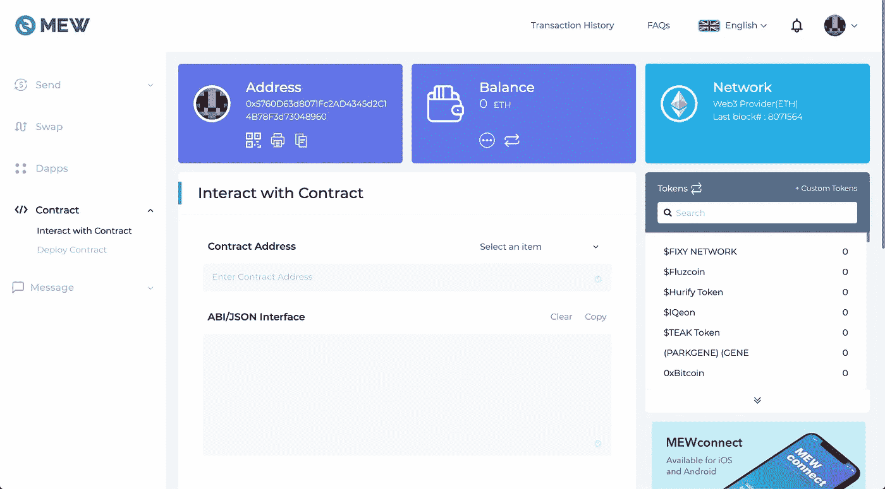
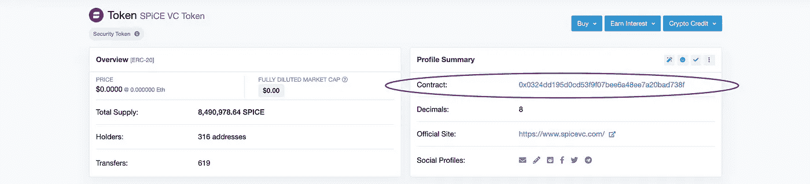
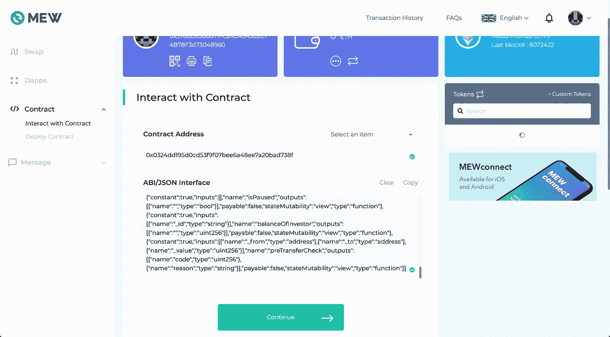
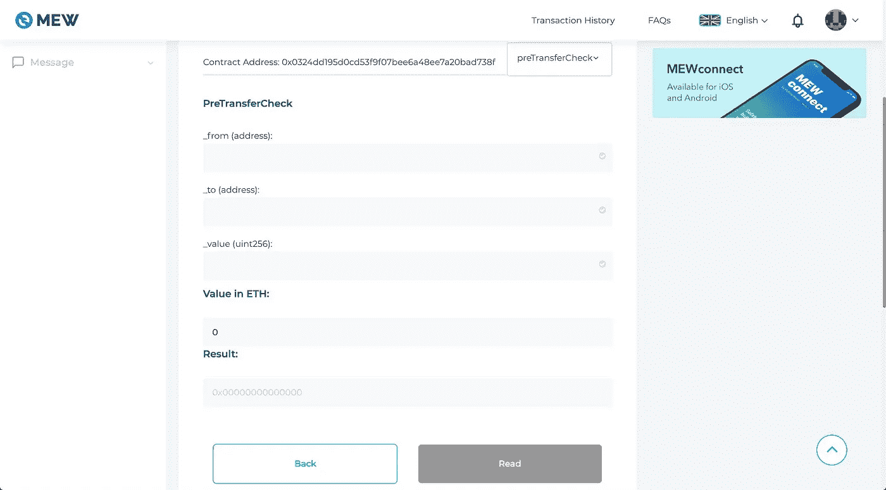
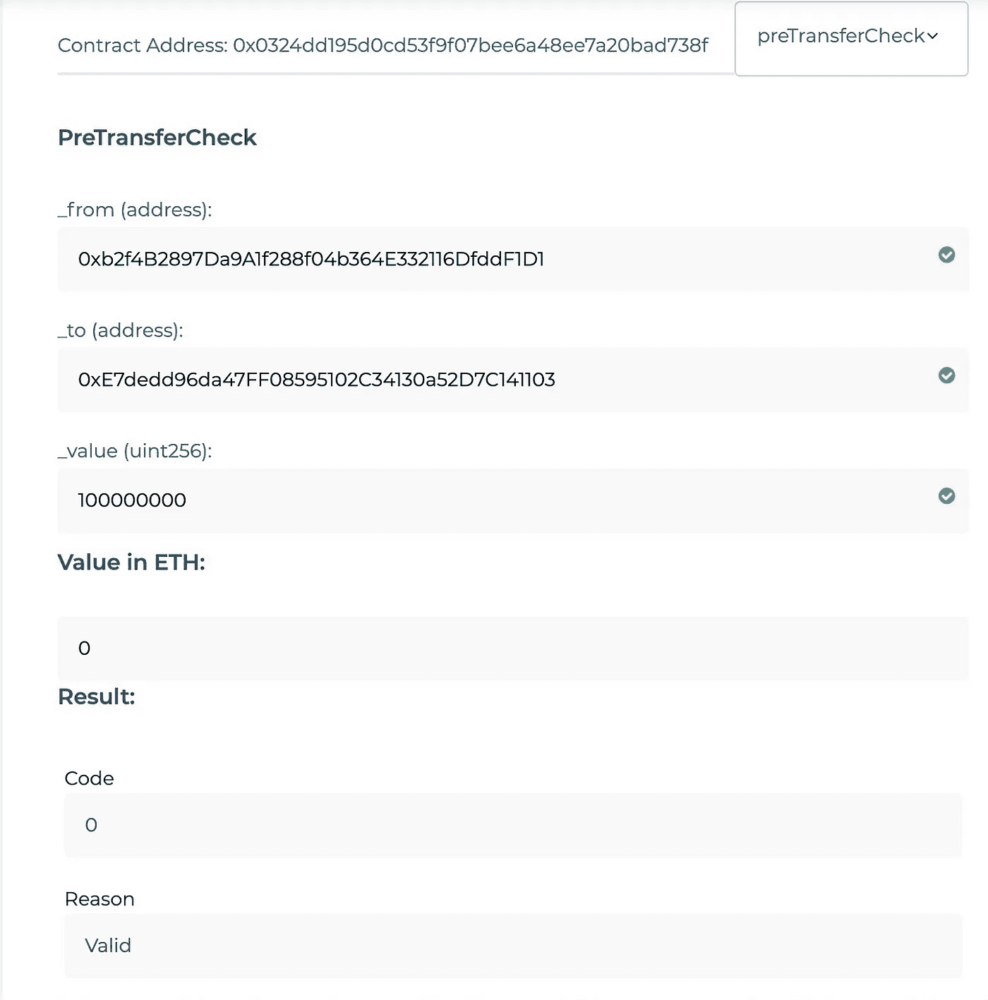

# 了解数字证券的转让限制

> 原文：<https://medium.com/hackernoon/understanding-transfer-restrictions-for-digital-securities-3be1b2bf0375>

## 如何检查钱包之间的安全令牌转移是否有效

得益于[数字证券技术](/securitize/introducing-ds-digital-securities-protocol-securitizes-digital-ownership-architecture-for-4bcb6a9c4a16)，投资者现在可以以代币(也称为“安全代币”)的形式持有自己的证券所有权记录，这些代币[可以放在任何钱包](https://hackernoon.com/how-to-use-coinbase-wallet-for-securitizes-digital-securities-e3591c2324f7?source=rss----3a8144eabfe3---4&gi=83573e4f1934)中。这带来了部分所有权的优势，能够在允许 24/7 交易的不同市场[之间转移这些资产](https://consent.yahoo.com/collectConsent?brandType=nonEu&.done=https%3A%2F%2Ftechcrunch.com%2F2019%2F05%2F16%2Fopenfinance-opens-up-us%2F%3Fguccounter%3D1%26guce_referrer_us%3DaHR0cHM6Ly93d3cuZ29vZ2xlLmNvbS8%26guce_referrer_cs%3DO_-UHL-wjNP-nx_rsovmnw&sessionId=3_cc-session_fda01f9f-61ad-4625-a142-5c92f37acc9d&lang=&inline=false)，以及通过转移这些代币的简单机制直接进入个人之间的交易。

但数字证券不同于其他数字资产。比特币或以太网等加密货币可以在没有任何额外控制的情况下转移到世界上的任何钱包，但**证券是受监管的工具**，因此所有权只能在特定情况下转移。这些情况将因证券而异，因为它们将取决于所涉资产的具体种类(例如，一家公司的股权与风险基金的有限合伙制股权具有不同的属性)、其注册方式(或免于注册)以及当前的所有权结构(因为可能已经达到了某些限制)。

确保仅交易符合适用法规或发行方限制的方法是，数字证券实施**转让限制**。转移限制被编码为实现数字安全的智能合约的一部分，并为请求的每个交易执行，就像从一个钱包向另一个钱包转移令牌一样。在 Securitize 的数字证券协议中，这些规则是合规服务的一部分，[我在以前的帖子中详细介绍过。](/securitize/ds-protocol-the-compliance-service-b6fe472d625d)

这些限制的结果是，当令牌持有者试图将他们的令牌转移到新的钱包地址时，交易可能会失败，并且在一些块浏览器如 [Etherscan](https://etherscan.io) 中查看详细信息会显示如下错误:

A reverted transaction in a DS Token

*(注意错误标记为* ***恢复原状。*** *不同的错误可能导致交易失败，但这并不意味着它受到智能合约的限制。这种情况的一个例子是“汽油用完”错误，这意味着为交易设置的汽油限制太低而无法完成，如果提供更多的汽油，交易可能已经完成)。*

虽然上面的错误表明智能合约认为交易无效，但这里的一个限制是不清楚为什么交易没有被批准。为了改善这种情况， [Securitize 的 DS 协议](https://securitize.io/resources/thought-leadership/ds-protocol-whitepaper)提供了一种机制，允许在尝试任何特定交易之前验证令牌的转移，而不必花费任何汽油。这是基于 DS Tokens 公开的`preTransferCheck()`方法，该方法允许它模拟钱包之间的转账，返回该转账是否有效，如果无效，则返回具体原因。

# 我们如何使用这些支票？

DS 协议机制允许这些检查立即了解是否有可能在钱包之间转移代币，而不必花费任何汽油，并且有两个要点，其使用将改善与数字证券的交互:

*   **在** **受监管的市场**，为了方便数字证券的交易，他们在幕后管理这个过程。它们只提供可以执行的订单，并且它们执行所有的检查(包括使用`preTransferCheck()`方法),以便当您试图出售或购买您的代币时，该过程可以顺利执行。例如， [OpenFinance Networks](https://openfinance.io) 就是这种情况，这是一个受监管的市场，允许几个 DS 令牌的交易，而[最近向美国投资者](https://techcrunch.com/2019/05/16/openfinance-opens-up-us/)开放了交易。
*   **直接放在钱包上**。由于 DS 令牌接口是公开的，并且可以免费使用`preTransferCheck()`,我们希望钱包提供商能够将此整合到他们的体验中，以便在处理数字证券时，他们能够在执行令牌转移之前通知用户有关令牌转移的潜在问题，甚至建议有助于完成转移的选项(如转移不同数量的令牌或检查目的地地址是否正确)。

但是即使没有这些玩家，任何人都可以在 DS 令牌中调用这些检查。这涉及到在智能契约中调用`preTransferCheck()`方法，对于不熟悉这些概念的人来说，这听起来可能非常复杂，但是让我们看看如何通过三个(相对)简单的步骤来完成。

# 1.前往 MyEtherWallet 中的“与合同互动”部分

使用浏览器进入 https://myetherwallet.com/interface/interact-with-contract 的。

首先您将看到的是 MyEtherWallet 需要访问一个钱包，以允许您与合同进行交互。为了检查转账的有效性，您不需要使用任何特定的钱包(没有必要使用交易中涉及的任何钱包进行检查)，因此任何钱包都可以工作，甚至是您可以在 MyEtherWallet 网站上创建的全新钱包。为此我通常使用[元掩码](https://metamask.io/)，但这不是强制性的。

Give access to a wallet in MyEtherWallet

访问您的钱包后，您会看到类似这样的内容(如果没有，请确保进入左侧菜单中的合同>与合同交互):

Interacting with smart contracts using MyEtherWallet

# 2.设置令牌地址和令牌接口 ABI

访问“与合同互动”部分后，您将看到一个包含两个字段的表单:

*   **合同地址**。这是您要检查传输限制的令牌的以太坊地址。如果不知道令牌地址，可以在[以太扫描](https://etherscan.io)中搜索令牌，寻找“合约”信息。例如，在 [SPiCE VC](https://spicevc.com/) 令牌的情况下，它们的地址在[这里](https://etherscan.io/token/0x0324dd195d0cd53f9f07bee6a48ee7a20bad738f)是可用的:

The contract address for a DS Token

*   **ABI/JSON 接口。**ABI，或[应用二进制接口](https://en.wikipedia.org/wiki/Application_binary_interface)，是软件组件指示如何与之交互的方式。在 DS 令牌的情况下，它是表明它有一个`preTransferCheck()`方法以及如何使用它的方式。因此，为了与 DS 令牌进行交互，我们只需要提供 DS 令牌 ABI，幸运的是这里的[是可用的](https://raw.githubusercontent.com/securitize-io/DSTokenInterfaces/master/abis/DSTokenInterface.json)，您只需要复制代码并粘贴到该页面上。 [Securitize 的 DS 协议接口在几周前发布](/securitize/ds-protocol-interfaces-released-7470e4d45ae6)，作为其中的一部分，ABI 也可以精确地与智能合约一起工作，如本文所示。

提供合同地址和 ABI 后，您将看到这样一个屏幕，允许您继续:

Filling the contract address and ABI

# 3.使用 preTransferCheck

单击“继续”后，将出现以下屏幕，允许您选择 ds 令牌提供的方法之一与其进行交互:

Selecting the method to interact with the contract

从“选择一个项目”下拉列表中，您可以选择要使用的 DS 令牌方法。我们将选择`preTransferCheck()`，它将显示该屏幕:

preTransferCheck() parameters

该对话框允许您提供将用于在`preTransferCheck()`中调用的参数，特别是:

*   **_from，**将发送代币的钱包地址
*   **_ 到**，这是将接收令牌的钱包地址
*   **_value** ，要发送的令牌数量*(但是要记住小数，所以如果令牌有小数，我们需要加零来考虑这个问题)*

填写这个然后点击“发送”将调用合同中的`preTransferCheck()`,并让你知道结果。

但是请记住，**这不会发送任何令牌**，它只会执行检查，以确定如果令牌确实被发送，操作是否会被批准。所以你可以毫无畏惧地测试这个，因为尝试这个不会移动代币，也不会耗费汽油。

例如，我们可以尝试在两个地址之间发送一个令牌(在 **_value** 参数中，我们看到 100000000，因为这是一个具有 8 位小数的令牌，所以我们必须使用该值来表示 1 个令牌)，如下所示:

An invalid transaction

代码响应显示不会批准转移，并带有“附加原因”信息，说明“钱包不在注册服务中”。这是因为目的地钱包没有注册到任何已知的投资者，而数字证券的一个主要限制就是必须知道所有持有人，所以这种任意转移是不允许的。如果不是与`preTransferCheck()`核对，而是发送者钱包所有者直接尝试转移令牌，交易将会失败，并出现我们之前看到的“恢复”错误。

使用不同目的地钱包(这一次是已经注册为能够保存安全令牌的钱包)的不同测试将给出不同的结果:

A valid transaction

在这种情况下，响应是该交易将是“有效的”，因此如果钱包所有者尝试进行令牌的实际转移，这将被批准，并且交易将成功。

# 那么，接下来呢？

正如我们所看到的，DS 协议允许我们立即检查钱包之间的令牌转移是否被允许——而不必花费任何汽油。

上述部分描述的过程并不复杂，但显然有点繁琐，这表明我们仍处于数字证券的早期。随着钱包整合这些机制，以及这项技术带来的体验和功能方面的更多改进，我们将逐渐使金融交易更加灵活和强大。

[*证券化*](http://www.securitize.io) *为创建合规的数字证券提供可信的全球解决方案。证券化法规遵从性平台和协议为发行和管理数字证券(安全令牌)提供了一个成熟的全栈解决方案。Securitize 创新的 DS 协议拥有业内最高的采用率，能够同时在多个市场进行无缝、完全合规的交易。多种证券化驱动的数字证券已经在全球公开市场交易，还有更多正在筹备中。*

*您可以在我们的网站上了解更多关于证券化的信息:*[*www . Securitize . io*](http://www.securitize.io)

*您可以在我们的* [*电报频道*](https://t.me/securitize) *加入关于数字证券革命的对话。*