# 大型应用的统一应用框架:阿里巴巴的 Fish Redux 转向开源

> 原文：<https://medium.com/hackernoon/unified-application-framework-for-larger-scale-apps-alibabas-fish-redux-moves-to-open-source-b520bd9bdbbb>

## Fish Redux 为阿里巴巴的鲜鱼交易平台消除了痛点，实现了可配置组装

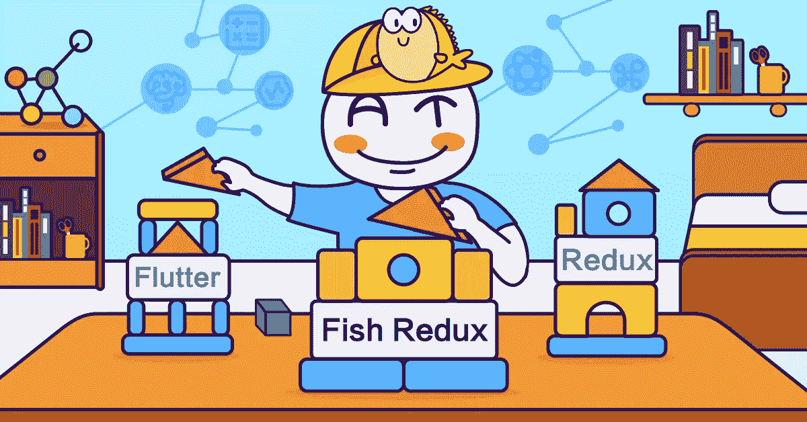

*本文是* [***阿里巴巴开源***](/@alitech_2017/alibaba-open-source-series-6ec06ca2a402) *系列的一部分。*

During its early stages, Alibaba’s Xianyu( 闲鱼) second-hand trading platform relied heavily on the Flutter mobile app SDK for its development. Developers encountered a number of persistent difficulties, especially strong business code coupling and poor code maintainability. To support its business scenarios, Xianyu needed a unified application framework capable of solving development dilemmas.

作为一个基于 Redux 数据管理的高级组装式 Flutter 应用程序框架，Fish Redux 为 Xianyu 早期的问题提供了一个理想的解决方案，证明特别适合于中型和大型复杂应用程序。由于可配置汇编的主要特性，它易于编写，易于维护，并使协作变得容易。受包括 Redux、React、Elm 和 Dva 在内的著名框架的启发，Fish Redux 改进了 Redux 的焦点、划分、重用和隔离功能。

由于它很快将被开源，本文将详细研究 Fish Redux 的架构、组件、字典和其他机制，以说明它对于应用程序开发的价值。

# Fish Redux 的架构概述

如下图所示，Fish Redux 自下而上分为三层。

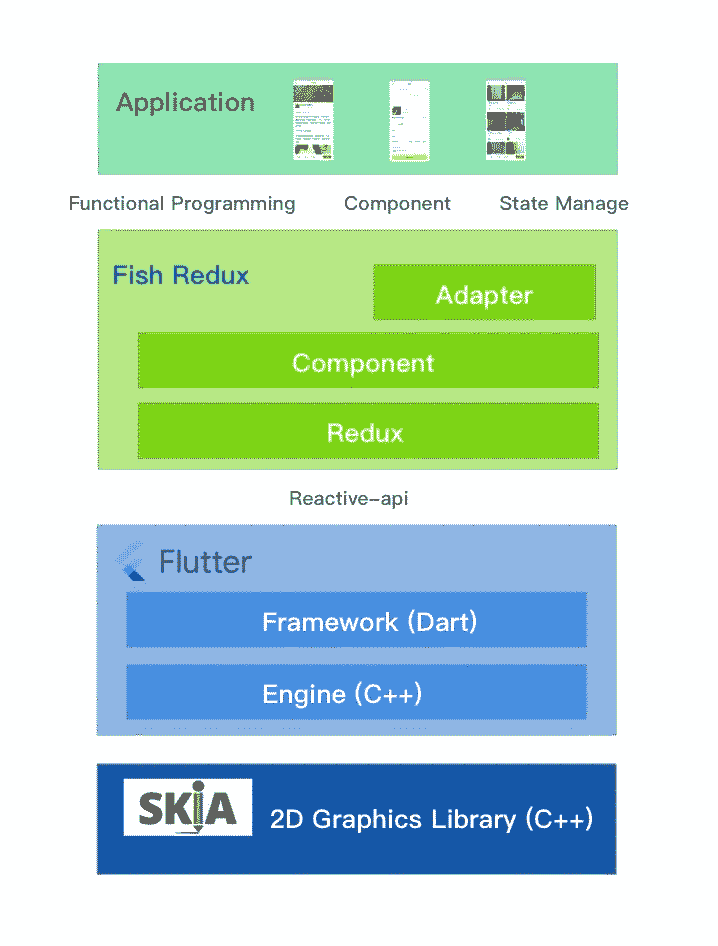

每一层都是用来解决问题，解决特定层面的矛盾。以下部分将详细讨论这些层。

## 冗余层

Redux 是由前端开发社区创建的状态管理框架，它是可预测的、集中的、易于调试的、灵活的。Redux 处理所有操作，如添加、删除、修改和查询数据。

在设计和实现方面，Redux 是一个功能性的状态管理框架。传统上，面向对象编程(OOP)使用 bean 处理状态管理，每个 bean 公开几个公共 API 来操作内部数据(充血模型)。功能方法更抽象。数据被定义为 struct(贫血模型),操作数据的方法被统一到一个具有相同函数签名的 reducer 中:

(T，Action) => T. FP: Struct(贫血模型)+ reducer = OOP: bean(充血模型)。

同时，Redux 增加了 FP 中常用的中间件(AOP)模式和“订阅”机制，赋予了框架很强的灵活性和可扩展性。(关于贫血和充血模型的更多信息可在[维基百科](https://en.wikipedia.org/wiki/PlainoldJava_object)上获得。

最初的 Redux 有许多缺点。首先是 Redux 的中心化和组件划分的矛盾。第二，Redux 的减速器需要人工一层一层的组装，比较繁琐，容易出错。

Fish Redux 解决了这些问题。它只与数据管理相关，不考虑具体的使用场景，通过 Redux 提供集中的、可观察的数据管理。除此之外，在客户端 Flutter 页面的横向开发场景中，它提供了比原始 Redux 更好、更高的抽象。

每个组件由一个数据点(结构)和缩减器组成。同时，不同组件之间存在父子依赖关系。Fish Redux 利用这种依赖关系来解决集中化和分区化之间的冲突。Fish Redux 还转换了 reducer 的逐层手动合并功能，以提供自动框架完成，大大简化了 Redux 的使用。最后，这有助于在使用分区代码时实现集中化的结果。

上面提到的状态、动作、缩减器、存储和中间件的概念与社区的 ReduxJS 是一致的，保留了原来 Redux 的所有优点。关于 Redux 的更多信息可在 [Redux Github 页面](https://github.com/reduxjs/redux)获得。

## 组件层

组件是用于本地表示和功能的包。基于 Redux 的原则，函数被细分为两种，一种修改数据(reducers ),另一种不修改数据(副作用)。结果包含三个部分:1)视图；2)效果；和 3)减速器，它们被称为组件的三个元素。它们分别负责组件的显示、不修改数据的行为和修改数据的行为。

这种细分既面向现在，也面向未来。现在的 Redux 把细分看做“数据管理”和“其他”，面向未来的 UI-automation 把细分看做“UI 表达”和“其他”。就程序员而言，UI 表达式现在即将进入一个黑盒时代，导致 R&D 工程师越来越关注不修改数据和修改数据的行为。

组件是视图的划分和数据的划分。通过层层分割，将复杂的页面和数据分割成相互独立的小模块，便于团队内部的协同开发。

## 1.景色

视图只是一个函数签名:(T，Dispatch，ViewService) = >小部件。它主要包含具有三个特征的信息。

首先，视图完全是数据驱动的。

第二，视图生成的事件/回调是通过 dispatch 带着“意图”发出的，没有具体的实现。

最后，它需要组件依赖，这些依赖是以标准化的方式调用的，例如通过 ViewService(在一个典型的视图签名兼容函数中)。

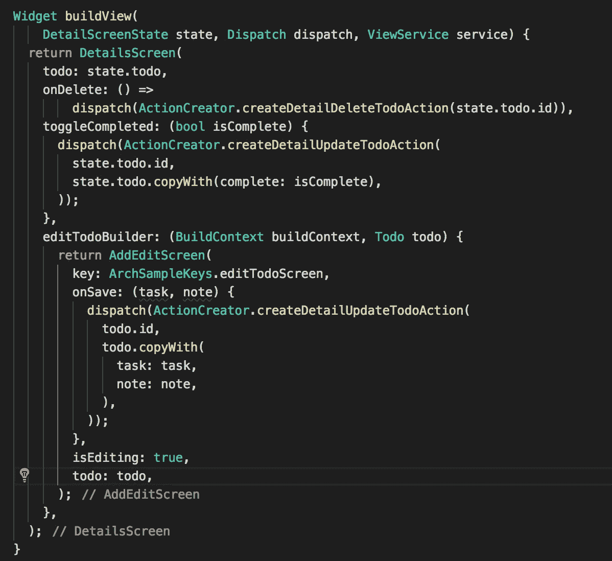

## 2.效果

作为非修改数据行为的标准定义，效果是函数签名:(Context，Action) => Object。它主要包含具有四个特征的信息。

首先，效果接收来自视图的“意图”，包括相应的生命周期回调，然后做出具体的执行。

第二，它的处理可能是一个异步函数，在这个过程中数据可能被修改。这意味着不应持有数据；相反，应该通过上下文获取最新数据。

第三，它不修改数据，如果需要的话，应该发送一个动作给 reducer 进行处理。

最后，它的返回值仅限于 bool 或 future，这对应于支持同步函数和协程(比如良好的协程支持)的处理流。

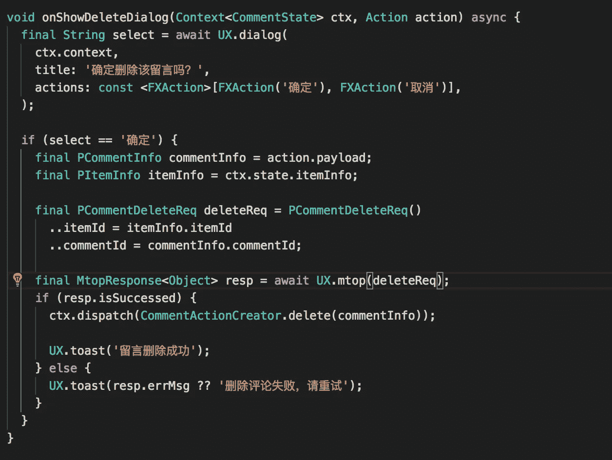

## 3.该减速器

缩减器是一个完全符合 Redux 规范的函数签名:(T，Action) => T。下面显示了一个符合签名的缩减器:

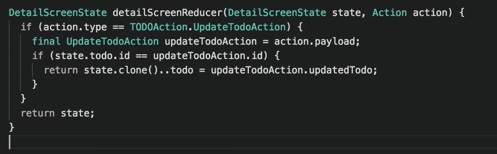

同时，大型组件所依赖的小部件和适配器是在显式配置中注册的；这种依赖关系配置称为依赖关系。

以下公式结果:组件=视图+效果(可选)+缩减器(可选)+依赖项(可选)。典型组件如下所示:

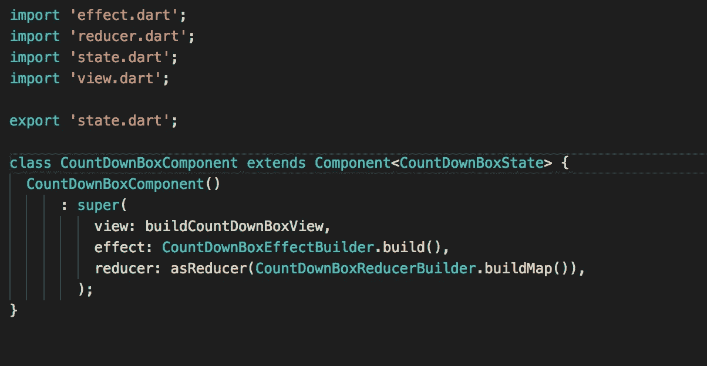

通过组件的抽象，实现了完全的划分、多纬度的重用和更好的解耦。

## 适配器层

适配器也是一个用于本地表示和功能的包。它是为 ListView 的高性能场景创建的，是组件实现中的一个变化，旨在解决组件模型在 flutter-ListView 场景中面临的三个问题。

第一个问题是，在组件中放置“大单元格”意味着无法享受 ListView 代码的性能优化。

其次，组件不能区分出现/消失和初始化/释放。

最后，效果的生命周期和视图之间的耦合不符合 ListView 场景中的直观预期。简而言之，我们需要的是本地表示和功能封装的抽象，从逻辑上来说是一个 ScrollView，从性能上来说是一个 ListView。这样一个单独的抽象层，只从它的实际效果来考虑。框架不用于页面，而是用于组件和组件+适配器基线性能比较。

减速器是长寿命的，而效果的寿命是中等范围的，视图是短寿命的。持续测试用于进行比较，如以下 android 设备示例所示:

在使用该框架之前，详细信息页面中的基线 FPS 为 52FPS。在只使用组件抽象的情况下使用框架，FPS 下降到 40 并遇到“大单元”陷阱。随着框架和适配器抽象的使用，FPS 上升到 53，这高于基线，并且有一个小的改进。

# 词典

Fish Redux 中推荐的目录结构如下所示:

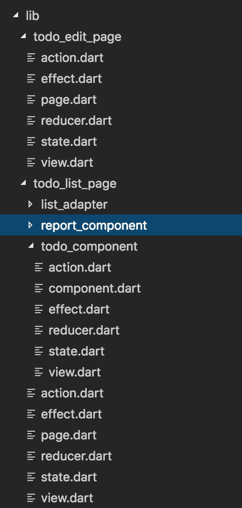

上层负责组装，下层负责实现。同时，提供了一个插件来快速填充。以下来自仙寓平台的场景提供了一个装配示例:

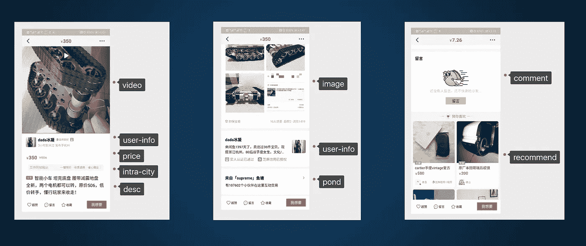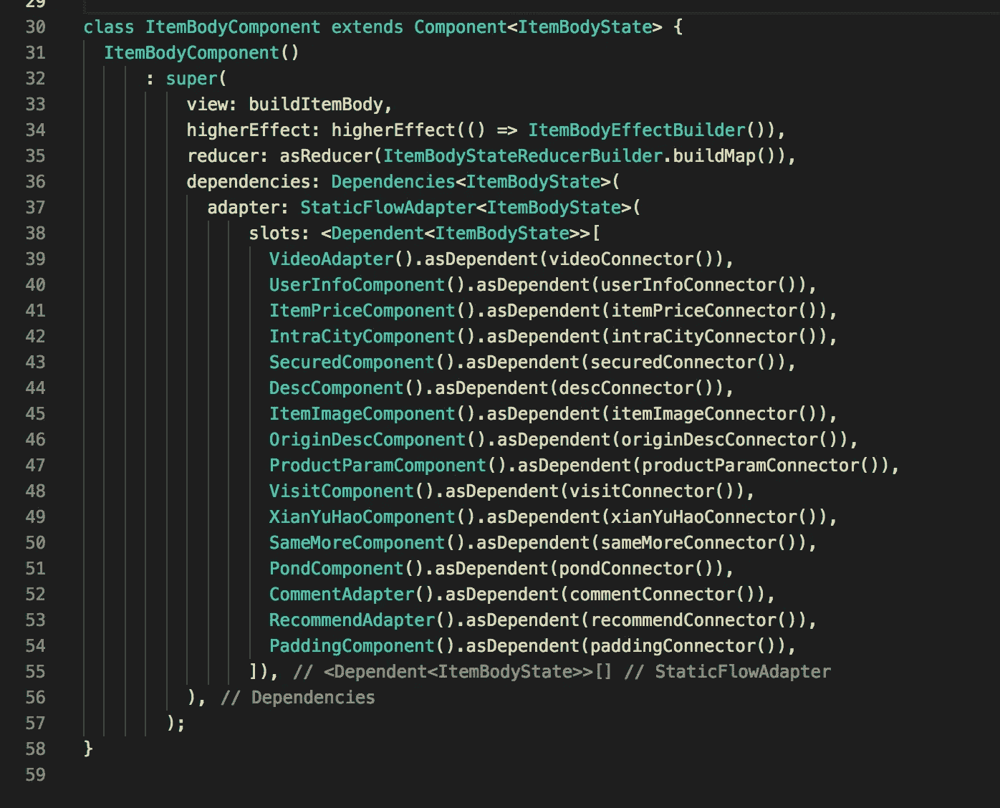

在这里，组件和其他组件之间以及组件和容器之间是完全独立的。

# 沟通机制

Fish Redux 的通信机制提供了适配器内部的组件通信和适配器之间的组件通信。

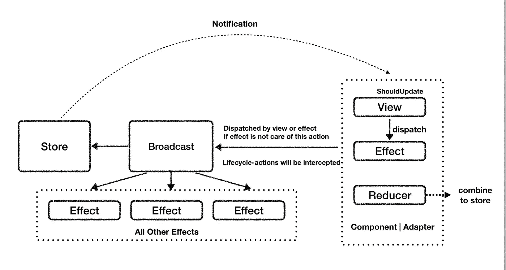

在上面，使用了具有优先处理的广播剪辑。发出的动作将首先被自处理，或者它将被广播到其他组件并被 Redux 处理。最后，组件内部和组件之间(父-子、子-父、兄弟-兄弟等)的所有通信请求都将通过一个简单、直观的分派来完成。

# 刷新机制

Fish Redux 的刷新机制同时提供了数据刷新和视图刷新。

## 数据刷新

数据刷新包括本地数据修改和逐层数据复制。

在本地数据修改中，逐层自动触发上层数据的浅层拷贝。这些数据对上层业务代码是透明的。

逐层数据复制一方面严格遵从 Redux 的数据修改，另一方面严格遵从数据驱动的表示。

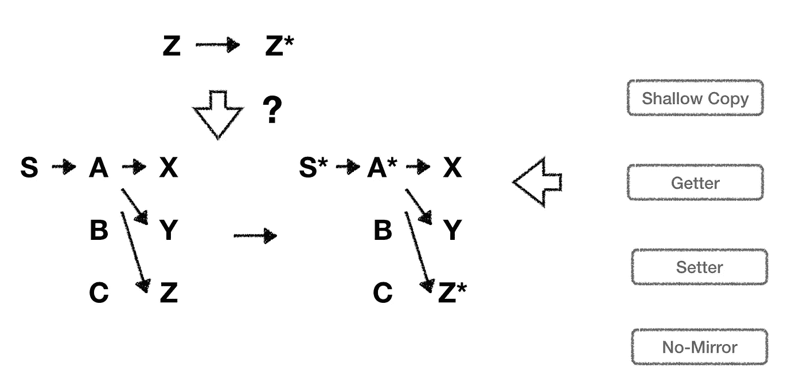

## 视图刷新

视图刷新将所有扁平化通知发送给所有组件，而组件通过 shouldUpdate 确定是否需要刷新。

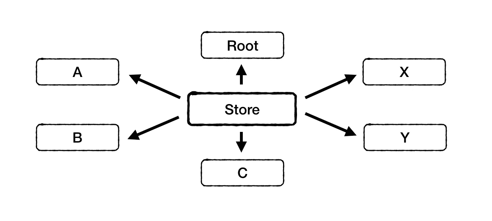

# Fish Redux 的主要优势

Fish Redux 的第一个优点是通过 Redux 对数据进行集中的、可观察的管理，其中保留了 Redux 的所有原有优点。在 reducer 合并过程中，Redux 操作被转换成由框架自动完成，极大地简化了使用 Redux 的繁琐过程。

其次，它擅长组件的划分管理。组件不仅作为视图的划分而存在，也作为数据的划分而存在。通过将复杂的页面和数据逐层划分，Fish redux 将这些划分为独立的小模块，实现团队内部的协作开发。

第三，它提供了视图、效果和缩减器之间的隔离，将组件分成三个无状态的、不相关的功能。因为这些是无状态函数，所以它们更容易编写、调试、测试和维护。同时，这为组合、重用和创新带来了更大的可能性。

第四，它提供了声明性配置程序集。组件和适配器通过自由配置组装，包括组件的视图、缩减器、效果和它所依赖的子关系。

第五，它提供了强大的可扩展性。核心框架维护它自己单独关心的三层核心焦点，同时为上层维护灵活的可扩展性。该框架没有一行打印的代码，但是数据流和组件的变化仍然可以通过标准的中间件观察到。除了框架的三个核心层，mixins 还可以通过“dart”添加到组件和适配器层，以灵活地增强其上层应用程序的定制和功能。此外，该框架连接到 SDK。SDK 和框架之间没有壁垒，由上层自由组装。

最后，Fish Redux 简单易用，只需要大约 1000 行代码。在一些小的函数和汇编任务之后，代码运行完毕，然后就可以使用了。

鱼 Redux 的价值在仙鱼的发展中得到了很好的展现。Fish Redux 提供了一个统一的应用程序框架，能够解决持续的困境。

**(Original article by Wu Jifeng 邬吉风)**

# 阿里巴巴科技

关于阿里巴巴最新技术的第一手深度资料→脸书: [**“阿里巴巴科技”**](http://www.facebook.com/AlibabaTechnology) 。推特: [**【阿里巴巴技术】**](https://twitter.com/AliTech2017) 。