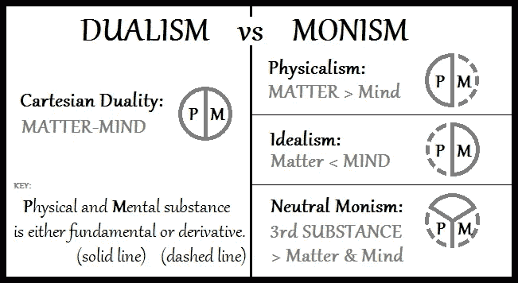
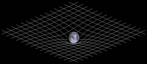
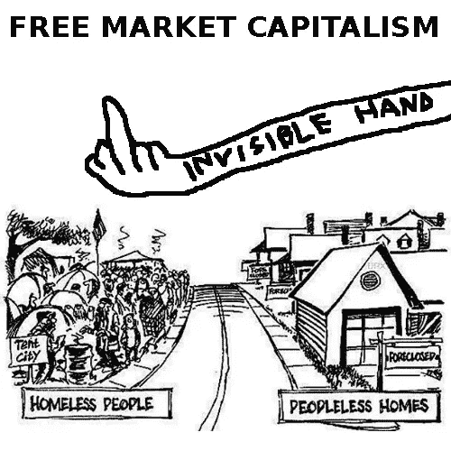
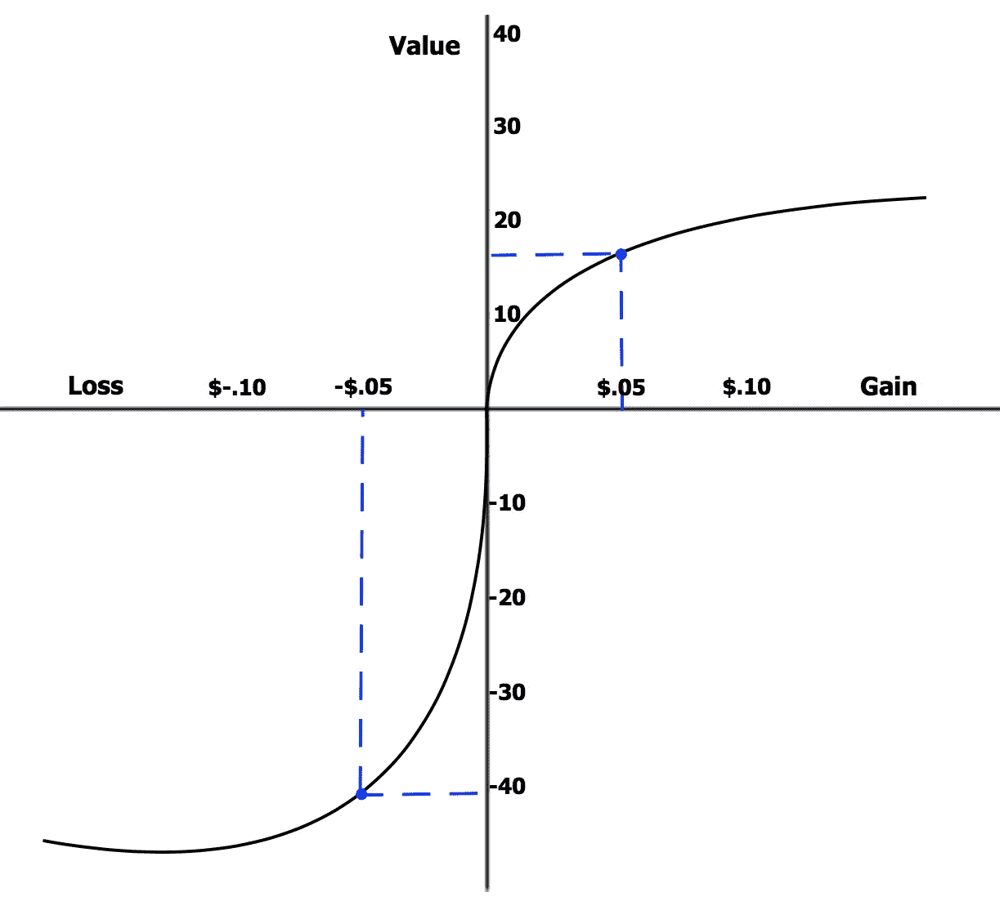
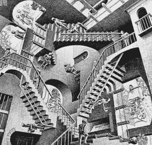
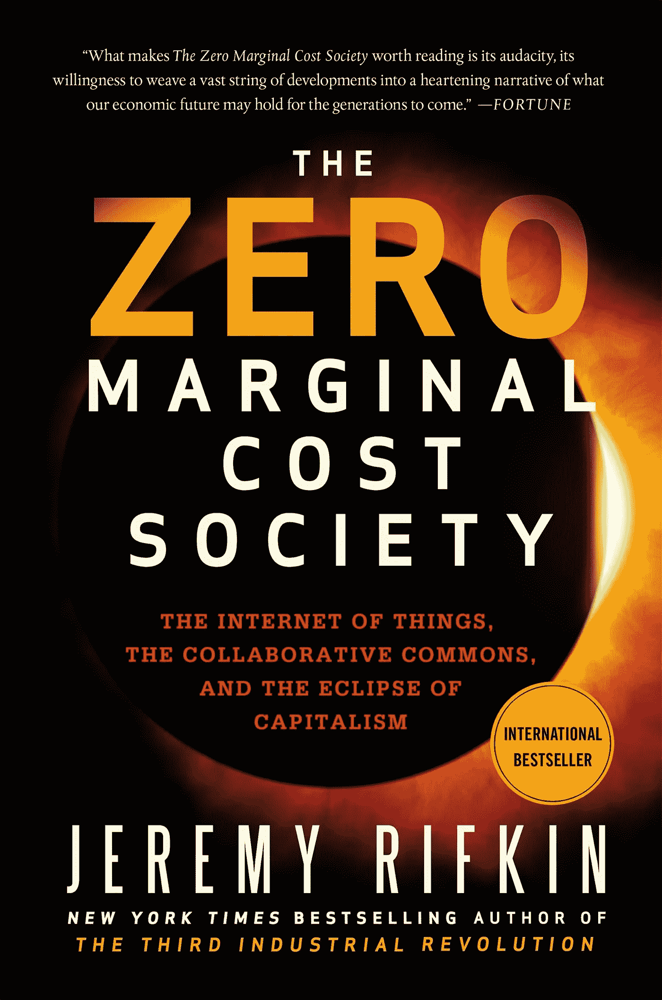

# 普遍基本收入:后稀缺时代的价值[第二部分]

> 原文：<https://medium.com/hackernoon/universal-basic-income-the-value-of-post-scarcity-pt-2-5739b58a2ec5>

## “普遍基本服务”比 UBI 更好，但要让两者都发挥作用，我们必须重新评估其经济意义。

在本系列的第一部分中，我解释说后稀缺时代已经开始了，但很难识别，因为经济学范式迄今将价值等同于稀缺和需求。稀缺且需求量大的商品是那些在市场上卖得最高“价格”的商品。

我指出，这些经济范式中的异常商品(后稀缺商品)会受到监管，并试图制造人为稀缺(以知识产权法的形式，甚至只是浪费)。制造人为的稀缺是合理的——因为人们必须增加利润来支付账单和财富信号。

不幸的是，这种经济范式中的理性行为有时会背叛我们的道德直觉。如果一种商品是后稀缺的(就像某些食物一样)，那么拒绝那些想要或需要它，但负担不起的人获得它，在道德上是可以的吗？在当前这个以稀缺为中心的经济范式中，许多人会说“是的，没关系，因为那是消费者的拳头和生产者的鼻子相遇的地方。”

但那正是*的*问题。我认为这个问题可以通过一种新的经济范式得到部分缓解，这种范式不仅能够通过相对稀缺性来理解一件事物的价值，还能够通过它的真实价值来理解它。

# **通往新经济范式的路障**

在解释一个新的经济范式的框架之前，首先确定为什么以稀缺性为中心的范式是标准是很重要的。所以让我们把这些层剥开。

在本系列的第一部分中，我解释了历史上越久远，稀缺就越普遍。有进化机制可能有助于解释为什么稀缺——甚至到了行为经济学家发现当我们被告知我们获得商品的机会将减少时，我们会更重视商品的程度。

霍尔马克公司的一项研究发现，一种洗衣液的效果如何似乎取决于你问的是一个正在被监管的地区的消费者(他们说效果更好)，还是一个没有监管的地区的消费者(他们说效果更差)。对于那些对大脑如何特别适应稀缺感兴趣的人，我鼓励你继续学习损失厌恶、抗拒和延迟贴现。

我不会深究这些问题，因为我认为采用新经济范式的更令人信服的障碍是我们对现实本质的根深蒂固的哲学假设。这听起来有点像黑客帝国，但请相信我。

Hermeneutic thinking is closest to “neutral monism” depicted here.

从牛顿的全盛时期到爱因斯坦的全盛时期，科学家们思考现实的压倒性方式是二元论。

我的意思是，现实有两个不同的领域:客观和主观。客观世界通常被认为由物质组成，而主观世界是精神世界——这是我们如何将想法投射到客观世界并理解它的方式。

然而，重要的是，主观世界被认为不那么“真实”它污染了我们对“客观”真理的理解——在进行科学实验时需要处理掉。这就是为什么科学家们对对照组和保持无菌实验室环境念念不忘，以免他们“偏见”结果。

当爱因斯坦出现时，不可思议的事情发生了——他颠覆了二元科学范式。事物运动的速度——甚至事件的时间顺序和时间的体验——都取决于一个人的位置和相对速度——根本不存在未被污染的“客观”现实，只是相对现实的集合，就像宇宙本身一样无限。

无论如何，科学家们都会影响一项研究的结果。后来出现了量子力学——一个粒子可以同时出现在两个地方，一只猫可以同时处于相反的状态。光可以是粒子或波——这并不是因为研究人员有偏见或没有足够的控制，而是因为现实的本质取决于由彼此组成的网状网络——而人类是这个网络的一部分。

2d illustration of 3d space-time curvature as posed by Einstein’s general theory of relativity.

虽然物理科学家多年来一直试图理解相对论和量子力学的含义，但社会科学似乎没有做出调整。

尽管在二元论牛顿物理学的丰富影响下，社会科学在很大程度上从物理科学借用了他们关于现实本质的哲学假设，但他们还没有适应新的广泛接受的假设——理解现实不是二元论的，而是一元论的。宇宙不是由两个领域组成的:不变的客观和可变的主观——而是简单的一个无缝的现实。

尽管它被物理学家完全拒绝，社会科学继续从旧的二元现实概念中运作。资本家们仍然非常倾向于亚当·斯密的《国富论》,该书出版于 1776 年——牛顿去世后不到 50 年！虽然对民主社会主义的呼声越来越高，但它试图在经济运行的二元概念的基础上定义自己。

# **客观&主观衡量价值**

资本主义最基本的前提是二元看待价值。粗略简化一下，你一般可以认为宏观经济学是从客观角度关注价值，微观经济学是从主观角度考虑价值。

宏观经济学家感兴趣的是经济的整体运行，以及泡沫和萧条的模式。选择特定的指标来表示价值是否随着时间的推移而增加(即国内生产总值、失业率、通货膨胀)。从某种意义上说，这是一种“客观”的方式来判断一个经济体表现“好”还是“差”。

Cartoon posted on a “safe space” for socialist discussion [on Reddit](https://www.reddit.com/r/LateStageCapitalism/comments/9kcu65/the_invisible_hand/). Ironically illustrates frustration with the ethical dilemma that “market inefficiencies” (or artificial scarcity?) can create.

社会主义试图将“客观”价值降低到主观水平。人们被给予平等的商品或获得商品的机会，因为这些商品和获得这些商品的机会被国家假定为对所有人都是同等有价值的。

像国内生产总值和通货膨胀这样的抽象指标被认为是价值助推器和价值阻尼器，应该被平均分配。这个想法是，一些人以某种方式从他们的行为中提取更大的“真实”价值(更大的性价比)，国家的工作是在“真实”价值不平等出现时修复它们。

微观经济学涉及的范围更小:人们和企业的经济决策。微观经济学仍然保持着试图客观理解“价值”现象的要素。然而，它为价值的主观体验提供了更多的空间——注意，当考虑到消费者已经拥有多少给定商品时，商品的相对效用可能会降低(在一加仑牛奶后，购买两加仑、三加仑或四加仑可能看起来不那么有吸引力)。行为经济学就是从这种经济研究中产生的。卡尼曼和特沃斯基意识到，人们经常不断地做出违背经典经济学的决定。

Perceived value discrepancy between losses and gains; “loss aversion” discovered by Kahneman and Tversky.

社会心理学家经常指出行为经济学是人类行为“非理性”的证据。他们认为他们拥有的杯子比他们不拥有的杯子更值钱。他们认为应该避免损失，而不是追求相同的收益。当时间至关重要时，他们比有时间消磨时更放松。而且，如前所述，当他们被告知以后不允许买东西时，他们会更喜欢买。这些心理“启发”和经济监管可能会延续所谓的“市场无效率”。这些效率有时被称为异常，指的是市场中的故障——当商品的价格没有反映出供求曲线预测的其“真实价值”时。

**二元价值函数的缺点**

将价值建立在“客观”和“主观”基础上的尝试都失败了。宣称价值的客观取向不再实用——它们与现实世界的经验脱节。当考虑是买一小盒还是一大盒蜡笔时，一个人很难进行心理供求曲线计算。

对我们来说，一件衬衫是否值 20 美元通常很难确定。同样，大多数价值形式都是不相称的——你愿意花 500 美元去旅行，还是花 500 美元买一台电视？这些都是很难回答的问题，因为它们各自的价值无法直接比较。

但是，宣称价值的主观取向变得完全相对论化，使得教授经济能力变得不可能。一个说一大包软糖值 1 美元，一小袋软糖值 2 美元的人一定是“正确的”

完全主观的价值取向也违背了任何伦理现实主义。一个人可以通过给药物定价来宣称另一个人的医疗保健的价值——从主观主义的角度来看，这个价值必须是“正确的”。主观主义的价值申报方法自然会允许价格歧视，以准确捕捉价值交换——这是一个肮脏的词，尤其是在与药品(无弹性商品)联系在一起时。

试图纯粹主观地对商品进行估价似乎也没有什么作用。如果每个人都可以任意定价，那么经济激励就会崩溃。生产率高的工厂主不再比生产率低的同行拥有更大的购买力，经济发展停滞不前。也就是说，如果一个人可以花 5 美元买一个马克杯，而另一个人可以花 2 美元买一个相同的马克杯，为什么还要如此努力地工作呢？

Relativity, by Escher

于是，定义价值的二元论尝试在埃舍尔草图中找到了自己的位置:“客观的”价值衡量取决于所谓“非理性”人类的行为(以及他们主观的、错误的计算)，而“主观的”价值衡量的效率或正确性取决于抽象概念的冷酷事实，如稀缺性、供给和需求弹性(宣布经济决策有利或不利的基础)。两种接地值的尝试都不令人满意。

当然，如果一个人拒绝二元论的现实观，而支持一元论，即当前物理学研究所暗示的解释学，这些概念都是令人不安的。如果价值不是由特定时间、特定环境中的人与物的关系构成的，那么价值是什么？当一个人通过自己的行动来构建一件商品的价值时，他怎么会表现得“非理性”呢？

一个人怎么能声称一个抽象的杯子有价值呢？有没有某种柏拉图式的杯子漂浮在真空中，宣称它实际上值 5.323 美元？当然不是。当人类提出价值主张时，他们不会做出“非理性”的行为。这种价值是一种具体化的、情境化的价值。

# **诠释学估值**

一元论、诠释学框架的核心是这样一种观点，即**现实是由更少的“对象”和更多的“意义”构成的**意义是由正式系统中的状态构成的。客观评价机制和主观评价机制是不可分割的。

自然语言处理的工作原理类似，因为句子中的每个单词以及句子构建的位置和时间都是理解句子的上下文(“蝙蝠差点撞到头”在洞穴中的意思可能与在棒球场上的意思不同)。

因此，一堆现金、一个杯子、一个商店和一个顾客是相互产生的，一个杯子的价值取决于上下文(就像单词“bat”)。解释学评估框架发现，客观事实和主观偏好是不可分割的，因此，尽管部分由个人偏好组成，但某物的经济价值是“真实的”。怎么会？

首先，想想人们如何体验他们的经济状况。当一个银行抢劫犯被问到为什么要偷一根金条时，他可能会说“因为它很值钱。”

强盗可能不认为金条是他赋予了价值的原子的集合。刚刚*的金条是*值钱的。如果强盗的警察审讯员说金条“不值钱”，我们会正确地说审讯员错了。金条位于地球复杂的网状网络中，从实际意义上来说是有价值的。

This book provides an excellent account of how technology has and will yield post-scarcity and give rise to a post-capitalist sharing economy.

当前经济范式的问题在于，稀缺性是构成价值的有限范围。

因此，即使我们可以想象这种情况可能发生的情况，在一个网络中，大量的商品是有价值的，这是没有空间的。尽管每个受过公共教育的人都知道毕达哥拉斯定理(它是后稀缺的)，但它仍然非常有价值，尤其是对视觉艺术家、建筑师和火箭科学家来说。

同样，许多后稀缺商品将继续有价值，尽管它们具有后稀缺性质。像消费娱乐这样的体验受到重视，不是因为别的什么，而是因为它们本身。对于这类商品，相对稀缺性在其网状价值网络中变得不那么有意义。也许当有数百万个杯子时，一个杯子对我来说就没那么有价值了(尽管我总是想要几个)，但是当其他人都可以看的时候，一部电影对我来说就没那么有价值了吗？大概不会。

如果我们能创造一个价值追踪系统，它能解释人们赋予一件商品的意义，那么我们就能创造一个价值追踪系统，它能比较稀缺商品和后稀缺商品的价值。

这将允许企业主有效地向世界释放他们的全部价值，而不用担心这种倾吐会降低整体利润。在我看来，将稀缺和后稀缺的相对价值等同起来的能力将释放出巨大的进步和生活水平的巨大提高，特别是在最贫困的人群中。虽然它允许富人保持他们努力工作的财富，但它也增加了社会经济阶层的流动性。

一个以意义为中心的估价系统不会将可负担性与盈利性对立起来，而是会发现更可负担的商品对人们来说更有价值——一鸟在手胜过双鸟在林。这使得调整穷人和富人的激励成为可能，同时仍然创造努力工作和攀登社会经济阶梯的激励。增加机会对下层阶级的人来说不是很有价值吗？因此，富人将是那些赋予穷人权力的人。

这是使普遍基本服务可行的机制。当今的福利项目是修补社会不体面的副产品的创可贴，这个社会充斥着个人主义者，他们痴迷于为自己囤积尽可能多的稀缺资源。贫穷是自然的副产品。相反，一个关心创造实际价值的货币体系会充斥着痴迷于不断给予他人有意义价值的群体。在这个“[自由主义](https://hackernoon.com/wealth-a-new-era-of-economics-ce8acd785441)的体系中，“给予他人价值不是损失，也不是道德上的权宜之计，而是你如何在经济上繁荣。

我认为这是一个关于经济和政治下一步的美好愿景，它是以现实的意义充分性为模型的。但是我们如何到达那里呢？显然，没有什么像法定货币，甚至我们所知的加密货币，能够追踪这些含义。

要使这一愿景在技术上可行，接下来的步骤是什么？把扣人心弦的情节引到第三部分。

我正在用[时代](https://era.eco/#step1)构建去中心化网络的平等主义基础设施。*如果你喜欢这篇文章，如果你为它鼓掌，分享它，并在*[***Twitter***](https://twitter.com/ambercazzell)*上与我联系，这将意味着很多！也可以订阅* [***看***](https://www.youtube.com/playlist?list=PL-UMfJVuezk-YgNUNSgpv-fE6q5Qjokdp) *或者* [***听***](https://open.spotify.com/show/3e3030cJwqwKa2A4UzBwnK) *到我的播客！*