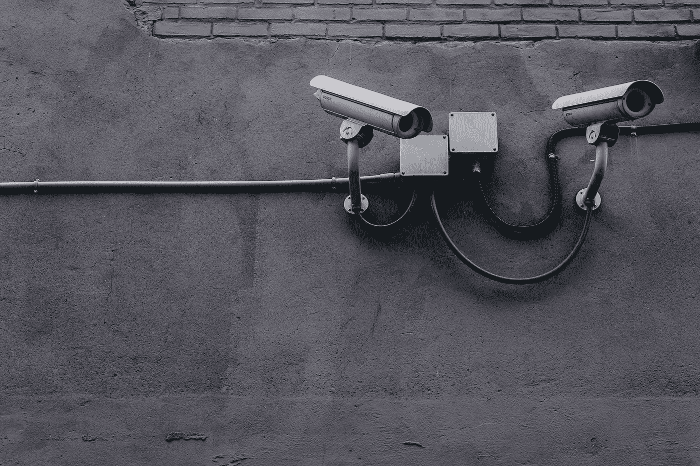

# 隐私的普遍丧失&采用比特币的乐观理由

> 原文：<https://medium.com/hackernoon/universal-loss-of-privacy-the-bullish-case-for-bitcoin-5d42a2864756>

令人难以置信的是，生活在我们中间的一些幻想家能够提前几十年预测事情——著名的英国作家乔治·奥威尔就是这样一个幻想家。[在他的文学经典《1984》](https://www.amazon.com/gp/product/0452262933/ref=as_li_tl?ie=UTF8&camp=1789&creative=9325&creativeASIN=0452262933&linkCode=as2&tag=hfenterprise-20&linkId=b3a001a41483325709772b9b0aa9dcef)(顺便说一下，那是 1949 年写的！)，他描绘了一幅“老大哥”下的全面监控社会的画面，在这个社会里，人类像牧羊人一样生活和运作，每个人的每个行动或话语都会产生后果。

瞧，在 2019 年进入现实生活，我们越来越有可能陷入奥威尔式的未来。

毫无疑问，互联网是现代人类最伟大的发明，它改变了我们所知道的人类生活。互联网让信息流动起来，带来了无限可能。它为地球上的每个人带来了新的想法、景象、声音、概念、技能和机会，并在此过程中积累了大量的人类身份和行为数据。

众所周知，世界上的大型科技公司现在拥有数百万千兆字节的此类数据，这些数据是通过社交媒体平台、移动应用程序、搜索趋势等获得的。在线隐私现在是一种特权，而不是一种权利，人们需要实际上避免使用任何社交媒体工具，以使个人信息不被谷歌和 Facebooks 掌握。这可能是一个巨大的困境，因为这些社交平台也为现代企业家提供了难以置信的商业(营销和广告)工具。

在中国这个因国家监控和互联网审查而臭名昭著的国家，许多基于人工智能的方法已经被用来进一步监控其公民。从 2019 年开始，现在大多数大城市的机场都强制要求登机前必须经过面部识别扫描(即使是外国人！).此外，现在正在采取措施将面部识别数据与公民的行为数据(如信用评分和违法行为等)进行匹配。事实上，中国已经开始实施“社会信用评分”系统，每个公民都将根据过去的个人历史获得一个分数。这太像 1984 年的风格了，就好像他们直接从奥威尔的书里抄来的一样。想象一下，如果你在过去醉醺醺地破坏了一处房产，那么由于这个错误，你将永远没有资格获得未来的各种机会！

在财务和资产保护方面，隐私的丧失近年来也受到了沉重打击，甚至对传统上有很好的方法来规避监管障碍的 hni(高净值个人)也是如此。

仅在过去的十年里，我们就看到经合组织国家建立了共同报告标准，以及臭名昭著的 that 协议。然后，随着[巴拿马文件](https://en.wikipedia.org/wiki/Panama_Papers)和[天堂文件](https://en.wikipedia.org/wiki/Paradise_Papers)的泄露，越来越多的重大全球审查被置于离岸实体和资产保护——富商和政客经常使用的工具。

最近，针对热门离岸避税天堂(泽西岛、马恩岛、英属维尔京群岛、开曼群岛等)的新[经济实体要求](https://home.kpmg/cn/en/home/insights/2019/01/china-tax-alert-06.html)。)2019 年初进场。同样，这是经合组织国家就其宽松的税收政策向离岸司法管辖区施加巨大压力的结果。鉴于如此多的西方国家政府债台高筑，它们试图通过任何可能的手段获取尽可能多的税收也就不足为奇了。

当然，富人足智多谋，总会有 B 计划。随着比特币现在成为一种普遍被社会接受的抗审查数字资产，或“数字黄金”，越来越多的 hni 极有可能增加他们对比特币的敞口。危机中孕育着机遇，对主权金融控制权的挤压为比特币的采用和所有权带来了重大机遇。

随着我们迅速进入一个没有个人和金融数据隐私的世界，对网络安全和分散加密解决方案的需求将会增加。作为抗审查的潜在全球货币体系，以及目前唯一拥有这种特征的“密码”，比特币在未来几年肯定会出现看涨势头——我对此深信不疑。

*原载于 2019 年 3 月 11 日*[*thesovereignmillennial.com*](https://thesovereignmillennial.com/2019/03/11/universal-loss-of-privacy-the-bullish-case-for-bitcoin/)*。*

如果你在这篇文章中发现了一些价值，请给我一些掌声来满足我的自尊心。；-)