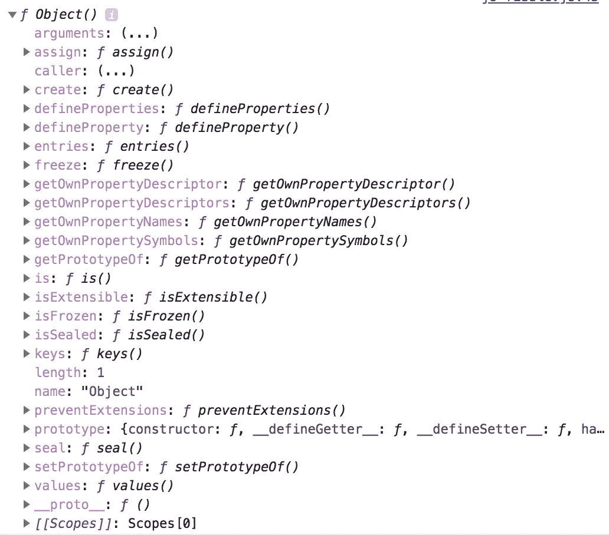
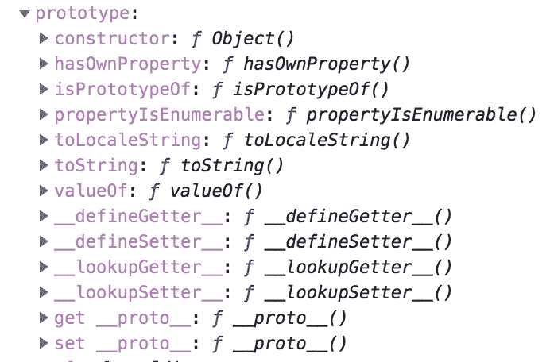
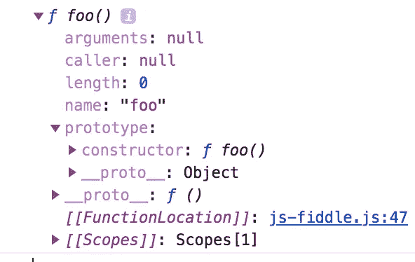
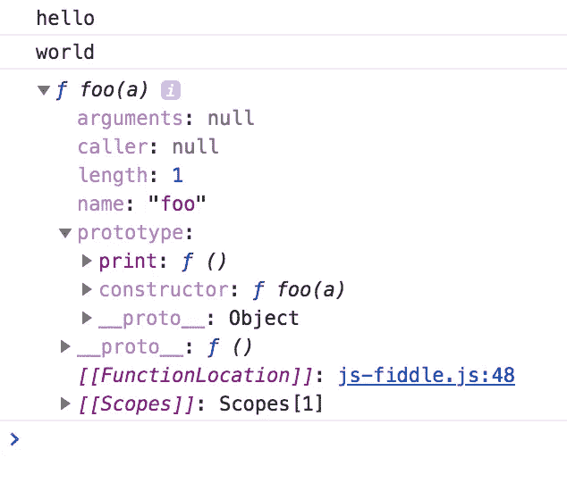
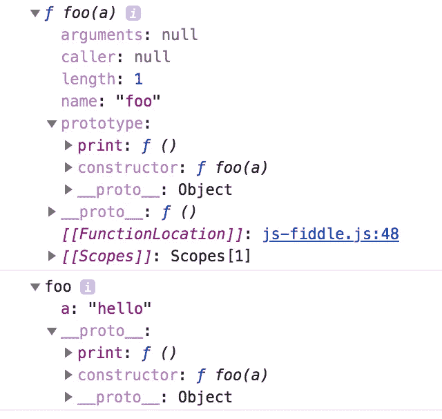
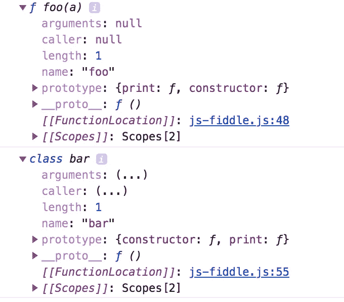

# 解包 JavaScript 类

> 原文：<https://medium.com/hackernoon/unpacking-javascript-classes-81d32804c978>

让我们开门见山吧。那么，JavaScript 中的类是什么意思呢？


要理解[类](https://hackernoon.com/tagged/classes)，我们必须深入挖掘，从**开始*对象构造器*开始**

对象构造器是所有 [JavaScript](https://hackernoon.com/tagged/javascript) 对象的根。您可以使用对象构造函数创建任何类型的对象。让我给你这个故事的第一个剧透。

***“需要注意的是，JavaScript 中的所有对象都是 Object 的实例。将 JavaScript 中的任何对象都看作是通过调用对象构造函数“*** 创建的实例

```
// Object('k1':'v1', 'k2':'v2')
console.log(new Object({'k1':'v1', 'k2':'v2'}))// Array[1 ,2, 3]
console.log(new Object([1, 2, 3])
```

所以，现在我们清楚了对象构造函数的用途，让我们看看对象构造函数的属性。

```
// Print Object's properties
console.dir(Object)
```



除了长长的属性列表，我们还看到一个名为**‘prototype’的属性。现在，这给了我们一个在 JavaScript 中解构类的起点。**

那么，这个'**原型**'属性是什么？它在其他常规属性之上有一个“构造函数”属性。



为了理解它的意义，让我们写一个函数，看看它的属性。记住，函数也是一个 JavaScript 对象，它从对象构造函数继承属性。

```
// foo function
function foo() {}
console.dir(foo)
```



正如我们所料，函数 foo()有一个原型属性。这是我的第二个剧透，

***“原型属性是唯一的。它从*** ' ***对象传递给所有 JS 对象，我们称之为原型链“***

这意味着什么？为了理解这一点，让我们理解当类不是 JS 的一部分时，我们是如何设法模仿类的。我们做了我们称之为构造函数的事情，通过在“new”关键字前加上前缀来创建特定类型的对象。

```
// constructor function
function foo(a) {
  this.a = a
}// Add class method
**foo.prototype.print = function() { console.log(this.a)}**var foo1 = new foo("hello")
foo1.print() // hellovar foo2 = new foo("world")
foo2.print() // world
```



我们刚刚做了什么？我们通过将新方法“print()”直接附加到函数的 prototype 属性来添加类方法。但是，我们如何能够在实例 foo1 和 foo2 上直接调用' print()'神奇！

当我们调用一个前缀为“new”的函数时，JS 通过将函数的 prototype 属性复制到实例的 __proto__ 属性上来进行戏剧性的窃取。而 __proto__ property 是什么？向上滚动，查看所有图像。它也是 JS 中所有对象的属性，这就把我们带到了第三个剧透，

`***__proto__***` ***是查找链中使用的实际对象解析方法等。*** `***prototype***` ***是当你用*** `***new***`创建一个对象时用来构建 `***__proto__***` ***的对象***

这就解释了为什么 __proto__ 一直保持沉默。现在，当我们用' new '调用一个函数时，就会发生这种情况。

```
var foo1 = new foo("hello")
console.dir(foo)
console.dir(foo1)
foo1.print() // hello
```



我们走吧！实例 foo1 的 __proto__ 现在有了 print()函数，当我们这样做的时候，foo1.print()就可以被解析，而且它工作得非常好。

但是，WTH 是阶级吗？


好的，我们有诚实的 **console.dir()** 它告诉我们真相，而且只告诉我们真相。让我们看一个例子。

```
// constructor function 'foo' with a method, print
function foo(a) {
  this.a = a
}
// Add class method
foo.prototype.print = function() { console.log(this.a) }// class 'bar' with a class method, print
class bar {
 constructor(a) {
  this.a = a
 }
 print() {
  console.log(this.a)
 }
}console.dir(foo)
console.dir(bar)
```

最终剧透:

***“foo 和 bar 一样！!"***



***“JavaScript 类是 JavaScript 构造函数的语法糖，是利用 JavaScript 的原型属性和原型链对传统类的伪实现”***

我认为，为了理解 JavaScript 中的任何概念，理解这种语言的组成部分以及一个特性是如何和为什么以一种特定的方式被实现是很重要的。这不仅能让你对主题有一个具体的理解，还能帮助你在解决具体问题时应用这些概念。

如果你喜欢读我的故事，如果你能请我喝杯咖啡，我将不胜感激:)

[](http://buymeacoff.ee/oejUJyBsO)

另外，别忘了按一下“鼓掌”按钮来给我鼓掌。这有助于其他人发现这个故事，他们可能会觉得有帮助。谢谢大家！

