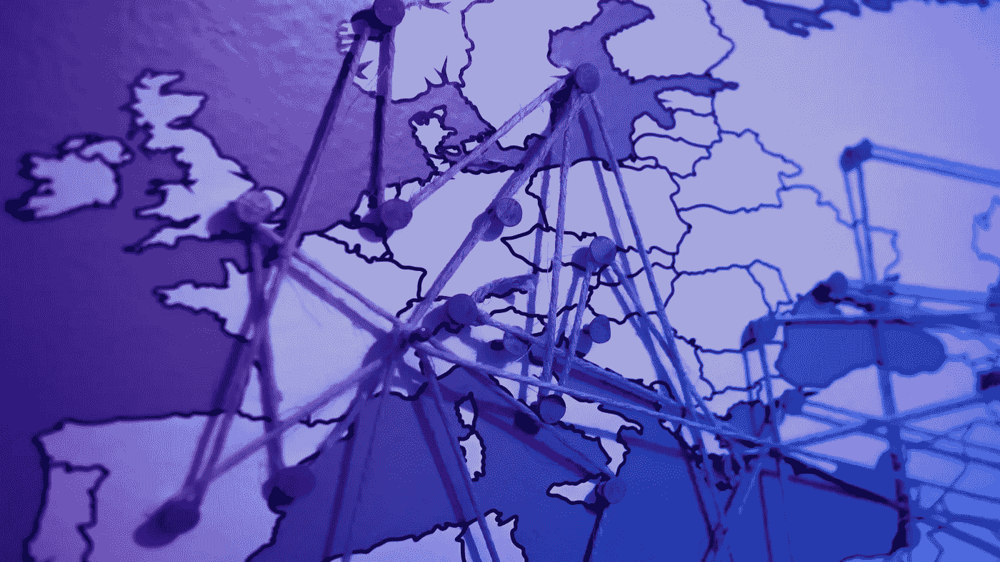

# 解开密码法规:欧洲之旅

> 原文：<https://medium.com/hackernoon/untangling-crypto-regulations-a-european-journey-7c165202fc1a>

Find out more at [www.aXpire.io](http://axpire.io)

2018 年，美国证券交易委员会(SEC)在 18 起加密相关案件中执行了[惩罚措施](https://www.sec.gov/spotlight/cybersecurity-enforcement-actions)，而前年有 5 起，2016 年只有一起。相比之下，欧盟密码领域在个别情况下的法律诉讼较少，而在更大范围内的诉讼较多。

创始人基金的合伙人拿破仑·塔[指出](/harborhq/harbor-raises-28m-to-reengineer-private-securities-for-blockchains-bbc120bfabd3)资本形成是区块链的下一件大事。因此，[sto](https://cointelegraph.com/explained/what-is-an-sto-explained)(安全令牌产品)在 2019 年获得了发展势头，并将在不久的将来继续增长。欧盟国家已经开始按照预期构建监管环境和基础设施。

简单地探究一下 sto，代币被美国 SEC 和瑞士 FINMA(金融市场监管局)广泛归类为实用和安全代币。

公用事业代币使其持有者能够使用代币发行公司提供的产品或服务。拥有公用事业代币并不代表拥有公司的股份。

另一方面，安全令牌带有利润预期，并代表对外部资产的所有权。此外，传统投资可以以安全令牌的形式数字化。因此，它们被视为证券，受联邦安全法规的约束。

*The island nation of Malta is at the forefront of solid crypto regulations*

在欧洲银行管理局( [EBA](https://www.ft.com/content/cb03dd96-1378-11e9-a581-4ff78404524e) )和欧洲证券和市场管理局( [ESMA](https://www.esma.europa.eu/press-news/esma-news/crypto-assets-need-common-eu-wide-approach-ensure-investor-protection) )呼吁泛欧盟加密规则之际，已经有了在整个欧盟范围内无缝制定加密规则的动力。安全令牌根据 [MiFID II](https://kbassociates.ie/overview-mifid-ii/) 规则进行管理。

2018 年 1 月 3 日，欧盟制定了 MiFID II——金融工具指令(2014/65/EU)。该指令涉及与金融资产交易相关的监管框架。根据这项法律，证券代币被归类为“可转让证券”。

MiFID II 的主要目标包括为整个欧盟金融市场提供统一的监管，并确保适当水平的投资者保护。有了这部法律，在整个欧盟范围内发行和交易证券应该会容易得多。

这方面的另一项重要的欧盟立法是[招股说明书指令](https://uk.practicallaw.thomsonreuters.com/8-200-9274?transitionType=Default&contextData=(sc.Default)&firstPage=true&comp=pluk&bhcp=1) (2003/71/EC)。该指令位于金融服务行动计划之下，该计划为任何希望在欧盟境内发行或提供可转让证券的项目奠定了框架。它规定，这些项目必须有各自成员国的国家金融监管机构批准的计划书。

招股说明书指令简化了这一过程。如果招股说明书在一个成员国获得批准，那么通常没有必要提交给另一个成员国批准；仅仅通知监管者就足够了。事实上，在一些成员国，如果企业符合特定标准，甚至可能不需要招股说明书。这一过程使得任何希望在几个欧盟国家提供安全令牌的企业都非常方便。

欧盟法规还列出了获得在交易所交易证券令牌的许可证所需的步骤。 [MTF](https://www.investopedia.com/terms/m/multilateral_trading_facility.asp) (多边贸易设施)许可就是这样一种选择。MTF 为散户投资者和投资公司提供了传统交易所之外的选择。

由于交易速度快、成本低和交易激励，它们在过去几年里在欧洲变得相当受欢迎。与招股说明书指令类似，如果在一个欧盟国家获得许可证，那么交易所运营商在另一个成员国开展业务通常需要做的就是通知该管辖区的监管机构。

就单个国家而言，以下是迄今为止密码法规发展的一些例子:

**马耳他:**在加密友好法规方面，马耳他可能是先行者，甚至在欧洲国家中也是如此。命名为区块链岛，许多加密项目已经转移到马耳他，最著名的是币安和 OKEx。2018 年 7 月，马耳他政府[通过立法](https://www.forbes.com/sites/rachelwolfson/2018/07/05/maltese-parliament-passes-laws-that-set-regulatory-framework-for-blockchain-cryptocurrency-and-dlt/#1dc4eb49ed2f)为区块链、分布式账本技术(DLT)和加密货币建立首个监管框架。

这项立法通过了三项重要法律:

**1)** 马耳他数字创新管理局法案(MDIA 法案)，该法案设立了一个官方机构来认证 DLT 平台。

**2)** 创新技术安排和服务法案(ITAS 法案)，处理加密货币领域技术提供商和公司的注册事宜。

**3)** 虚拟金融资产法案(VFA 法案)，该法案制定了针对 ico、交易所和交易的法规。

VFA 法案还定义了 3 类代币:*公用事业*、*证券、*和 *VFA* (虚拟金融资产)。

被归类为 VFA 的代币不是证券。项目因此使用这个范围将他们的令牌分类为 VFA，允许更广泛的受众购买它们。

*Zug, Switzerland, is home to ‘Crypto Valley’*

**瑞士:**瑞士的楚格镇是一个加密和区块链开发中心的所在地，被称为加密谷。它被评为欧洲发展最快的科技社区。瑞士金融管理局是负责金融监管的政府机构，包括 sto。

2018 年，FINMA 发布了将代币分为四类的指导方针-支付、公用事业、资产和混合。其中，只有资产代币被视为证券。提供 sto 的企业必须遵守股票、债券和衍生品等其他证券所遵守的所有法规。此外，sto 还受“五大”瑞士[金融法规](/mme-legal/securities-token-offerings-stos-in-switzerland-3ad2e6ec5718)——股票交易法规、反洗钱法规、银行法规、金融市场基础设施法规和集体投资计划法规的约束。

**法国:**法国金融监管机构 AMF(authorityédes Marchés Financiers)在 2018 年发布了指导方针，规定 ico 应提供充分的透明度，并确保为投资者提供特定的担保。企业还必须向当局披露细节，比如它们计划发行何种类型的代币。

这些规定的目的是确保潜在买家能够做出明智的决定。有趣的是，全面披露的要求减少了在法国以外经营的 ico 的数量，同时使 sto 更加有利。

**德国:**在德国，金融监管机构 BaFin(联邦金融监管局)已经将比特币和以太坊归类为记账单位和金融工具。过去，它曾对 ico 表示过关切，并认为 ico 应受到严格审查。它还拒绝了几家公司提出的象征性发行提议，理由是不具备竞争力。

然而，2019 年 1 月，联邦金融监管局批准了柏林初创企业 Bitbond 的代币发行提议。这一批准被认为是一个开创先例的判决，并为德国未来的 sto 铺平了道路。

**爱沙尼亚:**自 2012 年以来，爱沙尼亚一直在使用自己的区块链技术，称为无钥匙签名基础设施(KSI)。毫不奇怪，爱沙尼亚是欧盟首批将加密相关活动合法化的国家之一。爱沙尼亚金融监督局(EFSA)指出，每一个 ICO 都是独一无二的，每一个都应根据其本身的优点进行独立评估。

加密货币和 ICO 投资的税收都很低。政府[对区块链技术和加密货币的鼓励](https://news.bitcoin.com/estonia-issues-over-900-licenses-to-cryptocurrency-businesses/)，加上市场的开放性，使得爱沙尼亚成为当今世界上对加密最友好的国家之一。

在整个欧盟，我们看到监管越来越清晰，越来越有利于 sto 的趋势。作为一个常见的安全类别，他们更容易管理，因此也更容易制定法律。此外，MiFID II 等框架指令正在缩小跨境加密监管差距。当马耳他继续为加密货币制定具有里程碑意义的法规时，欧盟的其他国家也紧随其后。

*关于作者:*

Rohit Chatterjee *是德州仪器公司的一名模拟设计工程师。* [*阿比乔伊·萨卡尔*](/@SarkarAbhijoy) *是一位银行家出身的企业家。他们是多年前失去联系的高中好友。他们在 2018 年初通过 crypto 重聚，并通过相互研究和共享知识进行投资。Rohit 和 Abhijoy 通过*[*matchbx . io*](http://matchbx.io)作为自由职业者为 aXpire 写了这篇文章