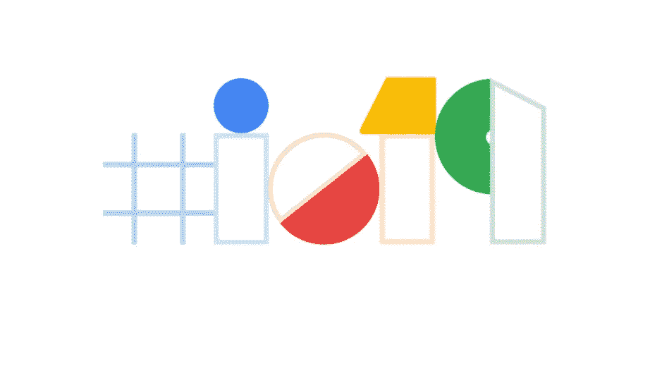

# 面向 Web 开发人员的即将推出的 Web 功能— Google I/O 2019

> 原文：<https://medium.com/hackernoon/upcoming-web-features-for-web-developers-google-i-o-2019-4df0ad993889>



Google I/O 2019 Logo

*注意:如果这是在 Medium 的米墙中，请使用匿名/隐私浏览模式来克服这个限制。*

这是 Google I/O 2019 中概述的所有即将推出的网络功能的列表。这些都是从[谷歌](https://hackernoon.com/tagged/google)在其[频道](https://www.youtube.com/channel/UCnUYZLuoy1rq1aVMwx4aTzw)发布的所有 YouTube 视频中删除的。这是一个活的文档，当我开始观看所有视频并且谷歌不断上传它们时，它将会更新。

# Chrome 和网络的新功能(Google I/O’19)

[@5](http://twitter.com/5) :48
平均页面传输 800KB 图片。chrome 上的延迟加载

[@6](http://twitter.com/6) :38

添加 loading 属性来延迟加载图像。

```
 
<ifram loading=”lazy” />
```

谷歌搜索控制台中的 [@8](http://twitter.com/8) :40
速度报告

[@9](http://twitter.com/9) :17
绘画保持:
防止特定内容从一种状态转换到另一种状态时闪烁。

[@11](http://twitter.com/11) :16(门户)—您可以导航到的 iFrames。基本上，它允许 iFrames 之间的无缝转换。相当酷，一定要去看看！旗帜后面的铬金丝雀)

[@15](http://twitter.com/15) :09(网页打包)——他们在去年的 I/O 2018
上宣布，基本上你的网站被打包成一个文件，让浏览器能够预加载页面。

[@18](http://twitter.com/18) :00(网页感知工具包和形状检测 API(条形码、文本检测等))

[@23](http://twitter.com/23) :00(网页分享 API)。基本上可以让你把 Android 的共享屏幕功能带到你的 PWA 上

[@26](http://twitter.com/26) :10 (Proxx) —扫雷 a la 2019……看起来有病！它也适用于功能手机！！！

[@27](http://twitter.com/27) :40(网络上的双工)—使用人工智能来帮助您填写/导航(在您同意的情况下)网站中的表单。您可以访问搜索控制台添加一个测试帐户，以便双工可以分析您的网站流量。

[@ 32](http://twitter.com/32):04 Chrome 即将推出的功能:
-原生文件系统访问
-无限制配额
-联系人选择器
- MIME 类型处理程序
-基于短信的认证

他们开始谈论安全问题。重述 chrome 以前的功能，例如:站点隔离、默认 HTTPS
[@ 34](http://twitter.com/34):28 用户在网络上如何被跟踪
[@35](http://twitter.com/35) :25 —默认第一方 cookies。这可以防止 cookies 被第三方共享。您将需要为 cookie 隐式声明一个相同站点:无设置。(可以在旗帜后面的金丝雀上测试)

[@36](http://twitter.com/36) :45: Chrome 会屏蔽指纹识别。

[@37](http://twitter.com/37) :40 WebAuthn。将原生 2FA 带到网络上！

[@39](http://twitter.com/39) :10 Web.dev 一个教你如何在现代网络中构建的网站。