# 升级您的 JavaScript 数组知识

> 原文：<https://medium.com/hackernoon/upgrade-your-javascript-array-knowledge-b917431408d0>


JavaScript 每天都在增加新的特性。有时，我们忙于日常的编码工作，以至于我们使用旧的技巧来解决一些特定的问题，而不知道新版本的 JavaScript 中添加了新的方法或特性。在本文中，我将介绍一些新版本 JavaScript 中添加到 Array 中的有趣方法。

1.  **array . prototype . is array**

如何在 JavaScript 中检查给定的对象是数组？这是面试中通常被问到的问题之一。通常，如果你是一个没有经验的 JavaScript 开发人员，首先想到的是`typeof`操作符。但是`typeof`会返回`Object`进行数组。

```
let a = [1];typeof a
//Returns 'object'
```

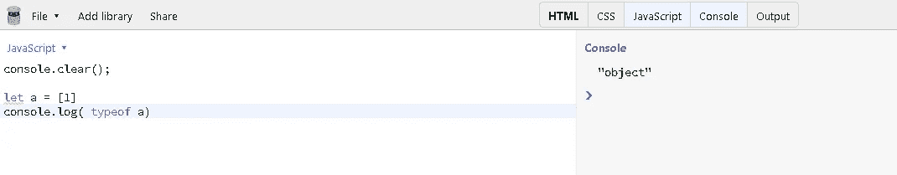

所以`typeof`不起作用。那么什么会呢？

解决这个问题的办法是使用`Object.prototype.toString`

```
let arr = [1, 2, 3];
let obj = {name: 'Akash', age: '22'};

Object.prototype.toString.call(arr);
// Returns '[object Array]'

Object.prototype.toString.call(obj);
// Returns '[object Object]'
```

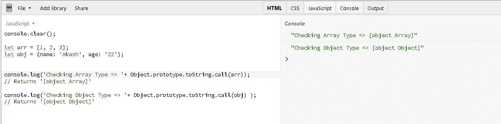

所以这是这个问题的变通方法。现在在新的 JavaScript 中我们有了`isArray`方法。

```
let arr = [1, 2, 3];
let obj = {name: 'Akash', age: '22'};

Array.isArray(arr)
// Returns true

Array.isArray(obj);
// Returns false
```

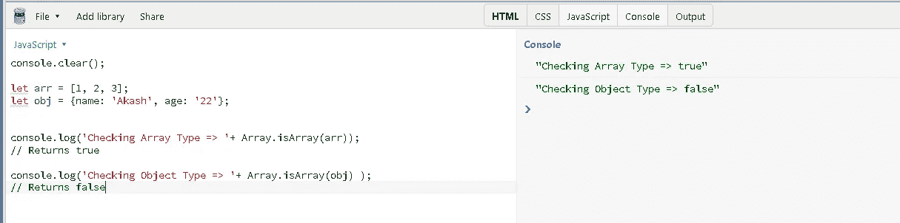

`isArray`被所有主流浏览器支持。你可以看到下面:

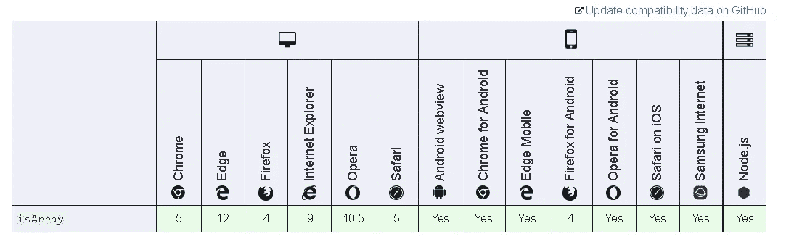

对于不支持的浏览器，您可以使用 polyfill。你可以在这里找到 polyfill [。](https://developer.mozilla.org/en-US/docs/Web/JavaScript/Reference/Global_Objects/Array/isArray)

**2。Array.prototype.includes**

当我们必须发现一个给定项目是否存在于一个特定的数组中时，我们通常使用`indexOf`操作符，然后检查结果是否大于-1。

```
let arr = [1,2,3,4];let item = 4;let result = arr.indexOf(item) > -1 ? 'exist' : 'do not exist';console.log(result)
//Result exist
```

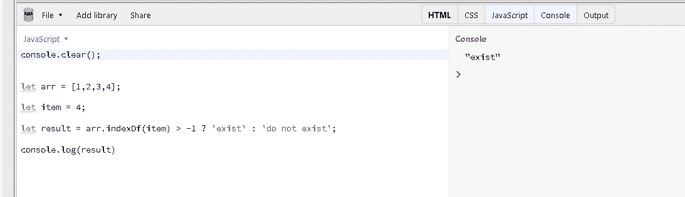

但是现在我们可以使用`includes`，如果数组中存在条目，它将返回`true`，如果条目不存在，它将返回`false`。

```
let arr = [1,2,3,4];let item = 4;console.log(arr.includes(item));
// Returns trueconsole.log(arr.includes(5));
// Return false
```

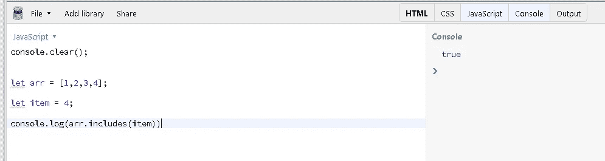

您可以在此处检查浏览器兼容性:

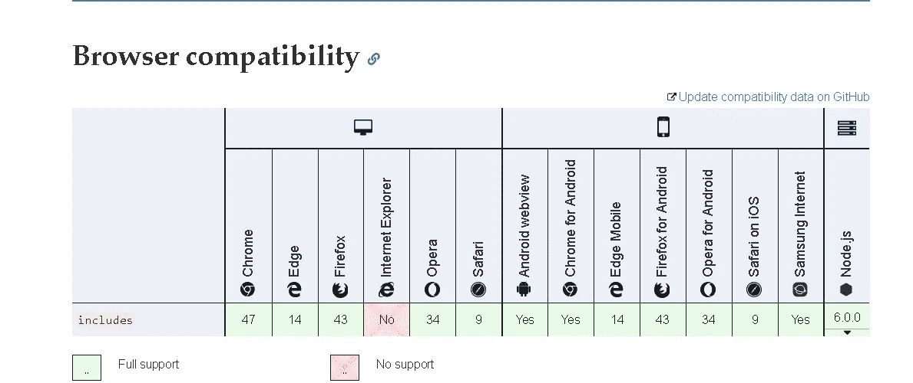

注意，IE 不支持这个。所以如果你想在 IE 中使用它，你可以使用 polyfill。Polyfill 可以在这里找到[。](https://developer.mozilla.org/en-US/docs/Web/JavaScript/Reference/Global_Objects/Array/includes)

**3。Array.prototype.find**

如果您有一个对象数组，并且您的目标是从集合中找到一个满足特定条件的对象，那么这是一个非常有用的方法。

有时，编码人员使用`filter`来根据条件查找对象，但是众所周知，filter 方法返回一个过滤项目的数组，而不是数组中的项目。所以每次我们需要从过滤后的数组中取出第一项。

```
let users = [{
  name: 'Mayank'
}, {
  name: 'Prashant'
}, {
  name: 'Pankaj'
}, {
  name: 'Nikhil'
}];// find a user named Pankaj// solution via filterlet filteredUser = users.filter(user => user.name === 'Pankaj');console.log('fileterd user array => ', filteredUser);// Result [{ name: "Pankaj" }]// so to get the user we need to do **filteredUser[0]**console.log('Filtered user => ', filteredUser[0]);// Result { name: "Pankaj" }
```

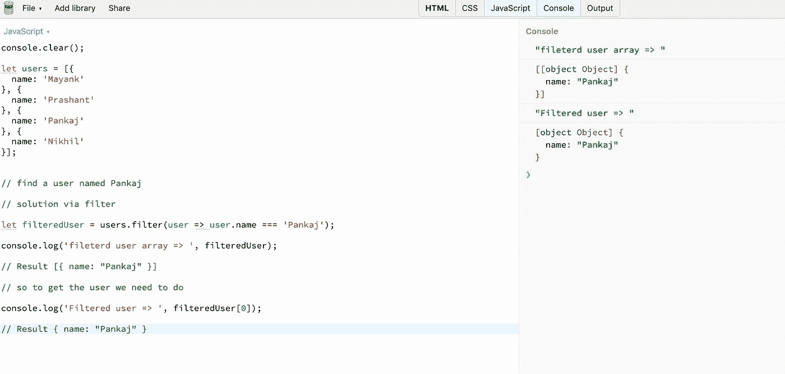

但是这个问题有一个更好的解决方案，我们可以通过使用`find`方法直接获取用户。

```
let users = [{
  name: 'Mayank'
}, {
  name: 'Prashant'
}, {
  name: 'Pankaj'
}, {
  name: 'Nikhil'
}];// find a user named Pankaj// solution via findlet filteredUser = users.find(user => user.name === 'Pankaj');console.log('Filtered user => ', filteredUser);// Result { name: "Pankaj" }
```

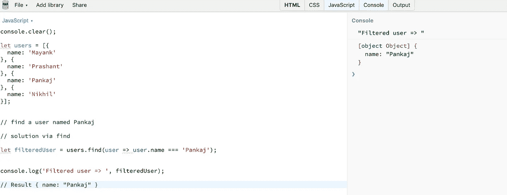

浏览器对此的支持可以在此处看到:

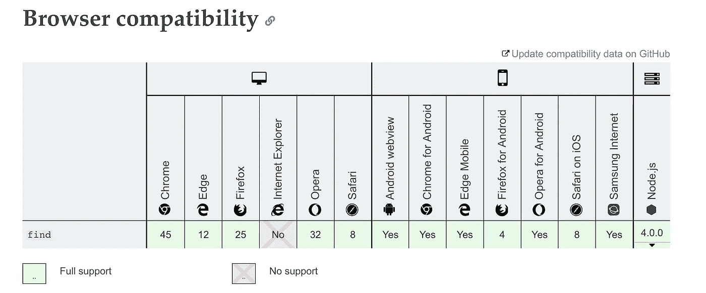

如你所见，IE 不支持这种方法，所以如果你想使用这种方法，你可以在这里找到 poly fill。

**5。Array.prototype.flat**

你有没有遇到过这样一个数组:数组的元素也是数组，而你希望所有的元素都在一个平面数组中？你是如何解决那个问题的？我猜你可能用过`reduce`和`concat`。这是解决这个问题的好方法。但是现在我们有了`flat`操作员，它可以为我们做这件事，直到你通过的深度。如果不传递深度，它将采用默认值 1。

```
let arr = [1,2, [3,4,5]];let result = arr.flat();console.log(result);
//Result [1,2,3,4,5]
```

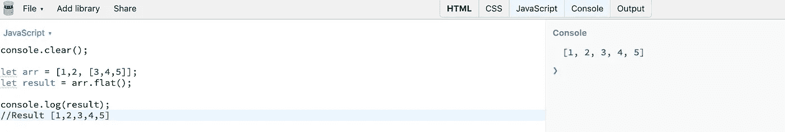

让我们考虑一个嵌套更深的数组的例子。

```
let arr = [1,2, [3,4,5,[6,7,8,9,10]]];let result = arr.flat();console.log(result);
//Result [1,2,3,4,5,[6,7,8,9,10]]// if we know the depth as we know here that is 2\. We can pass itlet flatArray = arr.flat(2);console.log(flatArray);
//Result [1,2,3,4,5,6,7,8,9,10]
```

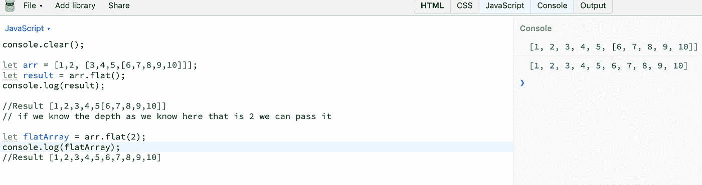

现在我知道你在想什么，如果我们不知道深度呢？如果我们不知道深度，我们总是可以回去减少和连接解决方案

```
let arr = [1,2, [3,4,5,[6,7,8,9,10]]];function flattenDeep(arr1) {
   return arr1.reduce((acc, val) => {
       return Array.isArray(val) ? 
           acc.concat(flattenDeep(val)) :
           acc.concat(val);
   }, []);
}console.log(flattenDeep(arr))
//Result [1,2,3,4,5,6,7,8,9,10]
```

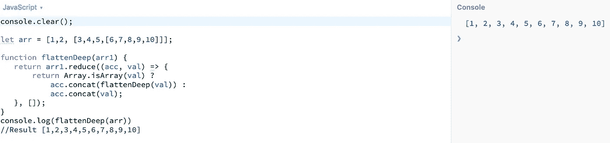

正如[马修·哈特曼指出的那样，](https://medium.com/u/d2dbc6b33777?source=post_page-----b917431408d0--------------------------------)如果你不知道数组的深度，你可以简单地通过`Infinity`，它会像魔咒一样工作，你不需要去寻找`reduce`和`concat`的解决方案。

```
let arr = [1,2, [3,4,5,[6,7,8,9,10]]];let result = arr.flat(Infinity);console.log(result);
// Result [1, 2, 3, 4, 5, 6, 7, 8, 9, 10]
```

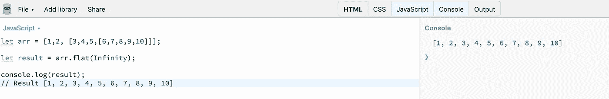

如果您不想要递归解决方案，有几个其他解决方案可以解决这个问题。你可以在这里找到[。](https://developer.mozilla.org/en-US/docs/Web/JavaScript/Reference/Global_Objects/Array/flat)

浏览器对此方法的支持如下:


您可以使用此方法的 polyfill，可在此处找到[。](https://developer.mozilla.org/en-US/docs/Web/JavaScript/Reference/Global_Objects/Array/flat)

这些是一些我觉得有用的 JavaScript 方法。

请提出任何改进建议，并分享、订阅和鼓掌。谢谢:)