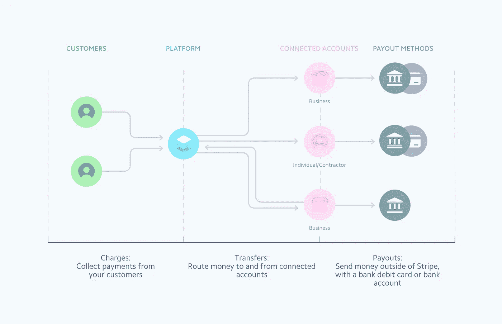
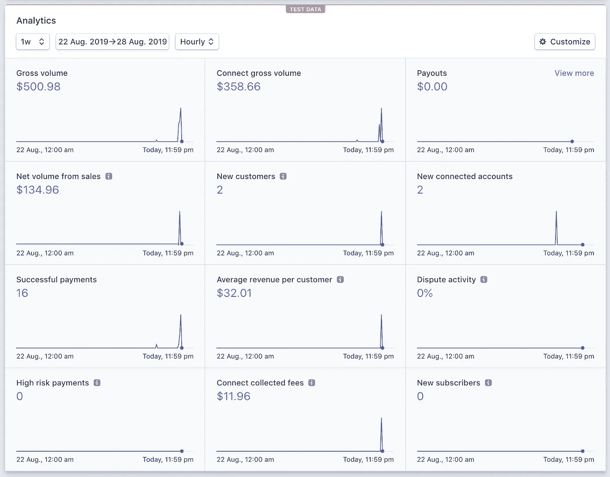
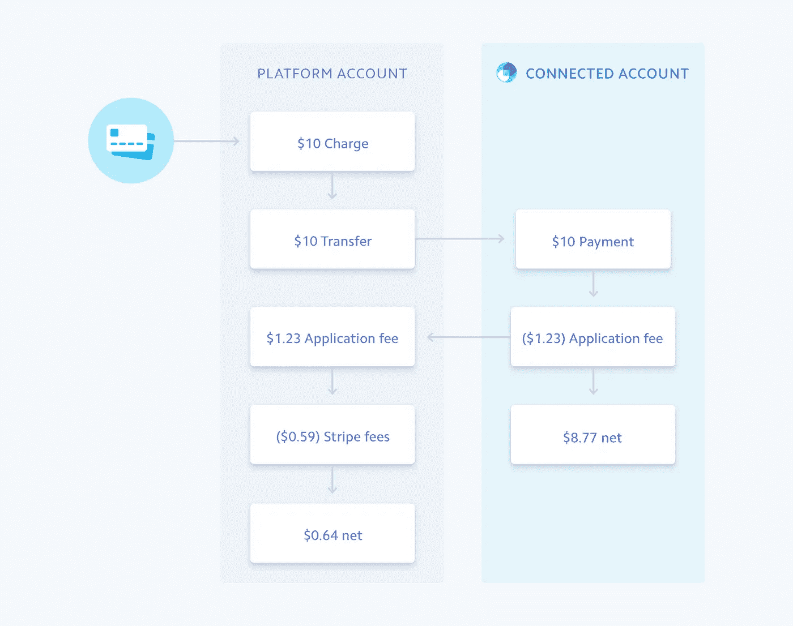
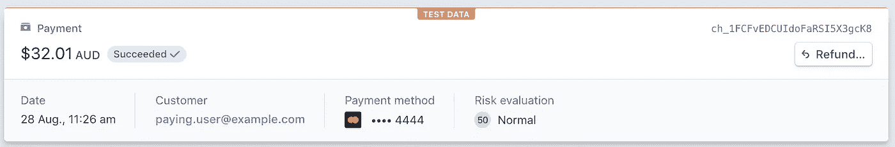
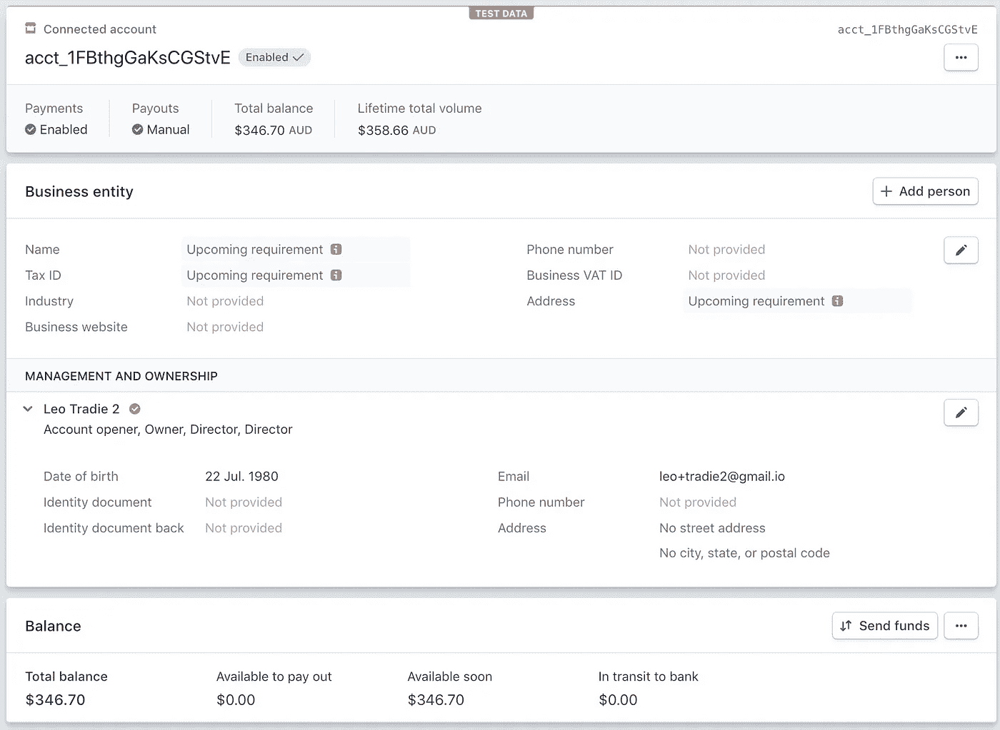
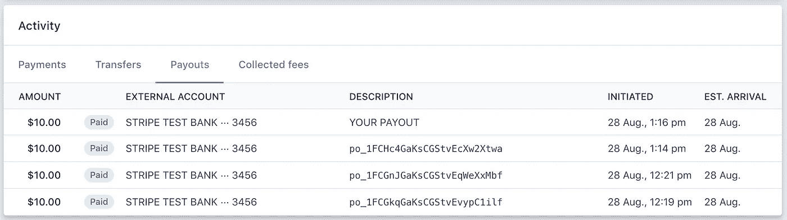

# 如何在美国和加拿大之外使用 Stripe Connect API

> 原文：<https://medium.com/hackernoon/use-stripe-connect-api-outside-the-usa-and-canada-741bae8127a2>

Stripe Connect

Stripe Dashboard made during this Stripe Connect API research

> TL；DR；下面，您将了解如何使用 Stripe Connect 在市场场景中为美国和加拿大以外的企业处理支付，这些企业使用 Stripe Connect 的自定义帐户。这里的主要目标是促进市场双方的付款收集。在澳大利亚；)

准备工作:创建一个 Stripe Connect 帐户并验证它，以便它成为活动帐户。获取 API 密钥并安全存储。我将使用 JavaScript (NodeJS)来快速尝试 API。对于这个探索，我还没有搭建任何 UI。

让我们创建一个自定义的连接条带帐户。

之后，我们需要接受条款和条件。

我们创建一个人，他是帐户的企业所有者。

然后，我们更新帐户所有者的生日，以通过个人验证。

现在，我们需要创建一个银行帐户，并将其与自定义 Stripe 帐户相关联，以便将来支付。

好的，我们即将让消费者为服务付费，所以我们需要创造一个愿意为服务付费的客户。

现在我们终于准备好向客户收取所提供服务的费用了。这种收费是通过平台(平台是结算账户)完成的，然后钱可以被转移到服务提供商。

你可以发现我们平台收费 2.99 澳币。为了更好地了解费用，请查看下图。

但是，如果您希望资金直接进入服务提供商的 connect 帐户作为商户结算帐户，您可以代表服务提供商收费。

在条带仪表板中，事务可能如下所示。

在所有这些费用之后，服务提供商还有一些钱可以收回。

如果你想控制服务提供商是否直接拿到钱，你可以将支付时间表切换到手动模式。

最后，服务提供商可以得到赚来的钱，所以我们发起一个转移(这是一个支出)。但是，让我们先快速查看一下可用余额。

如果你在余额上没有钱，当你试图支付时，你会得到下面的错误。

*Stripe 账户资金不足。在测试模式下，您可以通过创建以 4000 0000 0000 0077 为卡号的收费，将资金添加到您的可用余额中(绕过您的待定余额)。您可以使用/v1/balance 端点来查看您的条带平衡(有关更多详细信息，请参见 stripe.com/docs/api#balance)*

你需要用这个令牌 **tok_bypassPending** 进行充值。在您的服务提供商获得一些可用余额后，您最终可以向关联的默认外部支付工具付款:)

如果此操作成功，您应该会在仪表板中看到支出。

好的，我花了大约 3 个小时来尝试一切，并更好地理解 Stripe Connect 如何与自定义帐户配合工作(标准和快速帐户在澳大利亚不完全可用)。

# 最后

IMHO: Stripe Connect 提供了当今快速启动市场以测试产品创意的最佳选择。如果你的创新基于支付，你可能不想使用 Stripe，但是，这是一个好的开始，可以节省大量的时间和金钱。

如果您有任何意见或建议，请写下回复。