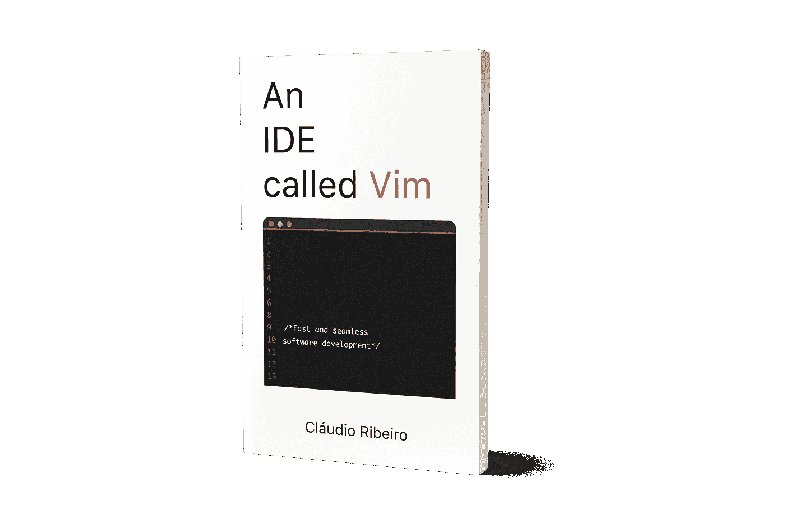

# 2019 年有用的 Vim 技巧

> 原文：<https://medium.com/hackernoon/useful-vim-tricks-for-2019-e7c1db7a18d6>

Courtesy of Unsplash, some cool tricks!

Vim 有一个陡峭的学习曲线，我们不要试图覆盖它。但是一旦你开始了解它的细微差别，你就会发现 Vim 充满了节省时间的技巧。这就是我们将在本文中讨论的内容。

我在网上搜索 Vim 的窍门。有些来自不同的网站，twitter 帖子，有些是我自己的。无论如何，其中一些可能有助于在 2019 年改善你的工作流程。

**但我刚刚开始使用 Vim**

没问题，开始使用 Vim 时，您真正需要知道的一切可以浓缩成一句话:

> 用“vim {filename}”打开一个文件。输入“I”开始添加文本。添加完文本后，输入“ESC”。最后，输入':wq '保存并退出，':w '保存，或者':q！'不存就退出。

我将向您展示的一些“技巧”并不是真正的技巧，只是简单的快捷方式，以及内置于 Vim 中的命令。事实是，这些命令中的一些非常有用，它们本身就可以被认为是技巧。

所以，我想给你们介绍的第一个是 vimtutor。Vim 附带了一个交互式教程，可以用来学习编辑器的基础知识。本教程充满了有用的信息，如如何移动，vim 模态方式，搜索等等。所以，如果你刚刚开始使用 Vim，这是我希望你尝试的第一个技巧。

只需在 Vim 中键入 **< ESC >** 后跟 **:Tutor** 即可启动它。

**我是一名中级/高级 Vim 用户**

其中一些建议可能适合你。我就筛选一下，不多解释。这些提示的目的是让你使用它们。如果你想真正理解它们是如何工作的，帮助文件总是在那里等着你。

**在文件内移动**

很多时候，在一个文件中，我们需要做一些事情，比如跳到文件的末尾或开头。当处理大型文件时，其中一些任务可能会非常繁琐。Vim 提供了一系列在文件内部移动的快捷方式。

**G** 会跳到文件的末尾， **gg** 会跳到文件的开头。如果我们想移动到特定的行，我们可以使用下列之一: **:123 < CR >** ， **123G** 或 **123gg** 。所有这些选项都会将光标移动到第 123 行。

同样， **$vim filename +123** 将在 vim 上启动已经在第 123 行的文件。

行导航也很棘手，所以 **0** 会将光标移动到当前行的开头， **$** 会移动到行尾。

**H** 将光标移动到当前窗口的顶部， **M** 将光标移动到当前窗口的中间。

最后，如果您正在编辑代码， **%** 将跳转到匹配的括号。

请注意，所有这些命令都适用于正常模式。当然，在插入模式下，这些不是命令，只是正在写入的字符。

在文件中移动的命令有很多，但是有了这些，我们应该能够更快地执行大多数日常任务。

## 去做更有趣的事情

Courtesy of Unsplash

虽然非常有用，但上面的提示是乏味的。它们只是伪装成提示的常规命令。更复杂的东西呢？

**-恢复信息**
有时候我们需要关闭正在做的事情，没有时间创建一个会话来存储东西。Vim 提供了将光标放在最后一个已知位置上来打开机器上最后一个编辑过的文件的能力。为此，我们启动 Vim 并点击 **CTRL + o + o** 。

**- Shell 命令**
另一个真正有用的功能是在 Vim 中输出终端命令的结果。Vim 提供了在其中运行 shell 命令的能力。为此，我们使用**！**命令。例如，要输出运行 ls 的结果，我们可以使用 **:r！ls** ， **:r！cal** 输出当前月历或 **:r！日期**为当前日期和时间。

**-历史**
Vim 提供了最近运行的命令的历史。有时我们需要重新运行一些命令，但是 **:history** 命令仅供参考。要重新运行这些命令，我们可以使用交互式命令历史窗口。要启动它，我们可以使用 **q:** 。接下来就是选择要运行的命令并用 **< CR >** 执行它。

**-压缩文件**
另一个可以派上用场的是无需解压即可打开、编辑和保存压缩文件的能力。这可以通过打开压缩文件来实现。例如，**$维姆 archive.tar.gz**。这将启动浏览器。然后，我们可以打开、编辑和保存这些文件，而不必提取它们。

**-不知道命令是做什么的？**
在正常模式下点击 **K** 将启动光标下关键字的联机帮助页。此外，点击 ***** 将搜索光标下出现的所有单词。

**-缩进**
**gg=G** 将根据我们使用的标签的定义缩进我们的整个文件。为了更进一步，我们可以设置标记来缩进整个文件并将光标保持在原来的位置，为此我们可以使用 **mmgg=G'm** 。这看起来很复杂，但很有效。我发现使用这个命令的最好方法是重新映射它，而不是试图记住它。只是太多了。

我们之前看到，我们可以从 Vim 内部运行 shell 命令。对于 grep，Vim 提供了自己的版本 Vimgrep。
Vimgrep 不过是它的 shell 版本的别名，但是比'**:！grep…**’。
例如，搜索所有“错误”的所有出现。txt 文件我们可以使用 **:vimgrep error *。txt** 。
有关 Vimgrep 的更多信息，请使用 **:h vimgrep** 。

**-使用 Vim**
检查不同的 git 分支内容很多时候，在使用 git 的时候，我们需要检查不同分支的内容。使用一些 bass-fu 和 Vim，我们可以在一个不同的分支中看到给定文件的内容，而不必进入它。

**git show branch _ name:/path/to/file . txt | vim-**

基本上，我们将不同分支中的文件显示到 Vim 中。

这些是我自己发现并使用的一些技巧。如您所见，了解一些 Vim 的内部工作原理，就有可能做一些非常酷的事情，从而节省我们大量的时间。

你呢？你有哪些 2019 年的 Vim 小妙招和我们分享？

想了解更多关于 Vim 的知识？想学习如何将其用作 IDE？看看我的新书[一个叫做 Vim](https://leanpub.com/anidecalledvim) 的 IDE。从基本的 Vim 使用到文件查找、自动完成、文件管理器等等，它都有。