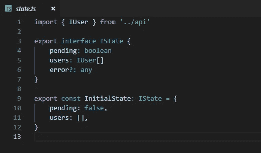
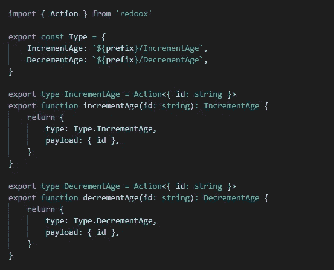
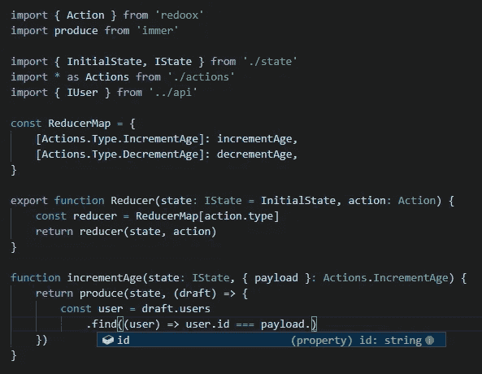
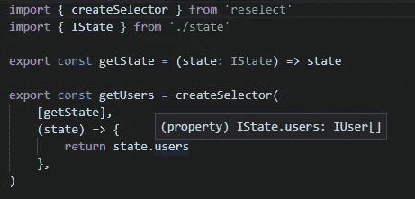
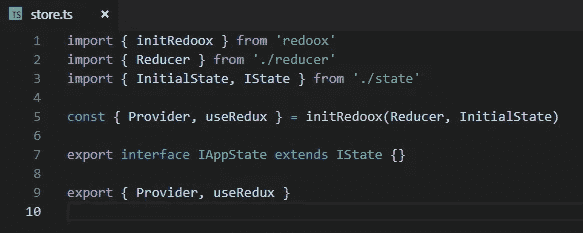
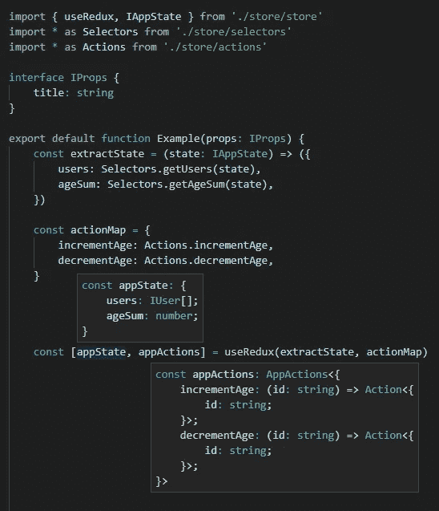

# useRedux —带 React 挂钩的状态管理模式

> 原文：<https://medium.com/hackernoon/useredux-state-management-pattern-with-react-hooks-fa8e1413b9f1>

自从 [React Hooks](https://reactjs.org/docs/hooks-intro.html) 特性公布，API 公开以来，我一直在思考这对*Redux*——一个众所周知的状态管理库——意味着什么。相当一段时间以来，一直有声音喊着我们不需要 *Redux* ，我们可以用 *React Context* 达到同样的效果。嗯，我认为 *Redux* 与其说是一个库，不如说是一种模式。在玩了一天 *React 钩子*之后，我能够使用**上下文**和**钩子**来实现这个模式。我将向你展示如何制作你自己的*提供者*包装器和 *useRedux* 钩子。哦，而且是在**打字稿**里全打出来的。


Unrelated, yet still a nice photo. ( by [Agustin Gaute](https://unsplash.com/photos/bShDAAlPLKc?utm_source=unsplash&utm_medium=referral&utm_content=creditCopyText) on [Unsplash](https://unsplash.com/?utm_source=unsplash&utm_medium=referral&utm_content=creditCopyText))

# 供应者

首先，我们为我们的状态和动作创建一个*提供者*。让我们创建一个名为`initRedux`的函数，它将有两个参数:root reducer 和应用程序的初始状态，因此我们可以将它们传递给 [useReducer](https://reactjs.org/docs/hooks-reference.html#usereducer) hook。

```
const [state, dispatch] = useReducer(rootReducer, initialState)
```

这个钩子会给我们*状态*对象和*分派*函数。这两个应该在整个应用程序中都是可访问的。实现这一点的最好方法是用 *React Context* 沿着组件树向下传递它们，每个上下文对应一个上下文。

```
const StateContext = React.createContext(null)
const DispatchContext = React.createContext(null)
```

我们的`initRedux`方法创建了一个已经包含这两个上下文的提供者的`Provider`。

有了这个`Provider`,您可以包装整个应用程序，并在每个组件中提供应用程序状态和调度功能。但是我们如何在组件中使用它们呢？

# useRedux

钩子的一个很大的优点是它们的组合能力。你可以用另一个钩子做你自己的钩子。只要你遵守钩子的[规则，你想怎么玩就怎么玩。](https://reactjs.org/docs/hooks-rules.html)

正如我所说的，我们需要访问应用程序状态，并且能够调度我们的操作。为了方便起见，我决定使用一个与 [React-Redux](https://github.com/reduxjs/react-redux) 中的`connect`函数非常相似的接口。如果不熟悉，肯定查一下，很有用的。

因此，我们的`useRedux`钩子将接受两个参数，称为`extractState`和`actionMap`(与`mapStateToProps`和`mapDispatchToProps`平行)。

首先，我们检索两个上下文。

```
const appState = React.useContext(StateContext)
const dispatch = React.useContext(DispatchContext)
```

当然，我们不想返回应用程序的整个状态，而是使用`extractState`函数从参数中提取状态的所需部分。

```
const stateExtract = extractState(appState)
```

这部分很简单。`useRedux`的一个消费者已经提供了一个函数，它将应用程序状态作为一个参数，并且只选择相关的值。现在我们需要使用`actionMap`参数并做一些映射魔术。假设`actionMap`是一个形状为`{key: myActionCreator}`的对象，让我们给那些动作创建者绑定一个`dispatch`函数。

代码遍历`actionMap`对象中的键，并用函数替换它的值(动作创建者),这些函数直接调度那些动作创建者返回的动作。通过一个简单的修改，我们也可以调度 *thunks* 。只要加一个条件:

```
const fn = (...args) => {
    const action = actionCreator(...args)
    if (typeof action === 'function') {
        action(dispatch, () => appState)
    } else {
        dispatch(action)
    }
}
```

现在我们需要做的就是从我们的自定义钩子返回`stateExtract`和`actions`。一个完整的`initRedux`函数如下所示。

在大约 40 行代码中，你可以创建自己的 *Provider* 和 *useRedux* 定制钩子。我照做了，用 TypeScript 把它全部打出来，并把它作为`redoox`包发布给 npm。如果你愿意，你可以试着玩玩它，但是要知道这只是一个实验，它绝对不适合生产。

已经有相当多的软件包试图达到同样的效果。有一个甚至来自脸书孵化器。我认为最好不要有大量的软件包试图用稍微不同的 API 来解决同一个问题。如果你知道有一个公平的机会成为“官方的”，让我在评论中知道。我很乐意帮助实现它。

现在，让我们来看看由于类型化接口，开发人员的体验有多好。

# 它是如何工作的？

用法很简单。例如，我创建了一个简单的应用程序，它从 REST API 加载用户，显示他们，您可以增加/减少他们的年龄。

1.  创建应用程序状态



2.实施行动创建者



3.机具减速器。我使用了 [immer](https://github.com/mweststrate/immer) 库来确保不变性。*请注意，在访问 action payload 时，您几乎不会出错。*



4.实现选择器。我正在使用[重新选择](https://github.com/reduxjs/reselect)库。



5.创建一个商店。



6.最后，在组件中使用钩子。如果所有的接口都被正确地输入，您将总是知道您提取了状态的哪一部分，以及哪些动作是可用的。



你可以在这里找到完整的例子[。
只克隆一个库，然后`yarn`、`yarn build`和`yarn start`。](https://github.com/jake-daniels/redoox)

在我作为软件开发人员的职业生涯中，我遇到过许多不同的状态管理模式，不仅仅是 React /JavaScript。到目前为止，我最喜欢 Redux。它是可预测的、可维护的和易于测试的。就应用程序的数据层而言，这些属性对我来说非常重要。如果我们能让它在更大范围内与 React 挂钩一起工作，那就太好了。

感谢阅读。如果你有问题或有趣的想法，请在评论区分享。