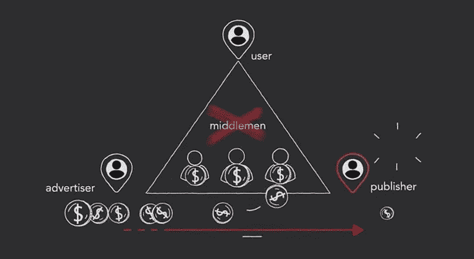
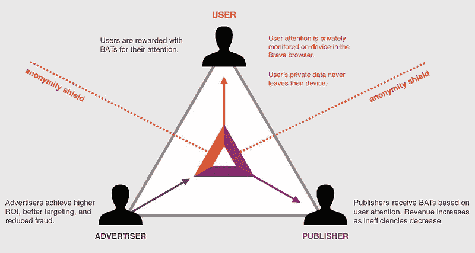
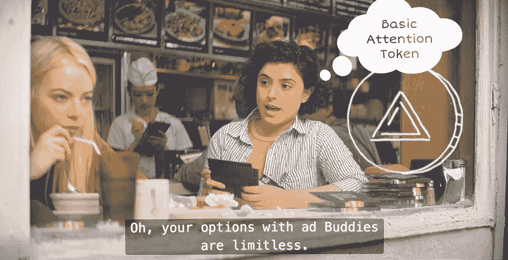

# 作为加密货币的用户注意力:未来的广告？

> 原文：<https://medium.com/hackernoon/users-attention-as-cryptocurrency-the-advertising-of-the-future-42f9e7a8d33c>

想象一个你再也看不到主动提供的在线广告的世界。如果看到广告的唯一方式是明确选择加入，会怎么样？如果你不再是产品，而是真正成为顾客，会怎么样？

今天的互联网经济大多建立在一个基本前提之上:当一项服务免费使用时，通常意味着收入是通过将你的个人数据变成商品来赚取的。广告是利用你的个人数据赚钱的最常见(也是最简单)的方式。2018 年是充满网络隐私问题的一年。很多人发现他们的个人信息暴露了，我认为很多人开始更加认真地对待自己的隐私和数据。我就是这些人中的一员。

目前，用户在浏览网站或使用在线服务时会受到广告的狂轰滥炸。这些广告是由出版商委托给广告商的，广告商负责锁定用户以吸引他们的注意力。当用户的注意力被广告吸引时，发行商就赚到了属于它的那一份。通常，广告商和出版商之间的中间人通过支付系统获得一部分金钱交易。当然，用户永远不会收到这些钱。这就是为什么当我读到一个基于用户有意注意的广告系统时，我很感兴趣。

*How advertising money moves today.*

上周，我收到了一封关于比特币基地挣的电子邮件，这是一个由比特币基地(加密货币经纪商)创建的网站，旨在“一边学习加密一边挣加密钱”。我通过这种方式了解了基本注意力令牌(BAT)和 web 浏览器 Brave，旨在解决前面描述的广告问题。

BAT 是一种基于[以太坊](https://www.ethereum.org/)的加密货币，试图量化用户注意力的价值。最终的想法是，当用户决定观看或阅读广告时，他们应该为他们的注意力付费。类似地，用户可以选择通过向他们付费来奖励他们喜欢的内容或服务提供商。英美烟草正试图成为这些交易的货币。

现在，基于 BAT 的广告与我们在网上找到的常规广告竞争是不公平的，因为这些广告已经在窃取用户的时间和注意力。这就是网络浏览器 Brave 的用武之地。Brave 基于 Chromium，带有内置的广告拦截器和其他关注隐私的功能。通过这个新的浏览器，用户将能够不受干扰地浏览网页；他们还可以在任何时候决定观看基于蝙蝠的广告，并在这个过程中获得回报。与此同时，用户将能够用他们的 BAT 钱包支付他们喜欢的内容或服务提供商，只要他们注册接收代币。所有这些以奖励为中心的功能都将作为勇敢团队所称的“第二阶段”的一部分启用。当前的“第一阶段”是关于加密货币和浏览器的社交，这需要达到整个项目长期成功的临界质量。

Brave 的最终目的是做一个广告主、用户、发行商或内容提供商之间安全、去中心化的 BAT 交流平台，不需要任何中间人。

*How advertising would work under BAT and Brave.*

遵循蝙蝠背后的真正精神，比特币基地赚网站在观看一些教育视频和下载勇敢的浏览器后，用蝙蝠代币奖励用户。归根结底，比特币基地赚是一个精心制作的广告，试图推广加密货币。

如果你对这整个想法持怀疑态度，你并不孤单。我的第一个问题是关于背后的技术团队，我很高兴地发现，JavaScript 的创造者、Mozilla 和 Firefox 的联合创始人布伦丹·艾希(Brendan Eich)是 BAT 和 Brave 的愿景和战略负责人。

然而，这真的是数字广告的未来吗？我不得不承认，当我第一次读到“一种基于用户注意力的加密货币”的描述时，它立即让我想起了网飞秀 Maniac 中呈现的反乌托邦版本的世界。在这个节目的世界里，人们使用一种叫做“广告伙伴”的服务，这种服务会给他们发送一个工作人员，让他们阅读或展示广告，以换取金钱，当然他们可以用金钱购买任何东西。

*Scene from Netflix’s Maniac, where the protagonist uses an ‘adBuddy’ to pay for her lunch.*

这部分是我对 BAT + Brave 项目长期生存能力最大的担忧。如果全世界都采用它，我们最终将被迫乏味地听、读或看广告，以便能够使用我们心爱的在线服务。如果 BAT 成为电子邮件、云存储或媒体流等服务的燃料，我们将需要不时地为令牌充电，以便能够使用我们的设备。

隐私维权人士一直在要求大型科技公司提供其服务的付费版本，以此减少它们对用户个人数据的依赖，这些数据支撑着它们的商业模式。然而，完全转向付费服务可能会对技术的民主化造成威胁。低收入家庭无力支付他们今天使用的所有在线服务；想象一下，如果只有富人才能访问互联网，它会变成什么样子。到目前为止，通过广告利用个人数据已经阻止了这种精英化的未来，所以也许我们确实应该专注于解决用户无法控制他们消费的广告这一事实。

BAT 和 Brave 是朝着这个方向迈出的一步，因为它赋予用户决定何时消费广告的权力，有效地将时间转化为金钱。尽管如此，它给我们的日常生活带来的摩擦可能会大到无法接受。最终，许多人会厌倦不得不做出观看这些广告的自觉决定，很快，一些公司会回到一种轻松访问其服务的模式，这仅仅意味着广告会自动提供，并与内容混合在一起。听起来很熟悉？

选择加入广告可能不是一个适用于所有用例的解决方案。我们可能不可避免地被现状所束缚，注定要承认我们的个人数据是为我们的在线服务“付费”的更可持续的货币类型。我们可能永远无法同时拥有自由和私有的互联网。

想了解更多关于 crypto 的信息吗？ [*我吸取的 4 个教训在比特币上输钱*](https://geekonrecord.com/2018/02/19/4-lessons-i-learned-losing-money-on-bitcoin/)

你喜欢这篇文章吗？ [**订阅**](https://geekonrecord.com/subscribe/) **通过邮件获取新帖。**

*图片经由*[*basicattentiontoken.org*](https://basicattentiontoken.org/)*和* [*网飞*](https://www.netflix.com/title/80124522)

*原载于 2019 年 2 月 11 日*[*geekonrecord.com*](https://geekonrecord.com/2019/02/11/users-attention-as-cryptocurrency-the-advertising-of-the-future/)*。*