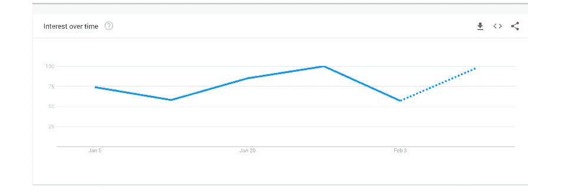
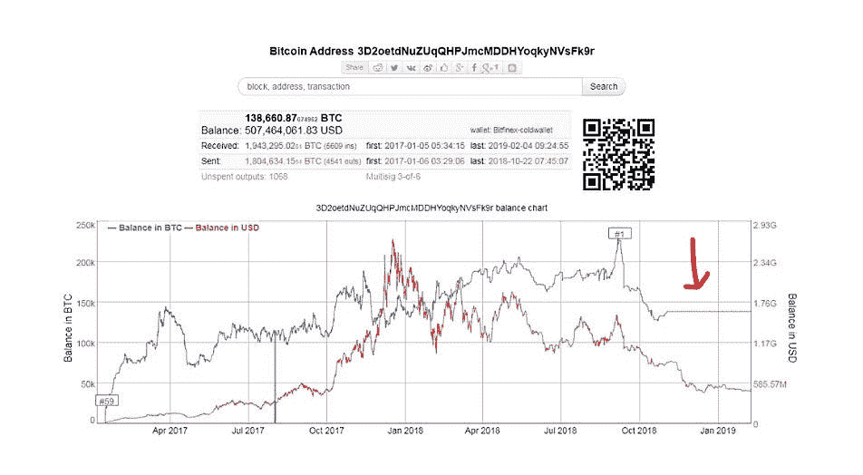
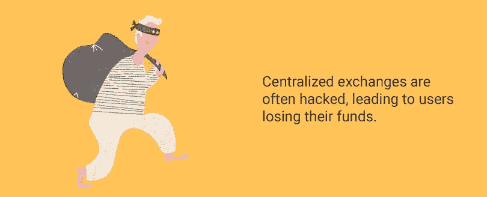
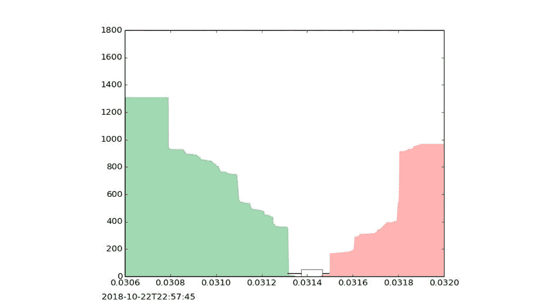
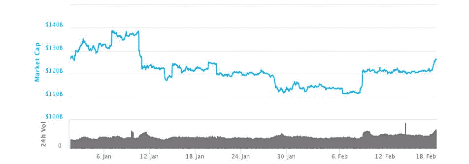
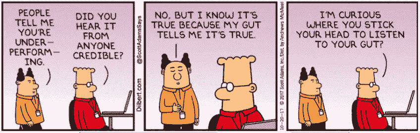

# 2019 年使用分散式交易所比两年前容易得多

> 原文：<https://medium.com/hackernoon/using-a-decentralized-exchange-in-2019-is-much-easier-than-it-was-two-years-ago-eb936039ea2f>

当在波动的加密货币市场交易时，风险已经相当大了，你真的想承担任何与集中化相关的风险吗？

*   集中式交易所经常被黑客攻击，导致用户资金损失。
*   从法律角度来看，交易所是一种灰色地带的业务。被当局查封可以锁定用户资金数月甚至数年。
*   整个交易所可能会在一夜之间消失——你会向谁抱怨呢？

当已经有一些可行的替代品存在时，你不应该面对这些风险，例如 [VDEX](https://volentix.io/) 、 [KyberSwap](https://kyberswap.com/) 或 [Paradex](https://paradex.io/) 。

两年前，使用分散式交易所(DEX)是一件非常麻烦的事情，人们在犯了像输入错误地址这样的小错误后会失去他们的资金，但是现在这些平台已经变得比你想象的更加用户友好。你最后一次尝试交易是什么时候？如果你不愿意自己检查，在这篇文章中，我将揭穿分散交换难以使用的神话(剧透:其中一些甚至比集中交换更容易使用)。同时，如果你觉得你没有跟上最好的 dex，我们手工制作了一个简短的列表供你选择。

# dex 受欢迎了吗？

不会。像比特币基地、币安、Bittrex 这样的集中交易所仍然占据加密货币总交易量的 99%的惊人比例。这主要是因为 dex 在 2017 年仍处于早期阶段，当时[大多数加密交易员都加入了市场](https://www.coindesk.com/2017-year-crypto-became-new-asset-class)。2019 年去中心化交易所有没有做得更好？首先，Twitter、Reddit 和 Quora 上关于 dex 的讨论越来越多。甚至谷歌趋势都说这个话题已经飙升。这是一个信号，表明人们准备好接受一个不信任的政府的好处了吗？

[https://trends.google.com/trends/explore?date=2019-01-01%202019-12-31&q=decentralized%20exchange](https://trends.google.com/trends/explore?date=2019-01-01%202019-12-31&q=decentralized%20exchange)

# 集中交易所改进的局限性

首先，让我们来理解是什么让集中交易变得如此危险。这些平台使用户能够购买、出售和交换加密货币，或者更简单地说，它们是代币的市场。这种解决方案对于加密货币生态系统至关重要。问题在于他们选择处理交易的方式。

集中交易使其系统[脱离链条](https://www.investopedia.com/terms/o/offchain-transactions-cryptocurrency.asp)，这意味着交易并不实际记录在区块链上，即使你在纸面上交换实际的代币。为了让他们能够做到这一点，在幕后，他们总是[储备了实际的代币](https://www.quora.com/How-can-crypto-exchanges-keep-coins-in-cold-storage-when-day-week-trading-happens)。然而，这些大量的硬币无意中使它们成为潜在黑客的甜蜜蜜罐。当他们的安全系统遭到破坏时，数百万美元的损失，而且没有任何保险能够弥补。没有当局能够跟踪和调查此事。万一攻击成功，交易所宣布破产，谁会遭受损失？你和所有信任这项业务的用户。

[https://www.reddit.com/r/CryptoCurrency/comments/aoqq99/does_anybody_know_why_bitfinex_their_btc_cold/](https://www.reddit.com/r/CryptoCurrency/comments/aoqq99/does_anybody_know_why_bitfinex_their_btc_cold/)

# dex 也不能被黑吗？

任何一个可以上网的软件都可以被[黑](https://www.quora.com/Is-it-possible-to-build-software-that-cant-be-hacked)。那只是事实。真正的问题是:

*   做起来有多容易？
*   有人去做的动力有多大？

一个 DEX 只是一个分布式的[订单簿](https://www.investopedia.com/terms/o/order-book.asp)。交换发生在同意通过编程正确的智能合约进行交易的两个匿名方之间。交易发生在双方之间，而不是其他任何人。攻击者成功的唯一方法是破坏两个客户端中的一个。因此，在 DEX 的情况下，恶意攻击的方法变得更加不可预测，回报也小得多。

当然，我们假设 DEX 的代码没有[错误](https://bitcoinmagazine.com/articles/bug-making-ethereum-transactions-exchanges-vulnerable-has-been-fixed/)。这就是为什么 DEX 只有在经过多次审核、密集测试以及多年的正常运行和服务后才能被认为是安全的。这就是为什么这种类型的软件不会定期更新，从而影响用户的资金。这就是为什么 dex 花了两年时间才达到符合当今应用标准的用户友好状态。

[http://nomuramaya.tumblr.com/post/66452388398/basiadziadosz-i-saw-a-burglar-today](http://nomuramaya.tumblr.com/post/66452388398/basiadziadosz-i-saw-a-burglar-today)

*如果 DEX 被监管机构查封怎么办？*

如前所述，分散式交换只是对等方发现自己并参与智能合约的一种自动化方式。任何国家的任何人都可以参加。不仅如此，这些平台使全球交易成为可能，而且交易过程中不涉及[法定货币](https://www.fool.com/investing/general/2015/12/06/fiat-currency-what-it-is-and-why-its-better-than-a.aspx)，dex 不需要遵守 AML(反洗钱)法律，也不需要 KYC(了解你的客户)流程。拥有加密货币地址是 DEX 的注册。

# 分散式交易所是如何运作的？

DEX 本质上是一个[分散式应用程序(dApp)](https://ethereum.stackexchange.com/questions/383/what-is-a-dapp) ，其功能如下:

1.  代币所有者下订单:用 DEX 上可用的另一资产交换他/她的资产。代币所有者指定他们必须出售的单位数量(在本例中)，每个代币的成本，以及在此之前允许对其资产进行投标。
2.  一旦卖出订单(如上所述)被设定，其他用户可以通过发出买入订单来提交出价。
3.  一旦卖方设定的时间到期，所有的投标将被审查和执行，以符合双方的最佳利益。

[https://en.wikipedia.org/wiki/Cryptocurrency_exchange](https://en.wikipedia.org/wiki/Cryptocurrency_exchange)

其实这正是[写在一个交易所智能合约](/coinmonks/build-a-smart-contract-that-transfers-erc20-token-from-your-wallet-to-other-addresses-or-erc20-ee8dc35f40f6)里的逻辑。作为一个下订单的用户，从外部如何看待这一点？

1.  您正在使用您的钱包地址登录 DEX(与登录您的钱包的过程相同)
2.  你提交一个买卖请求
3.  智能合约得到执行，资产转移完成(请求的令牌将直接自动发送到您的钱包中)
4.  断开连接。

你就完了。你准备好试一试了吗？

# 适合任何类型用户的现代索引

如果 2017 年是 crypto 迄今为止最好的一年，2018 年是充满未实现希望的一年，那么 2019 年似乎是解决基金会的完美一年。要不要准备新的投资策略？市场不寻常的稳定性让你深思熟虑。你想巩固你的钱包吗？费用不能比这个低[，所以现在是移动你的硬币的最好时间。你想把自己从集中交易的风险中清理出来吗？如今，替代的 dex 是如此先进，以至于进行这种转变不需要对你已经熟悉的过程进行任何改变。我只能用一个手工制作的三个用户友好的 dex 列表为你打开路径，其余的就看你的了！](https://bitcoinfees.info/)

[https://coinmarketcap.com/charts/](https://coinmarketcap.com/charts/)

# 1. [VDEX](https://volentix.io/)

VDEX 是一个分散的数字资产交易所，与标准的 DEX 没有太大区别。不过，它的特别之处在于它所包含的 DAE(数字资产生态系统)。这样一个生态系统由一个 DAO(去中心化的自治组织)来管理，它可以确保自己能够自我调节、自治并为用户的需求服务。VDEX 提供的软件解决方案套件的一部分是多货币钱包 VERTO。VDEX 与 VERTO 相结合，允许使用密钥进行本地管理，并提供无缝交易体验，可与已经建立的传统股票市场交易流程相媲美。

构建于 EOS 现有开源技术之上。IO 项目，VDEX 不受可交易令牌底层技术的限制。跨区块链通信是允许的，而数字资产，如比特币，EOS，他们的原生数字货币 VTX，以及所有其他支持的区块链货币，始终由用户保管。VDEX 向我们展示了轻松的身份验证和增强的访问可以通过与集中式 exchange 相同的交易速度和安全性来保证。

# 2. [KyberSwap](https://kyberswap.com/)

即使 KyberSwap 不是一个完全成熟的交易平台，但由于其简单性，Kyber 的解决方案在这个简短的列表中值得一提。不仅可以作为分散式交易所用于交换和转换数字资产，同时还可以充当代理支付服务。

让我们来了解一下他们独特的解决方案。KyberSwap 是一个平台接口，由智能合约提供支持，并由令牌储备维护。智能合约充当数字资产转换和交换的分散网关，令牌的主动储备确保了这一过程的即时性。它不需要任何区块链确认，也不需要存款，所有交易都由该平台直接处理，从你的钱包进出。KyberSwap 可以集成不同的钱包，但这意味着用户应该已经知道如何使用 MetaMask 或硬件钱包，如 Ledger 或 Trezor。跨链交易也还不可用。这可能只是一个时间问题，因为 Kyber 已经在研究一个将于今年推出的解决方案，并且一个移动应用程序已经在测试中。DEX 会比集中式解决方案更好吗？

# 3. [Paradex](https://paradex.io/)

就功能而言，Paradex 是一个分散的交换平台，与上面列出的另外两个平台没有太大区别。然而，让 Paradex 与众不同的是它所基于的技术:0x 协议。0x 项目正在通过开发一种协议来解决 dex 之间当前的流动性问题，该协议允许 dex 相互连接并离线结算交易。只有交换成功完成，交易才能写入区块链。这个过程更快、更便宜，并且解决了这些平台之间的信任问题。在 Paradex 上，所有交易都通过利用协议优势的 0x smart 契约进行。

Paradex 保持其界面整洁，没有杂乱或压倒性的功能，这些功能可能会威胁到没有交易经验的普通用户。然而，以太坊区块链上仅支持 ERC20 令牌，并且仅支持开发者为交易而实现的有限的几个令牌。Paradex 去年被比特币基地收购，但我们仍然不知道他们是否计划增强该平台，或者只是将其功能用于自己的交易所。

这是我列出的 2019 年值得一试的新兴分散交易所的短名单。在功能、特性和用户友好性方面，任何提到的 dex 都可以很容易地与任何集中式 dex 竞争。但是使用这样一个平台最重要的优势是增加了安全性，降低了在全球范围内越来越受欢迎的监管行动的风险。