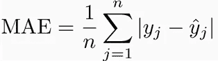
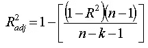
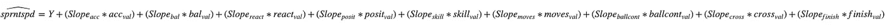

# 运用多元线性回归模型预测 FIFA 19 运动员的冲刺速度

> 原文：<https://medium.com/hackernoon/using-a-multivariable-linear-regression-model-to-predict-the-sprint-speed-of-players-in-fifa-19-530618986e1c>


FIFA 19 Source: Express.co.uk

我偶尔玩国际足联的游戏，但我认为自己是一个相对强大的玩家，在与其他休闲玩家的比赛中，我经常获胜。总的来说，我不是一个超级足球迷，也不会尝试去玩战略游戏。相反，我非常依赖运动员的冲刺速度和不可预测的跑动和转身。我经常结合这些技巧在我对手的空间中寻找和制造空间，并运球取得胜利，这让我的对手很沮丧。在这种背景下，我决定从 Kaggle 下载 [FIFA19 数据集，目的是根据我认为最能预测球员冲刺速度的变量/特征来预测球员的冲刺速度。](https://www.kaggle.com/karangadiya/fifa19)

**线性回归**

线性回归可以总结为试图建立一个或多个自变量与特定结果或因变量之间关系的模型。为了使该算法有效，自变量和因变量之间必须有线性关系。应用于两个或更多变量之间存在中度到强相关性的数据，通过找到最适合/预测结果的线，它可以是预测一个结果的值的非常有用的起点。

```
Y = MX + B
```

这背后的数学很简单，特别是当你只看一个独立变量的时候。y 代表结果或因变量，而 m 代表斜率，x 代表自变量，b 代表 y 截距。简单地说，假设 x 和 y 之间存在线性关系，如果你知道直线的斜率和独立变量的值，你就可以预测结果。

然而，在我的例子中，我要考虑多个独立变量，因此公式需要稍微改变。

```
F(x) = A +(B1*X1) +(B2*X2)+(B3*X2)+(B4*X4)...+(Bn*Xn)
```

用这个公式，我假设有(n)个独立变量。在这种情况下，F(x)是该线性模型的预测结果，A 是 Y 截距，X1-Xn 是预测值/独立变量，B1-Bn =回归系数(与简单线性回归公式中的斜率相当)。在这个公式中插入适当的数字会给我一个结果的预测，在这种情况下，一个球员在 FIFA19 上的冲刺速度。

**与数据交互**

对于这个分析，我选择使用 Python，从 Kaggle 下载数据，上传到我的 Google Drive，加载 Google Colab，并使用 pandas read.csv 功能上传数据。上传完 scipy、numpy 和 pandas 库后，我开始了数据清理过程。

```
#libraries
import pandas as pd
import numpy as np
import matplotlib.pyplot as plt
import scipy.stats  as stats
from google.colab import drive#uploading data
fifa_dataset = pd.read_csv('/content/gdrive/My Drive/Google Research/Learning/Kaggle Projects/FIFA19 dataset/data.csv')
```

**数据清理**

我从几个假设开始，我假设短跑速度很大程度上受身高、体重、年龄、加速度统计以及可能的运动员体重和身高的比例的影响。在观察数据集时，我注意到身高和体重是以字符串格式记录的(例如 5 英尺 11 英寸和 180 磅)，此外，作为一个更习惯于公制的人，我想将这些测量值分别改为厘米和千克。

```
#inches to cms
fifa_dataset['Height']= fifa_dataset.Height.str.replace("'",".").apply(lambda x: float(x)*30.48).dropna()
fifa_dataset['Height']= fifa_dataset['Height'].fillna(fifa_dataset['Height'].mean()).astype(np.int64)#lbs to kgs
fifa_dataset['Weight'] = fifa_dataset.Weight.str.replace("lbs", "").apply(lambda x: float(x)*0.45359237).dropna()
fifa_dataset['Weight']  = fifa_dataset['Weight'].fillna(fifa_dataset['Weight'].mean()).astype(np.int64)
```

对于 weight，这个转换过程包括通过寻找撇号作为分隔符来拆分字符串，用句号(小数点分隔符)替换它，并应用 lambda 函数将 str 转换为浮点数并转换为厘米。我将 str 转换为 float，因为我知道计算将返回一个本质上是 float 的数字。这样做之后，我继续用数据帧中的平均高度值填充所有 NaN 值，并将该数字转换为整数(低于 100 行)。我假设用平均值填充缺失值比向前填充更适合我的分析，省略 NaN 行或将它们更改为零。我后来了解到，这些柱子不适用于我的分析，但是，我决定把它包括进来，以显示我清理一些柱子所做的工作。

```
def func(x):
  x = x.fillna(x.mean()).astype(np.int64)
  return x
fifa_dataset[['Agility','Acceleration','Balance','Positioning','Skill Moves','BallControl','Crossing','Finishing','Reactions','SprintSpeed']] = func(fifa_dataset[['Agility','Acceleration','Balance','Positioning','Skill Moves','BallControl','Crossing','Finishing','Reactions','SprintSpeed']])
```

在对 height 列进行了同样的清理之后，我定义了一个函数，当它应用于一个列时，用该列的平均值填充所有 NaN 值，并将数字转换为 int。在测试出哪些列将用于我的分析之后，我将这个函数应用到相关的列

**相关性检验和显著性检验**

为了测试每个列和结果列(sprintspeed)之间的相关性，我选择使用 scipy 包中的 [spearmanr 函数](https://docs.scipy.org/doc/scipy/reference/generated/scipy.stats.spearmanr.html)。此函数计算相关性并返回 x 和 y 之间的相关性以及 p 值或此相关性的显著性概率。

```
#We want to test for moderate to strong correlations
def corr_test(x):
  x_corr = stats.spearmanr(x, fifa_dataset['SprintSpeed'])
  return x_corrcorr_test(fifa_dataset[x])
```

使用这个函数，我遍历了数据集中的不同列，以确定哪些列将用于我的回归模型。我选择使用存在至少-0.50(或低于-0.50)的中度到强相关性的列。以此为基准，我完成了这些列；敏捷、加速、平衡、定位、技术动作、控球、传中、射门和反应——这些是独立变量。

通常，当您测量线性时，您可能需要用散点图显示每一列，以确认线性关系确实存在。单纯依赖相关系数的问题在于，有影响的异常值可以显著增加或减少相关系数，使得看起来好像存在强/弱相关性，而实际情况恰恰相反。在了解了 FIFA 中球员分数的分布之后，我做出了这样的假设:这是不必要的，我们不会得到具有高度影响力的单个值(销售价格等列除外)。

**多元线性回归模型**

```
#multivariate linear regression
#80/20 split- 20% training data
from sklearn.linear_model import LinearRegression
from sklearn.model_selection import train_test_split
from sklearn.metrics import mean_absolute_error
from sklearn.metrics import accuracy_score
train, test = train_test_split(fifa_dataset, test_size=0.2)
```

我的机器学习算法(假设你考虑线性回归模型机器学习)严重依赖于 sklearn 库。在导入这个库之后，我选择应用 80/20 规则将我的数据分为训练数据和测试数据，其中 20%的数据属于训练数据。我的理由是，我不想使用超过 20%的值，以便更确定我的模型可以推广到整个数据库。

```
#independent and dependent variables
features= ['Agility', 'Acceleration', 'Balance','Reactions','Positioning','Skill Moves','BallControl','Crossing','Finishing']
target = 'SprintSpeed'#define model I am using
model = LinearRegression()#training process
model.fit(train[features], train[target])#mean absolute value for training data
data = train[target]
predict =  model.predict(train[features])
training_error = mean_absolute_error(data, predict)#mean absolute value for test data
test_data = test[target]
predict_test = model.predict(test[features])
test_data_error = mean_absolute_error(test_data, predict_test)
```

我继续定义我将用于该模型的特征(自变量)和我试图预测的目标或变量(因变量)，然后继续使用线性回归模型训练该模型。训练包括查看自变量和因变量之间的相关性，以进行计算，使模型能够从测试数据中预测结果。

**测试模型**



Mean Absolute Error Formula

为了测试数据中的预测误差(损失函数)，我使用度量模块 n sklearn 为训练和测试数据计算了[平均绝对误差](https://scikit-learn.org/stable/modules/generated/sklearn.metrics.mean_absolute_error.html) (MAE)。在此公式中，n 代表数据中的错误数量，σ简单地表示总和，而|yj — ŷj|指从预测中观察到的绝对错误。该公式将绝对误差相加，然后除以实例总数，得到一个数字，显示预测的和实际的冲刺速度之间的平均误差。

理想情况下，我希望这个数字尽可能小，并报告这个数字以及我的预测成功率。我也可以打开使用[均方根误差](http://statweb.stanford.edu/~susan/courses/s60/split/node60.html) (RMSE)，类似于 MAE。这将返回一个数字，显示预测值与预测值的偏差。RMSE 简单地找到了 MAE 数字的平方根(然而，在这种情况下，我们将平方绝对误差)。

```
#we need some metric to measure the accuracy of our regression model
from sklearn.metrics import r2_score#on training data
true_value = train[target]
predicted_val =  model.predict(train[features])
accuracy = r2_score(true_value, predicted_val)#on test data
true_value2 = test[target]
predicted_val2 =  model.predict(test[features])
accuracy2 = r2_score(true_value2, predicted_val2)
```

为了测试这个模型的准确性，我依赖于 [r2_score 指标](https://scikit-learn.org/stable/modules/generated/sklearn.metrics.r2_score.html) ( [决定系数](https://en.wikipedia.org/wiki/Coefficient_of_determination))。R2 分数或 R 平方，衡量数据与回归模型的拟合程度，数字越接近 1，就越表明很大一部分值可以用线性回归模型来解释，这表明预测能力更强。

```
print('This model accounts for {}% of the training data with mean data error of {}'.format(round(accuracy2*100,2), round(training_error,2)))
print('This model accounts for {}% of the testing data with mean data error of {}'.format(round(accuracy*100,2), round(test_data_error,2)))####RESULT####
>This model accounts for 84.96% of the training data with mean data error of 4.08 
>This model accounts for 85.61% of the testing data with mean data error of 4.2
```

据我的控制台报告，预测模型占我的测试数据的 85.61%，平均偏差约为 4.2(预测值与实际值之间的平均偏差)。根据这个结果，例如，如果我们用这个模型对短跑速度为 90 的运动员进行预测，那么实际的短跑速度很有可能平均在 86 和 94 之间。

理解到我的 R 平方值会随着我加入更多的预测因子而增加，因为当我在我的模型中加入更多的预测因子时，我解释了我的数据中更多的可变性。为了考虑到这一点，我可以查看调整后的 R 平方值，它会对更多预测值的使用造成不利影响，这种不利影响的大小取决于预测值的数量与数据集中可能的预测值(所有其他列)的大小之间的关系。其结果是，仅当添加的预测因子对模型的改善程度超过偶然情况下的预期时，调整后的 R 平方值才会增加。



Adjusted R Squared

在上面给出的公式中，k 表示预测值的数量，而 n 表示数据集中列的总数。

```
n = len(list(fifa_dataset))-1
k = len(features)
#calculating adjusted r squared using formula given
r2 = 1-(1-accuracy2)*(n-1)/(n-k-1)
print('Adjusted R Squared is {}%'.format(round(r2*100,2)))####RESULT####
>Adjusted R Squared is 83.97%
```

当我想测试这个模型和其他模型之间的适合度时，这个百分比会变得更有用。

我注意到使用预测因子的另一个问题是，一些预测因子与其他预测因子相关，产生了[多重共线性](http://statisticsbyjim.com/regression/multicollinearity-in-regression-analysis/)。然而，根据我的理解，这对我的模型的预测能力没有显著影响，但对估计每个预测因子对我的模型的影响的能力有较大影响。

**做出预测**

现在让我们想象我们想要使用这个模型来做一个实际的预测。我们在数据集中随机挑选一个玩家。这是现在 21 岁的英国出生的约瑟夫·亚尼。这个玩家恰好出现在我测试数据帧的第 26 行。


Josef Yarney Source: WorldFootball.net

```
josef = test.iloc[25]
josef_stats = josef[['Acceleration','Balance','Reactions','Positioning','Skill Moves','BallControl','Crossing','Finishing']]#make prediction
model.predict(np.array([[josef_stats[0],josef_stats[1],josef_stats[2],josef_stats[3],josef_stats[4],josef_stats[5],josef_stats[6],josef_stats[7]]]))
josef_predic####RESULT####
>array([51.32203933])
```

我继续定位这个球员并提取相关的统计数据，保存在 josef_stats 变量下。然后，我使用创建的多元线性回归公式对玩家的冲刺速度进行预测，得到的冲刺速度大约为 51，而实际冲刺速度为 48。

**将方程式可视化**



Visualising the multivariate linear regression equation for the FIFA dataset

为了直观地展示预测函数的工作原理，我们需要重温一下多元线性回归方程。简单地说，预测的冲刺速度是每个预测因子的斜率乘以它们的值的函数(即。如果加速度是 80，我们用加速度的斜率乘以 80，我们把这些加在一起，然后把总数加到 y 轴截距上。

```
coefs = model.coef_
```

我们可以得到每个预测值的系数(斜率)。coef_ function。

然后，我们可以使用以下代码在 python 中解释这个等式:

```
speed = [a*b for a,b in zip(coefs,josef_stats)]
sum(speed)+model.intercept_####RESULT####
>51.32203933182582
```

这样，我们将 josef_stats 列表中的每个值乘以其对应的斜率，将这些值加在一起，并将这些数字加到我们使用 model.intecept_ function 找到的截距上，从而得到预测的冲刺速度 51。

这就结束了我的分析。

欢迎发送反馈或通过 Twitter @Emmoemm 联系我