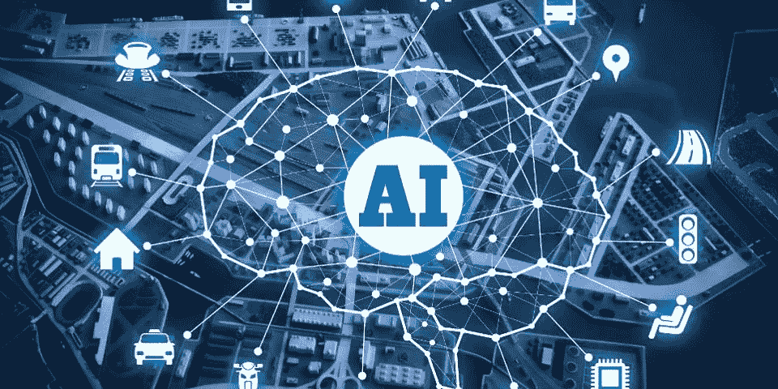

# 使用人工智能和电话跟踪软件来增加销售

> 原文：<https://medium.com/hackernoon/using-ai-and-call-tracking-software-to-increase-sales-7364dc867a33>

## 联系您的企业有多容易？在当今智能手机数量超过人口数量的世界，你不能忽视手机作为获取和转化客户的手段。

商业电话是各种行业中销售线索和销售的头号来源，电话跟踪是跟踪这些在线和离线销售线索的重要方法之一。最棒的是。一项研究表明，电话销售线索的隐蔽性是网络销售线索的 15 倍。但问题是，大多数营销人员未能利用这种情况赚钱。他们不跟踪电话，错过了许多潜在的转换。将[评论生成软件](https://www.scoremyreviews.com)和通话跟踪软件结合使用，可以帮助您提高销售额。

但是我们不要谈论过去和你错过的机会。我们为你准备了一个人工智能支持的电话跟踪软件，它将帮助你的业务发展和繁荣。

# 为什么选择人工智能支持的呼叫跟踪软件？

人工智能正稳步进入每个人的清单，而且是永久性的。人工智能正在许多方面帮助企业，帮助它们更好地服务于客户。通过由人工智能支持的新的呼叫跟踪服务，企业可以更好地跟踪潜在的销售机会。人工智能在呼叫跟踪软件中的一些帮助方式是:

## 提高您的投资回报率

小企业希望将成本降至最低。但这并不总是可能的。他们希望 24*7 全天候跟踪电话，但不想为此雇人，因为这将大大增加他们的成本。这就是人工智能驱动的呼叫跟踪软件发挥作用的地方。有了它，你可以很容易地跟踪每一个电话，并收集有关它的重要数据。

此外，它比人类更有效。您的员工可能无法将一个电话识别为转换，或者只是厌倦了跟踪如此多的电话，到一天结束时生产力会下降。反过来，这会导致大量转换失败。

有了一个 AI 通话追踪软件，就不用担心了。它全天有效工作，质量没有下降。它不会感到疲劳，并与其性能保持一致。

## 易于设置

如果你认为你必须教你的人工智能你的商业方式，那你就错了。您应该针对各种行业使用经过预先培训的电话跟踪软件。只需几分钟就能安装好软件并开始运行。此外，您还可以根据自己的需求定制它，以获得更好的结果和更大的成果。

## 帮助找出正确的关键词

我们都知道，如果我们想提高网站的流量，关键词有多重要。但是这些不仅仅局限于你的网站。通过在电话中使用正确的关键词，你也能从中受益。人工智能有助于识别关键字，从而导致更多的转换。通过了解哪些关键词有效，哪些无效，你就能够相应地改变你的策略。

如今，大多数在线搜索都是通过手机进行的，而不是台式机或笔记本电脑。哪些关键词促使客户致电您的企业？识别它是很重要的，而人工智能可以帮助你做到这一点。

## 提高客户支持的质量

如果你想生意成功，客户支持应该非常有效。这是一个事实，没有两个办法。人工智能驱动的呼叫跟踪软件记录所有客户支持代理的呼叫。你可以判断他们的能力以及他们满足顾客的效率。此外，倾听过去的对话对新员工非常有益，因为他们将学会如何处理复杂的情况，以及如何与人沟通以增加销售。

通过听电话，你也将能够了解你的客户所面临的问题和他们的期望。然后，您可以相应地优化您的服务，并做出某些修改，以满足您的客户。

## 识别高峰时间

通过使用人工智能的电话追踪软件，你将能够找出你接到最多电话的高峰时间。通过记录这些数据，你可以算出你接到最多电话的日子和时间。这有助于以最佳方式管理您的员工，并以不会错过高峰时段电话的方式决定他们的工作时间。

# 以正确的方式进行电话追踪

人工智能电话跟踪软件有很多方法可以帮助你的业务。一个好的[电话追踪软件](http://www.callgear.com/)只为大企业打造，这是一个神话。他们对小企业也有很大的帮助，可以帮助你赢得很多客户，赚很多钱。