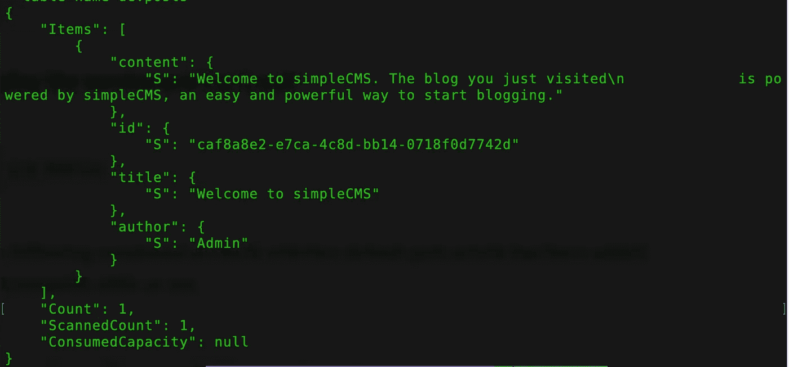

# 在无服务器框架中使用 AWS CloudFormation 宏和自定义资源

> 原文：<https://medium.com/hackernoon/using-aws-cloudformation-macros-and-custom-resources-with-the-serverless-framework-ab7bb121d13d>


**无服务器框架**几天前发布了 [1.4.11](https://github.com/serverless/serverless/releases) ，增加了检测到转换时的额外功能，这意味着我们现在可以使用 AWS CloudFormation 宏从无服务器框架执行定制处理。

在本文中，我展示了一个使用 CloudFormation 定制资源和宏在每次部署后向示例应用程序添加默认文章的示例。

## CloudFormation 宏和自定义资源

> [云形成宏](https://docs.aws.amazon.com/AWSCloudFormation/latest/UserGuide/template-macros.html)就像你的云形成模板的预处理器。提交 CloudFormation 模板后，在 CloudFormation 实际开始提供资源之前，会调用宏来转换模板的各个部分。
> 
> [定制资源](https://docs.aws.amazon.com/AWSCloudFormation/latest/UserGuide/template-custom-resources.html)极大地扩展了 CloudFormation 的功能，因为您可以将定制逻辑作为 CloudFormation 部署的一部分来运行。

## 用例

我运行我的 CloudFormation 模板，它设置了一个 DynamoDb 表和 lambda 函数。然后，CloudFormation 模板在每次部署后将默认的欢迎文章添加到空的 DynamoDb 表中。

## 先决条件

遵循本指南之前，必须完成以下工作:

*   设置 AWS 帐户
*   安装 AWS CLI
*   使用用户凭据配置 AWS CLI
*   将无服务器框架(≥1.4.11)安装或更新至最新版本

```
$ npm install -g serverless
```

## 云形成自定义资源

让我们来看看如何使用定制资源，要使用 CloudFormation 定制资源，您需要:

*   定义自定义资源。
*   通过部署到 AWS Lambda 函数，使自定义资源逻辑可用。
*   引用 Lambda 函数来使用 yml 模板中的自定义资源。

下面是一个自定义资源和 lambda 函数的示例:

如上所示，您必须提供 ServiceToken 属性。ServiceToken 是 AWS Lambda 函数的 ARN。

## 问题

如果我们部署上面的模板，自定义资源在第一次部署时被调用。不会再触发了。要解决这个问题，我们必须向自定义资源添加一个具有动态值的属性。

在我的例子中，我使用 CloudFormation 宏来获取堆栈的最后更新日期时间，然后将日期时间值注入到自定义资源的属性中。

## 设置云形成宏

创建一个新的无服务器框架项目，并将以下配置添加到 serverless.yml

注意新的 Cloudformation 资源`AWS::Cloudformation::Macro`，它使得 Lambda 函数可以从其他 CloudFormation 模板中访问。

## 添加 Lambda 函数

现在，让我们更新 handler.js，创建 lambda 函数来获取 CloudFormation 堆栈的 LastUpdatedTime:

对于上述宏，我们希望使用 CloudFormation 模板中提供的 CloudFormation 参数中的堆栈名称。参数将在我们的 Lambda 事件对象上的**参数**键下提供，我们的 CloudFormation 模板将在**片段**键中提供。

## 部署 CloudFormation 宏

宏可以这样部署:

```
$ sls deploy
```

## 使用

现在可以使用新创建的宏了，回到定制资源的`serverless.yml`模板，添加 **StackLastUpdatedTime** 属性以使用我们新生成的宏，使用唯一的参数 StackLastUpdatedTime 强制定制资源在每个部署上重新创建:

接下来，让我们创建一个 lambda 函数，该函数在每次部署时被触发，如果 DynamoDB 表为空，则将欢迎文章添加到该表中。

请注意，当自定义资源创建请求成功时，必须向 S3 存储桶发送类似于以下格式的响应:

```
{
    **StackId**:
      "arn:aws:cloudformation:ap-southeast-2:687416365397:stack/CustomResourceCMSDefaultPost-dev/67c30500-6741-11e9-9b67-0a8814e42c77",
    **RequestId**: "5270edad-8d64-453a-8683-da2db12f7381",
    **Status**: "SUCCESS",
    **PhysicalResourceId**: "2019/04/25/[$LATEST]8c7b0002a0ba45c29ea6685b99e28977",
    **LogicalResourceId**: "DefaultPost",
    **Data**: {
      LastUpdatedTime: "2019-04-25T12:07:16.747Z"
    }
  };
```

## 部署服务并试用它！

```
$ sls deploy
```

现在运行以下命令来检查默认项目是否已经添加到 DynamoDb 表中。

```
$ aws dynamodb scan --table-name devposts
```

## **结果**



希望你觉得这篇文章有用，你可以在我的 [**GitHub repo**](https://github.com/yai333/CustomResourceExample) 中找到完整的项目。