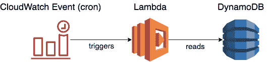
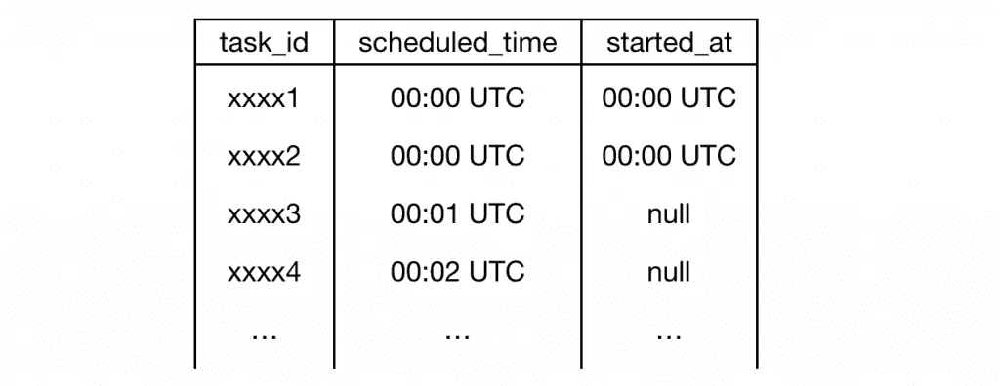
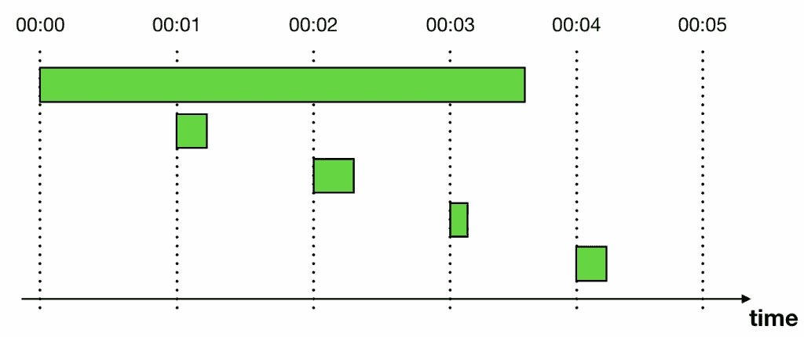
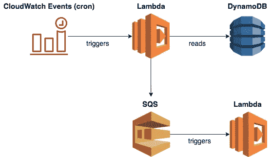
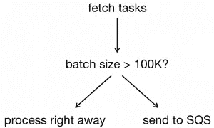

# 使用 CloudWatch 和 Lambda 实现临时调度

> 原文：<https://medium.com/hackernoon/using-cloudwatch-and-lambda-to-implement-ad-hoc-scheduling-8dd83f982bed>

前阵子我写过关于 [**使用 DynamoDB TTL 实现临时调度**](https://theburningmonk.com/2019/03/dynamodb-ttl-as-an-ad-hoc-scheduling-mechanism/) 。这引发了一些健康的辩论，你们中的一些人提到了替代方案，包括使用阶跃函数。因此，让我们来看看这些替代方法，从最简单的开始——使用 cron 作业。

我们将使用上一篇文章中列出的相同标准来评估这种方法:

*   **精度**:任务的执行离我的预定时间有多近？越近越好。
*   **Scale(未完成任务的数量)**:解决方案能否扩展以支持许多未完成的任务。即已调度但尚未执行的任务。
*   **扩展(热点):**该解决方案能否扩展到在大约同一时间执行许多任务？例如，数百万人设置了一个计时器来提醒自己观看超级碗，所以所有的计时器都在接近开球时间时启动。

# CloudWatch 计划和 Lambda

设置非常简单:

*   存储所有计划任务的数据库(如 DynamoDB ),包括它们应该何时执行。
*   每 X 分钟运行一次的 CloudWatch 计划(cron)。
*   从数据库中读取过期任务并执行它们的 Lambda 函数。

## 可扩展性(未完成任务的数量)

由于打开任务的数量只是转化为数据库中的项目数量，这种方法可以扩展到数百万个打开任务。

## 精确

使用 CloudWatch 事件，您可以每分钟运行一次计划任务。这是使用这种方法可以获得的最高精度。

然而，这种方法经常受到每次迭代中可以处理的任务数量的限制。当需要同时执行的任务太多时，它们可能会堆积起来，导致延迟。这些延迟是这种方法的最大挑战——处理热点——的一个症状。

## 可扩展性(热点)

当 Lambda 函数执行时，它会查找处于或超过其预定执行时间的任务。例如，现在的时间是 00:00 UTC，我们的函数将查找`scheduled_time`为≤ `00:00 UTC`的任务。

如果它发现有太多任务无法在下一个周期于 00:01 UTC 开始之前完成，会发生什么情况？为了避免同一个任务被多次执行，我们通常会将函数的`Reserved Concurrency`设为 1。这确保了在任何时刻，只有一个 Lambda 函数的实例在运行。

但是，这意味着在第一批任务完成之前，不会处理计划在 00:02 UTC 执行的任务(见上文)。这可能会产生不可预测的延迟，并会显著影响系统的精度。

或者，如果您可以将一个任务标记为有`started`,那么您就可以防止后续的周期再次拾起它，除非是在失败的情况下。一个这样的方案可能是给任务定义添加一个`started_at`属性。当 cron 函数寻找要执行的任务时，它会忽略已经开始但尚未完成或超时的任务。

这样做将允许您运行 cron 函数的多个实例，而不必冒多次处理一个任务的风险。

但这仍然留下了一个问题，热点可能会造成一些真正的损害:

*   该函数在能够处理整个批处理之前可能会超时
*   该系统的精度是高度不可预测的。如果一个函数花了整整 15 分钟来处理批处理，那么一些任务将在预定时间后 15 分钟执行。

当然，您可以在代码中并行处理这些任务。但是这增加了业务逻辑的复杂性，并带来了其他故障模式，例如:

*   内存不足异常——如果您启动了太多并发的`Promise`(在节点中)或线程，那么您可能会在运行时遇到可怕的`OutOfMemoryException`。
*   `Promise.all`在 Node.js 中如果有任何个人承诺拒绝就会拒绝。如果您有一个未处理的异常，那么它可以拒绝所有其他的承诺，而不知道最终哪个会成功。

我个人认为，更好的方法是将任务交给 SQS 队列。这个 SQS 队列可以触发另一个 Lambda 函数。

使用 SQS，您可以获得内置的重试和死信队列(DLQ)支持。Lambda 函数将成批处理 SQS 任务(最多 10 个)。Lambda 服务还会根据流量自动调整并发执行的数量。这两个特征都有助于提高吞吐量。

然而，由于这是一个额外的跳跃，它将增加任务被按时执行的延迟。这影响了系统的精度。所以，也许你不是一直这样。相反，如果批量很小，应该立即处理。只有当批处理超过一定大小时，才通过 SQS 队列推迟处理。

# 数据库选择

我在这篇文章的所有例子中使用了 DynamoDB，因为它易于使用，并且可以满足许多用例。然而，它并不擅长处理热键。不幸的是，这正是我们在这里要做的…

您受到每个分区 3000 个读取吞吐量单位的限制。因此，如果您的系统需要扩展到每批几千个以上的任务，那么 DynamoDB 可能不适合您。

# 结论

这种基于批处理的方法不被认为是现代的。但是对于许多用例来说，这也是安排临时任务的最简单的方法。

例如，如果您的用例是这样的:

*   你可以容忍任务晚执行几分钟。
*   任务平均分布在一天中，不太可能形成热点。

那么这种使用 CloudWatch 计划和 Lambda 的方法可能足以满足您的需求。即使你将经历一些热点，也有办法在一定程度上减轻它们。正如我们在这篇文章中讨论的，你可以做几件事来增加你的吞吐量:

*   您可以跟踪任务的状态。这允许 cron 函数的多个实例重叠。
*   你可以先把任务交给 SQS。这让您可以利用 SQS 和 Lambda 提供的批处理和并行支持。你还可以免费获得 DLQ 的支持。

我希望你喜欢这篇文章，作为这个系列的一部分，我们将讨论其他几种安排临时任务的方法。看好这个空间；-)

# 阅读其他方法

*   [DynamoDB TTL 作为临时调度机制](https://theburningmonk.com/2019/03/dynamodb-ttl-as-an-ad-hoc-scheduling-mechanism/)

嗨，我叫**崔琰**。我是一个 [**AWS 无服务器英雄**](https://aws.amazon.com/developer/community/heroes/yan-cui/) 和 [**量产无服务器**](https://bit.ly/production-ready-serverless) 的作者。我已经在 AWS 中运行了近 10 年的大规模生产工作负载，我是一名架构师或首席工程师，涉足从银行、电子商务、体育流媒体到移动游戏等多个行业。我目前是一名专注于 AWS 和无服务器的独立顾问。

你可以通过[邮箱](mailto:theburningmonk.com)、 [Twitter](https://twitter.com/theburningmonk) 和 [LinkedIn](https://www.linkedin.com/in/theburningmonk/) 联系我。

查看我的新课程，[**AWS 步骤功能完全指南**](https://theburningmonk.thinkific.com/courses/complete-guide-to-aws-step-functions) 。

在本课程中，我们将介绍有效使用 AWS Step Functions 服务所需了解的一切。包括基本概念、HTTP 和事件触发器、活动、设计模式和最佳实践。

点击获取您的副本[。](https://theburningmonk.thinkific.com/courses/complete-guide-to-aws-step-functions)

来了解 AWS Lambda: CI/CD 的操作性**最佳实践**，本地测试&调试功能、日志记录、监控、分布式跟踪、canary 部署、配置管理、认证&授权、VPC、安全性、错误处理等等。

您还可以通过代码 **ytcui** 获得票面价格的 **40%** 。

点击获取您的副本[。](https://bit.ly/production-ready-serverless)

*原载于 2019 年 5 月 3 日*[*https://theburningmonk.com*](https://theburningmonk.com/2019/05/using-cloudwatch-and-lambda-to-implement-ad-hoc-scheduling/)*。*