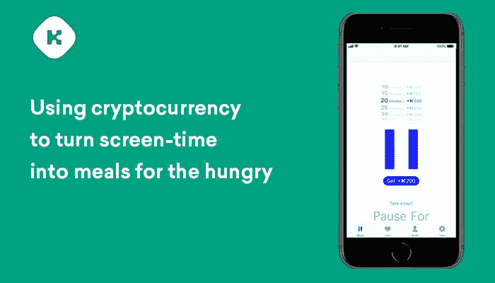
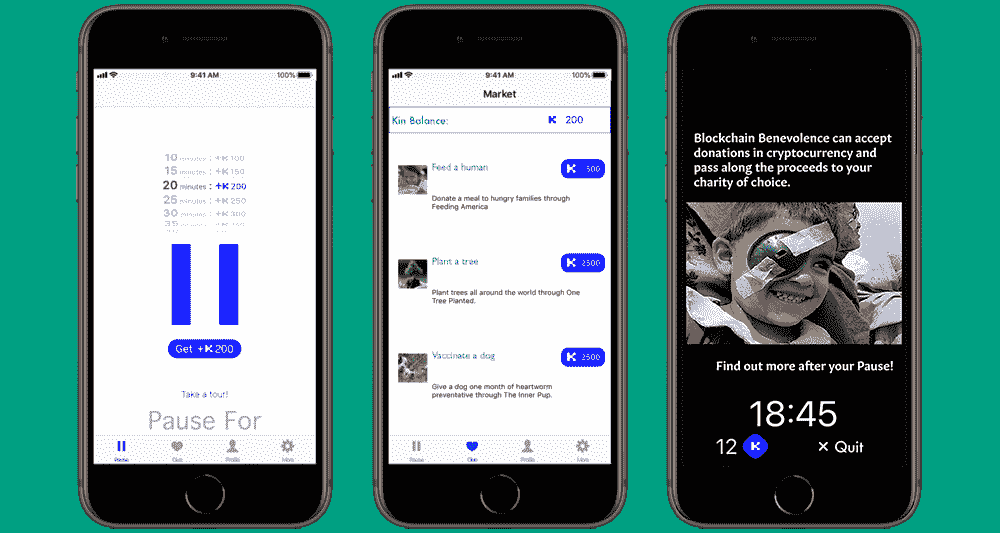
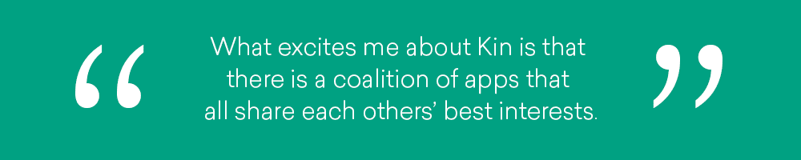

# 使用加密货币将屏幕时间变成饥饿者的食物

> 原文：<https://medium.com/hackernoon/using-cryptocurrency-to-turn-screen-time-into-meals-for-the-hungry-7161a1f6fbe6>

上周，我有机会采访了塞缪尔·多德，他是 Oroboros LLC 的创始人，也是第一个 Kin 开发者计划中推出的 30 个应用之一的 T2 暂停 T3 的创建者。我喜欢他们正在尝试做的事情，所以我想了解更多关于 Pause For 的信息，为什么他们与 Kin 合作，为什么他们注册了第二个 Kin 开发者计划。

**停顿是为了什么？暂停是一款允许用户用屏幕时间换取慈善影响的应用。现在，用户可以为美国无家可归者提供食物，为狗接种疫苗，并在世界各地植树。我们轮换这些慈善机构，并希望随着我们用户群的扩大增加更多。**

**Kin 在 Pause For 中是如何使用的？用户通过设置定时器并在他们选择的时间内不使用手机来获得 Kin。用户可以将他们的亲属花费在各种慈善活动和礼物上。**

**你是如何想到暂停的？最初的动机是帮助人们更有效率。这个想法源于我在一家大公司实习的经历。这是一个工作的好地方，但每个人都有自己的目标和梦想，他们希望朝着这个目标努力。例如，我的室友当时想提高小提琴水平，但他每天工作 8 小时，回家后看 youtube 或滚动他的 twitter。我看到每个人都这样做，我试图找到一种解决方案，让人们停下来，开始花时间练习小提琴或学习编码或做他们想做的任何事情。**

很快，我已经为一个慈善机构工作了 7 年，看到了慈善机构是如何真正激励人们的。我想找到一种方法，帮助人们专注于他们的梦想，花时间实现他们的长期目标，并从慈善事业中获得即时的良好感觉。

**暂停的用户反应是什么？** 现象级，很多次都让我刮目相看。我们收到的一些支持电子邮件是令人惊奇的故事。一个人伸出援手，他在生活中一直依赖食物银行，现在不再依赖了，但是没有经济能力去回报。他们一直虔诚地使用暂停来试图回馈。对我来说，收到那封邮件简直是疯了。人们真的接受了这个想法，并以我从未想到或从未想过的方式使用它。

你是如何选择慈善机构的？
在我们项目的这个阶段，我们需要足够广泛的慈善影响来激励每个人。人们非常热爱动物，帮助他们的同胞和环境，所以我们张贴了与每个相关的影响。现在，随着我们不断扩大的用户基础以及来自我们的用户和其他慈善机构的请求，我们将开始扩展到更多的全球慈善机构，因为我们的用户遍布世界各地。

**你有什么想分享的数据吗？** 截至今日:

*   通过喂养美国捐赠了 3，333 份膳食
*   通过种植一棵树种植了 537 棵树
*   209 个月的心丝虫疫苗接种狗通过内部小狗
*   喜马拉雅白内障项目资助了 112 例白内障手术

是什么让你对 Kin 感兴趣？
用以太坊开始对加密货币感兴趣。然后我听说了 Kin，当时每个人都被不同的硬币吸引住了。我投资了代币发放活动，在邮件名单上。当时暂停已经在进行中。最初的想法是，每一分钟都会有一定数量的美分或美元捐给慈善机构。我们意识到，如果用户能够收集他们的时间，并以一种更有意义的方式给予他们，这将对他们更有影响。例如，提供我前面提到的一餐。在我们开始讨论这个问题后，第二天，我收到了一封关于 Kin Developer 项目的电子邮件，并开始进一步研究它，一切都非常匹配。这是机会，好时机，好契合。

你最近加入了第二个 Kin 开发者计划，开发了一个名为 Hangmeme 的新应用。你为什么决定再次申请？
在开发 Pause For 时，我们的大部分时间都放在了 Kin 集成上。这项技术太新了，很多人不知道如何使用它。当我听说第二个 Kin 开发者项目时，我想从另一个角度了解我们如何使用 Kin。Hangmeme 是一个让我们从不同的角度了解更多关于 Kin 可以用来推动参与和提供价值的不同方法的途径。

**为什么其他开发者要用 Kin 来构建？** 对于 Kin 来说，最让我兴奋的事情是拥有了一个互相关照的应用社区。当你在没有亲属的情况下进行建设时，会有很多竞争对手试图摧毁你，大公司会通过四处扔广告钱来控制这个空间。Kin 让我兴奋的是有一个共享彼此最佳利益的应用联盟。有了这个，当你开始一个 3 人团队，用一个有 1000 个用户的小应用程序时，你就有了更多的力量。你通常没有太大的影响力，但当你将这种影响力融入生态系统时，它就会变得强大得多。

**停顿的下一步是什么？** 我们目前正在为区块链的迁移做规划。在此之后，下一步是在 Android 上直接发布到 Kin 区块链，以避免迁移这些新用户。Android 发布后，我们正在建立一个全球捐赠柜台。现在在暂停上，每个用户可以看到他们个人贡献的内容。例如，我可以看到我贡献了 8 顿饭，并为狗提供了 6 个月的心丝虫疫苗接种。我们希望建立一个全局计数器来显示用户能够暂停什么。

[在 iOS](https://itunes.apple.com/us/app/pause-for/id1293407815) 上下载今天的暂停，并在 [Twitter](https://twitter.com/PauseForApp) 、[脸书](https://www.facebook.com/pauseforapp)或 [Instagram](https://www.instagram.com/pauseforapp/) 上关注他们的进展。

想加入 Pause For 和其他志同道合的开发者吗？[申请 Kin 开发者计划](https://developers.kinecosystem.com/?utm_source=Hackernoon&utm_medium=blog&utm_campaign=Hackernoon_pausefor&utm_term=pausefor)并加入我们的开发者社区。