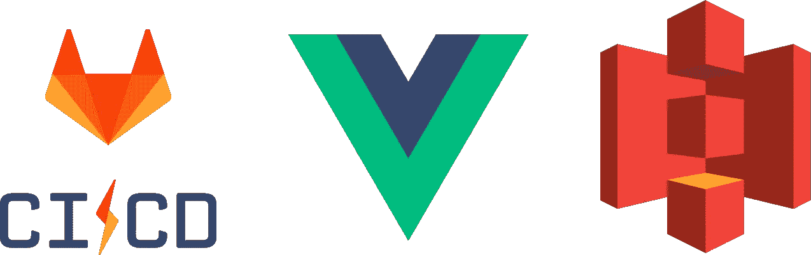
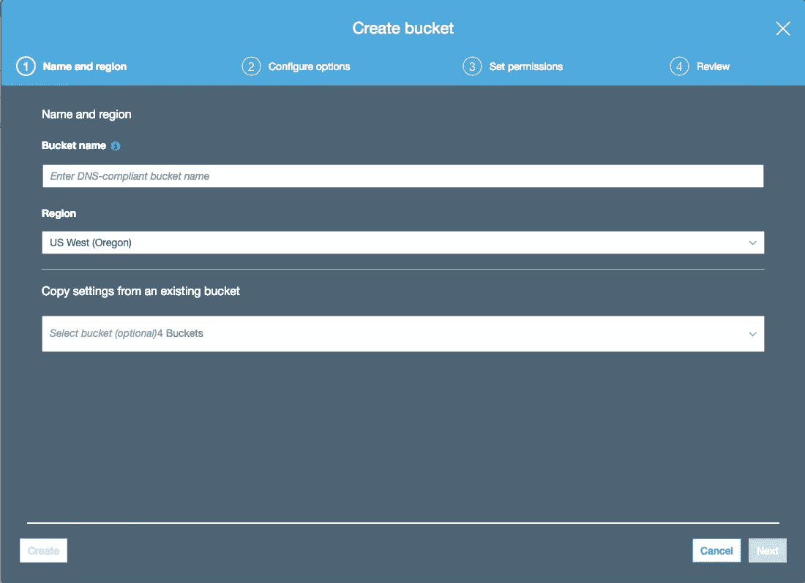
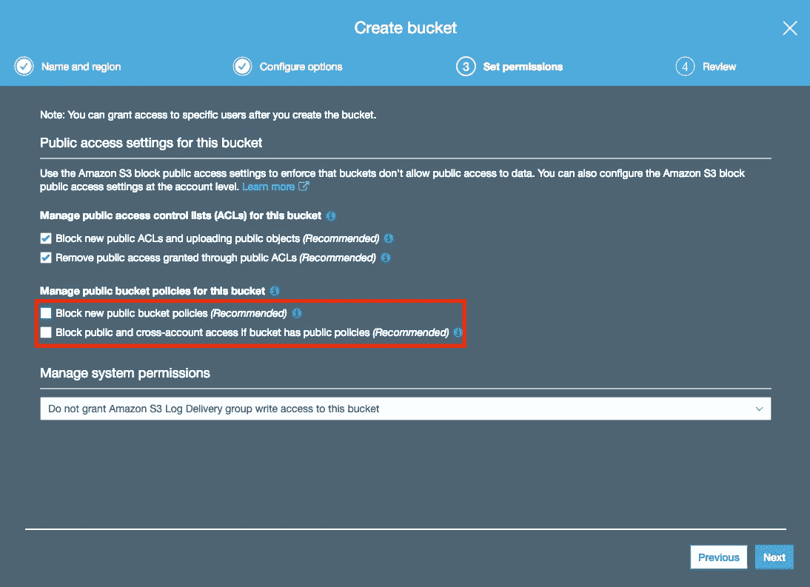
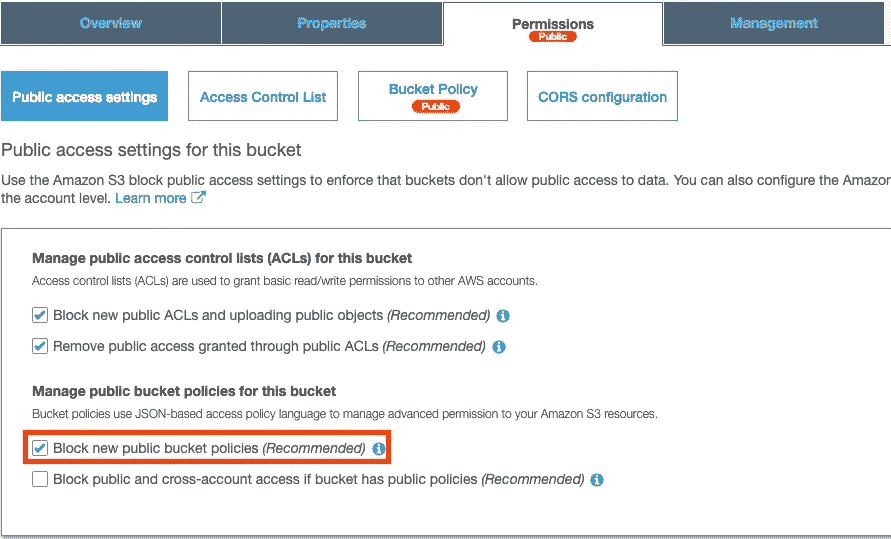
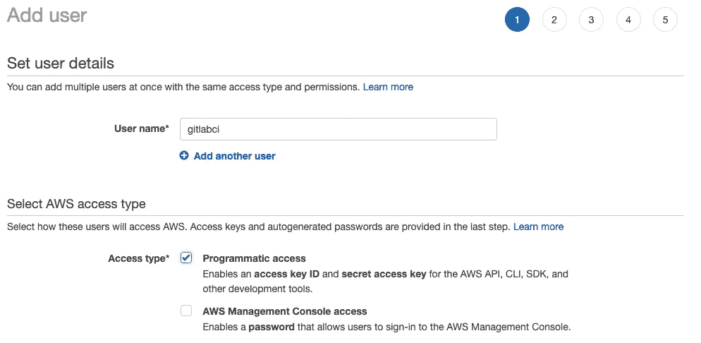
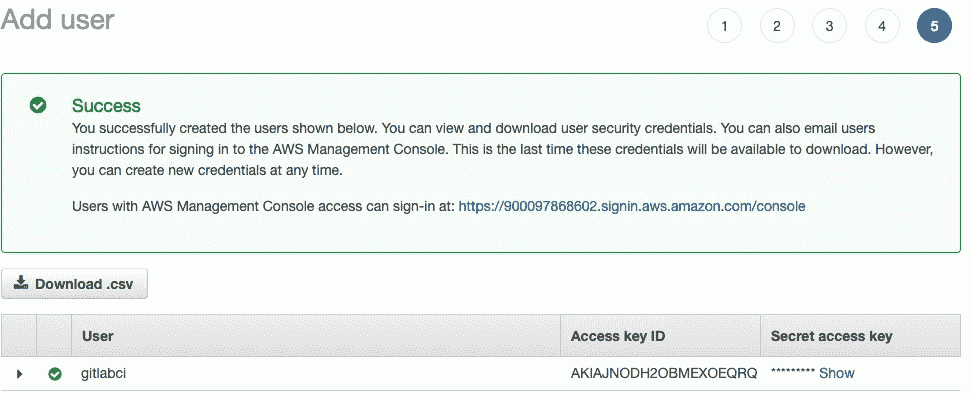
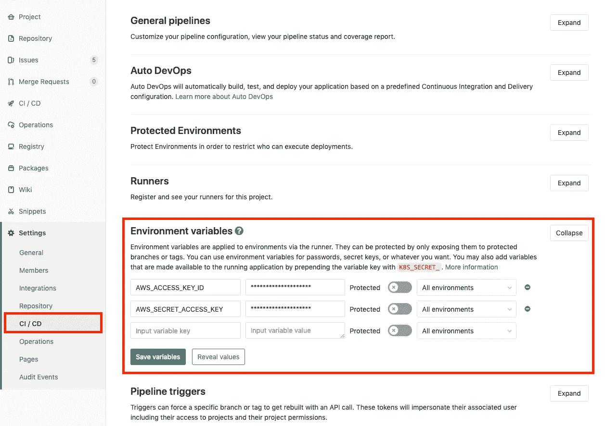
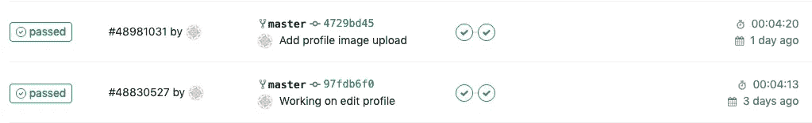

# 使用 GitLab CI/CD 将 Vue.js 应用程序自动部署到 AWS S3

> 原文：<https://medium.com/hackernoon/using-gitlab-ci-cd-to-auto-deploy-your-vue-js-application-to-aws-s3-9affe1eb3457>



GitLab CI/CD — Vue.js — Amazon S3

在我做工程师的前几年，我总是一脸得意地看着持续集成/持续交付(CI/CD)。这是一次艰难的经历(谢谢你，詹金斯🤢).然而，我坚信，在 2019 年，我们将会看到关于如何轻松管理和部署您的应用的对话有所增加；考虑开发应用程序只是一个单一的步骤，对不对？

*对于本文，我将假设您已经创建了一个* [*Vue.js*](https://vuejs.org/) *应用程序，并且现在已经准备好设置 GitLab 的持续部署。*

*虽然本文展示了如何部署 Vue.js 应用程序，但它是使用 GitLab 的 CI/CD 向 S3 部署任何东西的基本结构。*

首先，让我们建立一个 [AWS 账户](https://aws.amazon.com/)并创建一个新的 S3 桶！任何新的 AWS 帐户都归入其免费层[之下，这将允许我们免费部署到 S3(第一年，在某些请求限制下)。](https://aws.amazon.com/free/)


**S3:**

注册后，前往 [S3 控制台](https://s3.console.aws.amazon.com/s3/home)并点击“创建桶”



Create bucket modal

您将看到这个模式。输入一个存储段名称(请记住，该名称在整个 AWS 中必须是唯一的)。在“设置权限”选项卡上，确保取消选中“阻止新的公共存储桶策略”和“如果存储桶有公共策略，则阻止公共和跨帐户访问”:



创建了存储桶之后，单击存储桶，然后单击名为“Properties”的第二个选项卡。你会看到一张卡片，叫做“静态网站托管”。点击并启用“使用此桶托管网站”,并为索引文档填写`index.html`,如下所示:


*注意:模态顶部的端点将是你可以用来访问你的网站的 URL！*

现在是最后一部分，允许你的 S3 桶的读取权限(这样你的用户就可以看到你的网站了！).导航到第三个选项卡“权限”，然后单击“存储桶策略”。您需要在编辑器中添加以下策略:

```
{
    "Version": "2012-10-17",
    "Statement": [
        {
            "Effect": "Allow", 
            "Principal": "*", 
            "Action": "s3:GetObject", 
            "Resource": "arn:aws:s3:::YOUR_BUCKET_NAME/*" 
        } 
    ] 
}
```

*不要忘记将* `*YOUR_BUCKET_NAME*` *替换为您在创建时使用的桶名。这允许任何用户将* `*GET*` *从你的桶中取出。*

回到“公共访问设置”选项卡，重新启用阻止新存储桶策略:



This ensures the bucket policy cannot be updated

现在，如果我们转到亚马逊分配给这个桶的 URL，您应该会看到一个… 404！那是因为我们还没有从 GitLab 推送你的项目！

在 AWS 仪表板中，我们必须做的最后一件事是创建一个 IAM 用户，这样我们就可以安全地允许 GitLab 访问并上传数据到这个 bucket。这允许我们在需要时撤销访问。

**IAM 用户:**

导航到 [IAM 管理控制台](https://console.aws.amazon.com/iam/home?#/users)并点击顶部的蓝色“添加用户”按钮。给出一个描述性用户名，如`gitlabci`，并选择“程序化访问”



如果您尚未创建组，接下来您将创建一个组并附加一个策略。对于本演示，我们将使用`AmazonS3FullAccess` —但是，您可能希望根据您的安全需求更改策略。

在最后一步之后，当你点击“创建用户”时，你将看到一个成功的屏幕，其中将包含两条非常重要的信息:访问密钥和秘密密钥。**注:** **一旦离开此屏幕，您将无法再访问密钥**。你可以写下来或者下载。csv，然后**确保**您稍后删除。无论你做什么，确保没人能拿到钥匙。



Either download the .csv or click show secret key and copy and paste somewhere

我们快到了！现在我们只需要设置 GitLab 来推送我们的 S3 桶。

**GitLab:**

欢迎，GitLab CI/CD。在测试之前，我总是把我的代码放在 GitHub 上。GitHub 在确保我的源代码安全和广泛可用方面做得非常出色，但是，我注意到，如果没有一些额外的工作，它几乎就做到了这一点。我告诉自己，我希望能够进行代码更改、提交、推送，然后看到我的新代码部署到互联网上。

前往 [GitLab](https://gitlab.com/) ，注册一个账户，创建一个新项目。GitLab 就像 GitHub 一样，你需要将它的远程源添加到你的本地项目中。一旦项目被设置，你将重命名/添加这个作为一个新的遥控器到你的本地`.git`:

```
git remote rename origin old-origin
git remote add origin https://gitlab.com/croossin/vues3example.git
git push -u origin --all
```

现在，对于使用 GitLab 设置 CI/CD 所需的关键文件:

Funny enough, using GitHub Gist’s for a GitLab article 🤣

转到你的 app 的根目录下添加这个文件`.gitlab-ci.yml`并复制上面要点的内容；一旦推送，GitLab 将自动识别并开始其“开发-操作”过程。

那么这个文件到底是做什么的呢？

```
stages:  
   - build  
   - deploy
```

这告诉 GitLab 在 CI/CD 过程中要运行什么“步骤”。你可以很容易地看到添加更多的步骤，如`test`等。让我们来看看第一阶段— **构建**:

```
build prod:  
   image: node:10.15.0-stretch  
   stage: build  
   only:    
      - tags  
   script:    
      # Install vuecli    
      - npm install -g @vue/cli@latest    
      # Install dependencies    
      - npm install    
      # Build App    
      - npm run build  
   artifacts:    
      paths:      
         # Build folder      
         - dist/    
      expire_in: 1 hour
```

*   **image** :由于我们正在构建 Vue.js 应用程序，我们希望将 docker 映像设置为 Node 的某个版本(最好是最新版本)。
*   **阶段**:这应该与我们在文件顶部描述的`stages`之一相一致。这让我们 GitLab 知道阶段是如何关联的。
*   **only** :如果您希望 GitLab 基于特定的分支或标签有条件地运行这些脚本，这是非常关键的。对我来说，我喜欢搭建舞台和制作环境。当我将更改合并到 master 中时，它将运行 stage 脚本，当我创建一个标记时，它将运行 prod 脚本。
*   **脚本**:听起来，这是在这个阶段运行的命令序列。对于这个特殊的实例，我们安装最新的 [Vue Cli](https://cli.vuejs.org/) ，下载所有的依赖项，然后从我们的`package.json`运行我们的构建脚本——对我来说，它看起来类似于:`vue-cli-service build`
*   **神器** : *这就是我一开始犯的错误。*因为我们的部署过程有两个阶段(构建和部署)，并且它们都在两个不同的映像上，所以我们需要一种方法让第二阶段(部署)能够访问我们的构建文件夹— `dist/`。有了工件，我们可以设置一个“存储”的路径，供其他阶段引用。因此，我将路径设置为`dist/`文件夹，并将过期时间设置为 1 小时。

现在是管道中的最后阶段— **部署**:

```
deploy prod:  
   image: python:latest  
   stage: deploy  
   only:    
      - tags  
   script:    
      - pip install awscli    
      - aws s3 sync ./dist s3://YOUR_BUCKET_NAME
```

Python 是 AWS 支持的 CLI，因此我们将图像设置为`python:latest`。运行时，它将安装最新的 AWS CLI，并将 dist 文件夹与我们在开始时创建的 bucket 同步。确保`YOUR_BUCKET_NAME`与我们在 S3 控制台中创建的桶相同。

*注意:如果您同时需要登台和生产环境，您将需要在 S3 创建第二个存储桶(与第一个存储桶具有相同的配置),并将其用作登台存储桶。*

**最后一步:**

AWS 如何知道应该允许这个用户同步到 S3 存储桶？来自我们在文章前半部分创建的 IAM 用户！因为我提到暴露/提交你的密钥是一个非常糟糕的技术，我们将把它们添加到 GitLab 的[环境变量](https://docs.gitlab.com/ee/ci/variables/)。导航到“设置”选项卡中的 CI/CD，并展开“环境变量”



GitLab AWS Environment Variables

您将添加两个变量:`AWS_ACCESS_KEY_ID`和`AWS_SECRET_ACCESS_KEY`。使用在 IAM 管理控制台中创建用户时下载/复制的相关密钥来填充值。

我们都准备好测试它了！

推一些代码给 master，看 GitLab 自动拉开 CI/CD 进程的序幕。您可以观察各阶段的执行情况，并查看您完成的管道:



看看 [GitLabs CI/CD 文档](https://docs.gitlab.com/ee/ci/README.html)看看如何扩展您的工作来完成您可能需要的任何事情。

**总结一下:**

完成这些步骤后，您基本上应该拥有:

*   创建了一个 AWS 帐户
*   创建了一个 S3 存储桶，并将权限设置为公共访问
*   创建了一个 IAM 用户供 GitLab 使用
*   创建 GitLab 帐户/项目
*   添加我们的`.gitlab-ci.yml`，填写我们的 CI/CD 阶段
*   将我们的 IAM 凭据添加为环境变量
*   坐下来，微笑，看着你的代码通过 GitLab 的 CI/CD 过程自动部署到 S3

如果您有任何问题或顾虑，请随意评论、鼓掌或联系我们。我计划写一篇后续文章，在这篇文章中，我将向您展示如何在您的 S3 存储桶前部署 [CloudFront](https://aws.amazon.com/cloudfront/) 发行版，以确保您的站点快速可靠的发行，以及从 AWS 的[证书管理器](https://aws.amazon.com/certificate-manager/)添加 SSL 证书！