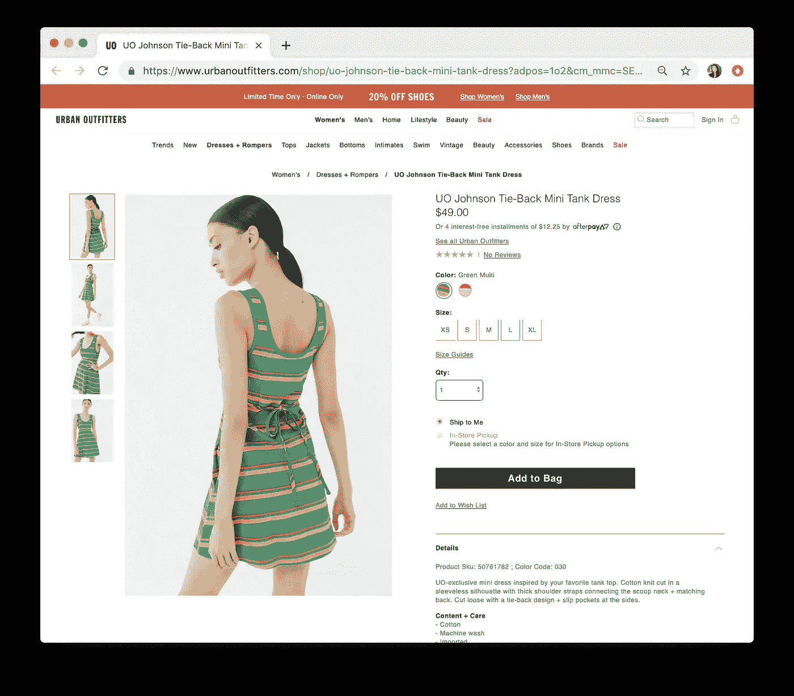
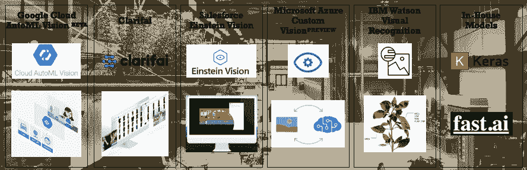
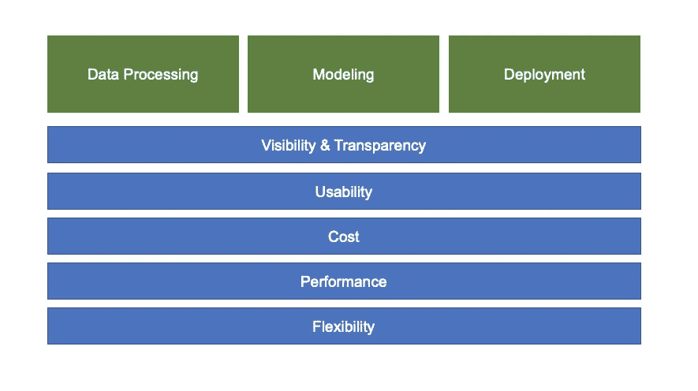
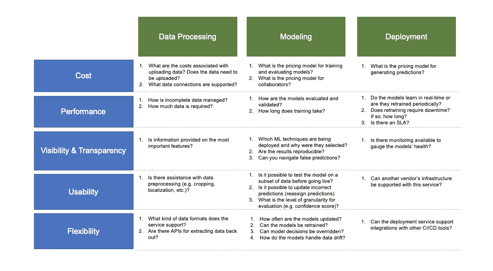
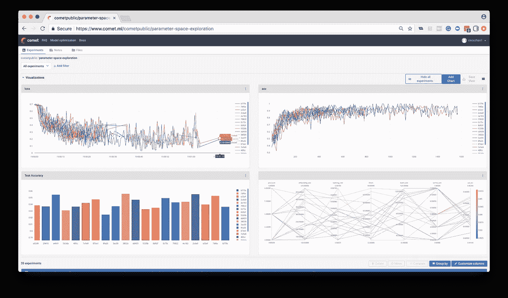
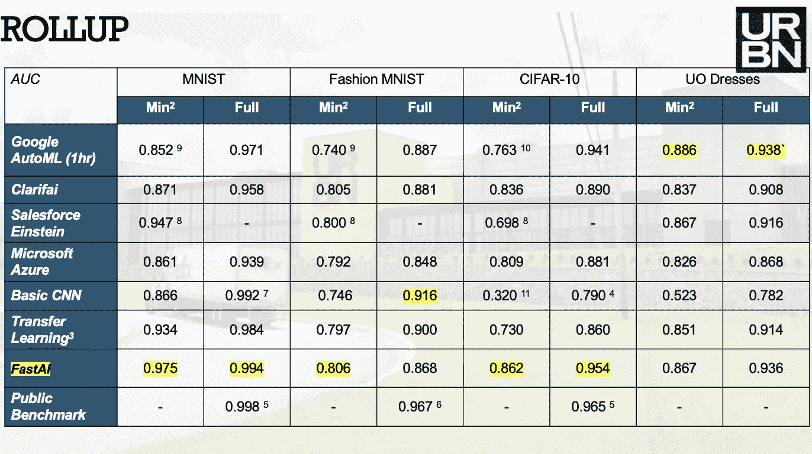
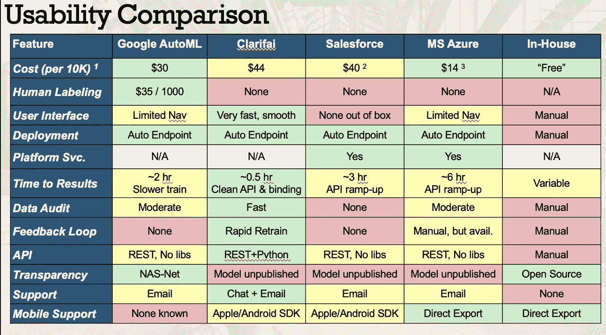

# 使用托管机器学习服务(MLaaS)作为基线

> 原文：<https://medium.com/hackernoon/using-managed-machine-learning-services-mlaas-as-your-baseline-e6c239d3f7f8>

## 构建与购买:MLaaS 是否符合您的数据科学项目的需求，您如何评估各个供应商？

Making a build or buy decision at the start of any data science project can seem daunting — let’s review a

几乎每个主要的云提供商现在都提供定制的机器学习服务——从[谷歌云的 AutoML Vision Beta](/p/1795457dce9#fd1c) ，到[微软 Azure 的定制视觉预览](/p/1795457dce9#8fce)，以及 [IBM Watson 的视觉识别](/p/1795457dce9#4d2d)服务，计算机视觉领域也不例外。

也许您的团队已经陷入了这种**是建造还是购买的困境？**

从市场营销的角度来看，这些托管 ML 服务定位于刚刚建立数据科学团队或团队主要由数据分析师、BI 专家或软件工程师组成的公司(他们可能[正在向数据科学](https://medium.freecodecamp.org/if-youre-a-developer-transitioning-into-data-science-here-are-your-best-resources-c31928b53cd1)过渡)。

然而，即使是中小型数据科学团队也可以从评估这些“机器学习即服务”(MLaaS)产品中获得价值。因为这些供应商生产并访问如此多的数据，所以他们能够在内部构建和训练自己的机器学习模型——这些经过预训练的模型可以快速提供更高的性能。使用这些 MLaaS 产品作为基准与内部模型进行比较也很有用。

**这篇文章将为您提供一个清晰的框架，让您了解如何评估这些不同的供应商及其 MLaaS 产品。**

这篇文章的灵感来自于

### [今天我们请到了 URBN 的数据科学家 Tom Szumowski，URBN 是 Urban Outfitters、Anthropologie 和…](https://medium.com/u/e815ce4c9ea5#247</h2>

 如果你还没有听过 TWiMLAI，我强烈推荐[整个系列](https://twimlai.com/shows/)。我最喜欢的几集是 *(1)* [在 Linkedin 上用 Hema Raghavan 和 Scott Meyer](https://twimlai.com/twiml-talk-236-scaling-machine-learning-on-graphs-at-linkedin-with-hema-raghavan-and-scott-meyer/) ， *(2)* [用 Sebastian Ruder](https://twimlai.com/twiml-talk-216-trends-in-natural-language-processing-with-sebastian-ruder/) 研究自然语言处理的趋势，以及 *(3)* [用 rnn 和 Adji Bousso Dieng](https://twimlai.com/twiml-talk-160-designing-better-sequence-models-with-rnns-with-adji-bousso-dieng/) 设计更好的序列模型
> 
> NY AI & ML 将于 5 月在纽约与 Adji 举办一场聚会— [加入我们的](https://www.meetup.com/NYC-Artificial-Intelligence-Machine-Learning/) *🚀🚀)*

## 👉🏼想要更多牛逼的机器学习内容？[关注我们](https://medium.com/comet-ml)。