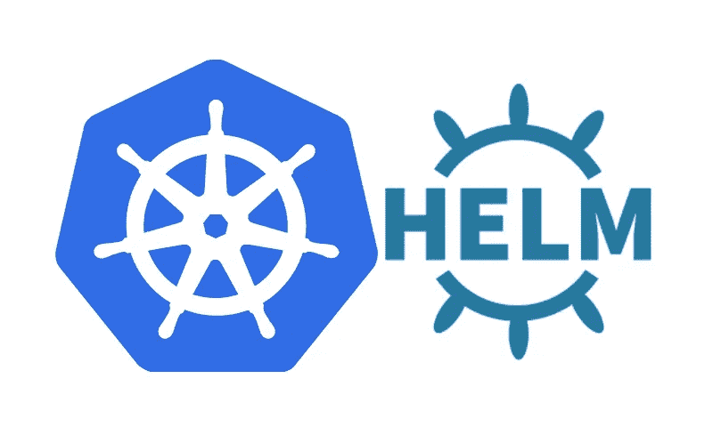

# 使用 S3 作为舵库

> 原文：<https://medium.com/hackernoon/using-s3-as-a-helm-repository-a76b504d494e>

> 简化您的 Kubernetes 部署



如果你知道标题的意思，你可能会直接进入本教程的内容。我会保持简短的介绍。

## 什么是头盔？

Helm 是一个工具，用于将 Kubernetes 资源模板化并应用到 Kubernetes 集群中。它标榜自己是“k8s 的 npm”，这是一个我发现完全没有帮助的描述。相反，[读读这篇文章](https://hackernoon.com/what-is-helm-and-why-you-should-love-it-74bf3d0aafc)——它解释得很好。

## 你为什么想要自己的头盔库？

> 从这一点开始，我将假设你熟悉什么是“掌舵图”。如果你不是，请阅读链接文章。

当您想要将应用程序部署到 Helm 中时，您有一些选择。您要么有每个应用程序的掌舵图，要么有一组应用程序的掌舵图。比如，你要么有你的`auth-service-helm-chart`，要么有你的`java-applications-helm-chart`。两者各有什么利弊？

## 每个应用程序一个图表

***优点*** *:* 您可以在图表中实现特定于应用程序或服务的逻辑。

***缺点*** *:* 如果你已经有了微服务(而且很有可能是 k8s)，你最终会得到很多分散的图表。大量重复，难以大规模管理。创建新的应用程序也需要更多的努力，你必须正确地连接图表。

## 适用于多种应用的图表

***优点:*** 一个图表更容易管理。你的图表都在一个地方(一个图表回购)。

***缺点:*** 你需要非常小心，不要让特定的应用程序影响到共享图表的逻辑。一切都需要通用。

# 我不喜欢重复

因此，我选择了共享图表方法。这就产生了一个新问题——我们到底在哪里存放图表？进入[舵 s3 插件](https://github.com/hypnoglow/helm-s3)。

## **安装插件**

要配置本地 helm CLI 以使用此插件，需要调用以下命令:

```
helm plugin install https://github.com/hypnoglow/helm-s3.git
```

## 给 S3 桶装上电线

一个舵库需要有一个`index.yaml`作为它的根。你可以使用 helm CLI 来初始化它，但是用一点 terraform 来连接它会更容易。不要运行两个命令或依赖正确配置的`helm` CLI，而是运行一个命令并完全依赖 terraform。

```
resource "aws_s3_bucket" "helm_central" { bucket = "my-helm-central-bucket" acl    = "private"}resource "aws_s3_bucket_object" "object" { bucket = "${aws_s3_bucket.helm_central.bucket}" key    = "charts/index.yaml" source = "/path/to/my/files/index.yaml"}
```

这个地形需要在本地目录中有一个名为`index.yaml`的文件。我使用的文件如下所示:

```
apiVersion: v1entries: {}
```

**注意**，这将创建一个关键的“图表”,您的捆绑图表将放在那里。此外，您的 S3 存储桶将无法从互联网上访问，您需要通过 IAM 角色来管理访问。

## 告诉赫尔姆你的新桶

现在您已经有了一个 bucket，您需要通知您的本地 Helm CLI S3 bucket 存在，并且它是一个可用的 Helm 存储库。为此，您可以使用 s3 插件:

```
helm repo add my-charts s3://my-helm-central-bucket/charts
```

**注意:**无论你从哪里运行掌舵命令，都需要适当的 IAM 访问这个 S3 桶。要么读，要么写，或者两者都读。

## 测试一下！

拉下一个现有的图表，打包并推送到新的存储库中。

```
# This will download the tar.gz from your stable central repository.
helm fetch stable/rabbitmq# This will push that new tar.gz into your private repository.
helm s3 push rabbitmq-<version>.tgz my-charts
```

如果成功了，恭喜你！您刚刚建立了自己的图表库。

更多关于技术的文章和漫谈，请在 twitter 上关注我！