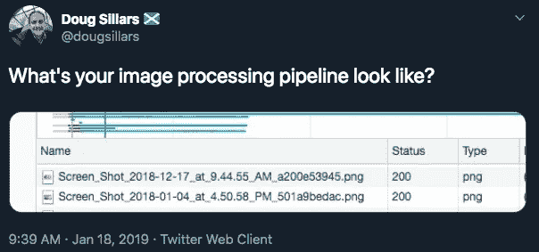
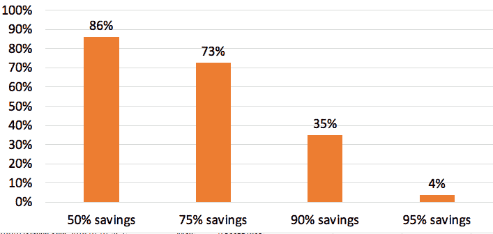
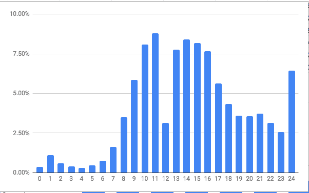
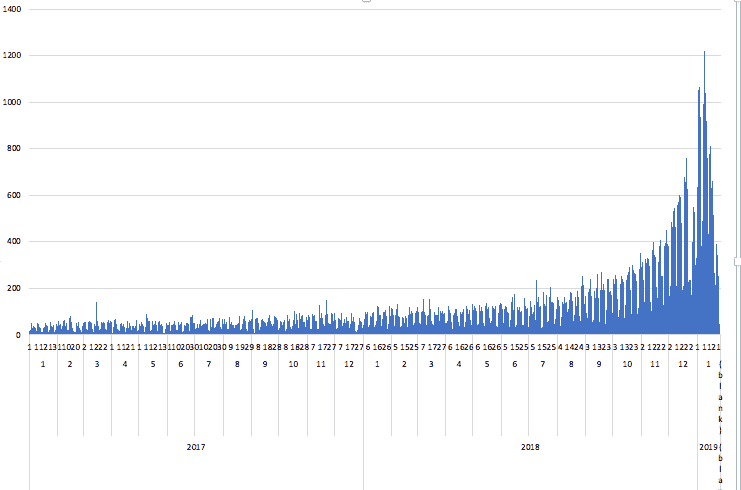
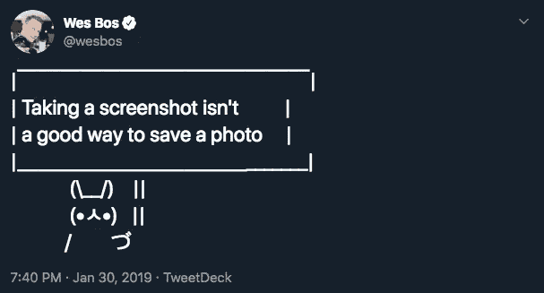

# 如何在制作中使用截图

> 原文：<https://medium.com/hackernoon/using-screenshots-in-production-c124d76de40f>

在查看网页测试瀑布时，我经常遇到令人惊讶的属性。几周前，我偶然看到一个页面，其中的图片有一个熟悉的文件命名约定:



[https://twitter.com/dougsillars/status/1086196363010949121](https://twitter.com/dougsillars/status/1086196363010949121)

这个网站正在使用 Mac 截屏工具来创建他们在网上使用的图像！

# 图像优化

我已经写了很多关于[图像优化](https://dougsillars.com/2018/05/21/state-of-the-web-top-image-optimization-strategies/)，关于[gif](https://dougsillars.com/2019/01/15/state-of-the-web-animated-gifs/)， [Base64 编码](https://dougsillars.com/2018/12/12/base64-encoding-on-the-web-anti-pattern/)等等的文章。我的直觉是，使用截图的网站没有优化网页内容。所以我决定一探究竟。

# 网页上的截屏图片是否经过优化？

2019 年 1 月的 HTTP 存档数据集包含约 4M 移动网站的负载特征数据。搜索这些网站的所有请求的文件名，我发现 36k (~1%)的页面有一个名为“截屏”(112k 离散文件)的图像。为了确定它们是否得到了优化，我选择了 1500 张文件名中带有术语“截屏”的图片。为了保持数据的及时性，我也只使用文件名中带有“2019”的图像。

为了在我的数据集中创建图像的优化版本，我使用了 Cloudinary 的 fetch 特性，该特性允许 cloudinary 优化远程服务器上的图像。我使用 f_auto 和 q_auto 参数来优化图像的格式和质量。Cloudinary 将 png 转换为 jpg (f_auto 表示 curl)，然后使用 SSIM(q _ auto 命令)找到最佳大小/质量。

```
Original:https://example.com/screenshot.png Optimized: [https://res.cloudinary.com/demo/image/fetch/f_auto,q_auto/https://example.com/screenshot.png](https://res.cloudinary.com/demo/image/fetch/f_auto,q_auto/https://example.com/screenshot.png)
```

为了获得每张图片的文件大小，我使用 curl 创建了一个 csv 文件，其中包含图片的 url 和下载的大小:

```
xargs -n 1 curl --write-out '%{url_effective},%{size_download}\n' --silent --output /dev/null < 1500screenshots.txt >results.txt
```

在 1289 个结果中，有 11%在原始大小的 10%以内——所以我们称之为优化的。然而，86%的图像缩小了至少 50%，73%的图像可以比原始图像缩小 75% KB。这证实了我的假设，文件名中带有“截屏”一词的文件通常不适合 web 交付。



# 旁白:这篇文章中的所有图片都是截图。

但是在我的 Mac 上安装了 ImageOptim 之后，我只需“右击”——在上传到 WordPress 之前选择 ImageOptimize。一次额外的点击——所有的图像都得到了优化。

# 有趣的正则表达式:截图中的日期和时间

因此，有很多未经优化的图像，这并不奇怪。但是我们这里有一些很酷的额外数据——图像被捕捉的确切时刻。那么——这些截屏是什么时候制作的？使用一些奇特的正则表达式，我们可以运行这些数字:

# 截图拍摄时间:



大多数截图是在上午 9 点到下午 6 点之间拍摄的。

**注意**:虽然看起来在午餐时间有一个巨大的下降，在午夜有一个大的峰值，但我认为这是由于我的数据处理——在任何时间加上“PM”后缀(12:30 PM 变成 24:30——数学可能很难)。

# 星期几


大部分是在一周内，周五略低于 M-Th。

# 截图是哪一年拍的？


这实际上让我有点惊讶——对于 1 月初拍摄的数据集来说——已经有 14%的截图来自 2019 年，近 70%来自去年。当然，这意味着网络上 30%的截图来自 2017 年或更早。

我们可以进一步看到这些照片是最近拍摄的。这是过去 2 年每天的截图计数。



这些数字并不十分重要，但是我们可以看到大多数截图都是最近的——大量截图是在 1 月份拍摄的——当时正在收集数据集！🙂

# 结论



https://twitter.com/wesbos/status/1090696149323927552

有许多网站使用 Mac 上的屏幕截图作为其图像处理管道的重要组成部分，以便在网上定期更新。然而，这些图像中很少执行任何优化(86%的图像可以在大小上减少至少 50%)。基于此，一个合理的假设是，如果你的网站使用截屏图像，你需要做一些优化工作。

*原载于 2019 年 2 月 10 日*[*dougsillars.com*](https://dougsillars.com/2019/02/10/using-screenshots-in-production/)*。*