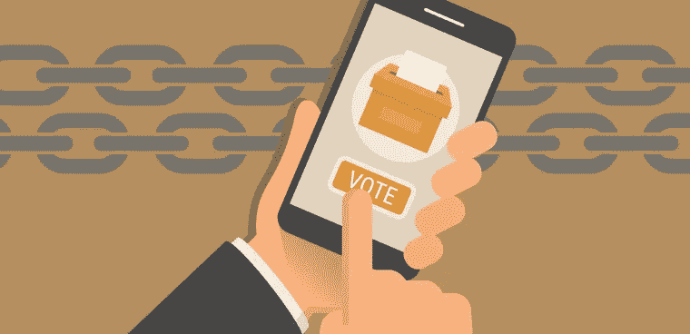

# 犹他州成为美国第三个提供基于区块链的移动投票的司法管辖区

> 原文：<https://medium.com/hackernoon/utah-becomes-the-third-u-s-jurisdiction-to-offer-blockchain-based-mobile-voting-2ba89e7fc74a>

犹他县是美国最新一个在即将于 8 月举行的市政初选中实施区块链移动投票的辖区。旨在提高美国选举投票率和参与度的 Tusk Philanthropies 与犹他州县选举部门、Voatz 和国家网络安全中心合作，在区块链为现役军人、他们的合格家属和海外选民提供移动投票试点。

该试点将由 Voatz 提供支持，这是一个由军用级技术驱动的移动选举平台，可确保世界任何地方的个人投票的安全性和便捷性。去年在西弗吉尼亚州，Voatz 推出了第一个在联邦选举中使用的基于区块链的移动投票解决方案。Voatz 也是丹佛 5 月 7 日市政选举的基础技术提供商。

“我们的技术已经在西弗吉尼亚州和丹佛使用，现在正在犹他州的九个不同城市应用。犹他州的选举将比丹佛的选举规模小，但概念保持不变。我们的目标是让海外公民投票变得容易和安全。”沃茨的首席执行官兼联合创始人尼米特·索内(Nimit Sawhney)告诉我。

根据 Sawhney 的说法，犹他州县和全国各地的选举官员都认识到，目前的缺席投票方法是不够的，特别是对于现役军人和海外公民来说。反过来，许多生活在国外的人不太可能投票。[来自联邦投票援助计划(FVAP)的数据](https://www.fvap.gov/uploads/FVAP/OCPANewsRelease_20180911_FINAL.pdf)反映了这一点，显示 2016 年有 300 万美国公民居住在国外，他们投了大约 208，000 张选票。相比国内 72%的投票率，海外投票率只有 7%。

“犹他州县和全国各地的选举官员都认识到，目前的缺席投票方法是不够的。驻扎在海外的军人或在世界各地执行任务的年轻人应该能够利用智能手机硬件、加密和区块链技术的最新进展来投票。我们很高兴丹佛、西弗吉尼亚州和犹他州的选民有机会评估移动设备投票的安全性和便捷性。”

该试点将主要用于在海外服役的部队，他们传统上不得不依赖于使用缺席纸质选票，这使得他们很难参加选举。据美国选举援助委员会(u . s . Elections Assistance Commission)称，近 30 万海外选民要求投票，但无法在 2016 年选举中将其返还给家乡的县办事员。

“犹他州的试点是另一个迹象，表明我国移动投票的势头非常真实，并支持我们的理论，即当你向人们展示一种更好的方式来做某事时，就会有需求，”图斯克慈善机构的创始人兼首席执行官布拉德利·图斯克说。“随着我们进入总统选举年，我们必须继续消除尽可能多的障碍，以便更多的人能够参与我们的民主。”

**区块链的作用**

虽然移动投票让海外公民更容易投票，但区块链技术增加了便利性、透明度和安全性。

“Voatz 使用生物识别、身份验证和区块链技术作为数据安全和选举后审计的独特机制。这个过程从海外公民申请缺席投票开始。一旦县办事员验证了用户信息，他们就可以在智能手机上下载 Voatz 应用程序。需要完整的身份验证，以及用于面部识别匹配的“视频动作自拍”。一旦一切都被批准，用户将收到一张移动选票，这是完全匿名的，存储在区块链网络上。索恩尼解释说:“需要指纹来解锁。

Voatz 移动选举平台由 Hyperledger Fabric 提供支持，Hyperledger Fabric 是 Linux 基金会托管的企业级区块链框架。投票数据库分布在亚马逊网络服务(Amazon Web Services)和微软 Azure 托管的 32 个计算节点上，所有这些节点都在美国的地理范围内。Voatz 与作为独立监督者的选定非营利组织一起监控这些节点。

“正如使用该平台的选民在投票前必须通过审查程序一样，那些想要运营一个节点的人，在这种情况下也称为审计员，也必须接受审查。在丹佛选举中，有 18 人报名成为审计员，这为这件事奠定了基础，”Sawhney 说。

还需要指出的是，Voatz 平台并不依赖于加密货币。根据 Swahney 的说法，在投票的情况下，为了避免冲突，加密货币不应该作为一种激励机制来应用。

“我们没有加密货币作为一种激励机制，因为我们希望避免利益冲突和法律纠纷，这些纠纷可能会因不得不付钱给某人来审核交易而产生。网络上的一切都是出于善意，为了支持透明的民主，这一切都符合美国的法规。”

**电子投票系统的数据安全**

然而，尽管区块链的一个移动应用程序可能会简化海外选民的投票过程，但电子投票系统背后的数据安全性仍然值得怀疑。

2016 年美国总统大选后，俄罗斯黑客试图删除和修改选民数据，人们对数据保护提出了担忧。然而，根据 Swahney 的说法，区块链确保数据保护比传统的电子投票系统更有效。

“区块链上没有存储任何可识别选民身份的信息，只有已投的选票。公众也可以访问区块链，在不知道谁投票的情况下进行个人分析。这是向创造透明度迈出的一大步。电子投票的另一个挑战是如何从投票人投票到制表过程中防止数据被篡改。使用区块链有助于这一点，此外它还具有审计功能，增加了整个交易的透明度和可验证性。”

在丹佛选举期间，国家网络安全中心(NCC)向公众提供了公开审计，以确保选民的选择得到尊重。

“在选举日，一个县的办事员将收到两套钥匙来打开保存着区块链记录的数字锁箱。然后他们打印这些选票并扫描进去。一旦选民提交了他们的选票，他们将会收到一份数字签名的收据，司法机关将会收到一份匿名副本。一旦选举结束，司法部门就使用匿名收据，并将这些收据与区块链的印刷选票和数据进行比较，”Swahney 解释说。

虽然 Voatz 只适用于在犹他州有资格投票的海外军事人员及其家人，但 Swahney 提到，下一步将把这项技术推广到残疾人。

“在丹佛选举部门的选举后调查中，100%的受访者表示，他们更喜欢安全的移动投票方式。我们路线图的下一步是从我们做的每一个试点中学习并做出改进。例如，从西弗吉尼亚州的选举中，我们学会了如何使选举后的审计过程更具协作性，这样公民就可以与县办事员一起参与进来。未来，我们希望将此扩展到残障人士，并致力于使该平台更加无障碍。”