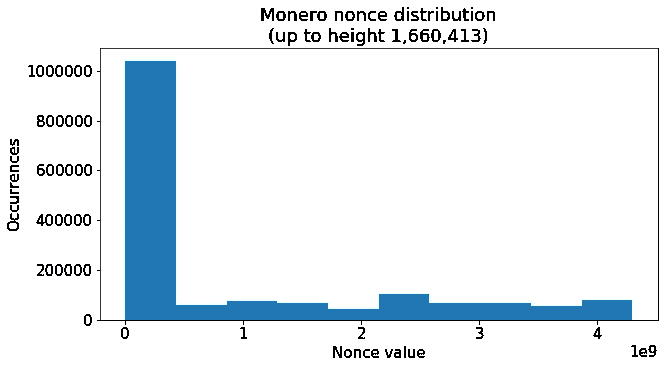
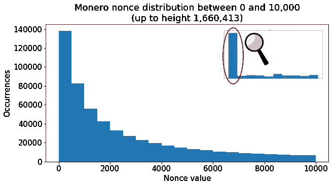
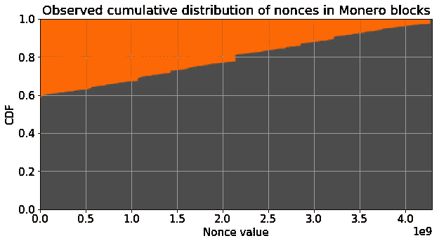
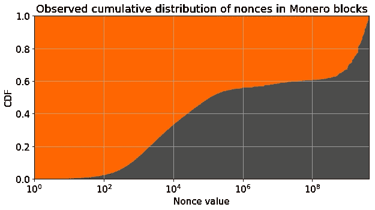
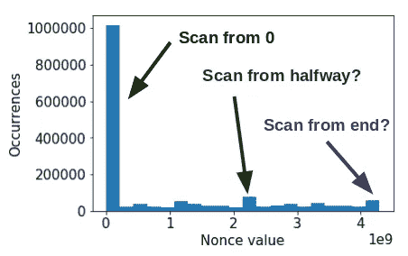
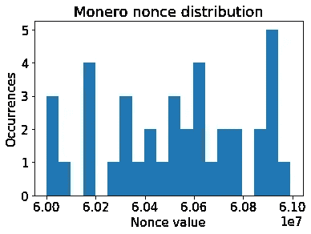
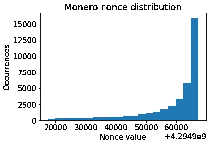
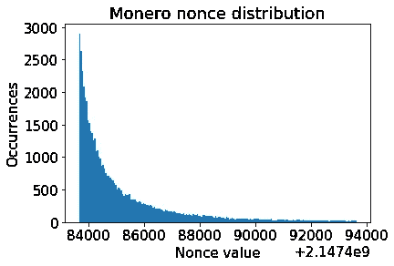

# 绝对的“不在场”——莫内罗区块链随机数值分布的统计研究

> 原文：<https://medium.com/hackernoon/utter-noncesense-a-statistical-study-of-nonce-value-distribution-on-the-monero-blockchain-f13f673a0a0d>


> 这篇文章涵盖了来自[非现场研究实验室](https://noncesense-research-lab.github.io/)的一个小项目，这是一个由开发人员、数据科学家和各种区块链书呆子组成的非盈利分散集体，他们一起研究共识生态系统中的有趣现象。欢迎你加入我们在 IRC 上的公共[讨论——随意介绍你自己，随意聊天，或者只是潜伏着学习。](https://www.irccloud.com/invite?channel=%23noncesense-research-lab&hostname=chat.freenode.net&port=6697&ssl=1)

本周，我正在为假期寻找一个轻松的研究项目，并认为将报告的 nonce 值可视化会很有趣。[Neptune Research](https://github.com/neptuneresearch)([Monero 档案项目](https://github.com/Mitchellpkt/monero_archival_project)的联合创始人和开发者)好心地提供了来自 Monero 区块链的随机数数据转储。

我预计对这些数据的探索性分析将是完全无意义的努力，因为可能的获奖值随机分散在矿工通过蛮力采样的巨大输入范围内。事实上，我在 Monero 研究实验室开玩笑说:*我的 Jupyter 笔记本最后会证明我在一个完全无用的任务上花了一个小时，因此这本身就是一个“工作证明”…*

然而，我在获胜的随机数中遇到了几个非常不同的模式。一些直方图和可视化显示了当今矿工使用的多个独特随机数搜索策略的签名！你可以跟随这个 [Jupyter 笔记本](https://github.com/noncesense-research-lab/nonce_distribution/blob/master/nonce_distribution.ipynb)中的分析。

# 示例块

考虑一下我写这篇文章时出现的这个 [Monero 块](https://xmrchain.net/block/ec1a771db71642d71f092ca5a002c64c97f3941089f39ee9adcb125d3c01efbf)。以下是它包含的一些信息的简化版本:

```
HEIGHT: [1711798](https://xmrchain.net/block/ec1a771db71642d71f092ca5a002c64c97f3941089f39ee9adcb125d3c01efbf)PREVIOUS BLOCK: [4343ccb0eccf8beac6f95461fe5f5e3aa61b8b49a8d7e920e1f8103826a73908](https://xmrchain.net/block/4343ccb0eccf8beac6f95461fe5f5e3aa61b8b49a8d7e920e1f8103826a73908)TRANSACTIONS: [6b6abb2a046a694d5edc21eeb5a7ddb5aefa4ed494be870c4f19d3612456ea4d](https://xmrchain.net/tx/6b6abb2a046a694d5edc21eeb5a7ddb5aefa4ed494be870c4f19d3612456ea4d) [ccf04b4fe210c5c123d032de6bff200407d955248fdc155cac0414d6c137fb3d](https://xmrchain.net/tx/ccf04b4fe210c5c123d032de6bff200407d955248fdc155cac0414d6c137fb3d) [a813579edc10878ca5fd9d40a678e49db23ff6c1c863c78293549d13576dd522](https://xmrchain.net/tx/a813579edc10878ca5fd9d40a678e49db23ff6c1c863c78293549d13576dd522) [37f76871ccd09e0085a85888e71936b9c2305de306aee0d0194be20052120067](https://xmrchain.net/tx/37f76871ccd09e0085a85888e71936b9c2305de306aee0d0194be20052120067) [b6b43cd533fd99a966cf20fd4d825244bc62624b7dce4e697863a722c098e7ed](https://xmrchain.net/tx/b6b43cd533fd99a966cf20fd4d825244bc62624b7dce4e697863a722c098e7ed) 
[8e323de9a6595b889a36d1c92f37e9213b55e955da7ae8210edbec3f355147ec](https://xmrchain.net/tx/8e323de9a6595b889a36d1c92f37e9213b55e955da7ae8210edbec3f355147ec) [6a469086bb7733778c8f5c746ad0684a32f89ae7b4e8284722870ad62f75c7a5](https://xmrchain.net/tx/6a469086bb7733778c8f5c746ad0684a32f89ae7b4e8284722870ad62f75c7a5)NONCE: 944
```

这个(真实的)示例块包含指向从内存池中挖掘的 7 个事务的指针。矿工标记块的高度和指向前一块的指针。

最后，挖掘者必须为 nonce 选择一个随机值，将其与其余信息捆绑在一起，并对整个块(包括 nonce)进行[散列](https://en.wikipedia.org/wiki/Hash_function)。如果输出散列的末尾有足够多的 0，则挖掘器已经成功地完成了该块。在这种情况下，挖掘器发现随机数 944 导致输出散列:

```
5f9d2da9bb79d244805918bf198560d7e34600d3d33e1a0cde12e40800000000
```

# 背景

nonce 字段允许包含任何 32 位整数。换句话说，挖掘器可以包括 0 到 4，294，967，295 之间的任何整数，该整数导致满足网络难度阈值的散列值。

在挖掘者准备好块(不包括随机数)之后，他们必须通过反复试验来搜索随机数空间，以找到有效的随机数。请注意，通常有许多随机分布在 0 到 43 亿之间的值构成可接受的 nonce，挖掘者只需找到其中的任何一个！

# 预期

如果采矿者随机抽取 0 到 43 亿之间的值，并且中奖随机数沿着相同的范围随机分布，那么区块链中记录的值应该没有模式。

在这种情况下，我们希望分布是“均匀的”，换句话说，我们希望大约相同数量的块使用 10 亿到 20 亿之间的随机数完成，因为有些块使用 20 亿到 30 亿之间的随机数完成。

# 现实

当我们实际绘制获胜随机数的直方图时，从最左侧条形的巨大峰值可以看出，明显偏向小值:



让我们放大 nonce 范围低端的巨柱，在 0 到 10，000 之间:



我们看到越来越多的块已经在小的 nonce 值处被发现，这表明许多挖掘者从零开始暴力强制 nonce，并且线性扫描搜索空间。

通过观察 nonce 值的累积分布函数，这种实践的规模更加清楚:



使用**线性 x 轴**，CDF 似乎从 y = 0.6 开始，因为大多数随机数被报告在 0 到 10，000 之间，并且在上面的图上该区域只有 1 个像素宽。

当我们用**对数 x 轴**重新绘制该图时，通常报告的随机数范围内的这种分布更容易可视化:



值得注意的是，我们看到一半的随机数是在 0 和 10⁵之间找到的，这仅涵盖了可能值的一小部分！

> 对于 Monero 来说，50%的中奖随机数来自 0.002%的搜索空间

在这个小范围内找到的块的分数可以被用作遵循搜索策略的矿工数量的代理。在这种情况下，似乎大约有一半的哈希速率正在使用从零开始线性随机数搜索的软件。

# 其他可观察随机数搜索算法



还观察到一些不太常见的方法。在上一节中，我们研究了在非常低的值时的 nonces 过剩。但是，请注意，在 nonce 空间的中间和较大一端附近也有一些凸起。

在我们研究这些之前，让我们看一下搜索空间的随机切片，看看是否有任何结构。我们将放大 6000000 到 61000000 之间的随机数分布。正如我们所料，没有模式，值大致均匀分布。



The “control case” — zooming in on a random subset of nonces, we see a uniform distribution with no biases.

现在，记住上面的统一控制案例，让我们看看搜索空间的顶端。有人写过从最大 nonce 值(2)开始向后扫描的软件吗？*(注意 x 轴偏移 4.3*10⁹ ~ 2 )*



Looking at the tail end of the nonce space, values near 2³² we see that many miners start at the maximum value and scan backwards!

事实上，我们看到一个扫描模式，其局部最大值朝向最高的仓，而衰减朝向较低值！这比从零向上扫描的规模小得多，但模式仍然非常清晰。

对于最后一个例子，让我们放大中点附近。*(注意 x 轴偏移 2.1*10⁹ ~ 2 /2)*



Zooming in very close, we see that some software begins at the center of the nonce search space (2³²/2 ~ 2 billion) and scans upward.

我们在一个非常小的随机数窗口上看到了另一个类似的扫描模式！这意味着有一些挖掘软件从搜索空间的中途开始向上挖掘，对每个随机数候选项进行强力测试。

# 含义

我们可以使用这种类型信息，对来自任何使用特别独特的 nonce 搜索模式的特定软件的 hashrate 进行弱统计限制。

例如，假设挖掘软件 X 通过从中间点(~ 21 亿)开始向上迭代来搜索 nonce 空间。任何 nonce 小于 21 亿的数据块最有可能不是来自软件 X。回头看一下 CDF，我们注意到它将区块链划分为大约 70%的不可能来自软件 X 的数据块和大约 30%的可能来自软件 X 的数据块

这个特别清晰的特征包含在从中间标记开始的另一个非常小的搜索空间窗口(0.002%)中。通过在这个小切片的直方图下积分，我们看到大约 50000 个块(160 万个中的)似乎是由从中点向上扫描的软件生成的。这种启发式方法将池划分为 3%可能来自软件 X 的数据块和 97%来自遵循不同搜索策略的软件的数据块。

对于使用两种“正常”搜索模式的软件来说，这种类型的启发式划分信息不多(即不损害隐私)，即

*   线性扫描随机数，从 0 开始
*   随机抽样随机数。

然而，特别不寻常的搜索模式(例如从中心扫描)会导致块出现在随机数群集中，这些随机数群可能来自相同的软件或遵循相同不寻常策略的 2+个实体(参见[奥卡姆剃刀](https://en.wikipedia.org/wiki/Occam%27s_razor))。

*更新 2018–01–07:Antoine Le Calvez 刚刚分享了一个* [*奇妙的可视化*](https://twitter.com/khannib/status/1082280569449447424) *，它强调了在 2018 年网络升级期间，这些激烈的临时模式是如何突然消失的，这是我的第一篇黑客文章* [*的主题*](https://hackernoon.com/opportunistic-investigation-of-monero-miners-during-march-2018-network-update-cfd6ad8a027f) *。*

# 这对你意味着什么？

> 这些分析和结果对一般 Monero 用户的隐私和安全绝对没有影响。

如果您使用 Monero 进行交易，而自己不挖矿，那么这对您的隐私或安全没有影响。

如果你是一名矿工，使用的软件采用了一种常见的搜索模式(从零开始向上扫描，或随机抽样)，那么这实际上对你的隐私或安全没有影响。

如果您是一名使用自定义/模糊软件的矿工，该软件使用不寻常的 nonce 空间搜索模式进行挖掘(例如，从最大值向下，或从中间点向上)，那么您应该切换到随机采样，以便您的块融入到您的事务树和整体区块链中。请注意，对于每个新块，您只需要为第一个随机数调用一次`random()`,然后您可以在任一方向上顺序迭代——这将完全删除块的随机数之间的统计链接。

# 建议

虽然搜索算法的选择不会影响任何单个矿工或他们的利润，但如果各方都使用随机搜索开始，对生态系统隐私来说是最好的。任何允许匿名池试探性分区的模式或趋势都表明其对象是弱可区分的，这从隐私角度来看是次优的。

~地峡

你觉得这种探索性的数据分析有趣吗？您可以在 [***Insight 分散共识研究员计划***](https://www.insightconsensus.com/) *期间从事类似的项目，这是一项专业的研究员计划，旨在帮助软件工程师和科学家过渡到在区块链领域创造前沿技术的职业。这将是一个* ***免费、全职、为期 7 周的旧金山团契，从 2019 年 3 月*** *开始。* [*现在申请！*](https://apply.insightdatascience.com/start)