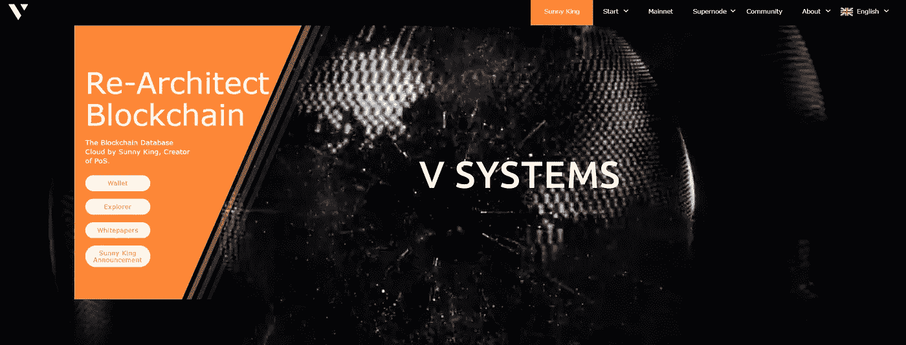
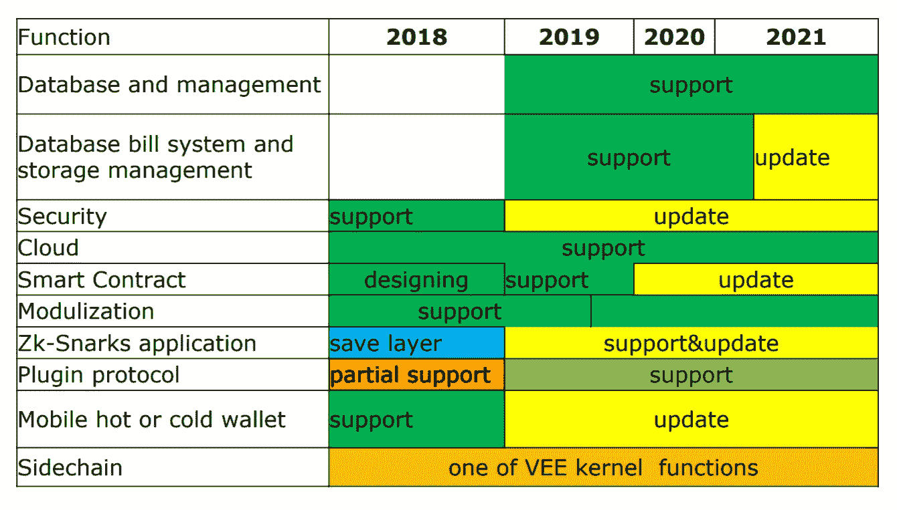
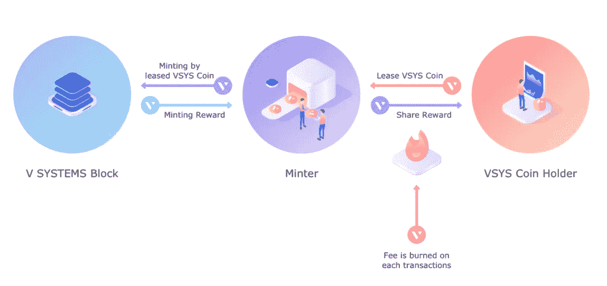
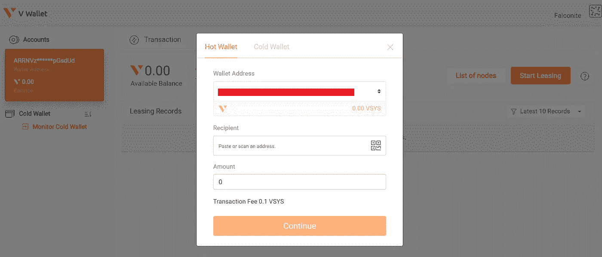

# 新数字经济的去中心化区块链数据库和 DApp 平台

> 原文：<https://medium.com/hackernoon/v-systems-decentralized-blockchain-databse-and-dapp-platform-for-the-new-digital-economy-3994e0f1df16>

比特币最初的构想是基于公共账本或区块链的点对点电子分散支付系统。开发者很快意识到区块链的范围远远超出了适度的支付服务。Vitalik Buterin 将其视为一个平台，在这个平台上可以使用智能合约编写去中心化应用程序(DApps ),并将以太坊带入生活，从而开创了区块链项目的新时代。区块链技术的另一个应用是分布式数据系统。就像我们使用谷歌云和亚马逊 AWS 这样的集中式数据系统一样，经过一些优化，区块链可以用作分散式数据库。 [V Systems](https://v.systems/pdf/vsystechevo.pdf) 是区块链数据库云项目和 DApp 平台，旨在为新的数字经济创建通用分布式数据库。该项目基于一种全新的共识方法，称为超级节点利害关系证明(SPoS)，由著名的 PoS 算法背后的大脑 Sunny King 开发。

网址: [*点击这里*](https://v.systems/)

电报: [*在此加入*](https://t.me/VSYSOfficialGroup)

v 系统白皮书: [*阅读此处*](https://v.systems/pdf/vsyswhitepaper.pdf)

SPoS 白皮书: [*阅读此处*](https://v.systems/pdf/sposwhitepaper.pdf)

**比特币作为去中心化数据库？**

我想到的一个明显的问题是，为什么比特币区块链本身不能作为一个去中心化的数据库？好吧，比特币最初并不是被创造出来充当数据库的！每个事务使用的数据大约为 100 字节，最大块大小被 Nakamoto 自己限制在 [1 MB，大约每 10 分钟产生一个新块。这种限制是有意引入的，因为数据使用量的增加会与系统性能发生冲突。曾经有人试图增加最大块大小，但是所有这些努力都导致了大量的](https://cointelegraph.com/news/satoshis-best-kept-secret-why-is-there-a-1-mb-limit-to-bitcoin-block-size)[心脏灼伤和硬分叉](https://en.wikipedia.org/wiki/Bitcoin_Cash)！

这里的另一个问题是，在目前的形式下，比特币是不可扩展的。如今，比特币网络每秒处理不到 10 笔交易(TPS)。对于每个事务，网络中的每个节点都必须完整地验证新的区块链状态。如果数据使用量增加，要么需要升级所有节点，要么导致已经很低的系统吞吐量大幅下降。不幸的是，像“闪电网络”和“T2 安全网”这样的升级努力收效甚微。

**战俘问题**

比特币选择的共识算法是[工作证明](https://cointelegraph.com/explained/proof-of-work-explained)，或 PoW。比特币区块链中的节点(称为*矿工*)解决密码难题，以验证交易并创建新的区块，在此过程中保持网络安全。在这个过程中，计算能力被消耗，首先解决难题的矿工将获得新*开采的*比特币。[解谜难度随时间增加](https://www.digitaltrends.com/computing/bitcoin-10-years-of-mining-from-genesis-block-to-asic-and-beyond/)；换句话说，需要更多的计算能力(或 [*散列率*](https://www.btcwires.com/glossary/hash-rate-or-hash-power/) ),导致消耗更多的电力。虽然 10 年前人们可以使用最便宜的笔记本电脑开采比特币，但今天需要特殊的专用集成电路(ASIC)处理器。事实上，单个 ASIC 处理器的哈希速率在今天也是不够的，迫使矿工们将他们硬件的哈希速率结合起来，形成所谓的 [*采矿池*](https://en.wikipedia.org/wiki/Mining_pool) 。

这种功耗越来越令人头疼。目前，比特币矿工每年消耗的能源在 [22 TWh](https://www.economist.com/the-economist-explains/2018/07/09/why-bitcoin-uses-so-much-energy) 左右，几乎与爱尔兰的电力消耗持平。而且随着比特币挖矿难度随着时间的增加，这个数字只会越来越大。此外，形成矿池的趋势倾向于集中整个生态系统，这打击了比特币赖以建立的基本价值。任何[积累超过 51%](https://www.ccn.com/bitmains-mining-pools-now-control-nearly-51-percent-of-the-bitcoin-hashrate) 哈希能力的矿池最终都可以按照自己的喜好修改比特币区块链！

**进入晴王**

PoW 的高能量消耗是一个必要的祸害，因为发动 51%攻击所需的巨大散列功率是潜在阻止攻击者的因素。然而，一直有反对战俘浪费本质的声音。一个这样的声音属于[阳光大王](https://en.everybodywiki.com/Sunny_King)。许多人可能不熟悉这个名字，特别是因为这个化名背后的人保持着一个隐居的角色，主要通过公共论坛进行交流。King 是[利害关系证明](https://github.com/ethereum/wiki/wiki/Proof-of-Stake-FAQ) (PoS)共识算法的开发者。他被认为是区块链空间的传奇人物之一。事实上，布特林甚至称他为[“最具原创性的 altcoin 开发者”](https://talk.peercoin.net/t/transcript-of-sunny-king-interview-with-vitalik-buterin-from-bitcoinmagazine/463)。2012 年推出的 Peercoin 是第一种采用 PoS 的数字货币。今天，Neo，EOS，Cardano 和其他一些加密货币使用 PoS。而以太坊也在通过 [Casper](https://blockgeeks.com/guides/ethereum-casper/) 升级实现向 PoS 的转移。

在 PoS 中，节点(称为*铸币商*)向网络存放(或*入股*)硬币，并在创建新块时赚取铸币费。以伪随机方式选择下一个区块的创建者，这取决于下注的代币的数量。这种随机化防止了集中化；否则，具有最多令牌的节点将总是块创建者。一般认为，节点的风险越大，该节点就越有可能希望网络保持安全。如果一个节点有欺诈行为，则该节点标记的所有令牌都将被没收。

PoS 系统中 51%的攻击需要 51%的区块链硬币。这将是一件极其昂贵的事情，因为任何这样的购买活动都会抬高象征性的价格。此外，由于铸币费的收入与投入的硬币数量成正比，因此没有额外的动机加入矿池。最后，由于不需要耗费大量能源硬件，PoS 比 power 更节能。PoS 也有其公平的问题，如[利益研磨和无利害关系问题](https://github.com/ethereum/wiki/wiki/Proof-of-Stake-FAQ#how-does-validator-selection-work-and-what-is-stake-grinding)，但这些都已通过算法的更新得到解决。

**SPoS——下一代 PoS**

与代码更新相关的问题很容易解决，但是当涉及到硬件问题时，它就成了一个主要的争论点。这就是 PoS 今天面临的克星。区块链网络不断增长的性能需求要求节点具备更好的硬件。然而，并非所有节点都有足够的动力进行升级。这会导致整个网络受损。另一个问题是，虽然平均块生成时间是固定的，但单个块实际上可能需要更长时间。最好保持块生成恒定，以确保稳定的系统性能。

这些问题促使 Sunny King 开发了 SPoS 算法。虽然 PoS 允许任何计算机铸造硬币，但 SPoS 要求 ***超级节点*** 具有更高的内存、带宽和处理能力。超级节点处理事务的速度比普通节点快得多，这使得 spo 更具可伸缩性。普通节点可以*将他们的硬币租赁给*超级节点，超级节点反过来将这些硬币作为赌注来赚取铸造奖励。然后，奖励按比例分配给股东。因为只有超级节点才能进行制造，所以这里可以保持一个恒定的制造间隔。通常，每分钟提供 60 个制造槽，并且超级节点在制造新块之前必须拥有一个制造槽。挑战者超节点对铸造槽的竞争也是允许的。这种冗余确保了如果某些超级节点突然出现故障，系统性能不会受到影响。

这种租赁硬币(也称为*或*)的想法最初来自 Peercoin 时代，涉及两个独立的密钥——一个*铸造密钥*和一个*花费密钥*。铸造密钥保持在线，允许铸造者签署新铸造的块；实际上“拥有”股份的支出密钥被安全地离线保存。这允许节点在不放弃所有权的情况下租赁它们的硬币，但这也鼓励了矿池的创建。这实际上也是今天反对 SPoS 的最大论据之一。**

**金对这一困境的解决方案包括向所有超级节点提供 ***同等的铸造权*** 。股权所有者将倾向于将硬币租赁给支付更多的超级节点，由于其恒定的铸造产量，这种额外的租赁将降低特定超级节点的租赁率。该机制在所有超节点的租用率之间保持平衡。所有超级节点的硬件要求也通过社区努力实现了标准化，这确保了没有哪个超级节点最终会比其他超级节点更强大。**

**SPoS 还实现了所谓的 ***股权流动性*** ，在这里，铸币者和股权所有人都可以随时花费或转移赌注硬币。这鼓励更多的节点参与到网络中，提高了整体安全性。不利的一面是，这可能会导致*忙争用攻击*，在这种情况下，股份所有者可能会试图快速移动股份，以要求多个铸造槽。为了应对这一点，当投标铸造槽时，使用账户的平均铸造余额**来迫使赌注在账户中停留一定的最小时间量。****

****介绍 V 系统****

**2019 年 1 月 11 日，Sunny King [推出了](https://bitcointalk.org/index.php?topic=5095844.0) V Systems，作为第一个实施 SPoS 的项目。King 以首席架构师的身份参与这个项目已经一年多了。他们的主要目标是成为一个**分布式数据库基础设施**，在此基础上可以低成本开发新的区块链和区块链应用程序。他们认为，区块链的未来需要多个特定应用的区块链，而不是一个单一的区块链来统治它们。单个区块链将受到可伸缩性的限制，不提供应用程序级的隔离，并且在多个应用程序之间共享资源时会妨碍资源的正确利用。V Systems 将通过其**去中心化云平台**和**用户友好的模块化开发平台**为组织提供定制的区块链解决方案，供开发者即时创建区块链和 DApps，而无需担心复杂耗时的代码。**

**多亏了 spo，他们的平台具有高度可伸缩性和低成本。将向超级节点提供足够的激励来根据需要不断升级硬件，以支持 DApps 的大规模增长。V Systems 也在开发下一代智能合约，因为当前的智能合约难以扩展且缺乏安全性。他们的 main-net 将在今年晚些时候推出智能合同和 DApps 开发平台功能。目前，他们将支持以太坊和 EOS 智能合约。**企业 dapp**也将在其分散数据库平台上得到支持，智能合约具有完整的隐私保护层，确保区块链透明，但数据保持私密。最后，V Systems 的长期愿景还包括一个**分散式移动互联网网络**，它将包括对手机用户的浏览器支持。**

****

**VSYS Function Roadmap**

**V 系统[区块链探索者](https://explorer.v.systems/)显示每 4 秒钟就有新的区块生成。 [VSYS](https://coinmarketcap.com/currencies/v-systems/) 是他们区块链的本币。硬币总供应量在 51.4 亿左右。它们用于支付网络交易费用，也用于租赁和铸造。区块链上的每一笔交易都会导致虚拟系统的烧毁和随之而来的通货紧缩。访问 V Systems 网络上的 DApps 以及利用分散式云数据库上的资源的支付也将通过 VSYS coins 完成。2019 年 3 月 27 日，总部位于香港的 ZB/BW/ZBG 交易所在其 project launchpad 平台上联合推出了 VSYS 的销售。超过 300，000 名 KYC 用户参与了销售，销售在不到 10 秒钟内结束。截至 2019 年 4 月 18 日，VSYS 在全球[交易所](https://www.v.systems/start.html)的交易价格约为 launchpad 价格的 6 倍。EOS 目前市值近 50 亿美元，可能是他们在区块链市场最大的竞争对手。**

****V 系统超级节点网络上的 Minting****

**V Systems 现在有 15 个超级节点在运行，还有一些备用超级节点。新的超级节点在备份部分列出，如果他们设法获得大量的租赁硬币，他们就会被提升为活跃的超级节点。如前所述，当用户将他们的硬币出租给超级节点时，他们的平均铸造余额(AMB)增加，从而他们可以争夺铸造空位并获得铸造奖励。超级节点保留一定比例的奖励作为硬件维护费，剩余部分分给用户。这里需要注意的一点是，容量为 100%的超级节点不会为用户提供造币奖励。**

****

**VSYS Economy Model**

**为了[将硬币](https://vsysrate.com/wiki/vsys-coin-leasing.html)租借给超级节点，用户必须首先创建一个 [V 钱包](https://wallet.v.systems/)。创建钱包后，复制您选择的超级节点的地址，进入您的钱包网页的“租赁”部分，并根据需要输入详细信息。这一部分非常容易和直观的导航，即使是第一次用户应该没有任何困难。**

****

**VSYS Wallet Interface**

**如果这里有额外的帮助，一些解释者的视频可以在他们的官方 Youtube 频道找到。取消租赁也可以通过同一页面完成。一旦**硬币时代**的持续时间结束，大多数超级节点实际上开始给予奖励。简单地说，用户将在租赁交易完成后大约 4 天(准确地说是 86，400 个街区)后开始获得奖励。**

****离别的思念****

**在经历了一年多的加密流放之后，Sunny King 正带领一个由区块链开发者组成的团队降低区块链技术的技术壁垒和进入成本。[集中托管的数据库](http://www.ajes.ro/wp-content/uploads/AJES_article_1_40.pdf)通信成本高，容易被黑客攻击，容易出现单点故障。另一方面，分布式数据库系统具有高并发性、可定制性、高数据安全性和其他附加优势。今天，基于区块链的数据库系统的主要障碍是网络吞吐量低。凭借他们的 SPoS consensus 算法，V Systems 承诺改变这种情况，并使区块链技术更容易为开发者所用。**