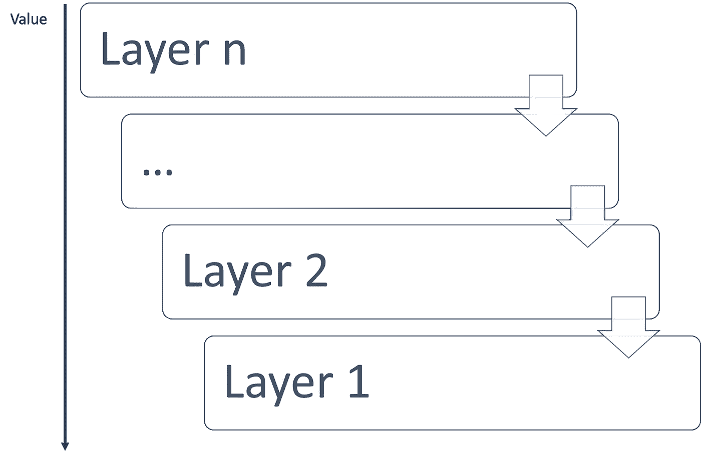
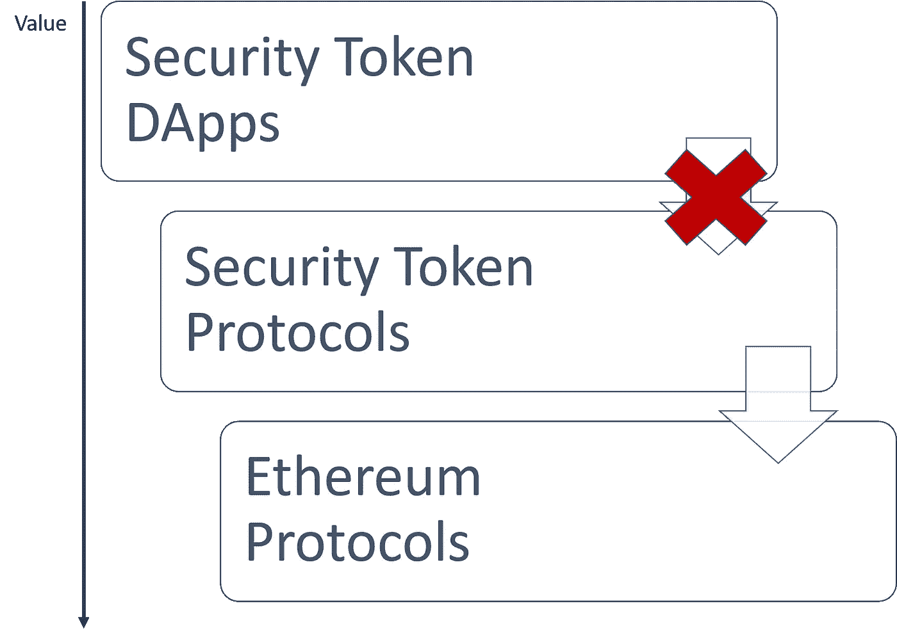

# 值泄漏协议和安全令牌

> 原文：<https://medium.com/hackernoon/value-leaking-protocols-and-security-tokens-789d85638f>

KF

通过协议创造、积累和交换价值是加密生态系统最重要的属性之一。从胖协议到瘦协议，加密网络的动态集中于不同方之间的价值可转移性，这些动态渗透到更高级别的组件，如 DApps。可以说，安全令牌是第一组绕过公共区块链的价值创造架构的区块链协议。在当前一代的安全令牌解决方案中，协议层很少甚至没有捕捉到任何价值，这导致与底层区块链层的摩擦越来越多。我喜欢将这种功能失调的动态称为值泄漏协议，我认为这是安全令牌生态系统面临的最大挑战之一。

Joel Monegro 的 Fat 协议论文成为第一代区块链应用程序的开创性论文之一。如果你读了这篇博客，你就会知道我不同意 fat 协议论文的许多前提，并且我已经写了几篇论文反驳它的一些核心观点。然而，我会是第一个承认 fat 协议思想中有一个重要的子集在区块链生态系统的进化中成立的人。其中一个基本思想是，在区块链应用中，协议层将积累某种形式的价值。*我明确地陈述了“某种形式的价值”,因为我认为较低的协议层将获得最大价值的想法是非常值得怀疑的，并且在技术和经济上是有缺陷的。*从这个角度来看，支持 DApp 的不同协议层将以不同但相关的方式获取价值。例如，在公用令牌传输中创建的值与 ERC20 协议捕获的值有一定的相关性，er C20 协议与以太网创建的值有一定的相关性。

将 fat 协议论文的价值创造思想外推到安全令牌的领域给了我们一个非常奇怪的画面。如今的安全令牌基于 ERC20 标准之上构建的合规协议。然而，安全令牌协议的当前生态系统不提供任何本地机制，既不能捕获在栈的较高层中创建的值，也不能将该值传递给较低层中的区块链协议。在一个奇怪的价值泄漏动态中，由安全令牌应用程序(如市场或交易所*创建的价值通过*协议层泄漏到堆栈的较低层。从这个意义上说，安全令牌协议打破了传统 DApps 的价值创造链。

# 值泄露协议的挑战

到目前为止，您可能想知道安全令牌协议没有获取任何价值有什么大不了的。毕竟，互联网是有史以来最大的软件架构，它依赖的协议不会积累任何形式的价值。然而，互联网和公共区块链应用程序之间的最大区别在于，后者依赖于第一层协议，该协议要求货币交易所进行操作。换句话说，你能想象如果 TCPIP 拥有自己的数字货币，互联网的架构会有多大的不同吗？像安全令牌这样的公共区块链应用不仅是一种技术架构，还是一种价值创造系统，在断裂的价值链上构建价值创造模型是一个非常困难的命题。

想象一下，在一个经济体中，股票市场等层面与基础货币体系脱节。贸易动态将与通货膨胀、通货紧缩、货币贬值等经济运动脱节。你能想象吗？就像是哈耶克、凯恩斯和马克思创造的电子游戏😉

除了疯狂的理论之外，在安全令牌解决方案中，价值链的断裂也带来了一些切实的挑战。

## 错位的价值创造激励

价值泄露协议最明显的挑战是，它们在以太坊这样的第一层网络中的经济激励和更高级别的安全 toke DApps 之间产生了完全的不一致。随着以太坊网络的发展，任何货币政策都会直接影响安全令牌。在理想的生态系统中，安全令牌协议层应该能够在一定程度上调节这种影响。就像美联储可以在不考虑公共证券市场影响的情况下制定货币政策。

## 没有建立安全令牌协议的动机

没有价值创造模型，就没有建立和发展安全令牌协议和网络的动机。最成功的基于以太坊的协议是清晰的激励模型的结果，这些模型与以太坊网络中的潜在价值创造保持一致。有了价值泄露模型，很难想象安全令牌协议会超越孤立供应商的努力。

## 通货膨胀-通货紧缩依赖性

泄漏值的安全令牌协议使得更高级别的安全令牌应用容易受到底层区块链网络的膨胀-收缩动态的影响。更糟糕的是，该漏洞被协议层掩盖，因此没有明确的方法来应对。如果天然气价格上涨，这将对安全令牌交换业务产生影响，但整个交互隐藏在安全令牌协议之后。

## 易受架构变化的影响

很难想象体系结构变化(如等离子体、堆栈验证或分片)会对安全令牌应用程序产生什么影响。但是，可以肯定的是，任何价值创造或交换方面的影响都将直接反映在安全令牌应用程序中，因为中间协议无法控制。从字面上看，安全令牌 DApps 容易受到它们不直接交互的架构层的攻击。

## 随着成长，情况会变得更糟

值泄漏协议是一种随着周围环境的增长而变得更糟的噩梦。在这种情况下，随着以太坊网络和安全令牌生态系统的发展，安全令牌的价值创造模式将变得更具挑战性。鉴于以太坊的增长速度比安全令牌快一个数量级，挑战就更大了。

# 修复泄漏值的安全令牌协议

值泄漏安全令牌协议的挑战远非微不足道，而且似乎没有任何迫在眉睫的解决方案。然而，我想提出一些可能有助于开始辩论的基本想法:

1) **将安全令牌协议与现有的 Ethereum Tier2 协议集成:**将安全令牌协议集成到其他具有明确价值创造模型的 Tier2 协议中，有助于缓解一些价值泄露动态。

2) **在安全令牌协议中引入激励:**显然，如果安全令牌协议找到了引入明确激励机制的方法，这将有助于在该层创建价值模型。

3) **通过开源社区创造价值:**开源技术已经开发出一整套创造价值的剧本，其形式并不直接与堆栈的底层保持一致。围绕安全令牌协议构建强大的社区可能是另一种形式的价值创造。

4) **建立一个不同的网络:**证券创造价值的最激烈形式是建立一个完全不同的网络，不依赖于基础区块链的货币体系。这种努力既有风险又有技术挑战，但却能产生巨大的回报。

为创造和积累价值提供清晰的机制仍然是当前一代安全令牌平台面临的最大挑战之一。如果没有这一点，整个安全令牌生态系统将越来越容易受到底层网络货币动态的影响。我们可能没有胖的安全令牌协议，但某种形式的价值创造会很好。