# VCU 幻想工程师用孢子贴纸回收纸板

> 原文：<https://medium.com/hackernoon/vcu-imagineers-use-spore-stickers-to-recycle-cardboard-earth-hacks-recap-623d1fa56b74>

## 地球黑客概述

弗吉尼亚联邦大学(VCU)是一所位于弗吉尼亚州里士满的公立研究型大学，1 月 26 日至 27 日， [VCU 地球黑客](https://earthhacks.vcu.edu/)事件发生。

[Experimental Civics](https://www.experimentalcivics.io/) 立即成为赞助商，在活动期间举办设计思维研讨会，并提供额外的支持和介绍！*整个团队举办了一场精彩的赛事，值得称赞！*

## VCU 地球黑客的开始

我采访了联合创始人之一的桑吉娜·保罗，询问她为什么支持这项活动:

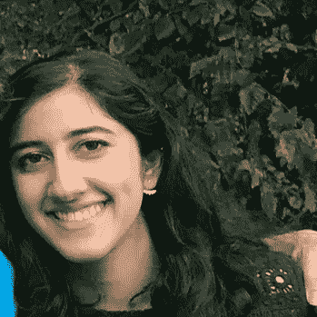

**Sanjana Paul**

> “当我注意到环境问题增加的速度是指数的，而解决这些问题的速度是线性的时，我开始了地球黑客。
> 
> 我过去参加过黑客马拉松，我知道在这些活动中，会发生快速创新，通常需要几个月才能实现的项目在 24 小时内就可以完成工作原型。
> 
> 在参加黑客马拉松时，我发现提交给参与者解决的问题类型通常范围非常有限，而且似乎没有解决迫切的需求。
> 
> 这让我和我的团队意识到，没有人真正将黑客马拉松创新模式应用于环境问题，我们做到了，创造了地球黑客。"

## 黑客马拉松 2019 主题

今年的三大主题是:

1.  企业可持续发展

2.公共卫生、生物技术和医疗废物

3.能量效率

这里有一个[链接](https://earthhacks2019.devpost.com/submissions?ref_content=winner_announcement_email&ref_feature=engagement&ref_medium=email&utm_campaign=winner_announcement_email&utm_medium=email&utm_source=winner_announcement_email?)到 DevPost 来访问 22 个提交的项目！

## 谁参加了？

147 名注册参与者参加了今年的地球黑客大会。

12 所不同的大学参加了此次活动，出席人数最多的是 VCU 大学、乔治梅森大学和弗吉尼亚大学。

在 125 名选择回答性别问题的参与者中，45 名是女性，80 名是男性。

参加 Earth Hacks 的专业分类如下图所示:

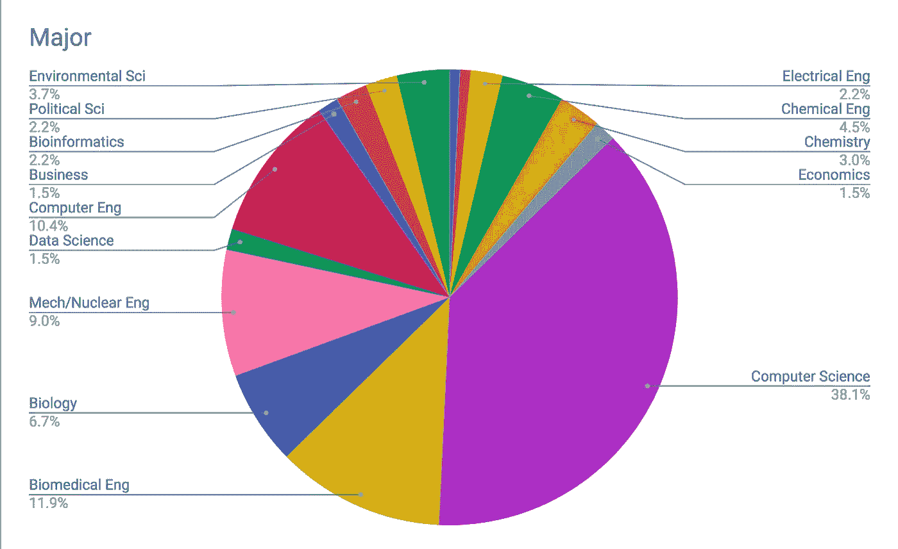

参加 Earth Hacks 的学生在大学期间的详细情况如下图所示:

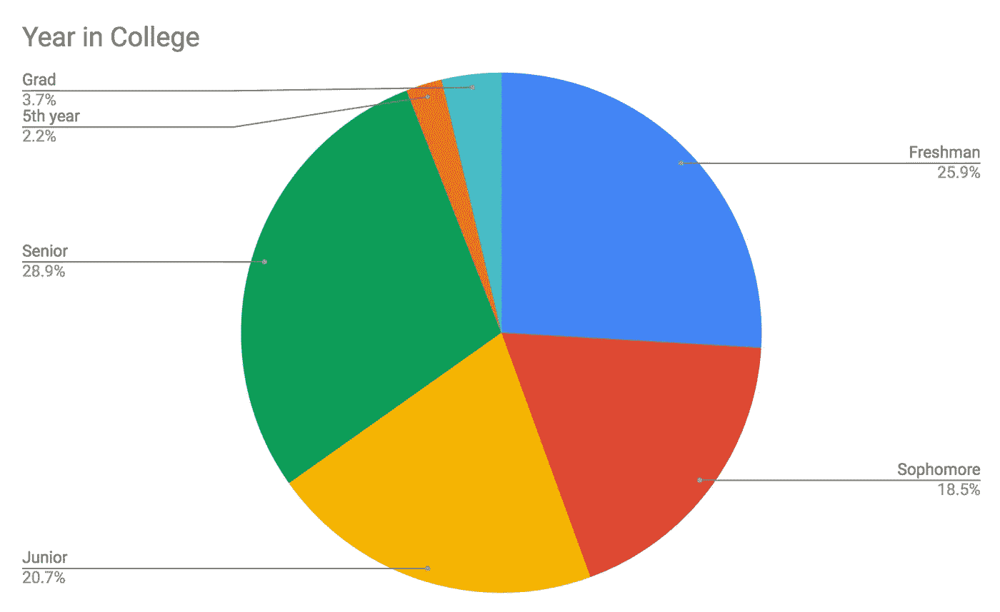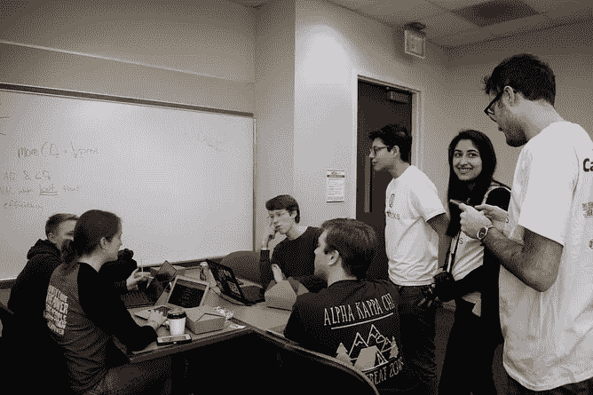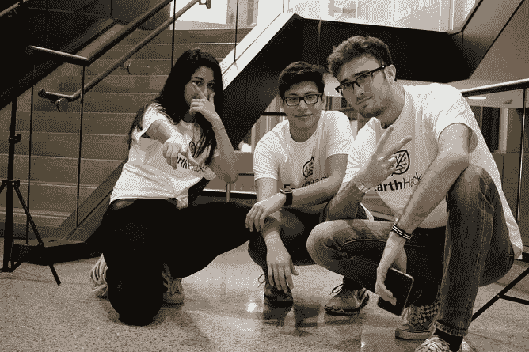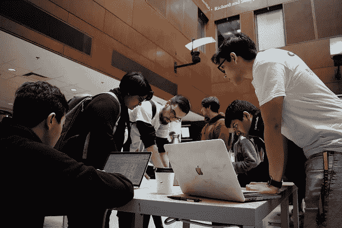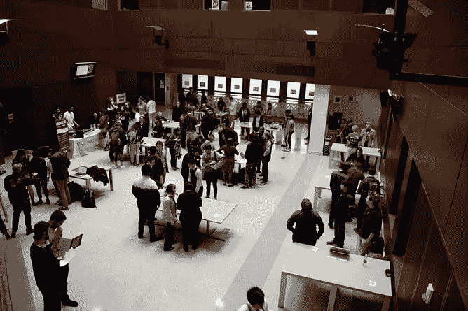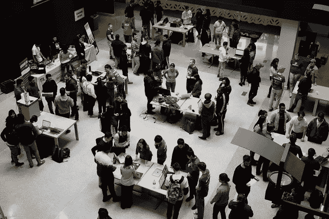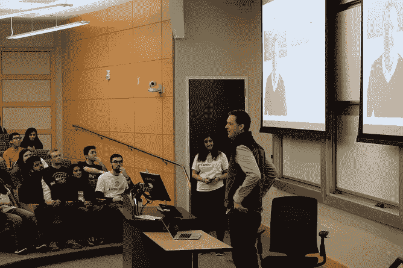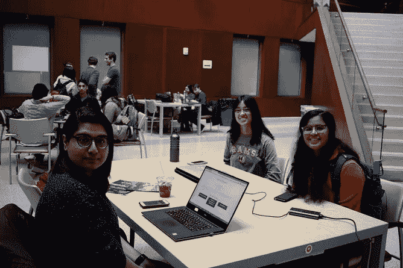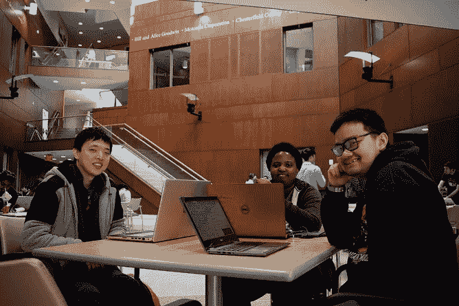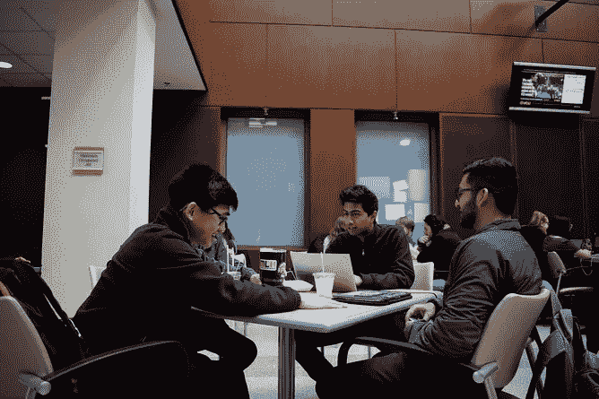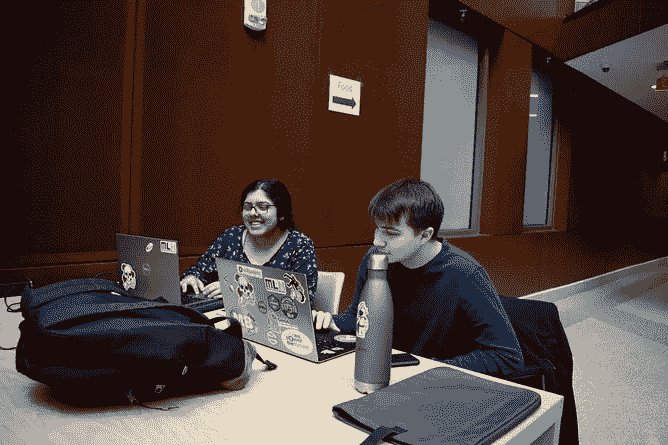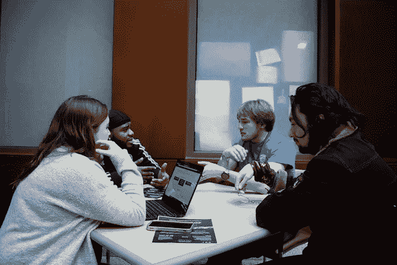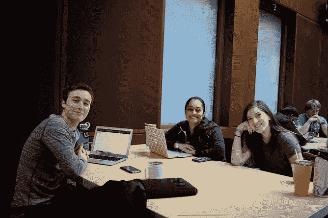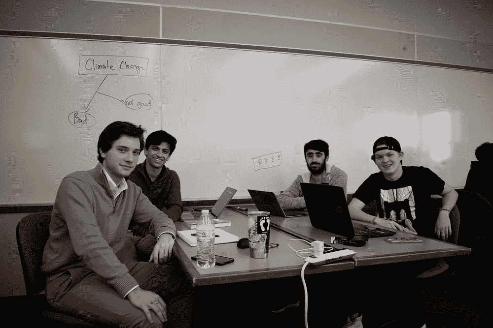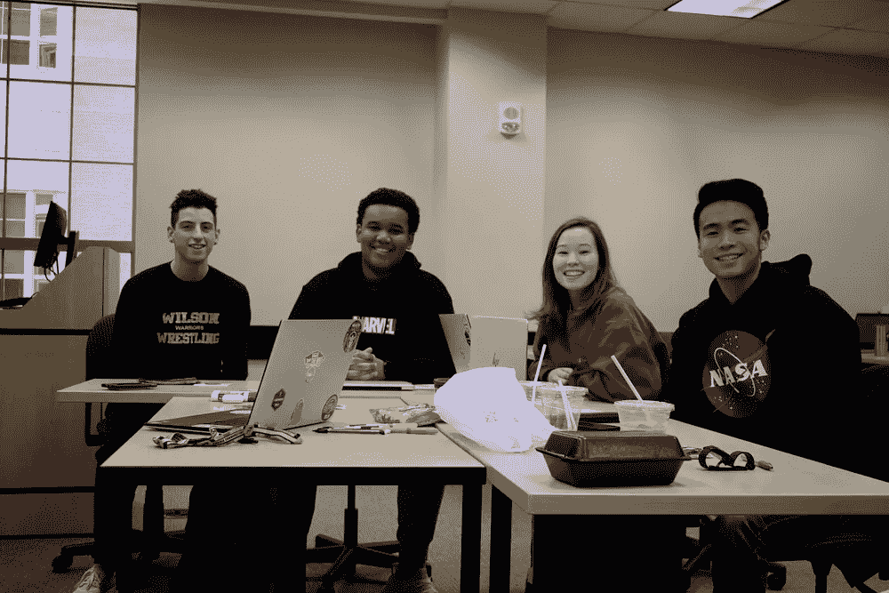

Credit: Earth Hacks

## 导师大喊

导师是任何黑客马拉松的重要组成部分，我在周末的活动中采访了 VCU 大学化学和生命科学工程系的 Stephen S. Fong 副教授博士，并询问了他关于导师的体验:

**Stephen S. Fong, Ph.D.**

> EarthHacks 是有意开发的，包括广泛的背景和专业知识，因此，对于新的和经验丰富的黑客来说，最初的挑战是确定 EarthHacks 项目的结果应该是什么样子。
> 
> 简而言之，我们希望强调一种可靠的解决问题的方法，在这种方法中，团队可以识别和阐明对他们来说重要的问题，并通过描述关键方面和已尝试的现有方法来展示对该领域的理解。
> 
> 每个团队应该能够描述他们方法的独特性，延伸目标是用足够的细节来发展他们的想法，使他们的项目是可操作的(能够实施)。
> 
> 核心挑战的一部分是我们喜欢为大思考(非传统的想法)提供背景，但是因为我们都想要现实世界的影响，可行性方面也很重要。

## 黑客马拉松项目

以下是本次活动中值得强调的一些获奖者:

## **罗斯**

**团队成员:**科琳·福利，丽贝卡·杨格曼，莫丽·盖恩斯

**两句话简介:** ROSS 是一款重新设计的开源智能手机传感器，有助于减少电子垃圾，促进社区发展。ROSS 帮助全球各地的社区引入他们所在社区的开源数据，并推动这些城镇朝着成为智能城市的目标迈进，而无需付出重大代价。

**试玩链接:**[https://devpost.com/software/ross](https://devpost.com/software/ross)

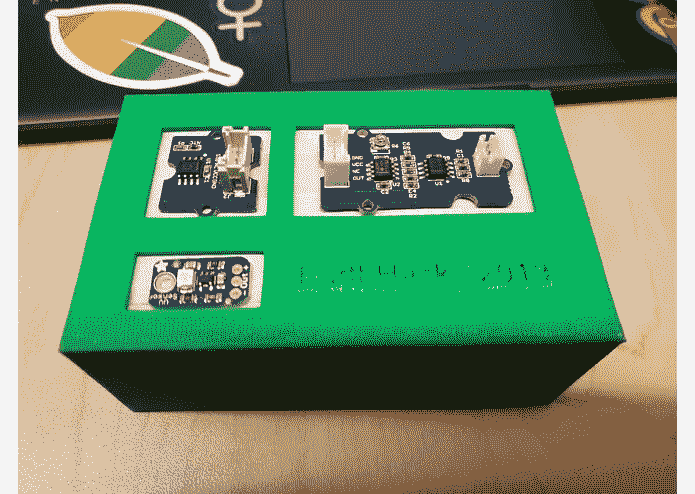

## **孢子贴纸(我们的 Exp_Civics 最爱！)**

**团队成员:**泰勒·邓肯、比纳尔·帕特尔、特伦特·杰克逊

**两句话生物:**真菌修复是生物修复的一种形式，利用真菌降解或隔离环境中的污染物的过程。允许纸板作为蘑菇在垃圾填埋场生长的介质，从而加速纸板盒分解所需的时间。

**试玩链接:**[https://devpost.com/software/spore-sticker](https://devpost.com/software/spore-sticker)

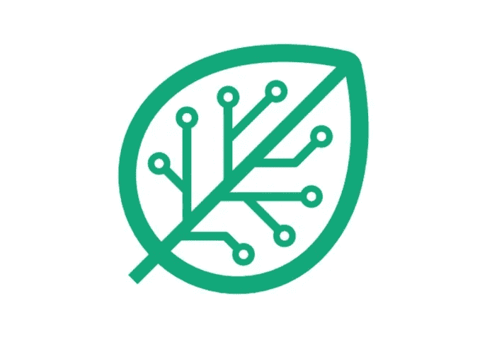

Earth Hacks Logo

## **罗赫**

团队成员:托马斯·戈登、查尔斯洛根·帕勒姆、基肖尔·巴特、索哈姆·阿普特

**两句话简介:**为了降低充斥着花里胡哨的智能温控器通常难以承受的价格，我们能够提供一款智能温控器，预计其性能超过能效测试，同时保持适中的零售价格。Rohe 通过利用嵌入式 WiFi 芯片提供精确的室内定位，消除了对数字接口的需求，从而提高了能效，并为用户大幅削减了成本。

**试玩链接:**【https://devpost.com/software/the-green-machine-wc5fe6 

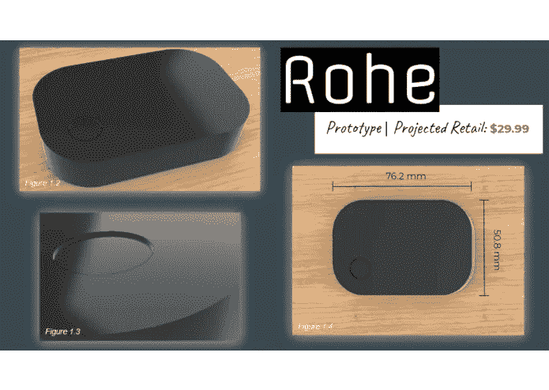

## **碳**

团队成员: Aliyah Desautels，Anthony Milositz，Jarrod Burrowes，Raymond Hang

**两句话的生物:**该应用程序还使用激励措施来增加人们对降低驾驶造成的碳足迹的兴趣。这将有助于通过将收集到的数据与无障碍技术联系起来，并创建一个网络来吸引不同类型的用户，从而提高人们的认识

**试玩链接:**[https://devpost.com/software/carbon-2tiax0](https://devpost.com/software/carbon-2tiax0)

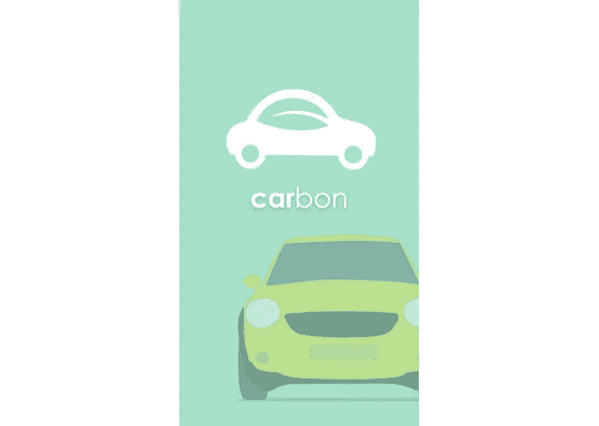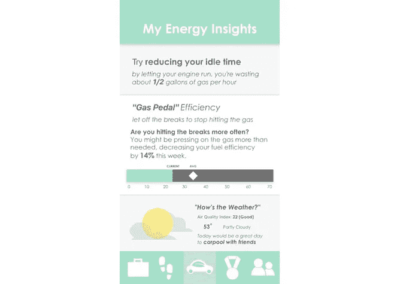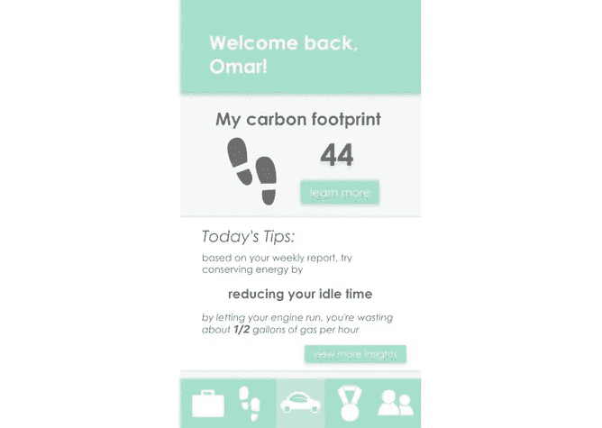

## **清洁条纹**

**团队成员:**艾玛·麦卡米、尼克·阿格利亚诺、西恩·麦克德莫特、康纳·马萨罗

**两句话简介:**我们的项目通过一个易于使用、易于实施的积分收集系统来促进可持续生活。我们围绕工作场所的绿色习惯设计了 CleanStreak，希望这些习惯不仅仅是免费乘坐 Lyft 的一种方式，而是有助于在工作内外形成健康、持久的习惯。

**试玩链接:【https://devpost.com/software/earthhacks】T22**

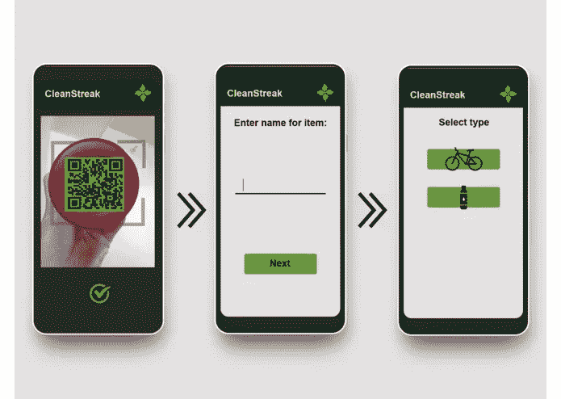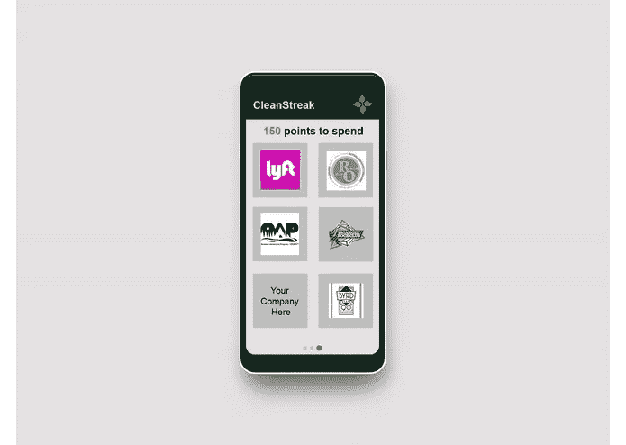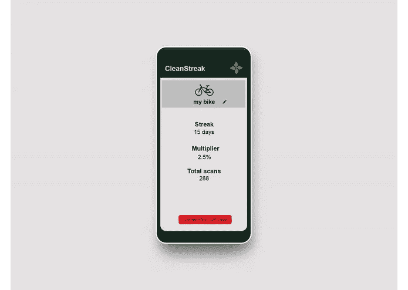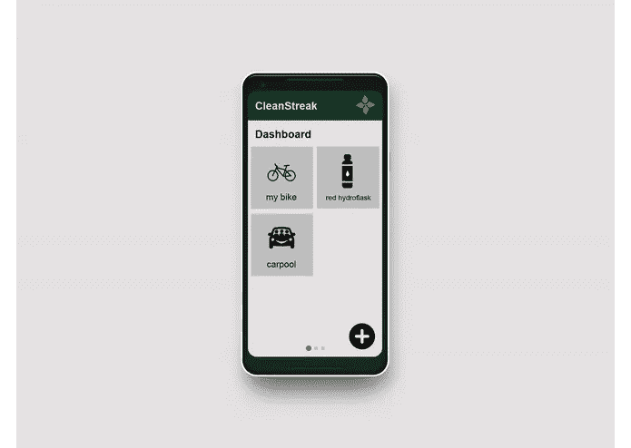

所以你有它！这些都是在短时间内完成的令人惊叹的项目！恭喜所有参与者。

## 后续步骤

像往常一样，如果你需要黑客马拉松的支持，给我们实验公民喊一声，我们这里有丰富的咨询技巧和成熟的模板来帮助提升你的影响和表现。

如果你是一名 VCU 的学生，一定要把这个活动记到明年，也许你甚至可以志愿贡献你的时间来完成它！

分享牛逼的给我们加标签: [**@** Exp_Civics](https://twitter.com/Exp_Civics) 或者[**@**earthhacksvcu](https://twitter.com/earthhacksvcu)