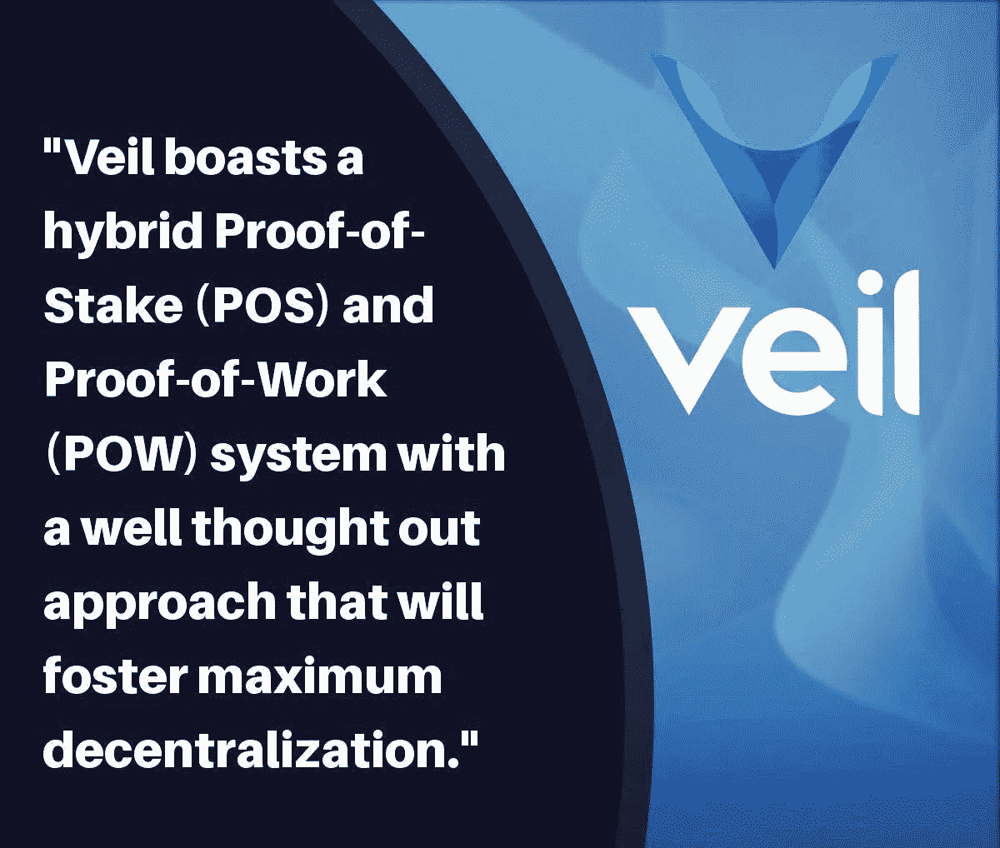

# 将加密交易中的隐私提升到一个新的高度

> 原文：<https://medium.com/hackernoon/veil-taking-privacy-in-crypto-transactions-to-the-next-level-14b49c7af800>

地球上的每一个活着的灵魂都有权并且愿意在他或她做的任何事情上拥有专属的不受约束的隐私权。隐私权是自由的标志之一，事实上，隐私权在显示一个人的尊严、感情和观点受到尊重和保障方面大有帮助。在金融界，不管是有组织的还是无组织的，隐私都是非常重要的，尤其是涉及到大量金钱的时候。

没有人会喜欢在交易之前或之后向公众宣布他的数十亿或数百万美元的商业交易…..可能只有精神不稳定或缺乏安全感的人才会这样做。在传统的金融机构中，至少对于所述金融机构的外部人员或非工作人员来说，隐私被保持在一定程度上。

然而，一个人在这些传统金融机构中的金融活动仍然可以被这些金融机构的雇员篡改，因为他们的客户通过他们进行金融活动，因此他们(金融机构雇员)保留交易记录…..因此，一个人的财务记录隐私仍然处于危险之中。近十年来，金融格局已经被重塑，并见证了金融科技创新带来的巨大转变。

非常感谢数字和互联网技术。加密货币创新是金融科技的一个分支，它真正重新定义了金融交易的方式。加密货币开发背后的意图之一是巩固政府控制的金融机构的金融自由，同时也增强个人进行无信任匿名和以隐私为导向的金融交易的自由和权利。

**揭开面纱**
从事金融交易时，隐私和匿名非常重要；尽管隐私和匿名可以被视为与区块链技术的透明规定相矛盾。另一方面，为了增加区块链网络的安全措施，隐私和匿名问题永远不能被忽视或低估。

在大多数区块链网络的交易中支持用户的隐私是不完全的，也就是说，在允许某种程度的隐私的当代区块链网络上，有一些特征可以用来挖掘用户的交易历史和身份。考虑到这一点，为了进一步巩固加密交易中的匿名和隐私，面纱加密货币将在其区块链上实现完全和恒定的零身份和匿名加密交易。

当使用面纱加密货币交易时，您的交易历史和公共地址对区块链网络的公共链是隐藏的；这种事务细节封装是在加密发送方和接收方完成的。

通过隐藏交易方的财务历史，与交易过程中所涉及的那些人的钱包活动有关的敏感信息被保护起来，并且不让根据 Veil 的区块链协议进行交易或操作的其他人接触到，为了实现这一点，Veil 协议采用了 Zerocoin 算法技术，该技术确保用户的交易历史和身份远离公共链。

面纱加密货币在实现其隐私交易中吸收的另一项技术是使用 RingCT 算法，该算法有助于隐藏发送者“A”在其区块链网络上发送给接收者“B”的加密货币的实际数量。通过使发送的实际金额仅对相关的交易方可见，增强了用户的安全性和隐私，因为在区块链网络上与交易无关的其他人实际上看不到被转移的实际金额。

因此，保护攻击通常转移大量加密货币的用户钱包的野心的问题被减少到最低限度。

**Veil 的特性**
Veil 并行运行利益一致性算法证明和工作一致性算法证明。有了 Veil 采用的这种一致同意的方法，无法负担工作证明的能量需求的矿工可以使用他们的加密货币来进行开采，因为它是在利益一致同意证明中获得的。

另一方面，工作证明将确保那些拥有深厚“加密货币钱包”的人不会劫持整个共识进程，并将从中获得的所有奖励独吞。工作证明确保基于节点解决验证交易所需的计算的能力来公平地执行验证记录和获得奖励的权利。

与其他寻求外部支持以维护其隐私加密交易解决方案的区块链网络相反，Veil cryptocurrency 拥有一个内部研发团队，致力于开发正确的隐私和匿名加密交易公式，而不改变其区块链网络的高性能指数。

面纱队

# 结论

面纱加密货币依靠自助和可靠的资金来源进行项目开发、营销和研究等，因此它不依赖 ICO 基金来实现其项目开发目标。

有关面纱加密货币的更多信息，请随意访问下面列出的链接:

网址:[https://veil-project.com/](https://veil-project.com/)

推特:[https://twitter.com/projectveil](https://twitter.com/projectveil)