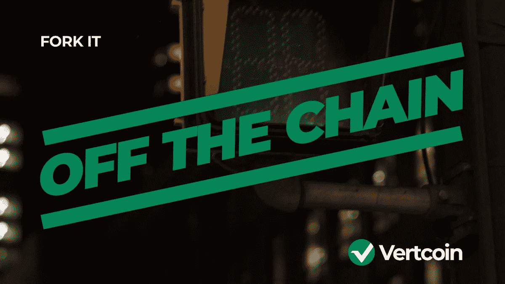

# Vertcoin 将努力对抗 ASIC 威胁

> 原文：<https://medium.com/hackernoon/vertcoin-will-hardfork-against-asic-threat-2dfecac6ea73>

## 由于 ASICs 对 Vertcoin 网络构成的威胁，Vertcoin 正在转向其当前算法的调整版本。这种分叉将有助于保护网络，同时恢复矿工的盈利能力。分叉的直接原因是 ASICs 的可用性和采矿外包能力带来的威胁。

# **分叉的动机是什么？**

Vertcoin 基于这样一种观点，即使用商用硬件进行挖掘是确保分散式网络的最佳方式。这反过来又创造了一个网络，在这个网络中，共识和经济激励都发生在用户层面。为 Vertcoins 算法设计的 ASICs 威胁到了这一愿景。

随着 2018 年接近尾声，Vertcoin 网络上引入了 ASICs。这不仅降低了使用商品硬件参与共识的利润，还降低了网络攻击的门槛。这导致了[在区块链的几次袭击](/@vertcoinman1/a-response-from-a-contributor-double-spends-a48288448384)。这个攻击就是臭名昭著的 51%攻击。

> 对区块链的 51%的攻击可以由一群矿工组织，甚至可以由一个人在一个优势池上组织。一个资金池可以试图控制超过 50%的网络 hashrate，这给了他们阻止新交易获得确认的可能性，允许他们暂停交易所和用户之间的支付，他们可能有能力撤销交易。同样重要的是要注意，51%的攻击不能让你失去硬币的所有权。

就在 ASICs 在网络上变得活跃之前，Vertcoin 的开发人员在名为 [Verthash](/vertcoin-blog/vertcoin-development-update-october-2018-d052210ae07f) 的算法上取得了很大进展。然而，在 Verthash 完工之前，ASICs 就来了，用 hashrate 充斥了 hashrate 租赁市场。这威胁到网络的完整性，作为回应，开发人员决定调整现有算法以提供短期解决方案是有用的。

# 算法是如何变化的？

Vertcoin 使用一种称为 Lyra2REv2 的哈希算法，该算法由 Vertcoin 开发者在 2015 年开发，其想法是可以改变某些参数，使现有的 ASICs 变得无用。由于其 GPU 友好/ASIC 抵抗属性，该算法也被一些加密货币(Mona，Verge)使用。

然而，随着新的 ASICs Lyra2REv2 被有效地接管，Vertcoin 与 ASIC 的斗争继续进行 **Lyra2REv3** 。

Lyra2REv3 是对 Lyra2REv2 算法的修改。它与 v2 的不同之处主要在于随机行选择的方法以及组成它的算法和算法顺序。

[see more — https://www.youtube.com/watch?v=FsdH_zbswvo](https://www.youtube.com/watch?v=FsdH_zbswvo)

# 叉子什么时候出现？

计划在区块 1080000 进行硬分叉。由于 Vertcoin 块时间为 2.5 分钟，因此分叉日期大约在[2019 年 2 月 2 日](https://wenvtcfork.xyz/)左右。一个友好的社区成员创建了一个倒计时叉:【https://wenvtcfork.xyz/。

Vertcoin 网络的所有用户都需要将他们的钱包更新到最新版本，可以在这里找到:( [Vertcoin Core V0.14.0](https://github.com/vertcoin-project/vertcoin-core/releases/tag/0.14.0) )

# Vertcoin 计划如何防范未来的威胁？

Vertcoin 仍在研究一种新的算法，能够更有效地抵御 hashrate 外包。在直接的 ASIC 威胁得到缓解后，开发人员可以继续专注于构建 Verthash，这是一种既能抵抗 ASIC 又能抵抗 hashrate 外包的算法。