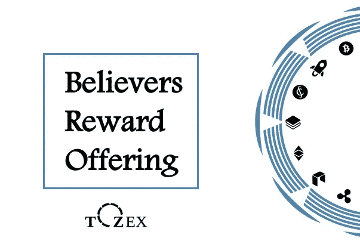

# ICOs 的可行替代方案——引入“信徒奖励计划”(BRO)

> 原文：<https://medium.com/hackernoon/viable-alternative-to-icos-introduction-of-the-believers-reward-offering-bro-7efbdbe0c25f>

tozex.io

区块链技术正在从根本上改变价值交换的方式，代币是其核心。自 2017 年以来，我们看到了一个强大的基于令牌的筹款机制的爆发式增长:首次硬币发行(以下简称“ICO”)。

ICO 包括提议购买代币以交换加密货币(例如:BTC 或 ETH)或补偿实现有利于项目的特定行动(推广、审计、测试等……)。代币发行允许从全球投资者筹集资金，以便为产品或服务的开发提供资金。

ICOs 的日益成功揭示了它作为筹资方式的吸引力。然而，对于项目业主和投资者来说，ico 仍然面临着挑战性的问题。

# ICO 有哪些问题？

首先，项目所有人不可避免地遭受主要投资者在加密资产交易所正式挂牌后推动的抽水和倾倒现象。在绝大多数 ICO 中，由于 ICO 众筹期间给予的重要奖金，token price 很可能永远不会返回其初始值，并降低项目本身的吸引力。目前投资者之间没有平等待遇。

其次，加密货币(如 BTC 或 ETH)的高波动性为投资者和项目所有者都提供了不确定性，看看熊市期间破坏性的破产效应，投资者暴露于用于投资的加密货币的波动性，并面临初始投资资本的侵蚀。从项目业主的角度来看，由于易变性，以加密货币筹集的资金数额会不时变化，这是公司资金管理的一个问题。波动性削弱了筹资方式的结构。

第三，目前大多数 ico 在竞选期间都是在不透明的情况下进行的，没有公布智能合同地址。投资者无法核实代币的总供应量及其正确分布。此外，他们不能实时检查筹集的金额，以防止 FOMO/FUD 效应和虚假陈述。更重要的是，智能合约通过保证初始交易在未来不会被修改来提供双方之间的信任，这也允许验证没有隐藏的交易。

不幸的是，目前的 ICOs 机制不鼓励项目业主和投资者之间的利益一致，并为双方提供了不确定性。这就是为什么我们设计了一个全新的基于代币的筹款机制，叫做“信徒奖励祭”

# 兄弟有什么新鲜事？

**“信徒奖励计划”(BRO)** 旨在提供一种可持续的替代最初硬币发行的方式，作为一种新的基于代币的筹资机制。BRO 通过对所有被称为“信徒”的贡献者提供平等待遇，允许大幅减少泵送和倾倒现象，限制波动性，促进增长。

> 怎么会？

BRO 允许公司通过**一笔加密货币贷款来为其发展融资。**投资者将与**共同出资**，如**、【戴】**，他们将获得**利息和收益**作为项目信托的补充红利。他们将在 **12 到 18 个月**之间每季度获得一个专用代币(贷款期限将取决于借款金额)。贷款的所有条件都是透明和明确的。它们被编码在智能合同上。报销和付款中没有恶意的空间。付款是自动的，反映了最初的交易。

> 我们如何限制用于支付利息和资本偿还的代币的波动性？

首先，代币分布将通过季度分布随着时间推移而稀释。

其次，每笔个人贷款的起始日期都不相同，这意味着参与者不会在同一时间收到令牌。实际上，起始日期的计算将取决于供款人借入金额的日期。作为一种新的筹资方式，我们更适合成为第一个提出这种方式的项目。我们的筹款活动将持续 3 个月(如果时间太短，无法达到筹款目标，可能会更长)。

第三，我们建立了奖金奖励机制，这是一种鼓励长期持有代币的方式，为那些不出售代币并持有代币的投资者提供额外奖励。

最后，当你将稳定币用于投资、随着时间的推移稀释代币分配并为持有提供奖励时，BRO 提供了一种可持续的新融资方式，而不会遭受 ico 存在的挑战性问题。此外，每一个参与这个筹款活动的捐助者都会知道这个过程，这意味着这个项目只会吸引真正相信你的项目的人，而不是垃圾。

像兄弟一样，我们认为项目业主和投资者是同一个家庭的一部分，必须分享家庭发展的愿景。

在接下来的几周内，我们将提供更多关于我们协议的信息。通过我们的社交媒体[关注我们，加入这场新的革命。](https://twitter.com/tozexofficial)

## 在你走之前…

*如果你喜欢这个故事，请随意*👏👏👏*几次，这样其他人也能享受。谢谢:)*