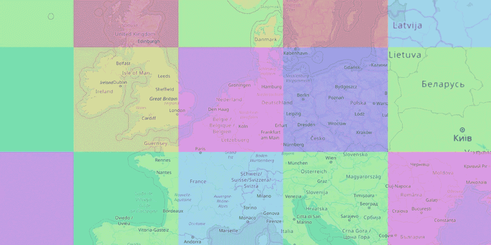
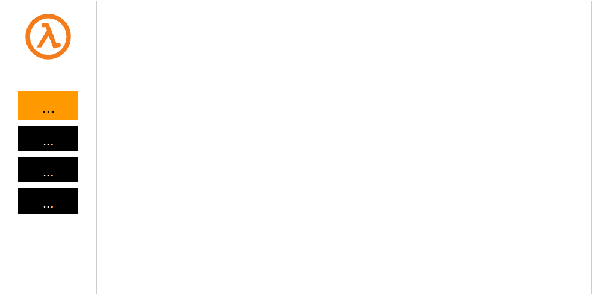
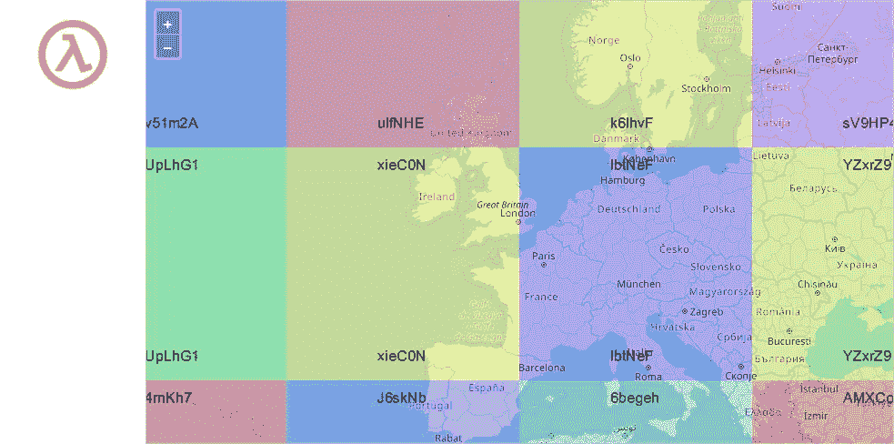
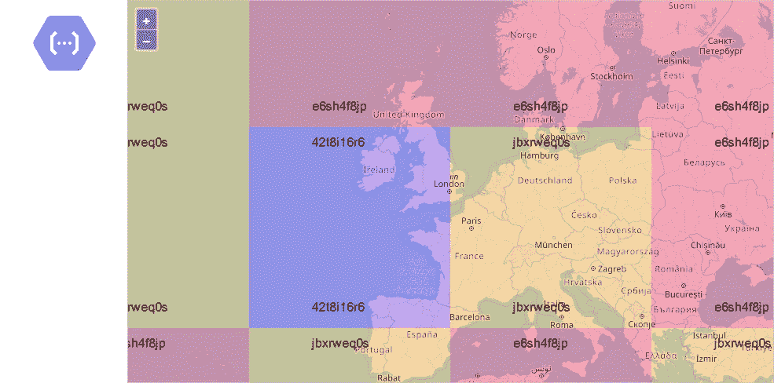
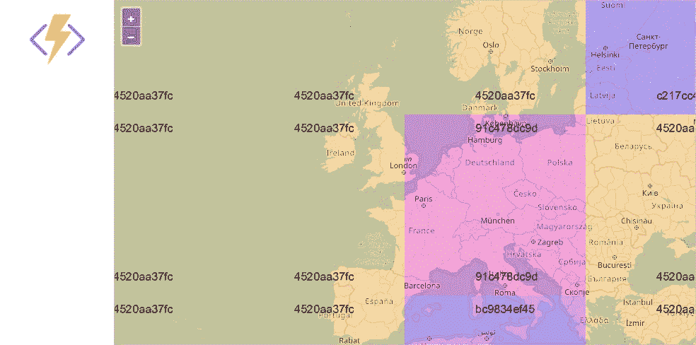

# 可视化冷启动

> 原文：<https://medium.com/hackernoon/visualizing-cold-starts-ddb7c3267419>

我[写了很多](https://mikhail.io/serverless/coldstarts/)关于无服务器功能的冷启动。这些文章充满了图表和数字，希望有用，但可能很难消化。我决定想出一个视觉上表现感冒开始的方法。

我创建了服务于地理地图的 HTTP 函数(地图信用[开放街道地图](https://www.openstreetmap.org/))。地图是小方块的组合；每个单幅图块为 256 x256 像素。我选择的地图视图由 12 个图块组成，因此向无服务器函数发出 12 个请求来加载单个视图。

在每个实验中，我加载地图，然后放大三次。第一个视图击中了处于冷状态的功能。随后，缩放的视图从温暖功能加载。地图旁边有一个计时器，显示从开始到最后一个图块到达所经过的总时间。

# 冷启动可视化

所有功能都在 Node.js 中实现，运行在地理上离我最近的地区(西欧)。

这些函数从云存储(AWS S3、 [Google](https://hackernoon.com/tagged/google) 云存储和 Azure Blob 存储)加载地图切片。因此，启动时加载 SDK 和存储读取延迟会增加持续时间。

## 自动气象站λ

以下 GIF 影片是针对 AWS Lambda 的实验记录:

Map loads from AWS Lambda backend

冷视图的加载时间为 1.9 秒，而热视图的加载时间在 200 到 600 毫秒之间。这种区别相当明显，但并不令人讨厌:第一个负载感觉起来像一个小的网络故障。

## 谷歌云功能

这张 GIF 展示了针对谷歌云功能的实验:

Map loads from Google Cloud Functions backend

加载初始视图比 AWS 多花了一秒钟。这不是一个交易破坏者，但 3 秒钟的延迟通常被认为是心理上的重要因素。

瓷砖似乎越来越多地出现；请阅读下面的更多内容。

## Azure 函数

这是另一部电影，这次是关于 Azure 函数的:

Map loads from Azure Functions backend

正如我之前发布的测量结果所预期的那样，Azure 函数的启动时间要长得多。用户有足够的时间开始怀疑地图是否损坏。

我希望用 C#实现的函数会有更好的结果，但这不是苹果与苹果之间的比较。

# 提供商如何处理并行请求？

map 控件并行发出 12 个请求。所有函数都使用 HTTP/2，因此旧的连接数限制不再适用。让我们比较一下这些并行请求是如何处理的。

## 自动气象站λ

AWS Lambda 的每个实例一次可以处理一个请求。因此，我们不是只进行一次冷启动，而是同时进行 12 次冷启动。为了说明这一点，我修改了函数，根据 Lambda 实例 ID 对每个图块进行颜色编码，并将 ID 打印在图像上:

AWS Lambda provisioned 12 instances to serve 12 requests in parallel

实际上，测量的持续时间代表了 12 个并行请求中最慢的*的往返时间。这不是冷启动的平均或中间持续时间。*

## 谷歌云功能

谷歌使用相同的每个实例执行一次的模型，所以我预计 GCP 云函数的行为与 AWS Lambda 完全相同。然而，我错了:

Google Cloud Function provisioned 3 instances to serve 12 parallel requests

只创建了三个实例，其中两个处理多个请求。看起来像是 GCP 序列化了传入的请求，并通过有限的实例集传播它们。

## Azure 函数

Azure 函数有不同的设计:函数的每个实例可以同时处理多个并行请求。因此，理论上，冷启动后创建的第一个实例可以服务所有 12 个瓦片。

实际上，会创建多个实例。这幅画看起来很像 GCP:

Azure Function provisioned 4 instances to serve 12 parallel requests

有四个活动实例，但同一实例处理了 12 个请求中的 9 个。这种行为在多次运行之间似乎相当一致。

# 结论

我希望这些可视化有助于更好地理解无服务器功能的冷启动。

然而，它们只是例子。不要将这些数字视为特定云提供商的精确统计数据。如果你很好奇，可以在[无服务器冷启动](https://mikhail.io/serverless/coldstarts/)系列文章中了解更多。

更新:函数源代码可用: [AWS Lambda](https://github.com/mikhailshilkov/cloudbench/tree/master/aws/http/jsmaptiles) 、 [Google Cloud 函数](https://github.com/mikhailshilkov/cloudbench/tree/master/gcp/http/jsmaptiles)、 [Azure 函数](https://github.com/mikhailshilkov/cloudbench/tree/master/azure/http/v2/jsmaptiles)。

*最初发表于*[*Mikhail . io*](https://mikhail.io/2019/03/visualizing-cold-starts/)*。*