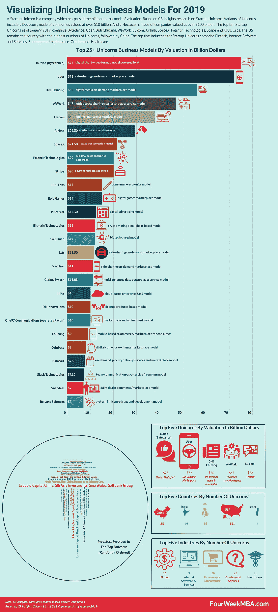

# 可视化 2019 年独角兽公司

> 原文：<https://medium.com/hackernoon/visualizing-unicorns-companies-for-2019-2fef4c0bde40>

*A* ***创业独角兽*** *是一家估值突破十亿美元大关的公司。基于 CB Insights 对创业独角兽的研究。独角兽的变体包括由估值超过 100 亿美元的公司组成的十角公司。和一个由价值超过 1000 亿美元的公司组成的大家族。*

*截至 2019 年 1 月，十大创业独角兽包括字节跳动、Lu.com、优步、滴滴出行、WeWork、*[*Airbnb*](https://fourweekmba.com/airbnb-business-model-explained/)*、SpaceX、Palantir Technologies、Stripe 和 JUUL Labs。美国仍然是独角兽数量最多的国家，其次是中国。创业独角兽的五大行业包括金融科技、互联网软件和服务、电子商务/市场、按需服务和医疗保健。*

# 四周 MBA 独角兽商业模式图所用的方法

对商业模式进行分类不是一件简单的事情，商业模式是由许多可移动的部分组成的。用一个单一的特性或特征来表现一家公司太简单了。

定义商业模式有几种方法。每个课程都旨在理解一家公司如何运作，以及它的引擎如何运转。这个引擎是由关键合作伙伴、资源、流程和公司如何赚钱等因素构成的。

这些方法始于对公司是什么以及关注哪些方面的假设。因此，任何对商业模式进行分类的尝试都可能不够完整。

因为这篇文章的缘故，我将为每一个商业模式贴上一个标签，挑选出我认为目前最适合这个组织的成分。目的是为你提供尽可能多的商业见解，或者至少激发你对这些组织的好奇心。

像任何标签系统一样，它有许多局限性。就像给一个人贴上标签是简化，给一个复杂的组织贴上标签更是简化。

重要的是要注意到这不是一门科学。商业战略本身是由关于世界如何运转的假设构成的。在我看来，企业家的角色是尽快在现实世界中检验这些假设。当这些假设被证明是错误的，我们称之为“失败”

然而在现实中，这些都是对当时世界的反馈。例如，一个想法对世界来说可能太早而不能被接受，一个试图将其推向市场的企业家将会失败。

重要的是要注意到，复杂的组织(想想[亚马逊](https://fourweekmba.com/amazon-business-model/)、[谷歌](https://fourweekmba.com/how-does-google-make-money/)和[微软](https://fourweekmba.com/microsoft-business-model/))并不依赖于单一的[商业模式](https://fourweekmba.com/60-business-model-patterns/)，而是将它们结合在一起，创造了一个能够获得长期竞争优势的独特组织。

例如，[亚马逊采用多种模式](https://fourweekmba.com/amazon-business-model/)，从基于订阅的模式，到云即服务，再到在线商店、第三方商店等等。

虽然这对于较大的组织来说是真实的，但是经过多年的整合；对于较小的组织或独角兽创业公司来说，一个更简单的商业模式可以让他们的估值达到 10 亿美元。

我尽最大努力给每只独角兽贴上正确的标签，这是 2019 年 FourWeekMBA 独角兽[商业模式](https://fourweekmba.com/what-is-a-business-model/)的一部分。这个标签包含了该公司在产品和盈利方面的主要特征。

这些独角兽来自 CB Insights 的 311 家公司名单。

我希望你喜欢它，并从中获得尽可能多的见解！

# 2019 年四周 MBA 独角兽商业模式

*   [**【字节跳动】商业模式**](https://fourweekmba.com/tiktok-business-model/):AI 驱动的数字短视频格式模式
*   [**优步商业模式**](https://fourweekmba.com/uber-business-model/) :拼车按需市场模式
*   **滴滴出行商业模式**:数字媒体点播市场模式
*   **WeWork 商业模式**:办公空间共享/房地产即服务模式
*   **Lu.com 商业模式**:在线金融市场模式
*   **:电子商务/按需家庭共享市场模式**
*   ****SpaceX 商业模式**:太空运输模式**
*   ****Palantir Technologies 商业模式**:基于大数据的企业 SaaS 模式**
*   ****条纹商业模式**:支付市场模式**
*   **JUUL 实验室的商业模式:消费电子产品模式**
*   ****史诗游戏商业模式**:数字游戏市场模式**
*   ****Pinterest 商业模式**:数字广告模式**
*   ****比特大陆技术公司的商业模式**:基于区块链的加密采矿模式**
*   ****虚拟商业模式**:基于生物技术的模式**
*   ****Lyft 商业模式:**拼车按需市场模式**
*   ****GrabTaxi 商业模式**:拼车按需市场模式**
*   ****全球交换机业务模式**:多租户数据中心即服务模式**
*   ****Infor 商业模式**:基于云的企业 SaaS 模式**
*   ****DJI 创新商业模式**:基于无人机产品的模式**
*   **One97 Communications(运营 Paytm)商业模式:市场和虚拟银行模式**
*   ****Coupang 商业模式**:基于移动的电子商务/消费品市场**
*   ****比特币基地商业模式**:数字货币交易市场模式**
*   ****Instacart 商业模式**:按需杂货配送服务和市场模式**
*   ****Slack Technologies 商业模式**:团队沟通即服务免费增值模式**
*   ****Snapdeal 商业模式**:日常交易电子商务/市场模式**
*   ****Roivant Sciences 商业模式**:生物技术许可药物和开发模式**

***其他 60 种* [*商业模式 FourWeekMBA 与身体质量指数实验室*](https://fourweekmba.com/60-business-model-patterns/) *合作整理。***

***原载于 2019 年 1 月 19 日*[*fourweekmba.com*](https://fourweekmba.com/unicorns-business-models/)*。***