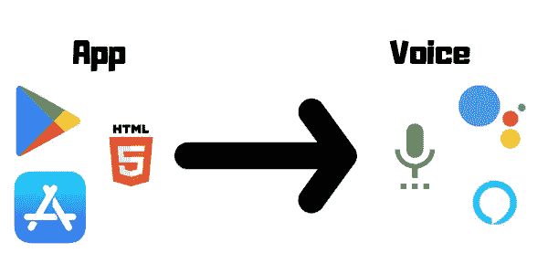
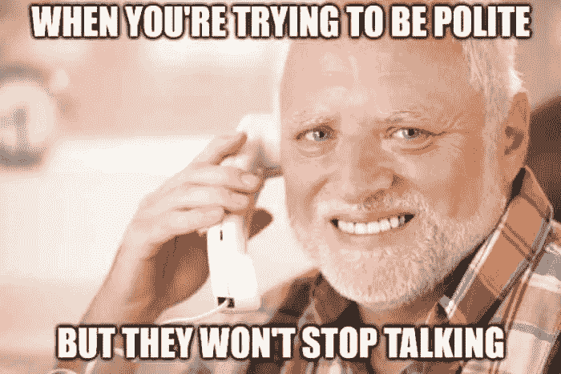

# 声音洪亮！你的 App 配得上语音版吗？

> 原文：<https://medium.com/hackernoon/voice-is-booming-does-your-app-deserve-a-voice-version-880300880bf9>

## 5 个小测试来决定你是否需要一个语音应用

语音似乎是市场上最值得关注的机会之一。仅在美国，就有 24%的家庭拥有至少一台智能音箱(谷歌/亚马逊)，这意味着 8000 万潜在用户。

这个数字一直在急剧增长(你可以在这里阅读更多和[这里](https://amitbend.com/chatbots/2018/07/23/amazon-alexa-vs-google-assistant)

你可能会看着这些数据，心想，“嗯...我应该建立一个语音应用程序”。事实是，语音可能非常适合您的应用程序，但也可能非常糟糕，这取决于使用案例或场景。

## 但是怎么做呢？

那么怎么评价呢？我想出了一个有趣、简单的方法来做到这一点，不管你是独立开发者还是代表企业——一个游戏！

或者更具体一点，为你的应用做一个个性测试。

# **游戏规则:**

让我们把你的用例放入几个测试中，在一些测试中，它可以获得分数，但对其他人来说也可能会丢分。

*   如果通过了测试，将这个数字加(+)到你的总数中
*   如果失败，减去(-)
*   你会在每个测试的标题中找到该加/减多少
*   在一些测试中，你只能获得分数——那些标题中没有“-”符号的人

所以让我们抓起一张纸(或打开记事本)开始吧！

# 游戏:

**#1 摩擦测试** *(+/- _ 分)*

这是**对您的用例的**基本测试，它只是关于计数动作——就这么简单。

> 计算用户在传统用户界面中需要做的动作数量。(网络/应用程序)
> 
> 用它在语音用户界面中必须做的动作数减去(-)它

基于语音的界面有一个很大的优势——用户只需一句话就能触发一个复杂的动作。

例如，使用银行语音助手:

*“从 12 月 15 日起我的余额是多少，不包括任何外币**？”*

—“您在 12 月 15 日的余额是 1，000，001 美元”

在传统的用户界面(网络)中，你可能需要:

1.  谷歌你的银行名称，并进入他们的网站
2.  登录您的帐户
3.  选择平衡菜单
4.  第页至 2015 年 12 月
5.  过滤外币

累人。不是吗？

Yeah. I know how you feel

因此，在语音用户界面中，我们计算了 1 个动作，而在传统用户界面中，总共有 5 个动作！

在这种情况下，将会有 5–1 = 4 个额外动作(！)

*   正如我所说，这是一个至关重要的测试，所以每一个额外的行动算作 2 分！
*   因为这是流程中最基本的测试，我们会对每个动作计数两次
*   在我们的例子中，我们将添加 4*2 = **8 个点**。

更准确地说，测量你的应用程序的“快乐路径”和“错误路径”,并将它们与传统的用户界面进行比较。

此外，与较短的动作相比，你对较长的动作(如搜索、浏览和排序)给予不同的权重。

**#2《忙碌的双手》测试** *(+3 分)*

> 如果在一个典型的场景中，你的用户的手被占用或休息，这可能是你的语音应用程序的一个很大的优势。

这方面的一些例子是:

*   开车、走路、跑步
*   一位带着孩子的母亲
*   在厨房准备食物
*   躺在床上

我最常用的语音命令之一是在我的 Chromecast 上控制网飞。

说实话，我就是懒得拿起手机，打开 app，想做什么就做什么。我更喜欢让我的谷歌助手“*扮演缉毒警察”。*(不要评价我😅)

Typical lazy Netflix user

**#3“狭窄场景”测试***(±4 分)*

这是每个对话界面的另一个核心原则——语音或聊天。

> 用户的期望与你的语音应用能力一致吗？

在语音应用程序中，你眼前没有菜单或有组织的类别，因此，当用户接近语音聊天时，她需要知道它通常能做什么。

否则，她可能会要求你意想不到的事情，也不想支持。这可能会导致你对语音应用程序的失望和误用。

所以你需要问自己“这个场景够窄吗？(还是开放式的？)".请记住，这不是你的期望，而是用户第一次接近它时的期望。

**示例:**

*   **狭义—** 用于提交汽车保险索赔的语音机器人
*   **开放式**——一款游戏语音机器人
*   **看似狭窄却开放的**——“礼宾语音机器人”

在最后一个例子中，您可以看到，了解**用户在实际场景中如何理解它**是非常重要的。

在我最近关闭的初创公司 *Gooster* 中，我们的产品是“礼宾聊天机器人”(用于推荐、门票等。)，但对用户来说，这个机器人代表了酒店的所有服务，包括预订或任何其他奇怪的问题。(“你能帮我洗袜子吗？”)

**#4 信息过多测试***(±3 分)*

> 能否用简短、简洁的回答来回答用户的问题？

*“好的谷歌，为什么我的 wifi 这么慢？”*

—“干扰也可能是由于另一个电子设备过于靠近无线路由器本身造成的。如果无线路由器位于或非常靠近电视或超低音扬声器或其他电子设备，它可能会造成干扰……”😕

(这是我的谷歌助手的一个长回答的真实例子)

想象你正在和一个不停说话的朋友说话。有件事让你分心了一会儿，突然你不知道他在说什么。

使用语音应用程序，就像正常的对话一样，几乎需要我们作为一个人的全部注意力。当一个人分心时，他会丢失一些信息，所以他可能会让你重复一遍，或者更糟的是，他会迷失在谈话的流程中。

此外，如果你的应用程序给出的信息不是用户所期望的，她可能会一直等到它结束通话。

所以请不要做那个不停说话的朋友。保持你的答案**简短**和**精确**！

**#5 情感测试** *(+2 分)*

> 与语音代理交谈有时会感觉像与人交谈。
> 
> 一个好的语音机器人不仅能传递数据，还能点燃情感。💓

如果你的保险语音应用程序将拥有你最喜欢的电影明星的个性，那该有多好？或者在一个卖药语音 app 上听到巴勃罗·埃斯科巴(开玩笑😆)

情感是对话中一个强大的工具，实现这一点的最常见方式是赋予你的语音应用**个性。**

然而，一个标志性人物并不总是适合每个行业或企业，例如，如果你的应用程序的一个重要特征是展示一个正式和值得信赖的形象。

# **计算结果**

将这些数字加起来，看看您的使用案例在哪个范围内:

**上图 15**

好极了。你现在处于一个很好的位置，你应该继续前进，明天创建一个语音版本的应用程序。

**15–8**

不错，你的应用程序可能会有语音版本，这至少会让你的一些用户受益，但它可能不会改变你的业务。

**下图** 8

嗯……语音版本可能不适合你的应用。处理用例并**重新进行**测试。有时候小的修正可以带来大的改变！

# 结论

为你的应用程序创建一个语音版本并不容易，我希望你已经从这篇文章中学到了好的语音应用程序的重要原则，现在你的决定更容易了。

➤:如果你喜欢读这本书，给它几个掌声👏👏👏

➤我错过了什么吗？写评论！

特别感谢 Mor Bendor、 [Gilad Dayagi、](https://medium.com/u/54149ee94235?source=post_page-----880300880bf9--------------------------------)[Noam izhaki](https://medium.com/u/42bc2af65df1?source=post_page-----880300880bf9--------------------------------)&[Chen Feldman](https://medium.com/u/7fd5ce501cbd?source=post_page-----880300880bf9--------------------------------)在我写这篇文章的过程中给予我的帮助

Amit Bendor 是一名语音聊天机器人专家，帮助公司创造出色的语音体验。共同主持成功的播客“制作软件”&Gooster 前首席技术官。

【amitbend.com】访问[T5](https://amitbend.com)*了解更多*

