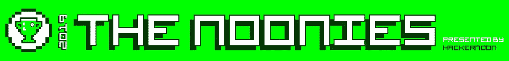

# 现在就为 Hacker Noon 的第一届年度大奖——2019 年# Noonies 投票吧

> 原文：<https://medium.com/hackernoon/vote-now-in-hacker-noons-1st-annual-awards-the-noonies-2019-a5a36114d5cb>

## 你坐下了吗？

现在就投票吧—[noonies.hackernoon.com](http://noonies.hackernoon.com)(还有[在 ProductHunt 上！](https://www.producthunt.com/posts/the-noonies))

## 为了向值得关注的人和产品以及互联网致敬，Hacker Noon 自豪地宣布推出有史以来最环保的年度科技产业奖:[noones 2019](https://noonies.hackernoon.com/)！🏆

> “中午了！是时候投票决定科技领域的重要问题了。年复一年，这些将成为对当今技术领域所有最优秀和最糟糕的人和产品的权威性、国际性和某种程度上的民主认可。”
> 
> ——有人无意中听到 CEO 大卫·斯穆克最近在 Zoom 的全体会议上说

**与**[**Stream**](https://getstream.io/?ref=noonies)**合作推出，今年的 50 个 Noonies 以 Hacker Noon 的三个编辑流为主题:**

— [通用技术](https://noonies.hackernoon.com/#tech)、
— [密码与区块链](https://noonies.hackernoon.com/#blockchain)、
— [软件开发](https://noonies.hackernoon.com/#development)。

## 从今天起 到 8 月 16 日，你每天都可以 [**投票，所以继续吧，设置一个提醒，行使你每天宣布世界科技行业最佳和最差的权利。**](https://noonies.hackernoon.com/)

## 今天在 ProductHunt 上投票。

在投票的第一周，公共奖项提名仍然开放。*注意:您的自定义提名在添加之前需要经过审核。所有获奖名单将于 8 月 21 日公布！*

VOTE NOW: noonies.hackernoon.com

## [点击此处查看完整的奖项和提名名单。](https://hackernoon.com/-89fx38bn)

正午是由[流](https://getstream.io/?ref=noonies)造成的。Stream 简单、强大的可扩展提要和聊天 API 被一些最大、最受欢迎的应用程序所使用。

***愿最好和最差的人和产品胜出！*** [***娜塔莎***](https://hackernoon.com/@natasha) ***从*** [***骇客正午***](http://hackernoon.com)*🤖*