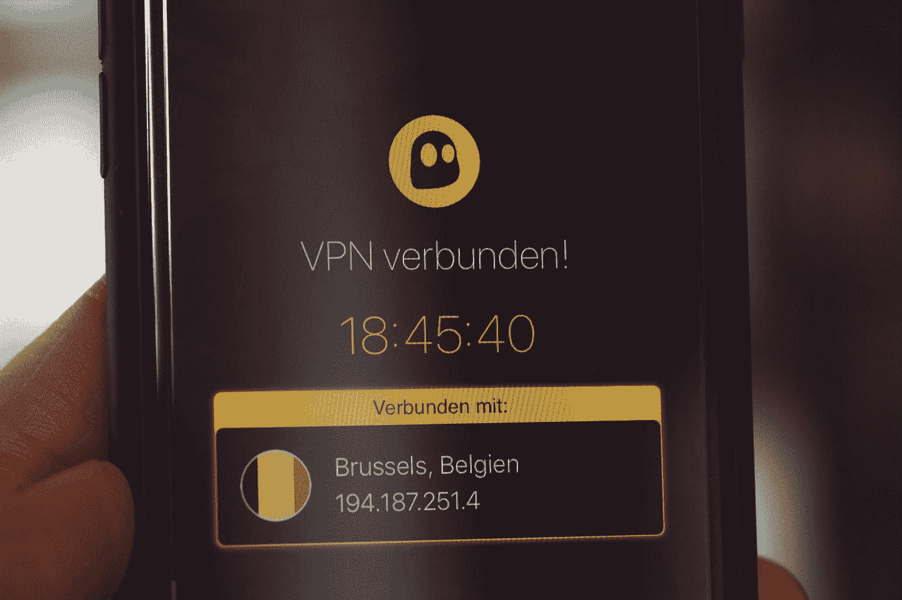

# VPN:现在你看到了我，现在你…仍然这样…

> 原文：<https://medium.com/hackernoon/vpn-now-you-see-me-now-you-still-do-806c50a01fc0>

Photo by [Markus Spiske](https://unsplash.com/@markusspiske?utm_source=medium&utm_medium=referral) on [Unsplash](https://unsplash.com?utm_source=medium&utm_medium=referral)

虚拟专用网络(VPN)已经存在了 20 多年，这段时间足以让它的局限性变得显而易见。然而，许多公司仍然认为，当用户从家里或路上连接到公司网络时，VPN 将保护他们的用户免受隐私侵犯和网络攻击。

很多时候，情况并非如此。是的，VPN *可以*通过加密数据使连接网络和资源更加安全。但它仍然会将活动的 web 代码传递到本地端点，这允许恶意软件和间谍软件渗透，以及第三方的数据渗透和去匿名化。

许多(如果不是大多数的话)VPN 服务在防止网络窥探、数据泄露和有针对性的在线攻击方面装备不良——少数甚至可能积极促进此类活动。从 IT 安全和隐私的角度来看，这意味着什么？我的观点是:VPN 时代到了。

# VPN 的时间到了

要理解我的意思，重要的是要记住 VPN 是如何工作的(当它工作的时候)。VPN 在用户的计算机和一个安全的服务器(例如，在公司网络上)之间建立了一个加密的数据隧道，它也可以作为一个进入网络的跳板。

尽管如此，这种安全隧道还是不够的，因为在大多数情况下，它只是从 web 浏览器连接到这些资源，而这些浏览器固有的安全缺陷使用户暴露在 web 漏洞、数据丢失、本地化和去匿名化的威胁之下。

雪上加霜的是，VPN 会带来延迟，导致生产力下降。VPN 是出了名的慢，用户抱怨它阻碍了关键的工作流程并降低了生产力。依赖于安全的网络使用、一致的访问策略以及用户访问应用和网站时的非归属的组织最能感受到 VPN 的这些缺点。

在考虑 VPN 时，这些标准是否在您的决策中发挥了作用？

*   **隐私、匿名和位置屏蔽:**您希望确保用户的 IP 地址和地理位置完全隐藏，并且您的 IP 地址不会泄露给网站。
*   **针对恶意软件和间谍软件的防护:**您需要在用户和网络之间设置一个隔离层，防止恶意网络代码到达终端设备并危及本地 IT 环境。
*   **可管理性:**您的 CISO 或合规官希望您组织的 VPN 节点能够帮助他们重新控制用户的在线活动以及他们访问 web 和公司网络资源的方式。

这些考虑让你想到 VPN 了吗？如果是这样，再想想。让我解释一下。

# 隐私和匿名:隧道的裂缝

VPN 服务的一个被广泛误解的特性是它们隐藏用户真实身份和位置的能力。是的，在某些情况下——并非所有情况——访问互联网的人可能看起来与他们的实际物理位置完全不同。

后一个特征被证明是有用的，尤其是在进行敏感的在线研究时，例如代表银行、律师事务所或执法机构。例如，反洗钱(AML)研究人员或欺诈调查人员不能冒险将他们的 IP 地址、公司网络信息或位置坐标透露给一个名为“纽约州纽约市 XYZ 银行”的可疑网站

相反，在 VPN“隧道出口”提供机器的信息，VPN 允许用户隐藏这样的信息——但不可靠。VPN 使用的本地浏览器泄露的信息仍然会让对手通过“浏览器指纹”识别用户。要了解更多细节，请查看万维网联盟(WC3)的论文[什么是指纹识别？](https://www.w3.org/2014/strint/papers/41.pdf)【PDF】。

事实上，大多数 VPN 服务都无法提供通过常规检查的伪装。依赖它们会损害用户的工作；例如，web 服务器可能向代理或 VPN 上的用户提供不同的或误导性的内容。对于安全敏感领域的专业研究人员和分析师来说，“现在你看到我，现在你仍然看到我”是不可接受的选择。它将运营安全置于风险之中，并可能导致暴露身份、违反合规性以及不完整或受污染的研究结果。

# 不，VPN 不会阻止恶意软件感染

不言而喻，VPN 不提供针对恶意软件的保护，如键盘记录程序、勒索软件或带有传染性负载的鱼叉式网络钓鱼附件。它只是在通往目的地(您的计算机或网络)的途中对其进行加密。

利用所有混乱的是流氓应用程序和可疑 VPN 服务运营商的制造商。犯罪分子和不择手段的营销人员正试图利用用户合法的安全和隐私顾虑来获利。骗子提供的低价或免费 VPN 应用程序和浏览器插件正在增加新的威胁。

假冒的 VPN 服务被发现在监视不知情的用户，就像 AirBnB 摄像头在度蜜月的人身上爬行。其他人将用户暴露于恶意代码，例如通过在浏览器中注入垃圾广告(“恶意广告”)。

# 在企业中，VPN 的复杂性增加了新的风险

在企业界，甚至合法的 VPN 也给[带来了新的漏洞](https://www.authentic8.com/static/media/uploads/resources/silo_vs_vpn_whitepaper.pdf)。当企业应用部署在不同的位置(现场或公共云中)时，每个应用都可能需要单独的 VPN 网关，需要手动配置。

目前 IT 安全专业人员的短缺加剧了这一挑战。如果策略没有在所有网关上一致地应用，安全性就会受到影响。在一份名为[VPN 不像你想象的那样安全](https://www.akamai.com/uk/en/products/security/enterprise-application-access.jsp)的白皮书中，内容交付网络 Akamai 的研究人员警告说:“VPN 导致分布式企业的安全政策支离破碎。”

就像反病毒解决方案或黑名单/白名单网络资源一样，VPN 只是隐私和网络安全被动方法的又一个例子，在有效性和效率方面没有什么表现。

相反，VPN 的混乱强化了这样一种看法，即当员工访问网络时，IT 实际上很少或根本没有控制到底发生了什么。如果 VPN 不能提供许多人(包括许多 IT 专业人员)所希望的全方位保护，那么未来的路该怎么走？

# VPN 死了。感谢浏览器。

我并不是唯一一个主张 IT 放弃以 VPN 为代表的注定失败的单点解决方案的人。就拿 Akamai 的全球安全总监 Patrick Sullivan 来说吧，他在三月份宣布了 T2 VPN T3 的死亡。沙利文写道:“是时候说再见了。”

我要补充的是，现在也是解决根本问题的时候了——互联网和浏览器固有的安全弱点[和 VPN 的传统致命弱点](https://www.darkreading.com/endpoint/the-architecture-of-the-web-is-unsafe-for-todays-world/a/d-id/1328529)。

如果用户可以通过断开网络连接来防止数据丢失和泄露，同时仍然利用其业务能力，情况会怎样？这正是主要银行和投资公司、领先的律师事务所和政府机构——包括国防部——正在走的路。尤其是在安全和监管要求严格的领域，他们已经重新控制了用户上网时会发生什么。他们的方法是:云中的浏览器隔离。

安全云浏览器技术使组织能够防止数据泄漏和违规，并确保用户保持安全、合规和匿名在线。所有的网络内容都被远程处理，隔离在一个云容器中。

用户得到的是远程浏览器会话的加密显示，而不是 web 代码。远程浏览器实例在会话开始时全新构建，在会话结束时销毁。它不会留下用户网络活动的任何痕迹(如 cookies 或残余代码)。

例如，国防和电子巨头雷神公司选择安全云浏览器技术来保护其全球任务合作伙伴。该公司指出，这一解决方案“消除了网络风险，允许用户利用互联网资源和应用程序进行关键工作流，同时保护他们的数字环境。”

听起来像 VPN 承诺的，但从来没有能够以最快的速度交付。