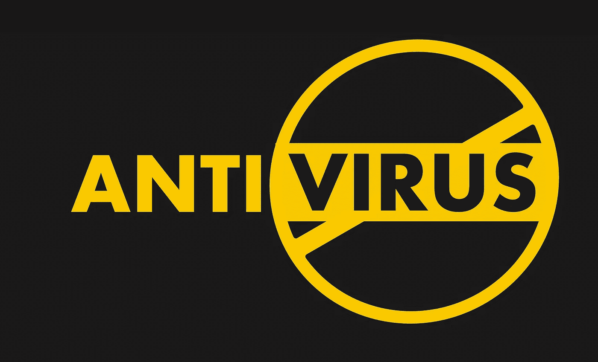
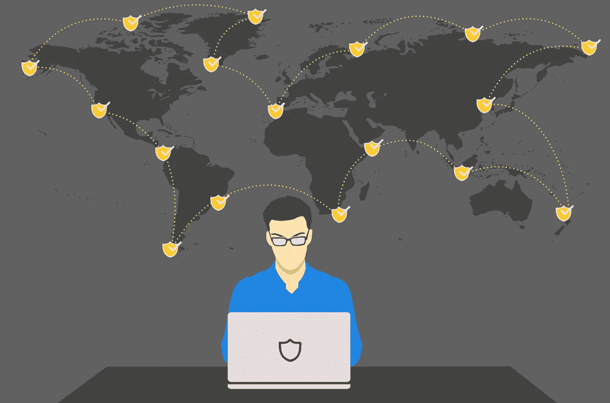

# VPN 与防病毒:哪个是更大的网络安全市场，贵公司需要哪个？

> 原文：<https://medium.com/hackernoon/vpn-vs-antivirus-which-is-a-bigger-cyber-security-market-and-which-does-your-company-need-59aa844526f7>

随着 [**网络安全**](https://searchsecurity.techtarget.com/definition/cybersecurity) 最近风靡一时，从众多承诺提供最佳保护的程序中进行选择变得进退两难。更重要的是，在选择推荐的防病毒软件和坚持用更传统的方法通过 VPN 保护你的计算机之间的选择有更多的限制。

考虑共存的想法是很诱人的，因为它们被设计来提供保护。然而，一旦这两个工具被搁置一旁，你所设想的和平共处就几乎成了泡影。

现在，考虑到竞争，最重要的是找出哪一个最适合你心中的目标。因此，我们挑选了一些技巧，说明哪些技巧在很大程度上受到不断增长的网络安全市场的青睐，以及为什么会这样。

**杀毒软件为你做了什么**

众所周知，杀毒软件在无数场合下拯救了世界；因此，他们在应对威胁方面相当有效。但在我们继续之前，解决一些在线可能面临的威胁是很重要的。

最常见的网络威胁是特洛伊木马——它伪装成有用的应用程序，但实际上是致命的病毒、蠕虫——自我复制，以及引导区病毒。其他一些形式的恶意软件，如 DNS 攻击、黑客攻击、身份盗窃和网络钓鱼诈骗。

因此，假设每次您打开任何文件、网页或新应用程序时，都会有新代码被引入到您设备的处理器中，那么您的设备对这些威胁的敏感度就很高。一个好的防病毒程序会通过扫描你的设备和所有运行的程序来保护你的设备。

一个好的反病毒软件是 [**配备有**](https://www.techrepublic.com/article/10-things-to-look-for-in-an-antivirus-application/) 防火墙、安全套接字层(SSL)监控和站点顾问功能。在一些更高级的防病毒程序中，白名单是额外的特征。

SSL 监控功能可以监控站点和设备连接。有了站点顾问，防病毒程序会指出你访问的站点的安全性——甚至是你的 VPN 网络的可靠性。毕竟 VPN 是要下载的。

然而，随着新形式的恶意软件和网络威胁的出现，即使对于一些领先的反病毒程序来说，跟上这种速度也是最困难的。因此，VPN 经常被留下来负责。

**VPN 如何拯救世界**

事实上，许多反病毒开发人员和公司都竭尽全力倡导在他们的整个保护包中添加 VPN，这表明 VPN 是网络安全可靠性的新定义。

现在，虽然杀毒软件的有效性毋庸置疑，但这些程序并不是专门设计来 [**影响设备到设备的数据加密**](https://www.forbes.com/sites/forbestechcouncil/2018/09/04/vpn-and-antivirus-comparing-cybersecuritys-largest-markets/#287489326874) 。因此，即使你的设备不会被病毒破坏，黑客也不太可能无法通过互联网连接获得你的个人数据。

即便如此，反病毒软件并不是被设计成不定期更新就能运行的，它们也不会鼓励在互联网上匿名。因此，他们可以保护你的手机，审查你的网站，但绝不会隐瞒你的 IP 地址。

[**政府审查**](https://www.theverge.com/2016/11/14/13596974/internet-freedom-decline-global-censorship-facebook-whatsapp) 这些天在市民不常去的地方很流行。这方面的一个例子是禁止访问加密货币网络。VPN 网络会使用隧道技术来加密你的数据，这样所有的数据都会被外人和知名黑客窃取。

更有甚者，一些 VPN 带有高级别的安全措施(即防火墙、站点顾问等)，当然这些措施封装了防病毒程序所做的一些工作。一个好处是，有了最好的 VPN，你可以访问不同国家的大量快速服务器。

一些最好的 VPN 可以让您额外访问多达 90 个国家的 1500 多台快速服务器，这将大大有助于为您的设备提供所需的保护。然而，通过浏览[**VPN 审查列表**](https://thebestvpn.com/) 来检查您打算在您的设备上启动的 VPN 的可信度是很重要的。这样，您将 [**找到满足您需求的最佳 VPN**](https://www.howtogeek.com/221929/how-to-choose-the-best-vpn-service-for-your-needs/)并了解哪些 VPN 在用户数据方面不可靠。

虽然 VPN 市场总体上正在扩大，而且更有吸引力，但运行防病毒程序以获得额外保护也并非完全不合适。请记住，当它们放在一起时，可能会有一些反感，它们不是小的调整不能解决的问题。