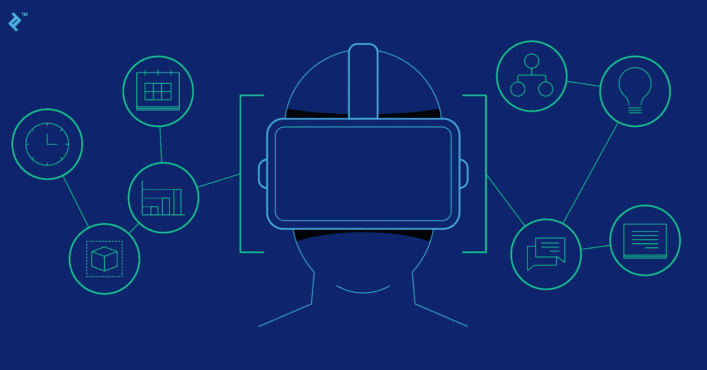
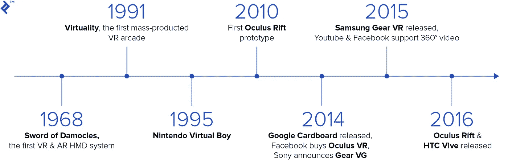
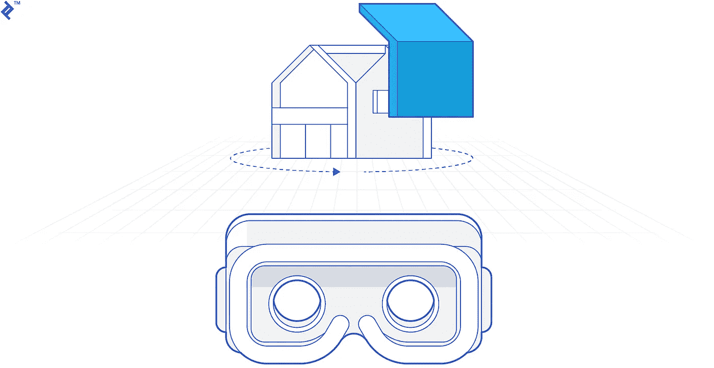
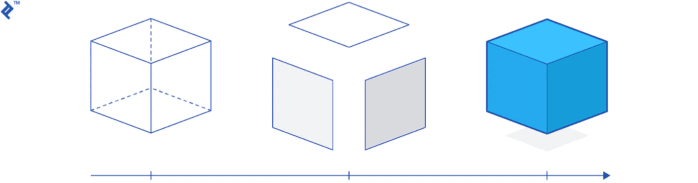

# 虚拟现实项目开发——项目经理应该如何准备

> 原文：<https://medium.com/hackernoon/vr-project-development-how-project-managers-should-prepare-2714a40c130b>

到 2019 年，大多数人可能已经看过或尝试过[虚拟现实](https://en.wikipedia.org/wiki/Virtual_reality)体验，也就是所谓的 VR。你可能已经用[谷歌 Cardboard](https://vr.google.com/cardboard/) 尝试了一个非常基础的虚拟现实版本，在那里你可以环顾四周，看到你周围的 360 度画面。或者你甚至可以用 [HTC Vive](https://en.wikipedia.org/wiki/HTC_Vive) 或 [Oculus Rift](https://en.wikipedia.org/wiki/Oculus_Rift) 尝试一个成熟的虚拟现实，在那里你不仅可以四处看看，还可以移动和探索新的和不熟悉的空间。

有些人认为虚拟现实只是一个短暂的时尚，而另一些人则称赞它是计算领域的下一个大事件。尽管如此，虚拟现实是一种与计算机互动的新型媒介，在过去的 8 年里，它一直在稳步打入消费者和企业市场。例如，福特已经使用 [VR 来帮助他们设计他们的 GT 超跑](https://vrscout.com/news/ford-virtual-reality-design-gt/#)，而波士顿儿童医院和[全球多个不同的其他医院已经使用 VR 作为止痛药的有效替代品](https://www.washingtonpost.com/national/health-science/virtual-reality-is-being-used-by-hospitals-to-help-people-cope-with-pain/2018/06/08/07e8b39e-6424-11e8-a768-ed043e33f1dc_story.html?noredirect=on&utm_term=.7abe9e7fbb05)。

本文将试图帮助项目经理更好地理解技术本身(类似于我们最近关于人工智能的文章)，帮助他们管理虚拟现实项目，并为管理虚拟现实项目时可能面临的任何挑战做好准备。

# 什么是虚拟现实？

要理解虚拟现实是什么，我们必须看看 3D 技术的历史，看看 VR 是从哪里来的。多年来，人们多次试图将我们从 2D 内容领域带入 3D 内容领域。这一切都始于 19 世纪末的“3D”电影，并在 20 世纪中期进入 3D 电影。但是，不要把 VR 误认为是更典型的 3D 内容。远不止如此。

# “在场”——信仰的飞跃

区分 3D 影院和 VR 的关键因素是 VR 领域的工程师所说的“在场”。临场感是一个技术术语，用来描述 VR 头戴设备向用户提供的完全沉浸和存在于另一个空间中的感觉。这种“在场”的感觉需要设备欺骗人类感知系统的许多不同方面。

检验“存在”的最佳测试是让一个人试着走上一座 100 层楼高的虚拟窗台，试着从上面跳下来。在 3D 电影中，这可能看起来令人望而生畏，但大多数人会毫不费力地迈出这一步。

然而，在虚拟现实中，耳机的视野、刷新率、分辨率和其他方面的设计方式欺骗了人类感知系统，使其认为你真的在其他地方。这使得从建筑物的窗台上跳下来对大多数人来说几乎是一个不可能的任务，而其他人在完成这个简单而无害的练习时会尖叫和大喊。

那些有勇气从窗台上走下来并开始从建筑物上掉下来的人报告说，他们有一种胃部坠落的感觉，这种感觉类似于真正的坠落反射。这是因为我们被骗相信虚拟现实是真实的。这种“在场”的感觉是其他 3D 体验和真正的虚拟现实之间的关键区别。

# 这是第一波 VR 吗？

虚拟现实的历史始于 1968 年麻省理工学院实验室的第一个达摩克利斯之剑演示。当时，虚拟现实主要是对军事飞行模拟器和屏幕技术的测试。在 20 世纪中期，有许多使虚拟现实成为现实的失败尝试，但大多数都像非常基本的演示，会占用太多空间，只有最大的 R&D 实验室才能负担得起。

第一次真正的 VR 炒作浪潮是在 90 年代初到来并过去的。有公司制造非常昂贵和笨重的 VR 头戴设备，如 [Virtuality 1000CS](https://www.youtube.com/watch?v=SP8wSw4bBuA) 。甚至有一个名为 VR 游骑兵的电视节目向孩子们展示了虚拟战士的精彩旅程，这些战士看起来与超级游骑兵非常相似。

然而，90 年代早期图形领域的技术能力并不能满足虚拟现实系统的需求。大多数人都报告了当时使用 VR 显示器的副作用。恶心和晕船几乎伴随着所有的经历。大多数游戏除了几个简单的形状之外都做不出太多东西，VR 又被遗忘了 15 年。

然后是 Oculus Rift 的崛起，始于他们在 2010 年初的 Kickstarter 活动，这让 VR 走出了阴影，再次进入主流意识。

# VR 只是为了游戏吗？

大多数人把 VR 和玩电脑游戏联系在一起。虽然游戏是 VR 市场的重要组成部分，但它绝对不是 VR 的唯一用途。自 20 世纪 60 年代末问世以来，虚拟现实已经成功应用于许多不同的领域。

它最初是作为一个研究项目来制造更好的飞行模拟器，然而，自从它的重生以来，虚拟现实已经被用于各种行业的许多不同领域。以下是一些比较著名的例子:

*   **医疗:** [外科手术室](https://www.surgicaltheater.net/)允许外科医生更有效地分析病人的解剖结构、定位肿瘤和计划手术。
*   **太空:** [美国宇航局使用虚拟现实](https://blogs.nasa.gov/spacestation/?s=virtual+reality)进行太空行走训练，并控制机械臂。
*   **博物馆:**虽然许多文化机构有能力在虚拟现实中查看他们的部分藏品，但[克雷默博物馆](http://www.thekremercollection.com/the-kremer-museum/)完全存在于虚拟现实中，由一位世界著名的建筑师设计。
*   **汽车:** [福特汽车沉浸式环境(五)](https://driving.ca/ford/auto-news/news/how-it-works-ford-design-studios)允许福特员工详细查看即将推出的车型，并计划对其进行任何更改。
*   **军事:**美国陆军将虚拟现实用于各种[训练场景和治疗从战场归来的士兵的 PTSD](https://www.delltechnologies.com/en-us/perspectives/how-virtual-reality-is-saving-lives-both-on-and-off-the-battlefield/) 。
*   **房地产:**许多房地产公司正在使用虚拟现实展示他们的一些房产，[规划师 5D](https://planner5d.com/) 创造了一个拖放工具，可以在移动虚拟现实的帮助下创建你未来的家庭室内并在其中走动。
*   建筑:Gensler LA 办公室的员工们[每周都会在一个虚拟的建筑复制品中会面](https://www.metropolismag.com/architecture/disrupting-reality-how-vr-is-changing-architecture-present-future/)，该建筑目前正由他们的建筑师设计。
*   社交网络:有许多像 [VR 聊天](https://www.vrchat.net/)和 [Sinespace](https://sine.space/) 这样的应用程序，允许人们在虚拟世界中互动和创造。
*   **教育:** [ClassVR](http://www.classvr.com/classroom-virtual-reality-lessons/) 在课堂上创造沉浸式教学的机会。
*   **运动:** [STRIVR](https://www.strivr.com/sports/) 为运动队创建训练方案，允许球员在自己的时间做一些额外的训练，以重复团队策略。

# 虚拟现实市场概述

目前，市场上几乎没有不同类型的 VR 设备。它们最好可以分为两类:**移动 VR 和桌面 VR。**

**移动 VR**——顾名思义就是由便携性因素定义的。第一代移动 VR 耳机通常使用智能手机，您可以将智能手机放入耳机外壳中。当前一代的移动 VR 耳机使用独立的硬件和集成到耳机本身的移动处理器。

与桌面虚拟现实相比，这提供了一种方便但有限的虚拟现实体验，通常具有更简单的图形。移动虚拟现实的另一个主要缺点是，大多数移动虚拟现实耳机都缺乏所谓的“位置跟踪”这种类型的跟踪不仅跟踪用户的头部倾斜，还跟踪用户在空间移动时的头部位置。这对于完全沉浸式体验和减少用户的不适是必不可少的。

***设备:*** 谷歌 Cardboard、谷歌 Daydream、三星 Gear VR、Oculus Go、Oculus Quest、HTC Focus 等。

**桌面虚拟现实** —桌面虚拟现实有时被称为全虚拟现实，因为它允许更全面的虚拟现实体验，并包括头部和双手控制器的位置跟踪等功能。存在各种各样的桌面 VR 系统，其中一些具有附加功能，例如全向跑步机、全房间跟踪器、手套、用于多个不同控制器的接口等。

然而，桌面 VR 头戴设备最具定义性的特征是全身沉浸体验的质量，为用户提供最佳的“在场”效果。这主要是通过这些耳机所连接的台式机中的 GPU 和 CPU 的能力来实现的。由于没有移动设备的小外形，这些系统可以使用更强大的处理器。这通常也意味着一台普通的虚拟现实电脑要花费你 2000 美元左右。

***设备:*** Oculus Rift、HTC Vive、Playstation VR、基于英特尔芯片的 Windows XR 变种如宏碁、三星、华硕、惠普 VR 系统。

# 虚拟现实开发:项目经理应该知道什么

# 虚拟现实开发生命周期中的关键角色

## 软件开发人员/游戏引擎专家/计算机图形专家

自然，有人需要在你的虚拟现实应用中编写所有的交互功能。这就是**软件开发人员**的作用。请记住，并非所有软件开发人员都有处理 3D 图形或使用游戏引擎的经验。大多数虚拟现实项目使用 **Unity 3D** 或**虚幻引擎**来使这项任务变得更加容易。3D 游戏引擎具有某些图形和控制功能，与制作自己的 3D 引擎相比，这有助于将开发时间和成本减少 20 倍。今天制作的 90%的 VR 内容都在使用 Unity 3D，并且相对容易找到 [Unity 开发者来雇佣。](https://www.toptal.com/unity-unity3d)

如果你决定从头开始构建你的虚拟现实平台，或者你的应用需要一个特定的 3D 引擎，那么你将需要一个能够使用 OpenGL 等基本工具来构建一个新游戏引擎的图形专家。如果你决定走这条路，请记住，这可能会大大增加完成应用程序所需的工作量和预算。在某些情况下，这种构建 VR 体验的方式可以获得一些性能增益。然而，如果您决定不使用可用的 3D 引擎之一，与寻找高级计算机图形专家的成本相比，这些好处中的大多数都是微不足道的。简单来说，这可以比作拍电影的时候自己做相机。

作为一名负责虚拟现实项目管理的专业项目经理，你需要自学项目的技术要求，以及它们如何影响你的项目底线。请记住，并非所有的软件开发人员都是平等的，所以在为您的 VR 项目招聘时，请寻找具有游戏开发经验的人。

## 虚拟现实专家/虚拟现实设计师

尽管简单的虚拟现实应用程序相对容易构建，但随着更多功能的添加，复杂性会呈指数级增长。这主要是由于当前计算能力的限制和计算机处理图形的方式。虚拟现实应用有自己独特的挑战，这些挑战只有在设计虚拟现实项目时才会显现出来。为了解决这些问题，你需要[雇佣一名**虚拟现实专家**](https://www.toptal.com/services/virtual-reality-development) ，他有专门处理虚拟现实应用的经验。

其中一些挑战与技术限制和规范有关，而另一些则更多地与人机界面有关。例如，如果你设计了一个虚拟现实应用程序，用户将通过不同于自己的高度来体验这个世界，请确保他们坐在酒吧的椅子上，而不是普通的椅子上。这听起来相当奇怪，然而，我们的大脑记录我们的脚接触地面，并计算我们的“正确”感知高度，因此，如果我们的脚不接触地面，我们可以更好地忍受虚拟现实中比我们实际高得多的体验。

作为另一个例子，如果你的虚拟现实体验使用心灵传输，一个好的虚拟现实专家会告诉你使用持续 300 毫秒的屏幕空白效果，因为我们的大脑会将这视为真实的眨眼(持续 300-500 毫秒)，并会完全过滤掉这种效果，从而获得更流畅的体验。

这些问题通常不会出现在我们常规的软件或设计项目中，这就是为什么雇佣至少一名兼职[虚拟现实专家顾问](https://www.toptal.com/virtual-reality)很重要，他可以确保你通过以正确的方式构建正确的东西来节省大量时间和金钱。

## 3D 艺术家/场景设计师/动画师

3D 艺术家通常是雕刻实际 3D 内容的人。场景设计师是把所有的 3D 资源放在一起创造环境的人。**动画师**负责准备动画的 3D 模型，然后使用各种不同的软件工具创建这些动画。

所有这些工作都可以由一个人完成，这通常是有人在构建一个自举式 VR 项目时的情况。在大型电影或游戏设计工作室，你通常会发现高度专业化的个人承担这些角色。

不管怎样，这些角色对于任何一个 VR 项目都是非常重要的。虚拟现实体验在很大程度上依赖于 3D 内容，而制作一个虚拟现实应用所需的工作中，80%都是制作 3D 内容。作为一个项目经理，重要的是要明白这些角色很可能是你项目最大的支出来源，你应该相应地计划你的预算。

# 管理虚拟现实项目时的常见挑战

## 3D 内容的制作时间可能比预期的要长

3D 建模是一项艰巨的任务，需要大量的时间来完成。为 3D 模型创建动画更是一项艰巨的任务。对于一个项目经理来说，在估算故事点时，记住这一点是很重要的。

例如，像机器人、人类、马、虚拟助手或任何其他复杂生物这样的人形人物的建模和动画制作时间可能比由更原始的形式(如建筑物或菜单窗口)制成的交互式对象长 100 倍。

例如，显示虚拟办公室工作人员工作的场景的建模、动画制作和设计时间可能比显示建筑物外部的建筑演示多 100 倍。

这里使用的一个好的经验法则是从绘图的角度来考虑动画和 3D 建模。如果一些东西很难画出来，比如人类或动物，那就很难用 3D 建模，甚至更难制作动画，让它看起来更专业。然而，如果某些东西可以用代码来描述，比如抽象形状的复杂动画，那么在 3D 中构建和操作就容易得多。算法比人类工作更便宜，作为项目经理，你应该是第一道防线，通过对内容提出现实的要求来确保项目范围保持现实。

## VR 是 GPU 受限的

在虚拟现实中创建的一切都必须使用计算机中的图形处理器单元来显示，也称为 GPU。即使是当今最好的计算机也仍然受到它们可以同时处理的 3D 对象数量的限制。VR 使用每秒至少刷新 90 次的显示器，这意味着 VR 正在给运行它的计算机带来非常重的负载。

例如，像 HTC Vive 这样的 VR 头戴设备需要的计算负载相当于同时在机器上运行的 3 到 4 个正常的计算机显示器。我们大多数的虚拟现实应用都受到当今设备通过其 GPU 所能实现的限制。

想象这一点的最佳方式是想想 21 世纪初的 3D 游戏。他们开始探索逼真的 3D 图形，然而，他们中的大多数人仍然使用捷径来获得最大的视觉效果。这正是当前虚拟现实体验的情况，我们仍处于非常早期的阶段，大多数应用程序将受到运行它们的硬件能力的限制。

## 各种设备和平台

如上所述，有许多不同的虚拟现实平台可用。在撰写本文时，桌面和移动 VR 市场上至少有 30 多种不同的 VR 设备。

这意味着在所有平台上支持你的虚拟现实应用需要很多额外的调整和返工。在移动虚拟现实和桌面虚拟现实应用之间共享内容尤其困难，因为它们支持非常不同级别的 3D 图形和动画。

使用 Unity 3D 或 Unreal Engine 等 3D 游戏引擎会有所帮助，因为它们允许一个应用程序在理论上以最少的返工部署到多个平台。在实践中，在大多数高端桌面虚拟现实系统之间共享构建很容易，但是，移动虚拟现实可能需要额外的返工和新的 3D 资产才能顺利工作。

作为一个项目经理，相应地计划，把你的范围限制在几个最流行的平台上，这样更容易维护代码库和支持最好的用户体验。

尽管虚拟现实已经存在了一段时间，但仍然没有确凿的证据证明它的潜在健康风险。有多项研究调查了设备导致的近视和其他潜在危险，但没有一项研究有确凿的证据。

VR 中的大部分危害来自于用户周围的实际环境。跌落、绊倒和砸坏工作区控制器的风险是存在的。制造商通过引入虚拟边界和通知系统来减少这些问题。

就目前而言，大多数 VR 头戴设备制造商并不推荐儿童使用该头戴设备。这主要是由于它的副作用，有时用户会遇到这种情况。20 世纪 90 年代早期的恶心和晕船大多已经消失了，但是一些应用程序，特别是如果设计不好的话，可能会引起某种程度的晕船。

作为一个项目经理，你应该知道设计好的没有副作用的虚拟现实体验的关键在于交互，尤其是运动力学。这些超出了本文的范围，但是对于那些有兴趣了解更多的人来说，脸书的 [Oculus 已经整理了一个如何设计舒适的虚拟现实体验的伟大指南](https://developer.oculus.com/design/latest/concepts/book-bp/)。

# 结论:眼见为实

VR 从早期到现在变化很大。在目前的形式下，它是一个有用的工具，适用于使用 3D 内容的行业、培训工作或旨在通过将用户“运送”到不同的地方来创造印象的行业。

正如大多数技术一样，虚拟现实是关于人和社会互动的，而不是技术本身。当今的技术发展只有在解决了用户的某种问题后才有用。虚拟现实项目及其在行业中的应用尤其如此。目前从虚拟现实中获得最大价值的行业是**建筑和室内设计、培训和模拟、数据可视化、游戏、娱乐和电影。**

虚拟现实发展的主要挑战来自于它严重依赖于 3D 模型和动画。如果不了解特定类型的建模和动画的复杂性，这可能是一项困难的任务。虚拟现实还有许多其他挑战，因此在构建虚拟现实应用时，向虚拟现实专业人士寻求帮助是明智的。游戏引擎可以帮助解决一些开发挑战，但你必须找到知道如何使用它们的合适的开发者。

# 作者提供的额外材料

**VR 技术工程师讲解 5 级难度的 VR**

【https://www.youtube.com/watch?v=akveRNY6Ulw 号

**MKBHD 简要 VR 讲解**

[https://www.youtube.com/watch?v=i4Zt3JZejbg](https://www.youtube.com/watch?v=i4Zt3JZejbg)

**虚拟现实技术的历史**

[https://www.youtube.com/watch?v=4BOwLCoBqCs](https://www.youtube.com/watch?v=4BOwLCoBqCs)

**VR 新闻**

[https://www.roadtovr.com/](https://www.roadtovr.com/)

*作者:* [*奥德瑞斯*](https://www.toptal.com/project-managers/resume/audrius-zujus)**原文发表于***。***