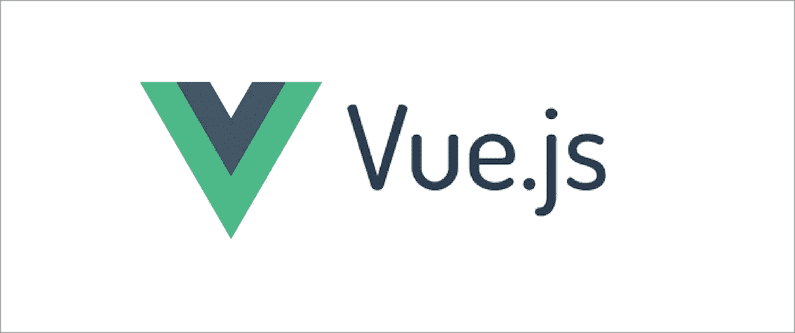
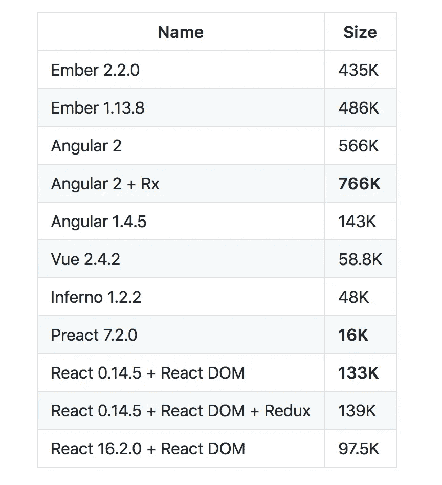
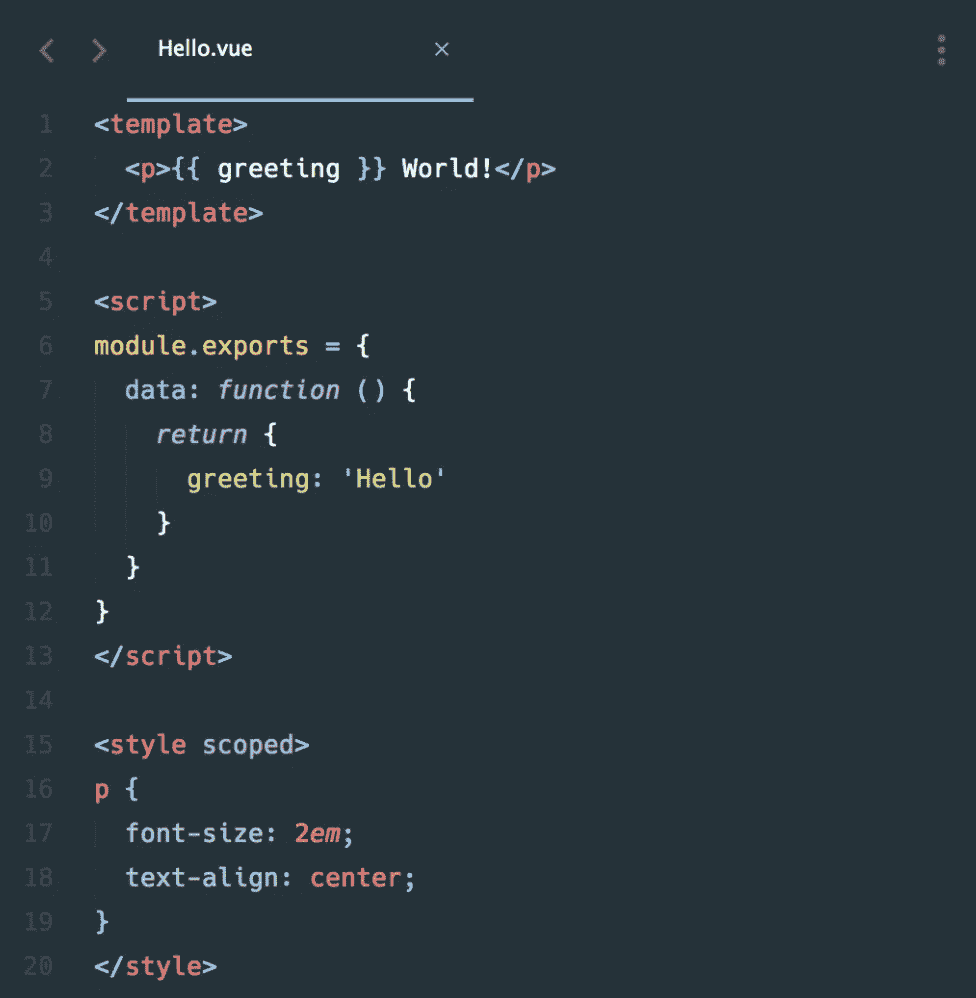
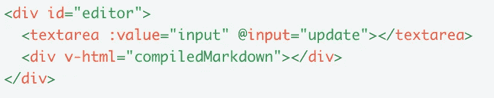

# Vue.js:好、坏和选择

> 原文：<https://medium.com/hackernoon/vue-js-good-bad-and-choice-dcc1d27f82c6>

如今，对于大多数构建新前端应用程序的人来说，框架/库的选择在很大程度上可以归结为 Angular 或 React。很多时候，人们没有给予 Vue.js 足够的爱。所以，我想分享一些关于 Vue.js 的信息和我在一个生产应用程序中使用 Vue.js 的个人经验。我们将一起尝试回答这个问题:Vue.js 是适合你的框架吗？

***注*** *:我并不是想说 Vue.js 比 React、Angular，甚至其他任何前端框架都好。这只是我在项目中使用 Vue.js 的亲身经历。*

对于那些不熟悉 Vue.js 或从未听说过 Vue.js 的人来说，Vue.js 是一个 JavaScript 前端框架，最初于 2014 年发布，由[尤雨溪](/@youyuxi)开发。从那时起，Vue.js 在很短的时间内在许多前端开发人员/工程师中获得了很大的声望。利用 Vue.js 的一些著名公司包括***【git lab】******阿里巴巴******Buzzfeed***等等。

> **vue . js 有什么好的？**

好问题！有几个原因。在众多原因中，这四个原因在我的个人经历中尤为突出。

1.  **轻量级**
2.  **低复杂度**
3.  **虚拟 DOM**
4.  **低学习曲线(初学者友好)**

现在让我们深入了解每一点的细节。

# 轻量级选手

在生产应用程序甚至个人项目中使用 Vue.js 的一个显著优点是它相对轻量级。让我们看看不同前端框架/库的下载空间:

[Source](https://gist.github.com/Restuta/cda69e50a853aa64912d)

轻量级非常有用，尤其是快速构建一个简单的应用程序。我个人的用例是为工程团队的内部工具构建 UI。

# 低复杂性

这恰好是 Vue.js 中我最喜欢的部分之一，因为在使用了许多用 React 构建的应用程序之后，随着应用程序变得越来越大，一旦在组合中添加了状态管理，代码库通常会变得非常复杂。我注意到 React 应用程序变得复杂的原因之一是 JSX 模板、生命周期方法和其他方法都存在于同一个对象中。这通常使得很难理解逻辑流程。那么，让我们看看 Vue.js 代码是什么样子的:

[Source](https://vuejs.org/v2/guide/single-file-components.html)

请注意，HTML 模板、必要的方法和样式表都是独立的，这使得准确了解代码的哪一部分变得非常容易。这可能意味着代码库将相对容易维护，而不必在每次代码更新时增加代码的复杂性。

# 虚拟 DOM

就像 React 一样，Vue.js 实现了使用虚拟 DOM 来操纵/呈现视图。通过使用虚拟 DOM，UI 不会在每次需要更改时都呈现真实 DOM，而是只呈现虚拟 DOM 和真实 DOM 之间的部分差异，从而性能会更好。

# 低学习曲线

想想这个场景，我相信很多人都经历过。

大多数进入 web 开发的人很可能会学习 3 种技术的基础:HTML、CSS 和 JavaScript。想象一下，作为一个初学者，不得不学习这个叫做 JSX 的新事物，而不是 HTML。虽然 JSX 看起来和 HTML 很相似，但是肯定有很多不同之处使得 JSX 和 HTML 不同，这不是学习 Vue.js 所必须的

[Source](https://vuejs.org/v2/examples/)

如您所见，Vue.js 使用与 HTML 相同的标记名，这使得将知识从 HTML 转移到 Vue.js 更加容易。此外，代码的模块化结构对于理解 Vue.js 组件的不同移动部分非常有帮助。

对于那些熟悉 React 的人来说，学习 Vue.js 将是小菜一碟，因为两者之间有很多相似之处。

> **vue . js 有什么不好？**

尽管我很想说 Vue.js 简直太棒了，但是它和任何框架/库一样，几乎没有缺点。以下是我注意到的 Vue.js 的一些缺点:

1.  **较小的社区**
2.  **英文写作资源**
3.  **就业机会**

我早期从事 Vue.js 项目时遇到的一个问题是，有时很难找到对我的应用程序中非常具体的问题的支持。这是由于 Vue.js 社区仍然没有 Angular 或 React 那么大，这是有意义的。

我发现的另一个问题是，当我认为我找到了帮助时，回应通常是用中文写的。就在我以为我得救的时候，我中了圈套。后来，我发现 Vue.js 在亚洲国家比像我们这样的英语国家更受欢迎。

最后，在目前的状态下，没有多少地方使用 Vue.js，所以可能很难找到具有 Vue.js 专业知识的工作。因此，我建议使用 Vue.js 进行个人项目，较小规模的 UI 应用程序，或者为了在相对较短的时间内让您的应用程序具有轻微的 UI 味道。

现在，是时候回答这个问题了:Vue.js 是不是适合你的框架？

告诉我们您在☺使用 Vue.js 的体验如何