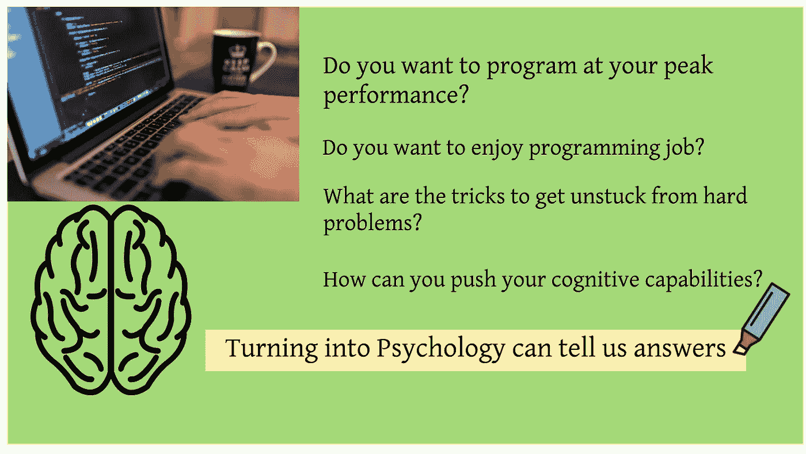
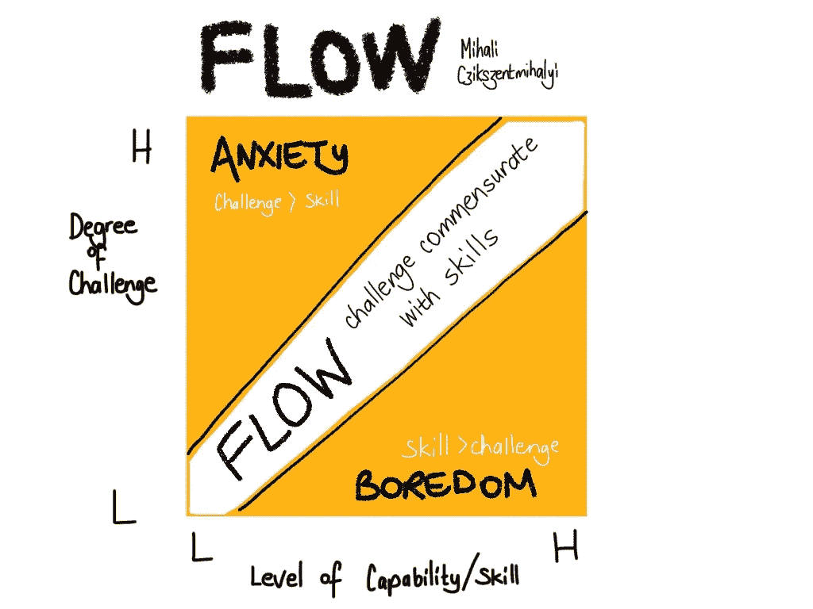
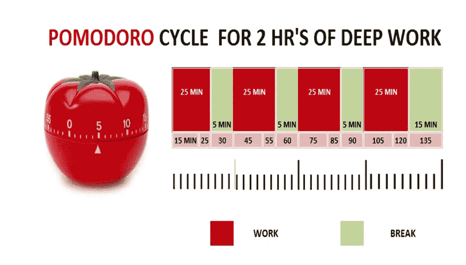
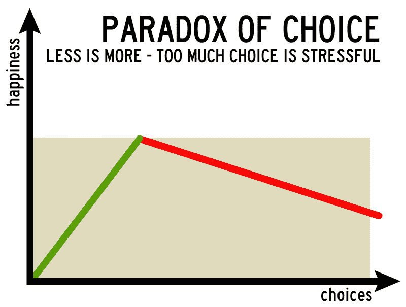

# 想成为一名快乐高效的程序员吗？使用心理学中的这 5 个技巧

> 原文：<https://medium.com/hackernoon/want-to-become-a-happy-and-productive-programmer-use-these-5-techniques-from-psychology-9e2e22b367b4>



## 来自人类心理学的想法如何帮助程序员？

你想在你的巅峰状态下编程吗？你想享受编程工作吗？摆脱难题的诀窍是什么？你如何推动你的认知能力？转入心理学可以告诉我们答案。

就像电影的英雄，程序员的人生有反派，有消遣，有打架，有情绪。你准备好成为编程英雄了吗？

# 1.达到流动状态

心理学家米哈里·契克森米哈在他的名著《心流:最佳体验的心理学》中揭示了达到最佳表现的秘诀是在最佳状态下工作，这种状态被称为 ***【心流】*** 。

> “心流”是意识的最佳状态，在这种状态下，我们感觉最好，并有能力在最高水平上表现。在心流过程中，人们通常会体验到深深的快乐、创造力，并完全投入到一项活动中。
> 
> 当一个人的技能完全投入到克服一个可管理的挑战中时，心流也会发生，因此它就像一块磁铁，吸引着学习新技能和增加挑战。



为了达到一种流畅的状态，你必须在活动的难度和你的技能之间取得平衡。

## 提前学习技能✅

如果你的工作需要一项新技能(可能是一门新的语言或技术等)..)，不要试图边学边做工作。熟悉它会避免焦虑，帮助达到心流状态。因此，提前学习技能，以确保你有合适的技能水平来应对项目中的挑战。

## 首先让它工作，然后让它完美✅

如果你试图写出完美的代码，你可能会陷入困境，那么这个挑战将会更加艰难。因此，为了减少挑战，只需编写第一个可以工作的代码版本，而不用担心它会变坏。然后，再重构，把它做好就更容易了。

## 各个击破✅

另一个诀窍是把你复杂的工作分解成小的可管理的任务，这样你就可以控制了。

所以这个想法是提升你的技能或者减少挑战来达到心流状态。游戏设计者用这种技术来吸引玩家。他们使游戏的难度与玩家的技能相适应，这样玩家既不会感到沮丧，也不会感到无聊。在心流状态下，编程会有玩游戏的感觉。

💡*如果你达到* ***心流状态*** *你将成为* ***英雄*** *。但是等等，还有一个* ***的小人。***

# 2.赢得焦点

心流体验可能不会在最初的几分钟出现，你需要保持专注，沉浸在工作中。卡尔·纽波特在他的书《深度工作:分心世界中专注成功的规则》中讲述了专注工作的重要性

> **深度工作:**在不受干扰的专注状态下进行的专业活动，将你的认知能力推向极限。这些努力创造了新的价值，提高了你的技能，并且很难被复制。

## 留出时间深入工作✅

可以留出一些时间专注工作。为了避免分心，请关闭电脑和手机上的所有通知。如果你不擅长自控，试试番茄工作法。

## ✅番茄技术公司

番茄工作法提供了一个进行深度工作的系统。



Source: [https://name-fame.com/motivation/pomodoro-technique-boost-study-work/](https://name-fame.com/motivation/pomodoro-technique-boost-study-work/)

基本上，你花 25 分钟完成一项任务，没有任何分心。然后，你休息 5 分钟，继续吃下一个番茄。4 个番茄之后，你可以休息很长时间。你可以很容易地在网上找到番茄红素应用程序。

💠*不要对番茄日程要求太严格。如果你正处于* ***心流*** *状态，当 25 分钟结束时，你不必强迫休息。但是还有其他散步休息的好时间，我会在这篇文章的后面讨论。*

这对外界干扰很有帮助。**内部精神涣散怎么办？**

## 提交你的想法✅

我们的思维通常会被未完成的任务分心，不管它们有多重要。因为开放性任务往往会占据我们的短期记忆，直到完成。

不过多亏了[蔡加尼克的](https://en.wikiversity.org/wiki/Motivation_and_emotion/Book/2015/Zeigarnik_effect)后续研究。我们现在知道，

> 我们实际上不需要完成任务来说服我们的大脑停止思考它们。我们所要做的就是把它们写下来，让我们相信它们会被妥善处理。

完成工作后，你不仅要将代码提交到源代码控制中，还要在一个合适的地方写下你的想法(比如下一步，待办事项等)。

💡*一个程序员的旅程不仅有* ***反派*** *还有改道和中断。*


Source: [https://www.big-red-digital.com/news/general/the-paradox-of-choice-why-the-choosing-a-website-partner-neednt-be-stressful](https://www.big-red-digital.com/news/general/the-paradox-of-choice-why-the-choosing-a-website-partner-neednt-be-stressful)

# 3.最小化选择

程序员的生活包括做许多决定，并且它干扰体验心流状态。

在他的书《选择的悖论》中，巴里·施瓦茨描述了更多的选择如何导致焦虑。他用了无数的例子，从购物到职业选择再到爱情，来证明选择少不仅能提高我们的生产力，还能增加我们的自由，让我们更容易活在当下，享受当下。



Source: [http://vpcoder.com/index.php/2016/03/13/how-to-start-learning-coding-effectively/](http://vpcoder.com/index.php/2016/03/13/how-to-start-learning-coding-effectively/)

他主要研究购物者的行为，但同样的原则也适用于程序员。我们可以使用一些技巧来减少我们必须做出的决定的数量。

## 选择语言或框架时，请考虑一下✅

很多人推崇 Go 语言，因为做一件事只有一种方法(比如写循环)。另外，人们讨厌 Perl 语言的原因之一是有太多的方法可以做同样的事情。

因此，在选择语言或框架时，要考虑灵活性相对于限制的好处。如果有做某事的唯一方法，你就不需要担心强制执行最佳实践。

## 提前在✅收集必要的材料

程序员经常需要查找代码示例或文档来完成这项工作。这不仅会导致上下文切换，还会增加选择正确示例或 API 的负担。

所以，提前收集必要的资料，这样你就不用翻遍无数的谷歌结果，决定正确的结果了。

## 写代码之前有一个设计✅

在开始编写代码之前，尝试做出重要的决策和设计。这将帮助你专注于解决手头的问题，而不是浪费精力做决定。

💡*如果我有拖延症或者在某个问题上卡住了怎么办？你需要打架吗？*

# 4.不要与意志力抗争

> 对非常成功的人的研究证明，成功不是强大的意志力和克服阻力的能力的结果，而是首先避免阻力的智能工作环境的结果。

这里有一些避免与意志力抗争的技巧。

## 如何避免拖延症？

我们不需要强迫自己去做我们不喜欢做的事情，而是需要找到一种方法，让我们喜欢去做那些让我们的项目更进一步的事情。

**分工明确** ✅

拖延的主要原因是在高层次上定义你的目标。写下你要做什么、何时何地做的细节，会给你提供更多的机会去真正去做。还有，你的大脑觉得没有足够的细节就太难了。因此，有一个有意义和明确定义的任务胜过意志力。

**开始下一个任务** ✅

当他们完成一项任务时，人们通常会休息一会儿或结束一天的工作。但是，开始下一个任务或者在下一个任务上取得一些进展是个好主意。因为当你第二天开始工作时，你会有一个更好的主意。这将帮助你避免拖延，因为你没有开始新的东西。

读书时也可以用同样的想法。如果你只是阅读下一章的第一页，而不是在读完一章后合上书，你很可能会再次拿起这本书。

## 如何在解决难题时摆脱困境？

类似于意志力，解决一个棘手的问题，不一定要绞尽脑汁。你可以调整你的思维，让解决方案以令人惊讶的方式自动出现在你面前！

**散步休息** ✅

让思绪徘徊而不去关注它们，会让我们的大脑有机会以一种不同的、通常令人惊讶的高效方式处理问题。当我们散步、淋浴或打扫房间时，大脑会情不自禁地处理它遇到的最后一个未解决的问题。

所以，如果你只是离开电脑，你可能会有一个想法。

**睡在上面** ✅

带着未解决的问题回家。不要强迫自己去解决它，而是睡觉。你的潜意识会处理它，你可能会在半夜或早上醒来时有一个解决方案。很多时候，我的问题的解决方案出现在午夜或者早晨的第一件事，或者在我洗澡的时候。

**尝试解决不同的问题或项目。** ✅

有时候，当你不思考问题时，问题的解决方案会自动出现。因此，不要去解决一个难题，而是将你的精力转向另一个富有成效的目标。用这种方法，同时做不同的事情，你永远不会遇到任何精神障碍。

💡仍然缺少一些东西。只有有情感，生活才会变得美好。编程也是如此。

# 5.练习移情

同理心是一项重要的技能，它会让你在个人生活和职业中获得更大的成功和幸福。在编程中也要练习换位思考。编程不仅仅是逻辑。它像艺术一样富有表现力。

## 编写可维护的代码✅

请记住，您编写的代码将被他人读取和维护。

> 程序必须是为人们阅读而写的，并且只是附带地为机器执行而写的――哈罗德·艾贝尔森，计算机程序的结构和解释

遵循编码风格的最佳实践，如有意义的变量名、较小的方法等。你不应该把程序看起来像在这个注释里😃

```
//When I wrote this, only God and I understood what I was doing
//Now, God only knows
```

确保您编写的代码对其他开发人员来说具有较低的认知负荷，以便于维护。写有用的评论。这是我遇到的一个有趣的评论😆

```
// 
// Dear maintainer:
// 
// Once you are done trying to 'optimize' this routine,
// and have realized what a terrible mistake that was,
// please increment the following counter as a warning
// to the next guy:
// 
// total_hours_wasted_here = 42
//
```

## 在✅设计中运用简约

无论是设计 API 还是用户界面，都要让用户容易使用。你可以遵循的基本原则是

> 简单的事情应该更简单。复杂的事情应该是可能的。

练习换位思考不仅能帮助你，还能让你的团队富有成效，让用户开心。

# 摘要

您可能已经在使用这些技术了。但是用心理学了解它们背后的推理可以帮助你更有成效地完成它们。

如果你讨厌编程或者考虑放弃，使用心理学中的这些想法可能会把你变成一个快乐的程序员。

当你用心理学的眼光看待编程时，你会欣赏它的美丽，享受编程的艺术。

*感谢阅读。如果你喜欢这篇文章，请鼓掌，这样会有更多的观众看到。另外，在评论中分享你的想法。*