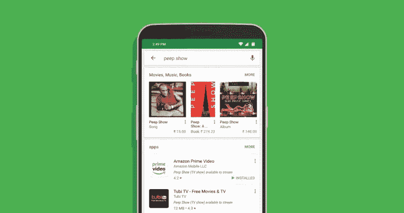

# 想做下一个 Spotify？

> 原文：<https://medium.com/hackernoon/want-to-make-the-next-spotify-cd5c10642d>

在接下来的几年里，音乐经历了一系列的变革和改进。从留声机的早期起源到音乐流媒体时代，这个行业已经发展了很多。



忙碌的用户想要满足他们的音乐需求和愿望。他们什么都想要，你的应用需要提供最好的体验。在这里，我们将向你展示[如何创建一个让他们保持兴趣的音乐流媒体应用](https://mova.io/blog/how-to-build-music-app/)。

# 从你最初的愿景开始

在进入开发计划之前，你需要对应用程序将如何工作有一个清晰的愿景。搜索类似的应用程序，查看它们的优缺点。初创公司正在尽一切努力在音乐流媒体行业保持成功。和你的开发团队坐下来，评估你希望你的应用程序有什么特性。

# 计划和评估

音乐流媒体行业有潜力。你需要对目标用户群、他们的生活方式、他们的喜好进行适当的研究，并得出向他们展示你的 MVP 的最有效方式的最佳结论。并根据目标市场的偏好修改音乐应用程序。

# 获得许可

创建应用程序时，您需要一个许可证来提交您要向他们提供的内容。

# 要包括的功能

在制作你的应用时，你需要确保它比你的竞争对手更好。以下是您应该包括的一些功能:

# 制作这些功能的时候用什么语言最好？

从编码的角度来看，我们建议你在制作音乐应用时使用 Python。Spotify 80%以上的程序是基于 python 的，另外 20%是用 Java 编写的非 Python 服务，他们也有一些用 C 或 C++编写的应用程序。

速度是 Spotify 的主要关注点。Python 在这种心态下工作得很好，因为它有助于减少应用程序开发的时间。Spotify 利用了绑定 IO 的 Python 框架。以下是 Python 如何使用扭曲代码来帮助其应用程序开发。[这里有一个关于如何在你的平台上实现它的例子](https://twistedmatrix.com/trac/)(基于他们的主页)。

```
**from** twisted.internet **import** protocol, reactor, endpoints**class** **Echo**(protocol**.**Protocol): **def** **dataReceived**(self, data): self**.**transport**.**write(data)**class** **EchoFactory**(protocol**.**Factory): **def** **buildProtocol**(self, addr): **return** Echo()endpoints**.**serverFromString(reactor,“tcp:1234”)**.**listen(EchoFactory())reactor**.**run()
```

如果你想使用另一种编码语言，那么要确保它的能力能够承受你平台上成千上万的人。我们建议从 Python 开始，因为它更容易，并且有成千上万的编码框架可以用于您的应用程序。


# 登记

用户下载您的应用程序后，他们需要获得授权。让他们通过你的音乐应用注册，可以更容易地获取和组织数据。它为应用程序管理员提供了在数据库中注册这些凭证所需的信息。

给他们提供通过社交媒体账户(Twitter、Instagram、脸书等)登录的选项。)并因分享而获得额外津贴。因此，在制作音乐流媒体应用程序时，请确保注册过程简单易行。

# 推送通知

对于像您这样的音乐应用程序来说，这是一个重要的功能。人们喜欢了解他们喜欢的名人。你的所有用户都喜欢个性化的好处，推送通知是最好的方式。每当你为 Android 或 iOS 制作一个音乐应用时，请记住推送通知。

# 推荐的音乐和播放列表

您的用户希望在几秒钟内获得他们的音乐。这意味着你的应用程序的算法需要接受他们的音乐偏好，并向他们建议一个播放列表。给他们一些功能，允许用户根据他们的风格、情况和心情创建播放列表。从长远来看，拥有具有这些功能的应用程序将吸引更多的客户。

这方面最好的例子是通过 Spotify 的播放列表算法。它分析世界各地的音乐听众和订户播放列表。该算法每次都会扫描数百万用户，所以你可以找到谁在听类似的音乐播放列表。然后，Spotify 比较每个用户的音乐品味，汇编数据，并在稍后找到要推荐的歌曲。

# 结论

要制作最好的音乐流媒体应用程序，你必须有一个在你的领域独特而有趣的计划。这意味着你必须使用你的开发团队来创建它，并推广它来吸引更多的用户。有可能，有一天你会拥有一个像 Spotify 这样成功的应用。

关于制作音乐流媒体应用程序，你有什么问题吗？

在下面的评论里告诉我们吧！

**来源:** [https://www . inno fied . com/create-a-music-streaming-app-like-Spotify/](https://www.innofied.com/create-a-music-streaming-app-like-spotify/)

图片来源:
[https://pix abay . com/photos/Android-mobile-smart phone-2618093/](https://pixabay.com/photos/android-mobile-smartphone-2618093/)

代码来源:
https://twistedmatrix.com/trac/