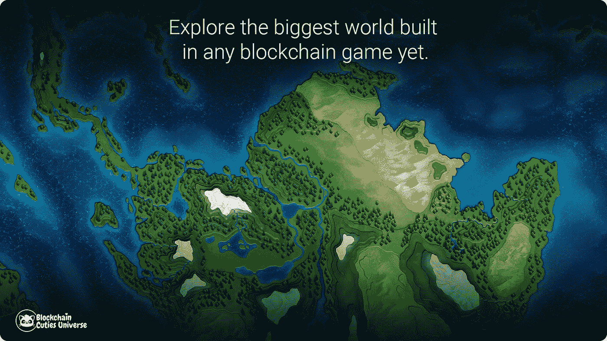
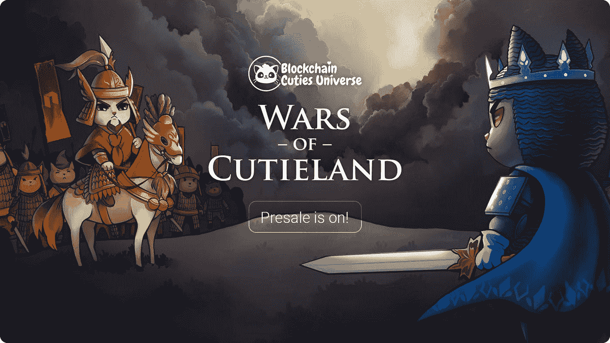
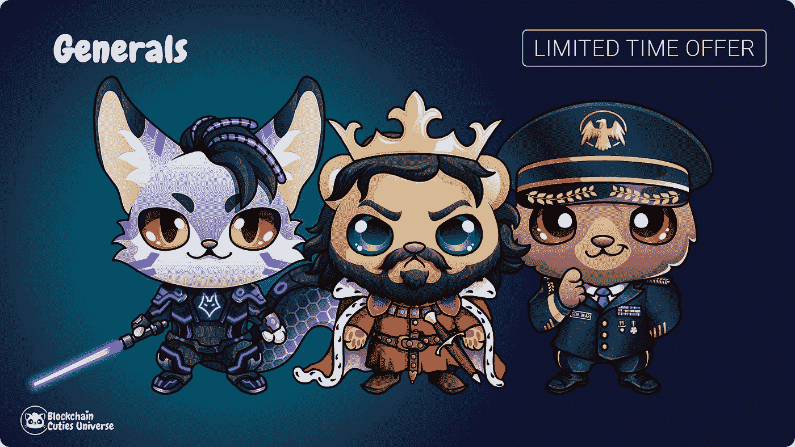
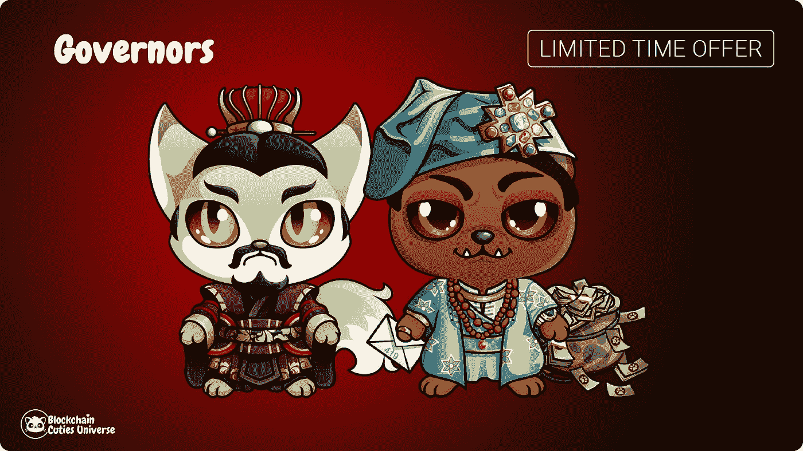

# 科威特战争:决定区块链世界的命运

> 原文：<https://medium.com/hackernoon/wars-of-cutieland-deciding-the-fate-of-the-blockchain-world-935fc958a33>

区块链 Cuties Universe 宣称，他们创造了一个真实的宇宙，在巨型地理地图上放置了不同类型的土地。到目前为止，可爱乐园的想法更加前卫，由可爱的角色支持，所有这些角色都被塑造成真实和幻想的生物。即将到来的更新承诺了一个全新的视角，在这个视角中，可爱的世界被改造成一个完全发展和运作的世界，拥有大陆、森林、山脉、河流和海洋。玩家可以沉浸在一个高度互动的世界中，控制土地和自然资源。区块链 Cuties Universe 的首席执行官弗拉基米尔·汤姆科(Vladimir Tomko)保证:“我们的玩家很快将成为第一个探索迄今为止任何区块链游戏中构建的最大世界的人”。

# 3D 元素的战争

区块链 Cuties 宇宙是第一个多区块链游戏，实现了以太坊，EOS 和创区块链，同时有新的方式。这些前面提到的区块链在游戏中也表现为 4 个主要的可玩派系(王国)。玩家可以选择支持其中一方，帮助它获得经济和军事优势。玩家将能够聚集资源和军队，联合成部落，对对立的派系甚至是他们自己王国的敌人发动战争。发动战争的人将有机会成为 Cutieland 的统治者。你可能会问，这些不可思议的可爱角色在为什么而战？嗯，答案是拥有丰富自然资源的土地和相当大的权力来影响库蒂兰甚至区块链游戏本身的历史！没人说这会很容易，尤其是当每个小可爱在游戏中可以做的事情数量急剧增加的时候。小可爱们能够做很多事情，比如监视他们的邻居，侦察该地区，收集重要信息以确保他们的胜利。这次更新将纯粹集中在战略元素上，这是区块链游戏从未见过的。

# 技术树是区块链博彩业的新宠

为了开始征服 Cutieland 并为他们喜欢的派别而战，玩家必须为他们的家乡获得一块土地。家乡，或者“玩家首都”可以放置在各种分散的岛屿上，也可以靠近派系首都(也称为创始人之地，数量有限)。在建设和发展家乡的同时，玩家将不得不通过“科技树”前进，研究新建筑、稀有资源矿藏、单位、升级甚至年龄。除了家乡，玩家还可以建造新的城市、堡垒、城墙、了望塔等。更重要的是，所有这些，除了家乡，都可以被征服和毁灭。

# 土地

**大岛:**大岛是指位于库蒂兰岛东北、东南、西南和西北角的长群岛中连接在一起的较大的陆地块。这些岛屿通常有丰富的自然资源，对于一个大城市来说足够大。

**中岛:**中岛是位于世界最远端的长群岛中的陆地。这些岛屿足够大，可以容纳玩家的城市，并且通常拥有丰富的自然资源。

**小岛屿:**小岛屿是在库蒂兰的海洋中可以找到的陆地，尤其是在世界东北部、东南部、西南部和西北部形成的长群岛中。它们适合玩家居住，但通常没有丰富的自然资源。

# 新角色

让你对区块链的政治决策永垂不朽。从现在开始，小可爱们在游戏中拥有合法的权力。玩家被邀请参加区块链的自由选举。同时在库蒂兰，最多可以有 4 个国王(与游戏中区块链/派系的数量相同)。同样众所周知的是，每个明智的统治者都应该有能干的将军来牵制他的敌人，有能力的总督来保持他的定居点的增长，有经验的侦察兵来检查他的敌人。所以，来认识一下新的高贵独特的可爱表演者吧！这些小可爱从 1 级开始，在游戏中会立即成为独特的小可爱。当《可爱之地战争更新》推出时，他们将自动继承特殊技能和能力，以穿戴影响其指挥下的部队或城市的特定物品。让我们从这一激动人心的新更新中更深入地了解一下这些新的专业人士:

# 将军

## 他们是经验丰富的战略家和战士，带领库蒂兰的军队投入战斗。

空军将军——经验丰富的授勋指挥官，在以太坊总部服务了 15 年。这只熊自己不做任何事，人们听从他的指挥，随时准备为他做任何事。

中世纪国王——他曾经是位于厄俄斯大陆的一个中世纪城邦的英明国王。在最近一次与创军队的大规模战斗后，他的军队和王国都丢失了。作为一个真正的中世纪统治者，这个可爱的人是一个强大的战士，喜欢亲自带领他的部队投入战斗。

**太空指挥官**——这位可爱的小家伙是一位经验丰富的太空队长，已经成功参与了超过 54 场战斗，获得了十几种不同的勋章，包括一枚荣誉勋章。在过去的十年里，他一直在指挥一个海军陆战队连队，在那里，他在打了就跑的战术和登陆队任务方面积累了非凡的专业知识。

# 理事

## 他们特别擅长对城镇和城市这样的复杂社会系统进行有效管理。他们给所在的城市带来了经济增长。

**汉朝官员**——这位美人精于政治、操纵和宫廷阴谋。他不仅能管理一个大城市的事务，也能管理整个派系的事务。

**尼日利亚王子**——极其聪明和强大的生物，他知道政治的来龙去脉。年轻时，他曾用不同的通信方案欺骗富人。

# 童子军:

## 每个玩家都需要它们，因为它们提供了重要的信息。他们探索附近的环境，侦察敌军和定居点。侦察兵可以在眨眼之间建造了望塔。

**丛林突击队**——这个可爱的侦察兵在以太坊陆军特种部队接受了训练，从那以后参加了 3 次不同的穿越可爱岛的冲突。他总是单枪匹马，有一套不可思议的技能来监视它的敌人。

计划集结军队并互相发动战争的玩家需要明智地选择他们的英雄，以便拥有一支值得骄傲的军队。

# 新经济

从现在起，玩家可以加入四个区块链交战派系之一，成为一个氏族的领袖，并宣称拥有该派系的王位！建立和发展他们的城市，以发现，收集和交易其资源。寻找勇敢的英雄来抵挡敌人的攻击。探索改造后的可爱世界，并沉迷于促进所有小可爱。