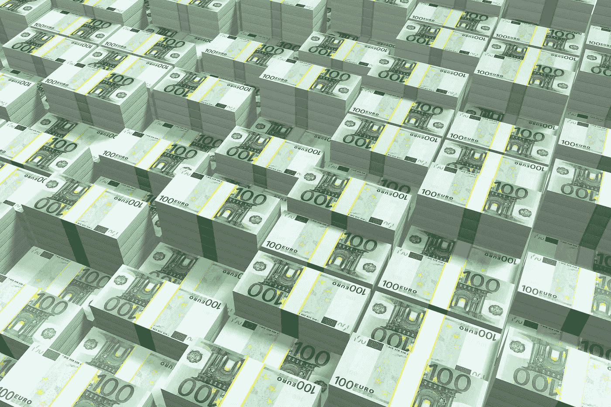

# 洗车公司每月必须清洗 11.6 万辆汽车，其€估值为 500 万英镑

> 原文：<https://medium.com/hackernoon/wash-out-must-sell-116-000-washings-per-month-for-its-5m-valuation-7577a9d4b676>

意大利[初创](https://hackernoon.com/tagged/startup) [洗出](https://www.washout-app.com/)为车主洗车平均每次洗车 [€21.90](https://www.washout-app.com/prezzi) (含增值税，全洗中型车)。

据 EconomyUp 报道，Wash Out 刚刚从 Telepass 筹集了€100 万英镑。

# 估价

基于可比交易，假设 Wash Out 向 Telepass 出售了其公司 20%的股权。

[估值](https://hackernoon.com/tagged/valuation) =投资/出售股权。

那么洗出来的价值是€100 万/20% =€500 万后期资金。

# 出口

假设，根据可比交易，Telepass 希望从他们的投资中获得 15 倍的回报。

退出价值=估值*货币倍数。

那么洗出来的€500 万估值需要一个€500 万* 15 =€7500 万的退出价值。

为了简化，这忽略了稀释。要在稀释 50%的情况下实现 15 倍，€500 万的估值实际上需要€500 万* 15/(1–50%)=€1.5 亿的退出价值。

# 收入

假设，基于可比的公司，在退出时以每年 3 倍的收入洗出交易。

年收入=退出价值/收入倍数。

那么 Wash Out 的€500 万估值需要€7500 万/3 =€2500 万的出口年收入。或€每月 210 万的收入。

# 洗涤

洗涤收费€21.90 英镑，包括增值税。按 22%的增值税计算，这相当于€每件衣物 17.95 英镑，不含增值税

每月洗涤次数=每月收入/每次洗涤的价格。

那么 Wash Out 的€500 万估值要求他们在出口处每月卖€210 万/17.95 = 11.6 万洗。

显然，Wash Out 不需要每月向 11.6 万新客户销售。他们确实需要每月售出 116，000 件洗涤用品。

背景:2017 年，米兰约有 [701，000 辆](https://www.statista.com/statistics/627831/italy-number-of-cars-in-milan/)汽车。

*原载于 2019 年 2 月 20 日*[*venturevalue.com*](https://venturevalue.com/wash-out-must-wash-116000-cars-per-month-for-its-e5m-valuation/)*。*