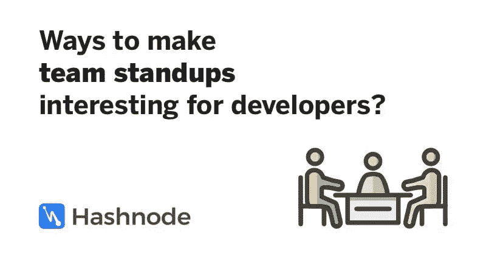

# 如何让开发人员对团队合作感兴趣？

> 原文：<https://medium.com/hackernoon/ways-to-make-team-standups-interesting-for-developers-programmers-e685511653e1>

这个问题[最初匿名发布在 Hashnode](https://hashnode.com/post/ways-to-make-team-standups-interesting-for-developers-programmers-cjra72suo004sjjs2iwgditz8) 上。

嘿伙计们，我的团队每天早上进行 30 分钟的站立训练。几乎每天我们都在谈论我们做过的事情和我们今天必须做的事情。大家都觉得很无聊。有些人试图用一些蹩脚的借口来逃避它。

然而，没有人讨厌在我的公司工作。只是单口相声很无聊。还有，我的团队 90%是编码员/开发员/程序员(随便你怎么称呼)。

有哪些方法可以让开发者对我们的单口相声感兴趣？他们正在寻找提示、技巧和软件建议(如果有的话)。

*最受赞赏的答案出自* [*乔斯·法布尔*](https://hashnode.com/@josfaber) *之手。*

*   做一个 5 分钟的站立。如果因为有趣而需要更多时间，那没问题，但是 30 分钟在单口相声开始前就是一个心理障碍
*   设置扬声器的最长通话时间
*   有一个指定的领导者，可以减少对站立会议无关紧要的枝节讨论。如果需要的话，边上的讨论可以是任何感兴趣的人单独站起来，但是其他人可以离开

阅读其余的答案，并提出你的解决方案👇

 [## 如何让开发人员/程序员对团队合作感兴趣？-哈希诺德

### 我不喜欢在站立过程中交谈。他们说它不应该超过 15 分钟，但在…

hashnode.com](https://hashnode.com/post/ways-to-make-team-standups-interesting-for-developers-programmers-cjra72suo004sjjs2iwgditz8)