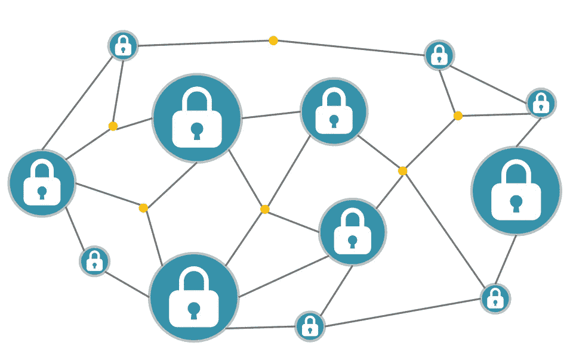

# 区块链连接大会三个问题的匿名回答

> 原文：<https://medium.com/hackernoon/we-asked-a-bunch-of-blockchain-experts-these-3-questions-269f05a4d952>

## 2018 年是区块链行业希望能够忘记的一年。

在过去一年里，做出了许多雄心勃勃的承诺，但从未真正兑现。许多硬币的价格下降了。路线图截止日期推迟。投资者变得更加谨慎。

区块链要去哪里？现在需要回答的一些问题是什么？

我们提出了 3 个问题，并采访了我们即将举行的会议 [**“区块链连接大会 2019”**](http://www.goblockchainconnect.com/)演讲名单中的一些人。由于他们中的许多人目前在区块链行业工作，我们决定略去他们的名字。

**1。区块链技术会引发未来硬件技术的升级吗？**

从比特币挖矿机到区块链智能手机再到冷钱包，硬件一直在区块链生态系统中扮演着重要角色。一般来说，区块链的五金产品用于硬币的生产、流通和安全储存。目标是最大限度地共享计算能力、硬盘、带宽等。

那么，区块链技术会在未来引发硬件技术的升级吗？

我们采访的几乎所有演讲者都给出了肯定的回答。

一个人说，“区块链技术有推动硬件创新的历史，有充分的理由相信这将继续下去。从历史上看，很容易追溯比特币挖矿操作的发展，从早期的通用处理器到基于图形处理器的系统，再到专用 ASICs。”

目前，有许多努力将基于硬件的解决方案引入区块链技术，例如基于硬件的可验证延迟功能(VDF)以实现高效的一致性，基于硬件的钱包以实现安全的密钥管理，以及各种基于硬件的可信执行环境(例如 Keystone 和英特尔软件卫士扩展)。

另一个答案表示同意:

对加密操作的硬件支持仍然是原始的。随着区块链和加密技术的成熟，我们将开始看到对同态加密、乱码电路、SNARKs/STARKs 等的进一步硬件支持。

**2。智能合约能实现完全仲裁吗？**

智能合同的想法既令人兴奋又令人解放。然而，尽管区块链的智能合约可能会缓解做出简单决策的重复过程，但人们似乎对其处理复杂决策的能力心存疑虑。

正如其中一个答案所提到的，我们生活的社会是一个“社会结构和法治继续是最高权威”的社会。智能合同的自动执行可以提高交互的效率，卸载交互的大部分“正常”或“常规”操作。然而,“期望法典化的契约对典型的社会或商业交往中出现的各种各样的问题具有鲁棒性似乎是不现实的。”

另一位受访者也“暂时怀疑通过智能合同进行全面仲裁的可能性。”话虽如此，似乎人们仍然认为，有用的有限仲裁可以通过合同实现，必要时可以求助于人类仲裁员。

**3。DApp 是否能够脱离现有的中央集权体制独立运行，而完全在区块链体制内运行？**

“不太可能。我看不出有什么特别的理由把界面、数据管理和应用程序的其他部分推到区块链身上。对效率、性能、易管理性等的要求可能会鼓励应用程序开发人员只将应用程序中真正需要去中心化的部分推入区块链。”

另一个答案稍微积极一些:

“在有限的情况下，是的，但至少在未来几年内，大多数 DApps 将继续保持半集中化。”

看起来在实现完全独立运行的 DApps 之前，我们还有很长的路要走，如果这是可以实现的话。

出于好奇，我们还加了一个加分题:

**如果让你用一个词来形容 2018 年的区块链，你会选哪个词，为什么？**

以下是一些答案:

**现实。**

零知识(不错的工作断字)。原因:zk-SNARKs 和 zk-STARKs 带来了基本的新原语，将支持新应用程序的主机。今年，我们已经在零知识前沿看到了许多悄悄的进步。

**混乱。**

有些人拒绝回答这个问题，因为对于我们在 2018 年经历的事情来说，选择一个词太难了。我明白这是为什么。

你会选择哪个词？欢迎在下面留下评论，让我们知道你的想法。

如果你想与我们的演讲者进行面对面的讨论，请参加 2019 年 1 月 11 日在旧金山举行的[区块链连接大会](http://www.goblockchainconnect.com)。

Blockchain Connect Conference