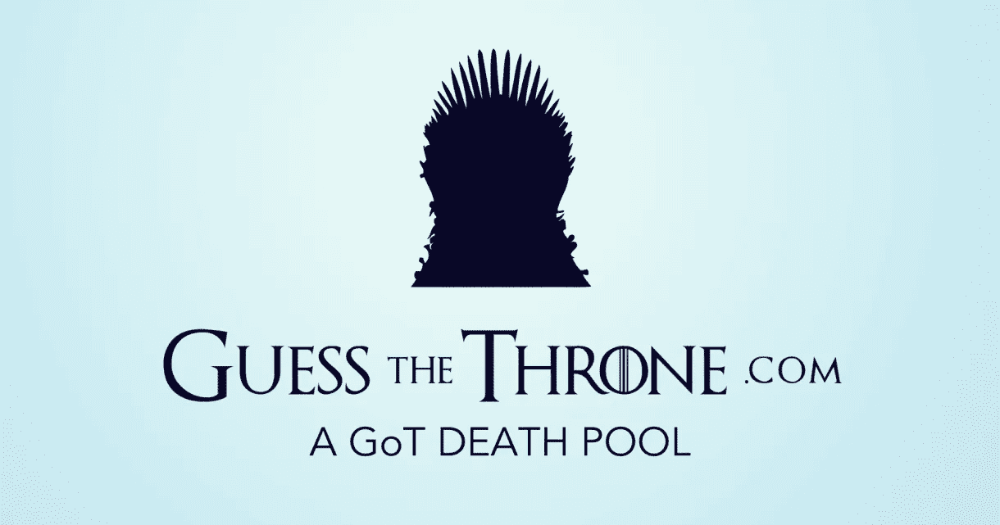
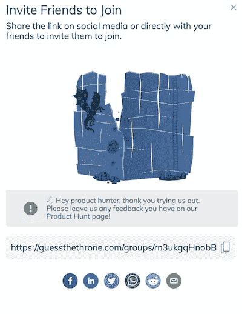
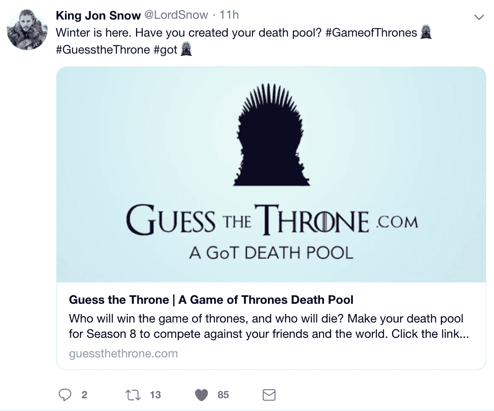
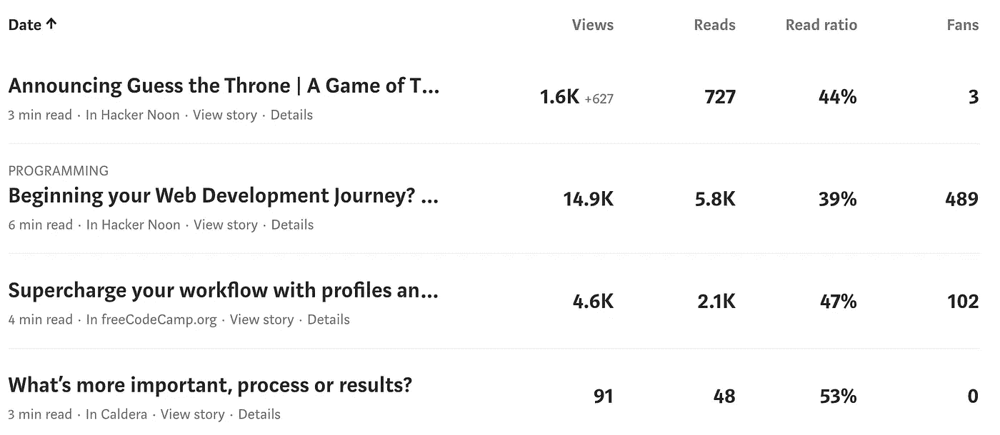
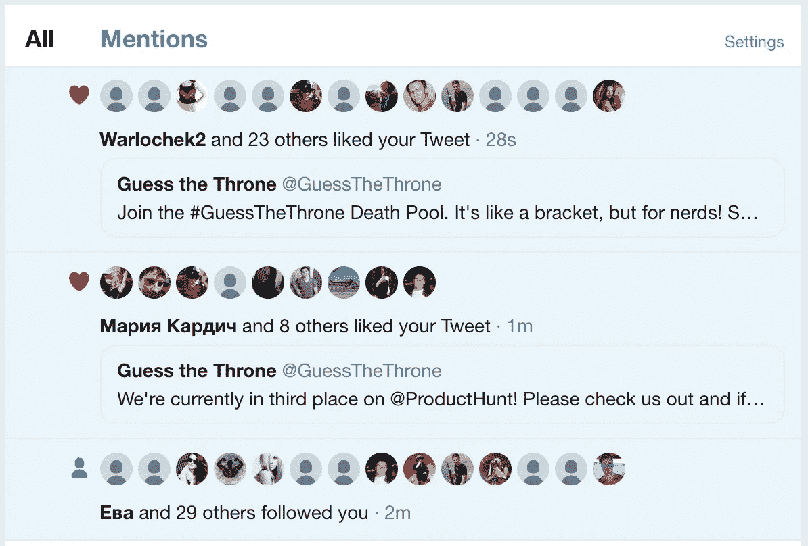
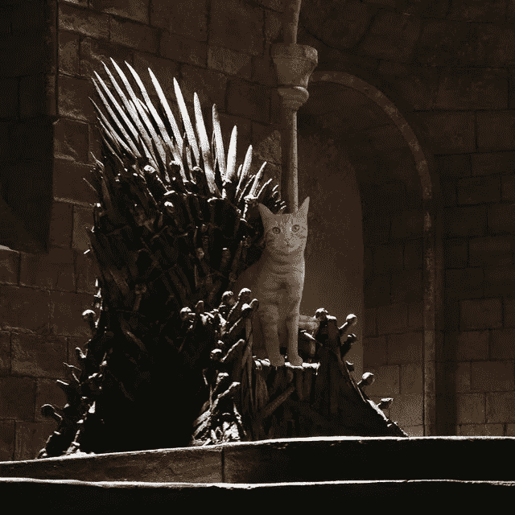
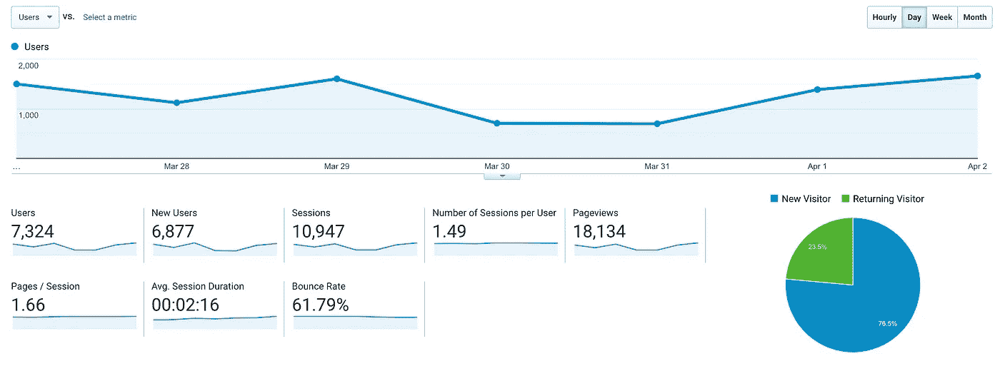

# 我们用 150 美元推出了我们的产品。事情是这样的。

> 原文：<https://medium.com/hackernoon/we-launched-our-product-with-130-heres-what-happened-46c80a830a59>

我和我的团队经常会留出两周时间来做一个激情项目。底线永远是重要的，但是用冒险来滋养灵魂也是重要的。在两周结束时，我们按原样实地展示，只是为了判断兴趣和实地检验我们的努力。我们最新的项目[猜王座](https://guessthethrone.com/)，也没有什么不同。然而，我们决定增加一个额外的挑战:以低于 150 美元的价格成功推出**。**

[猜王座](https://guessthethrone.com/)是《权力的游戏》最后一季的在线死亡池。创建您的群，提交您的选择，并邀请您的朋友。我们免费处理评分、规则和其他一切事情！

> 你可能会问自己，“什么是死亡之池？”听起来很像，这是一个让你预测角色生死的括号。每答对一题得一分，得分最多者获胜！

拥有大量现金的情况下，推出一款产品*已经够难了。迅速崛起所需要的时机、关系和运气可能会让最好、最值得拥有的产品成为废品。然而，我希望我们的实验能通过这一种方法帮助你成功:专注于产品，并有一个强有力的基础游戏来支持它。凭借 [DM](https://hackernoon.com/tagged/dm) 幻灯片、PS 过的猫图片和良好的用户体验，我们能够在发布 24 小时内捕获数千用户。*

# 产品搜索

在动用我们有限的预算之前，我们尝试了所有免费的方法。我们认为 Product Hunt 是一个在开发社区引起轰动的好地方。读完[如何实现](https://blog.producthunt.com/how-to-launch-on-product-hunt-7c1843e06399)后，我们在大约 20 分钟内完成了。在发布当天，超过 7，000 人浏览了我们的网站，1，200 名用户注册。我们一整天都在争夺前五名的位置，到收盘时跌至第八名。

这太棒了。我们注意到的一件事是，即使我们转化了 1200 多人，相比之下，我们在产品搜索上没有获得太多的支持。为了解决这一问题，我们决定对来自产品搜索的用户进行个性化体验，在你进行分组和登录后，给你一点提示，引导你回到网站。

If you’re using React and would like to have the code comment below and I’ll open source it!

> 由于我们在推出产品搜索之前没有建立联系，也没有事先使用平台，我发现自己会去评论、互动和关注其他人的产品。不要这样！每次我这样做，我们的排名就会下降，这很不幸，因为我没有被垃圾邮件。我当然希望他们回来看看我们的新玩意。😆

总的来说，在任何预算启动的情况下，寻找产品似乎都是不需要动脑筋的。我们仍然每天从他们的网站获得推荐。我们需要在 PH 上发布更多的产品，了解一下到目前为止我们有多幸运，但是在这次成功之后，我们肯定会的。

# 直播带货

也许更粗略的想法之一是溜进 Twitter 上有影响力的人的 DMs，礼貌地要求大声喊出来。没有人免费给我们一个😭，但你通常可以协商一种方式，让他们在推文中推广你。我们信任互联网，结果很好。

我们为这条推文付费，以获得+500k 的《权力的游戏》粉丝。在这条推文发出后的五分钟内，我们的主页上同时有超过 80 人，根据我们的分析，我们在两个小时内转化了超过 250 人。每次收购的成本为 **20 美分**🙌🏻。影响者营销才是关键。

# 到处分享

我们一起在网上搜索“死亡之池”和“权力的游戏”。如果有相关的文章，我们会在帖子上发表评论。权力的游戏不和谐频道，我们在那里。脸书集团？你猜对了。Reddit？没错。如果你在过去的三年里发了关于《权力的游戏》和《死亡之池》的微博，你可能会收到我们的信息。

我不能夸大互动性和*个性的重要性。你需要出现在人们可以搜索到你的产品的任何地方，并且能够及时回答他们的问题，为他们提供他们没有问过的问题的解决方案。**细心和滥发之间只有一线之隔。不要盲目地在互联网上给你的产品贴上俗气的、自我夸大的公司声明。大多数小组都有版主，最好在分享你的产品之前和他们确认一下。***

# 向媒体上的出版物投稿

在介质上写出版物非常容易，我想让更多的人知道这一点。写下你的文章草稿，找到与你最接近的出版物，然后联系他们。不要害羞！我从来没有一篇文章被拒绝，我的文章比放弃发表的时候表现好 100 倍(毫不夸张)。

Caldera is my personal account and rarely receives any views.

从我们在 Hacker Noon 发布的[中型帖子来看，我们估计有超过 1100 名用户加入。我们花了**小时**来写，而且完全免费！](https://hackernoon.com/announcing-guess-the-throne-a-game-of-thrones-death-pool-897737cfb285)

# 五分钟时间！

参与产品开发的每个人都在 Fiverr 上找到了一份工作来帮助我们推广。

## [**我将在 iHeartRadio 和社交网络**](https://www.fiverr.com/klevitt70/promote-your-business-on-my-podcast?source=Order+page+gig+link&funnel=9f82ae2c-c5fc-485a-85bb-890dc25620a0) 上宣传和推广您的业务

这太棒了。一个 iHeartRadio 主持人在他的脱口秀上为我们做了广告。这个广告立刻成为经典！

费用:7 美元

影响:难以衡量。因为你永远不知道谁在听。

## [向大量受众推广你的 Twitter](https://www.fiverr.com/klaurent/promote-your-twitter-to-a-large-audience?source=Order+page+gig+link&funnel=55ebc451-61ad-4d1f-93a5-b71152163ff0)

给这个人你的 Twitter 账号，他就会用完全真实的人来淹没你的页面，这些人喜欢你，关注你，转发你。

费用:7 美元

影响:微乎其微。在 Twitter 上一下子就有 75 个粉丝是件好事，但在那之后，虚假用户就没用了。

## [向我的 330，000 名推特粉丝发布你的消息](https://www.fiverr.com/tweets_asap/tweet-your-message-to-my-500k-twitter-followers?source=Order+page+gig+link&funnel=acb1b1d7-d110-46e9-8d87-89662201f101)

键入一条推文，它就会进入这个人的账户(他是一个很酷的人——这在他的简历中)。

费用:7 美元

影响:我想说我们从它那里转化了大约 60 个用户。还不错！

## [在我的 18k 猫 Instagram 上做推广或者大喊](https://www.fiverr.com/beril_d/shoutout-on-my-18k-cat-instagram-page?source=Order+page+gig+link&funnel=17f31c2a-207b-4c6c-a669-7b5c00f84b2e)

一旦我们看到这一个，它必须发生。

Meet Waffles!

费用:7 美元

影响:不会太大。Instagram 上的链接很硬。

## [分发您的新闻稿](https://www.fiverr.com/valanne/distribute-your-press-release?source=Order+page+gig+link&funnel=197a68be-78fe-452a-9a2e-8c03cee08344)

你打出一份新闻稿，它会立即发布在 100 多个网站上。这对我们来说更多的是一种好奇，因为我们从来没有得到产品的压力(更多的在下面)。**不要这样。**这是你得到的质量的一个例子😂…

 [## 中国出口业务

### 森默新闻专线:前方剧透！如果你没有赶上，请不要访问该网站或阅读这篇文章…

www.facebook.com](https://www.facebook.com/permalink.php?id=771443502993231&story_fbid=1440892436048331) 

费用:52.50 美元🙄

影响:它在任何地方都被分享，但我们根本无法衡量任何影响。大多数网站都很粗略，可能会损害我们的搜索引擎优化。

# 报刊上的轻微咆哮

“出版社呢？”你可能会问。我们试图在新闻中得到这个消息，并认为在看到像[这样的博客后，这个消息肯定会被发现。6 人从 110 张 DM 幻灯片中作答。一些人说他们个人喜欢这个应用程序，但他们对写这个观点缺乏兴趣是显而易见的。我们甚至不能让《权力的游戏》博客来写我们。我们发送了新闻资料袋和个性化信息，并反复跟进(我们认为)关于我们进展的有趣更新。如果有人读到这篇文章，对我们如何更好地与媒体联系有什么见解，我很乐意听到你的意见。](http://www.ladbible.com/entertainment/film-and-tv-boss-makes-a-game-of-thrones-death-pool-for-her-employees-20190124)

# 结果

总共花费了 130.50 美元。现在谈谈数字。在发布 12 天之后，我们的应用程序用户已经达到了 **5，058 人**。这是我们谷歌分析的快照。

我们对我们所看到的成功感到欣喜若狂，并认为我们离将此提升到一个新的水平只有一步之遥。我们计划在节目开始时达到 20，000 用户，并希望您[加入我们的](https://guessthethrone.com/)！

> 我们正在积极寻找合作伙伴，以帮助推广猜王座和创造内容。如果您对此感兴趣，请发送电子邮件至 support@itsadate.app。

我相信我们学到的最重要的一课是**产品**和**计时**的力量。对好的产品有一个及时的想法会让营销变得更容易。请记住，正如 Airbnb 的联合创始人曾经说过的那样…

我叫马库斯·伍德。我是 Caldera 的创始人，Caldera 是一家专注于通过尖端技术创造卓越用户体验的产品公司。