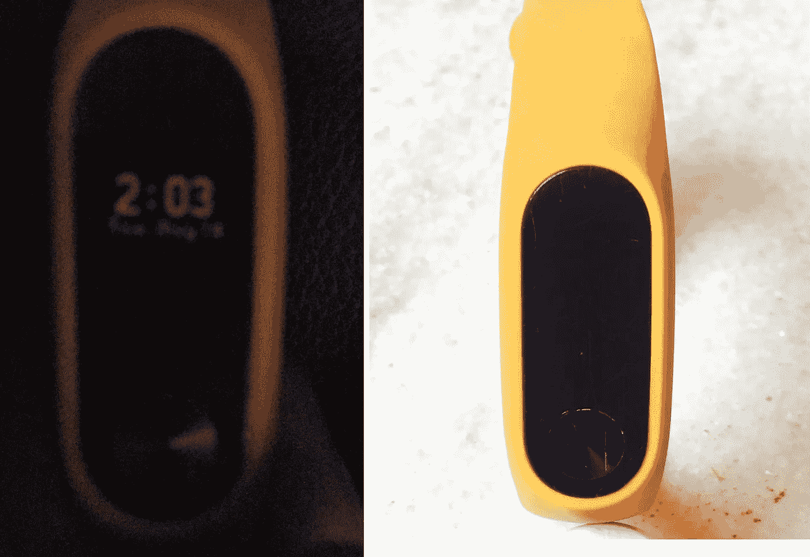
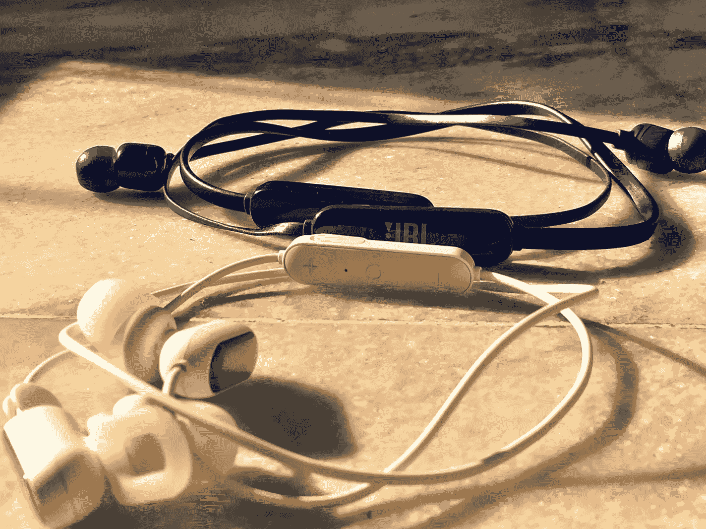
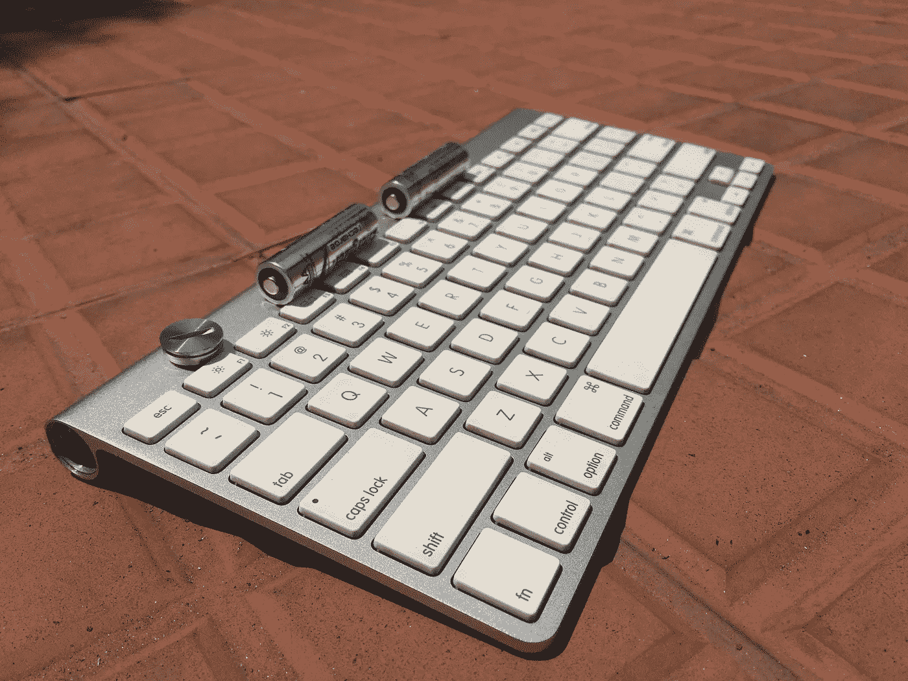

# 穿着不会磨损的可穿戴设备？

> 原文：<https://medium.com/hackernoon/wearing-wearables-that-dont-wear-out-ad2200a7f547>

## 配备不可更换电池的可穿戴设备是一场电子垃圾灾难，是时候对它们说不了了

My two-year-old fitness tracker is no longer readable in daylight, even if I’m indoors

我的 Mi fitness tracker 的屏幕变得暗淡，上周，它变得不可能在白天看到时间，这违背了戴手表的目的。在拜访当地的 Mi 服务中心时，我被告知它的电池没电了，而且无法更换。我甚至不能把它换成一个新乐队，因为旧乐队已经没有价值了。简而言之，我别无选择，只能扔掉它，去找一个新乐队。

从经济上来说，这是有意义的。我现有的乐队成本约₹1500(21 美元)，我用了两年多，所以它一直是我的钱真正的价值。此外，如果我愿意不使用很少使用的心跳传感器，我可以以低至₹1000(15 美元)的价格获得一个新的 Mi band HRX 模型，这是非常合理的。

困扰我的是我突然意识到我在很大程度上造成了世界电子垃圾灾难。引用这个[环境](http://www.theworldcounts.com/counters/waste_pollution_facts/electronic_waste_facts)网站，

> 我们每年产生大约 4000 万吨 it(电子垃圾)。这相当于每秒钟扔掉 800 台笔记本电脑。

据这家[网站](https://www.ccsinsight.com/press/company-news/2332-wearables-market-to-be-worth-25-billion-by-2019-reveals-ccs-insight/)称，可穿戴设备现在是全球 250 亿美元的市场，预计 2019 年将售出 2.45 亿台可穿戴设备。这些设备中有一半以上将是健身追踪器，其余是智能手表、增强和虚拟现实耳机以及可穿戴相机。

1.22 亿个健身追踪器，将会产生大量的电子垃圾。

像 Apple Watch 这样的智能手表确实有可更换的电池。但迟早，这些设备也会加入电子垃圾的行列，所以这只是推迟不可避免的事情。

但就在我欣赏苹果环保政策的时候，我突然想到苹果的 AirPods 有不可更换的电池。仔细想想，为什么蓝牙耳机不也被认为是可穿戴设备？我是说我们把它们戴在耳朵上，不是吗？

便携式蓝牙耳机无疑是电子垃圾的一个巨大来源。我自己有两套，因为我的蓝色 JBL 出汗了(后来恢复了)，我还得买防汗的 Mi 才适合慢跑。

让我看看我是否能得到一些 AirPods 和蓝牙耳机的号码。

2018 年， [Forbes](http://fortune.com/2018/12/03/analyst-says-airpods-sales-will-go-through-the-roof-over-the-next-few-years-report-says/) 报道称，AirPods 的销量将在未来几年内飙升。引用这篇文章，

> 郭说，苹果公司售出了 1400 万至 1600 万对 AirPods，但这个数字明年将达到 5000 万至 5500 万，到 2021 年将跃升至 1 亿至 1.1 亿。

哎哟！

根据这个[站点](https://www.grandviewresearch.com/industry-analysis/headset-market)，2015 年整个耳机市场需求为 2.971 亿台。第二个[网站](https://www.prnewswire.com/news-releases/the-global-earphones-and-headphones-market-is-expected-to-grow-at-a-cagr-of-731-during-20172023-300585974.html)称，到 2023 年，该市场的收入将超过 200 亿美元，并声称 59%的耳机市场是有线耳机，这是可以理解的，因为蓝牙耳机的音质较差。

虽然蓝牙技术有所改进，但音质仍然不如有线耳机。我观察到的是，除非你把有线和蓝牙耳机并排比较，否则你是看不出区别的。我怀疑普通用户不会注意到，除非他们是音响发烧友。

此外，新一代无音频插孔智能手机正在推动用户接受为蓝牙耳机充电的麻烦，以换取无线连接的便利，以及更长的电池寿命、防水和噪音消除等功能。

我的估计是，今年我们将销售超过 2 亿个蓝牙耳机，正如我所怀疑的那样，这接近整个可穿戴设备市场。

问题是制造商能做些什么。

他们可以制造像 Apple watch 那样的可更换电池的蓝牙设备。事实上，我的 iMac 有一个触控板和一个使用可更换电池的键盘。我认为苹果停止生产这些产品，转而采用不可更换电池。当然，那些可替换的电池最终会变成电子垃圾。但这比扔掉触控板和键盘要好得多。我想到了把婴儿和洗澡水一起倒掉。

当苹果转而使用内置电池的蓝牙设备时，它后退了一步。当然，这要方便得多，但上一代蓝牙触控板和键盘要环保得多。新的内置电池可以更换，但不是一个[门外汉](https://9to5mac.com/2015/10/16/ifixit-teardown-magic-mouse-2-keyboard-trackpad-2/)。如果苹果公司真的重视环保，它应该考虑恢复可更换电池的蓝牙设备，并将其作为一种选择提供给客户。

My Apple Bluetooth keyboard with replaceable batteries is over seven years old, and still going strong

那么，作为个人，我们能做些什么来减少这场灾难呢？

就我个人而言，我决定不更换我的健身追踪器(以及我的蓝牙耳机)。我会想念他们，但这仍然只是一种妥协，因为我将有一个电池驱动的设备，我的智能手机。事实上，当我慢跑时，我会通过手机跟踪我的跑步和听音乐。所以我实际牺牲的只是我的健身追踪器，以及最终的有线耳机。

像我这样的小玩意爱好者很难放弃蓝牙小玩意，但这是我能为地球做的最起码的事情，为了她给我的一切。

可能不多。但是微小的水滴可以充满海洋。

球，或者更确切地说，电池，在你的球场上。