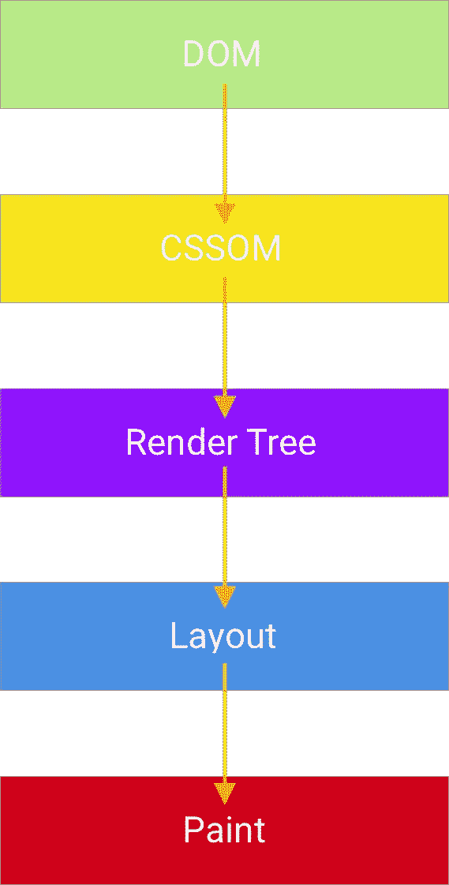
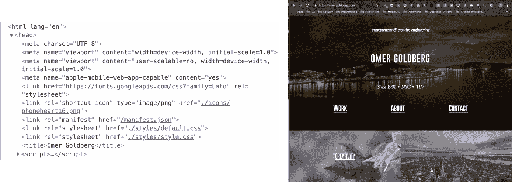
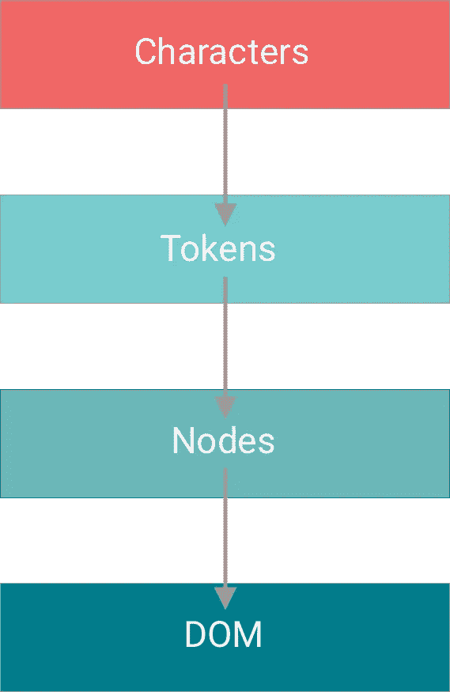
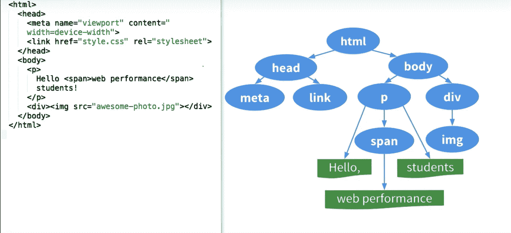
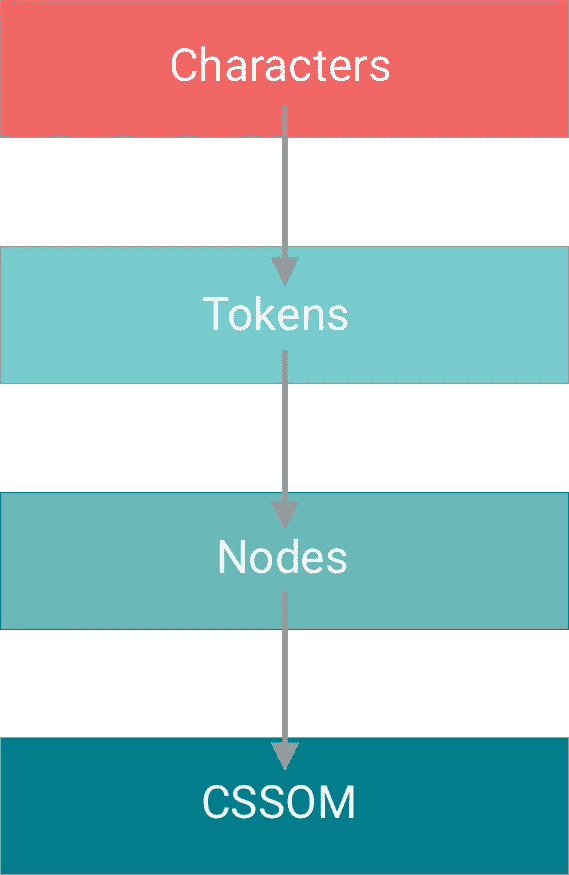
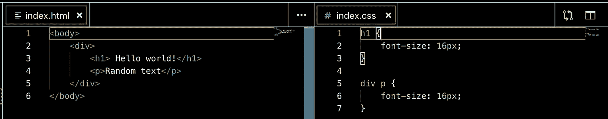
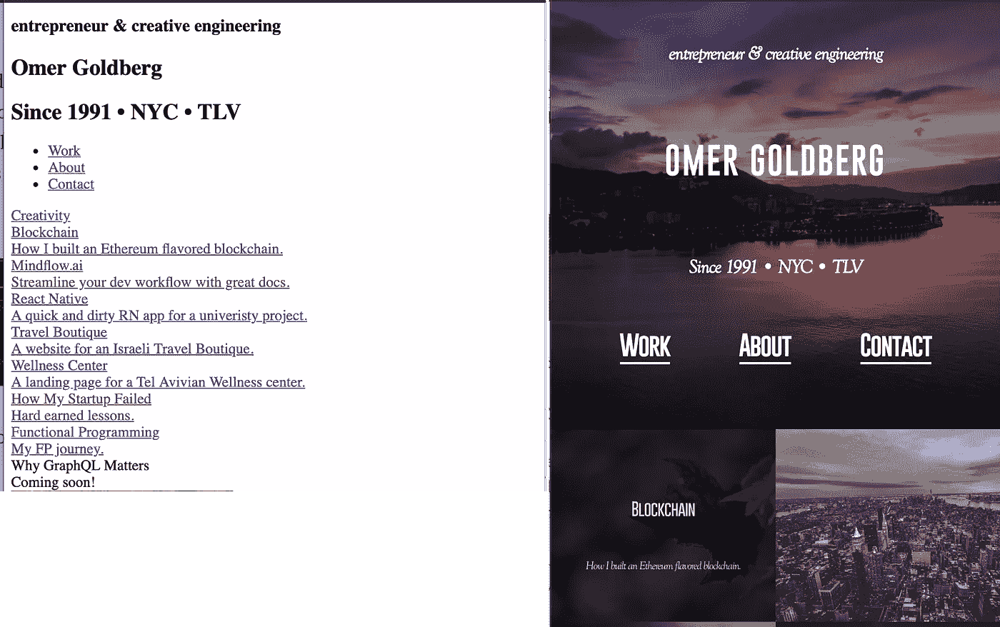
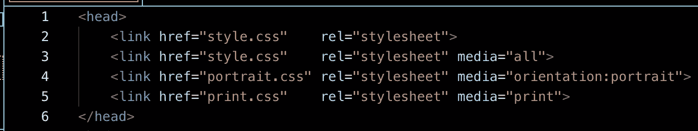
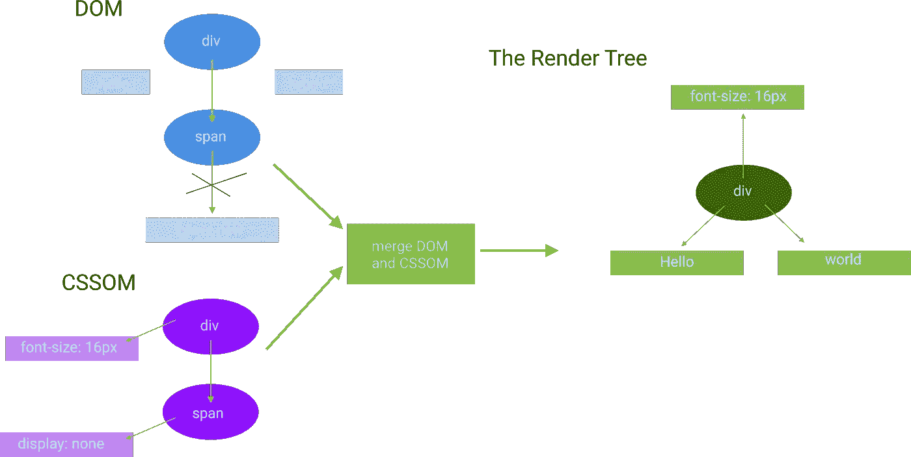
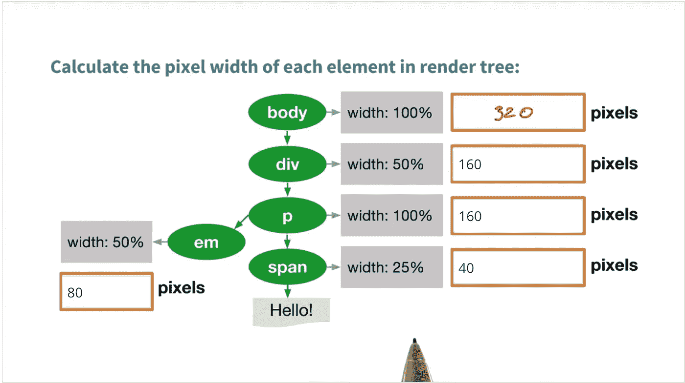

# Web 性能:理解关键呈现路径(第 1 部分)

> 原文：<https://medium.com/hackernoon/web-performance-understanding-the-critical-render-path-part-1-54eec8d7667c>

## 当访问一个新的 web 应用程序时，最大的障碍是加载速度慢！

幸运的是，有几种技术可以大大加快加载速度。在我们学习优化之前，我们需要了解浏览器是如何加载页面的。记住优化的黄金法则:

> **先测量，后优化**

在衡量理解之前，我会增加一个额外的步骤:)这将让我们对可能在早期阻碍我们网站性能的事情有一个强烈的直觉。

## 什么是关键的渲染路径？

关键的渲染路径是浏览器将 HTML、CSS 和 Javascript 转换成屏幕上实际像素的一系列步骤。一旦我们理解了关键的渲染路径，我们将能够改善网站的加载时间。在开始之前，让我们先来分析一下这个名字:

*   关键-必须加载
*   渲染-在用户浏览器中显示
*   导致我们的页面显示在用户浏览器中的事件序列

## 关键渲染路径序列

在我们深入细节之前，让我们整体检查一下序列:

1.  **DOM:** 我们按字符处理 HTML，标记并创建 DOM 节点，这些节点最终将成为 DOM 的一部分。
2.  **CSSOM:** 一旦我们处理了头部并获取了请求的 CSS 资源，我们就开始构建 CSSOM。这部分是阻塞的，我们将在下面看到。
3.  **构建渲染树🌳 🌲:**我们结合创建的 DOM 和 CSSOM 来创建**渲染树。**
4.  **布局:**通过检查创建的**渲染树计算页面的布局。**
5.  **画图:**我们终于可以在屏幕上画出像素了。

## 构建文档对象模型(DOM)

那么浏览器如何将一个请求转化为我们在屏幕上看到的像素呢？

example HTML payload

1.  浏览器接收字节格式的 HTML 有效负载。
2.  我们首先扫描字符来识别标记。
3.  一旦标识了令牌，一个单独的进程就开始使用令牌并创建 DOM 节点。
4.  节点之间的关系由 start ( <>)和 end( >)标记定义，这让我们可以定义父子关系👶节点之间的关系。

总的来说，DOM 解析序列如下所示:

一旦我们使用了所有的令牌并创建了它们各自的节点，我们就得到一个叫做 DOM 的树状结构。关于 HTML 如何转换为 DOM 的示例，请参见下图:

From Udacity

**构建 DOM 是一个渲染阻塞器，**因为显然没有 DOM 我们就没有任何东西可以渲染。

## 构建 CSS 对象模型(CSSOM)

DOM 捕捉页面的内容，但是我们也需要知道如何显示页面本身。为此，我们需要 CSSOM。解析和构建 CSSOM 的过程与 DOM 非常相似。

很好，我们读取了接收到的解析后的 CSS 规则，并将它们映射到我们拥有的节点上。

## 将样式映射到 HTML 元素

映射算法很幼稚。我们搜索具有相应标识符的节点。当我们从右到左阅读规则时，更具体的 CSS 规则需要更长的时间才能找到并应用。让我们来看看这个例子——你认为哪个规则需要更长的时间来应用？

第一条规则是将任何 *< h1 >* 标签修改为 16px 的*字体大小。*

第二条规则(从右向左读)说找到一个 *< p >* 标签。为每个 *< p >* 标签搜索一个 *< div >* 祖先。如果存在，应用 16px 的字体大小。很明显，这个规则更复杂，并且需要更长的时间才能找到，因为我们要遍历树中更多的 DOM 节点。话虽如此，这种差异可能是微不足道的，并不是一个大的性能瓶颈。

令人惊讶的是，**构建 CSSOM 也是浏览器的渲染阻塞资源。**这是因为许多网站在应用 CSS 之前基本无法使用。比如看我的作品集网站 ***有无 CSS 的区别。***

**虽然 CSS 是一个渲染拦截器，但是媒体类型和查询允许我们将一些 CSS 资源标记为非渲染拦截。**明确声明我们的媒体类型确实可以缩短加载时间(我们节省了不必要的读取和解析！)所以用你的 *CSS includes 注意这个。*

让我们来看看这个例子:

From the Google Documentation

*   前两个 CSS 链接是等效的。它们将被应用于每一个场景，不管是动作还是屏幕大小。
*   第三个 *CSS 包含*将**仅在屏幕方向设置为纵向时适用。**
*   第四个 *CSS include* 将**仅在我们打印文档时适用。**
*   **指定最后两种媒体类型使得这些资源不阻塞，**因此我们的站点在这些不适用的情况下会加载得更快。

还要注意，CSS 上下文中的“呈现阻塞”仅指浏览器是否必须暂停页面的呈现，直到接收到该资源。在任何情况下**浏览器将总是下载所有 CSS 资源，**不管阻塞或非阻塞行为。

考虑到 CSS 的阻塞特性，我们会一直努力让**尽快将 CSS 发送到客户端(用户浏览器),以改善初始渲染时间。**

## 渲染树

渲染树结合了 DOM 和 CSSOM，并且只包含屏幕上可见的内容📺。因此，我们不会在渲染树中看到任何显示设置为“无”的元素。

让我们看看 DOM 和 CSSOM 是如何结合起来创建一个渲染树的:

当渲染树完成后，我们可以继续布局阶段。

## 布局

我们有了渲染树，但我们仍然需要弄清楚元素应该如何在屏幕上定位。为了确定页面上每个对象的确切大小和位置，浏览器查看收到的渲染树的根，并开始遍历它。

除非另外指定，否则调整元素大小和放置元素始终相对于父 div。让我们来看看:

From Udacity

布局阶段的时间取决于几个因素:

*   运行它的设备
*   文档的大小
*   将样式应用于文档

文档越大，样式越复杂，完成布局阶段所需的时间就越长。

## 颜料🎨🎨

此时，我们知道哪些节点是可见的，以及它们的计算布局和样式。在这一步，我们采用最终的渲染树，将像素(单个节点)渲染到屏幕上😱😱。

## 摘要

我们在这里学到了很多。让我们总结一下呈现通过来自浏览器的 HTTP GET 请求接收的网页所需的步骤。

1.  解析和处理 HTML 并构建 DOM。
2.  解析和处理 CSS 并构建 CSSOM。
3.  合并渲染树的 DOM 和 CSSOM。
4.  运行布局计算来计算渲染树中每个节点的大小和位置。
5.  在屏幕上绘制每个节点(像素)。

为了让我们的页面加载速度超快，我们的目标是让上述过程中的每一步都尽可能快！

在本系列的下一篇文章中，我们将关注关键的渲染路径优化。记住，**我们不能优化我们不能测量的东西！**

## 如果这篇文章有帮助，请订阅并点击鼓掌👏按钮以示支持！⬇⬇

您可以在 [Instagram](https://www.instagram.com/omeragoldberg/) 、 [Linkedin](https://www.linkedin.com/in/omer-goldberg-680b40100/) 和 [Medium](/@omergoldberg) 上关注我，了解更多科技相关内容！