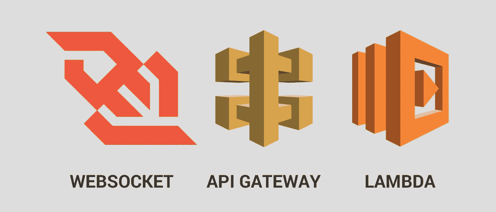
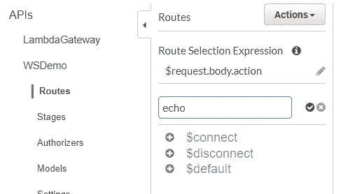
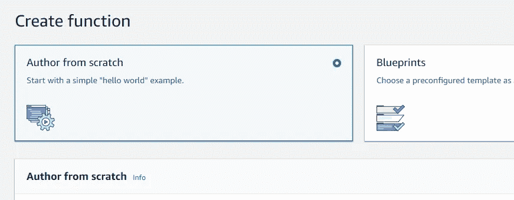
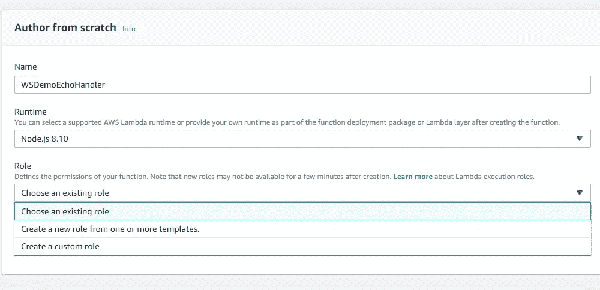
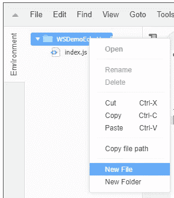
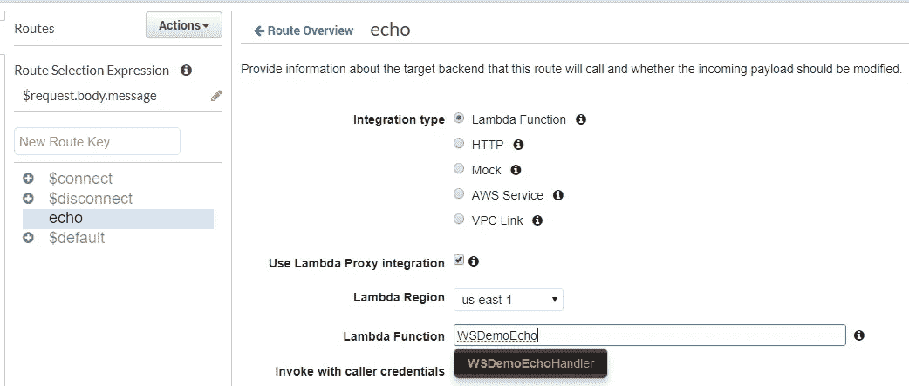
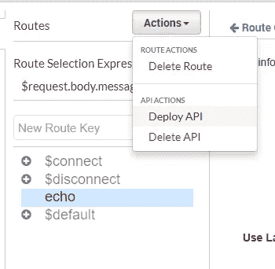
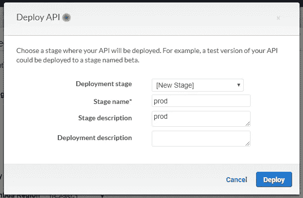
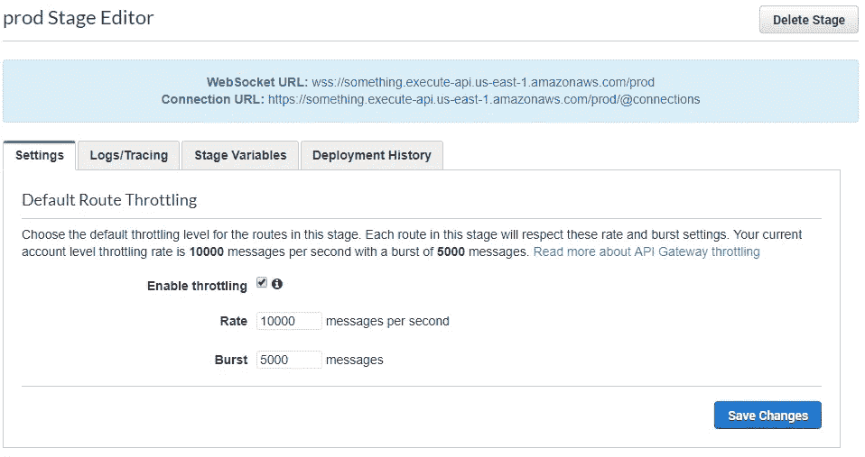

# WebSockets & API 网关

> 原文：<https://medium.com/hackernoon/websockets-api-gateway-9d4aca493d39>

## 快速的实际操作演示



2018 年，我赢得了许多关于为什么无服务器 WebSocket API 网关永远不会工作的虚构论点。我错了。

在我道歉之前，让我解释一下:当状态与执行逻辑分离时，无服务器模式工作得最好，但是我认为这两者在实时应用程序中是不可分的，与连接状态有关。所以当 [API Gateway](https://aws.amazon.com/api-gateway/) 团队在 re:Invent 上宣布支持 WebSocket 时，我渴望了解更多。

让我们将一个简单的实时应用程序重构为一个无服务器的实时应用程序，并将其部署到 WebSocket API 网关。

## 你好你好

我们从一个简单的 NodeJS 客户机开始，它与 wss://echo.websocket.org 对话:

我还准备了一个演示[回购](https://github.com/robzhu/ws-demos):

```
git clone [https://github.com/robzhu/ws-demos](https://github.com/robzhu/ws-demos)
cd ws-demos/echo
npm install
node client wss://echo.websocket.org# Once the process starts, type something and press enter
connected
> happy 2019
From server: happy 2019
```

如果我们想在本地实现 echo 服务器功能:

```
# Terminal Tab A
node serverLocal
# Terminal Tab B, note 'ws' protocol, not 'wss'
node client ws://localhost:8080
```

我们如何准备这些代码来使用 API Gateway 呢？这十行代码实际上做了几件事:

*   接受传入的 websocket 连接
*   监听传入的消息
*   给予消息处理程序对源套接字的访问权，通过源套接字将数据发送回客户端
*   (隐式)处理客户端断开连接

如果我们将这段代码粘贴到一个无服务器函数中，它将需要不断地运行来处理传入的连接请求，这违反了无服务器函数的按需特性。

然而，如果我们将内部 echo 逻辑隔离为一个无服务器的函数，我们将需要为它提供某种方式来与 API 网关持有的 WebSockets 进行通信。因为无服务器函数是无状态的，所以我们在上面的函数闭包中的对象引用是不够的。相反，我们需要一个表示连接的可序列化令牌，我们称之为“connectionId”:

在隔离 *echo* 功能逻辑的过程中，我们还分离了 API 网关的职责，尽管这是一个过于简单的例子(这里有一个关于 API 网关实际工作方式的[视频](https://www.youtube.com/watch?v=3SCdzzD0PdQ))。

在第 10–28 行，我们定义了三个特殊的默认动作处理程序:*连接*、*断开*和*默认*(处理任何没有在*自定义动作*中明确定义的消息)。

*echo* 自定义动作处理程序现在将 *connectionId* 和 *data* 作为显式函数参数，两者都是字符串。唯一的外部依赖是*发送*，我们很快就会回来

我们还修改了协议，要求客户端发送类似于{ " action ":…" data ":…}的请求。这只是一行(18)的变化:

要测试新重构的服务器和客户机:

```
# Terminal Tab A
node serverWithActions
# Terminal Tab B, note 'ws' protocol, not 'wss'
node clientWithActions ws://localhost:8080
```

现在我们准备在 API Gateway 中创建 WebSocket API。登录 AWS，(我在北弗吉尼亚地区测试了这个演示，但是在其他地区应该也可以)。打开 [AWS API 网关](https://console.aws.amazon.com/apigateway)，点击“创建 API”，选择 WebSocket，填写以下设置:


仔细检查路由选择表达式是否为“$request.body.action”，因为该表达式告诉 API Gateway 如何确定调用哪个操作。

接下来，单击“创建 API”，您应该会看到 Routes 页面。添加“echo”作为“新路由关键字”,然后单击“检查”按钮:



在新的浏览器标签中，打开 [Lambda AWS 控制台](https://console.aws.amazon.com/lambda)，点击“创建功能”，然后选择“从头开始创作”



给你的函数起一个名字，比如“WSDemoEchoHandler”，选择一个 IAM 角色，这个角色有权限[管理 web socket 连接](https://gist.github.com/robzhu/aec8f92c404ff29465fc3e874812c708)。如果您的 Lambda 函数没有 IAM 角色，请选择“创建自定义角色”,然后编辑策略，在上面的链接中包含 Allow 语句。例如，一个完整的策略可能看起来像 [this](https://gist.github.com/robzhu/2a496e62840b0fcca3caaa5472043c51) 。



WebSocket API 仍然非常新，所以我们需要为现有的 *aws-sdk* 模块添加一些功能。在嵌入式代码编辑器中，右键单击您的函数文件夹并选择“新建文件”:



将其命名为“patch.js”并粘贴到这个文件的[内容中。接下来，打开“index.js”并粘贴以下内容:](https://gist.githubusercontent.com/robzhu/2714d1c5183be9e620beba8b0d567544/raw/ed8b172569a0af95831f1221e0d80fce8dca791d/patch.js)

还记得早先 echo 函数的本地实现依赖于“send”函数的时候吗？现在我们可以看到它是如何通过 aws-sdk 实现的。

保存 Lambda 并返回到 API 网关控制台选项卡。在“Lambda Function”字段中，输入我们刚刚创建的 Lambda 函数的名称:



通过这种方式，API 网关知道调用 WSDemoEchoHandler 函数来响应对 echo *"* route "的请求。请注意,“路由”不是指 HTTP 路由。一旦连接了路由，我们就可以部署我们的 API 了:



我们需要定义一个新的部署阶段:



部署完成后，您将看到 Stage 编辑器，它显示了新 WebSocket API 的 URL:



复制顶部“WebSocket URL”字段的文本。看起来会是:*WSS://something . execute-API . us-east-1 . Amazon AWS . com/prod**。*

回到我们的终端窗口，我们可以测试新的 WebSocket API:

```
node clientWithActions.js wss://something.execute-api.us-east-1.amazonaws.com/prod
meow
From server: Echo: meow
```

目前就是这样，但还有一些后续主题需要探索:

*   当连接仍然处于活动状态时，在 API 重新部署和 Lambda 函数更新期间会发生什么？
*   使用 fanout 构建真正的应用程序
*   与 API 网关团队的访谈和架构讨论。

那些话题听起来有趣吗？你被卡住了吗？请留言或发邮件给我(robzhu at amazon dot com)。